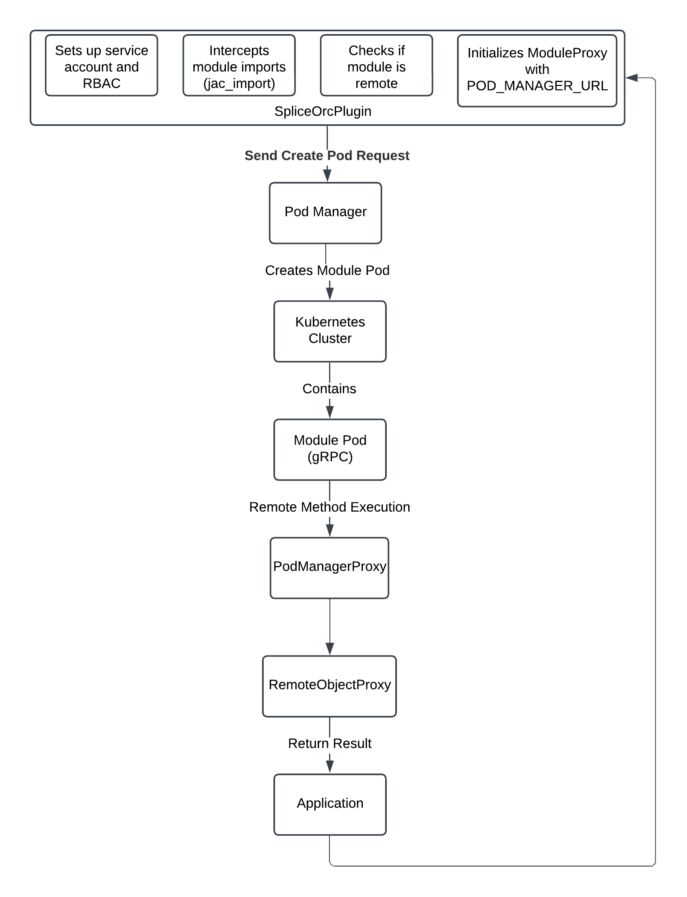
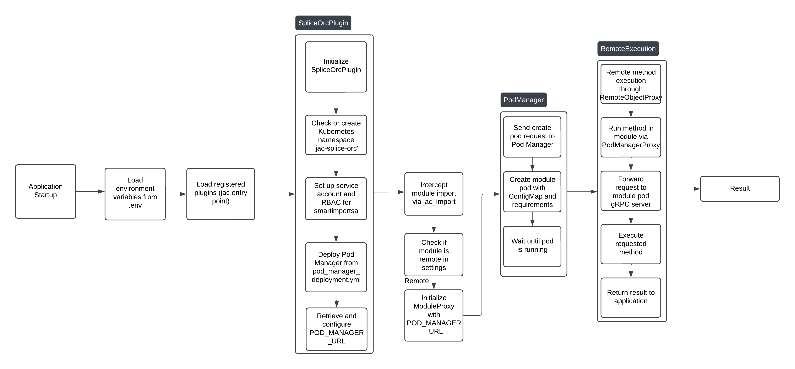

# JAC Cloud Orchestrator (`jac-splice-orc`)


JAC Cloud Orchestrator (`jac-splice-orc`) is a system designed to dynamically import any Python module, deploy it as a Kubernetes Pod, and expose it as an independent gRPC service. This enables any Python module to be used as a microservice, providing flexibility and scalability in a cloud environment.

---

## Table of Contents

- [Overview](#overview)
- [Features](#features)
- [Architecture](#architecture)
  - [System Components](#system-components)
  - [Data Flow](#data-flow)
- [Project Structure](#project-structure)
- [Setup](#setup)
  - [Prerequisites](#prerequisites)
  - [1. Clone the Repository](#1-clone-the-repository)
  - [2. Install Dependencies](#2-install-dependencies)
  - [3. Configure the System](#3-configure-the-system)
  - [4. Recreate the Kind Cluster with Port Mappings](#4-recreate-the-kind-cluster-with-port-mappings)
  - [5. Initialize the System](#5-initialize-the-system)
- [Docker Usage](#docker-usage)
- [Usage](#usage)
  - [Client Application](#client-application)
  - [Example Usage](#example-usage)
    - [Importing Remote Modules](#importing-remote-modules)
    - [Example: Using NumPy as a Remote Module](#example-using-numpy-as-a-remote-module)
- [Configuration](#configuration)
  - [Environment Variables](#environment-variables)
  - [Module Configuration](#module-configuration)
- [Troubleshooting](#troubleshooting)
- [Flow Diagram](#flow-diagram)
- [Notes](#notes)

---

## Overview

Imagine having the ability to use any Python module as a remote service, seamlessly integrating it into your application without worrying about the underlying infrastructure. JAC Cloud Orchestrator allows you to dynamically deploy Python modules as microservices in a Kubernetes environment, exposing them via gRPC for remote execution.

This system abstracts away the complexities of remote execution, pod management, and inter-service communication, enabling developers to focus on building applications rather than managing infrastructure.

---

## Features

- **Dynamic Module Deployment**: Import and deploy any Python module as a Kubernetes Pod on-demand.
- **gRPC Service Exposure**: Expose modules as gRPC services for efficient remote procedure calls.
- **Transparent Remote Execution**: Use remote modules as if they were local, with automatic handling of data serialization and deserialization.
- **Pod Management**: Automatically create, manage, and terminate pods based on usage.
- **Scalability**: Scale services horizontally by deploying multiple instances.
- **Resource Optimization**: Allocate resources dynamically, ensuring optimal utilization.

---

## Architecture



### System Components

1. **Client Application**
   - The interface through which users interact with remote modules.
   - Handles serialization and deserialization of data.
   - Provides proxy objects to interact with remote modules seamlessly.

2. **Pod Manager**
   - Manages Kubernetes pods and services for modules.
   - Receives requests from the client and ensures the appropriate pods are running.
   - Forwards method execution requests to the corresponding pods.

3. **Module Server (Pod)**
   - Runs the requested Python module within a Kubernetes pod.
   - Exposes the module's functionalities via a gRPC server.
   - Executes methods and returns results to the Pod Manager.

### Data Flow

1. **Client Requests**: The client makes a request to use a module's method.
2. **Pod Manager Processing**: The Pod Manager checks if the module's pod is running; if not, it creates it.
3. **Method Execution**: The Pod Manager forwards the request to the module's pod.
4. **Result Retrieval**: The module pod executes the method and returns the result.
5. **Client Receives Result**: The client receives and deserializes the result, making it available for use.

---

## Project Structure

```
jac-splice-orc/
│
├── jac_splice_orc/
│   ├── __init__.py
│   ├── config/
│   │   └── config.json                  # Main configuration file
│   ├── config_loader.py                 # Configuration loader utility
│   ├── grpc_local/
│   │   ├── __init__.py
│   │   └── module_service.proto         # Protocol Buffers definition
│   ├── managers/
│   │   ├── __init__.py
│   │   ├── pod_manager.py               # Pod Manager to handle pod operations
│   │   ├── proxy_manager.py             # Proxy Manager for handling client-side proxying
│   ├── plugin/
│   │   ├── __init__.py
│   │   └── splice_plugin.py             # Plugin for integration with jaclang
│   ├── server/
│   │   ├── __init__.py
│   │   └── server.py                    # gRPC server to serve the imported module as a service
│   └── utils/
│       ├── __init__.py
│       └── startup.sh                   # Startup script for initializing the server
├── k8s/
│   ├── pod_manager_deployment.yml       # Kubernetes deployment manifest
├── docker/
│   ├── Dockerfile                       # Dockerfile
├── requirements.txt                     # Python dependencies
├── setup.py                             # Installation script
└── README.md                            # Project documentation
```

---

## Setup

### Prerequisites

Before you begin, ensure that you have the following installed and configured:

- **Python** (version 3.11 or later)
- **Docker** (version 20.10 or later)
- **Kubernetes** (version 1.21 or later)
- **kubectl** command-line tool
- **Kubernetes Cluster**: Ensure you have access to a Kubernetes cluster (local or remote).

Ensure that your Kubernetes cluster is up and running, and that you can connect to it using `kubectl`.

### 1. Install Dependencies

Create a virtual environment and install the required Python packages:

```bash
python -m venv venv
source venv/bin/activate  # On Windows: venv\Scripts\activate
pip install -r requirements.txt
```
**Note**: The `requirements.txt` file includes all necessary dependencies, such as `kubernetes`, `grpcio`, `PyYAML`, and others.

### 2. Install via pip

You can install `jac-splice-orc` directly from PyPI:
```bash
pip install jac-splice-orc
```

### 3. Configure the System

The application uses a `config.json` file located in the `jac_splice_orc/config/` directory for all configurations.

**Update the Configuration File**

Edit `jac_splice_orc/config/config.json` to match your environment. Here's an example configuration:

```json
{
  "kubernetes": {
    "namespace": "jac-splice-orc",
    "service_account_name": "jac-orc-sa",
    "pod_manager": {
      "deployment_name": "pod-manager-deployment",
      "service_account_name": "jac-orc-sa",
      "container_name": "pod-manager",
      "image_name": "jaseci/jac-splice-orc:latest",
      "container_port": 8000,
      "service_name": "pod-manager-service",
      "service_type": "LoadBalancer",
      "env_vars": {
        "SERVICE_TYPE": "pod_manager",
        "NAMESPACE": "jac-splice-orc",
        "IMAGE_NAME": "jaseci/jac-splice-orc:latest"
      },
      "resources": {
        "requests": {
          "memory": "1500Mi",
          "cpu": "500m"
        },
        "limits": {
          "memory": "2000Mi",
          "cpu": "1"
        }
      }
    }
  },
  "module_config": {
    "numpy": {
      "lib_mem_size_req": "100Mi",
      "dependency": [],
      "lib_cpu_req": "500m",
      "load_type": "remote"
    }
    // Add other module configurations as needed
  },
  "environment": {
    "POD_MANAGER_URL": ""
  }
}
```

**Note**:

- Replace `jaseci/jac-splice-orc:latest` with your own image if you have customized it.
- Adjust resource requests and limits according to your environment.

### 4. Recreate the Kind Cluster with Port Mappings

To ensure that your Kubernetes cluster can expose services correctly, especially when using **Kind** (Kubernetes IN Docker), you need to recreate the Kind cluster with specific port mappings. This allows services like the Pod Manager to be accessible from your host machine without relying solely on port-forwarding.

**Why Recreate the Kind Cluster?**

- **Port Accessibility**: By mapping container ports to host ports, you can access Kubernetes services directly via `localhost:<port>` on your machine.
- **Simplified Access**: Eliminates the need for manual port-forwarding or additional networking configurations.

**Steps to Recreate the Kind Cluster with Port Mappings:**

1. **Delete the Existing Kind Cluster**

   If you already have a Kind cluster running, delete it to allow recreation with new configurations.

   ```bash
   kind delete cluster --name little-x-kind
   ```

   **Note**: Replace `jac-splice-orc with your cluster name if different.

2. **Create a Kind Configuration File**

   Create a YAML configuration file named `kind-config.yaml` with the desired port mappings. This file instructs Kind to map specific container ports to host ports.

   ```yaml
   kind: Cluster
   apiVersion: kind.x-k8s.io/v1alpha4
   nodes:
     - role: control-plane
       extraPortMappings:
         - containerPort: 30080
           hostPort: 30080
           protocol: TCP
   ```

   **Explanation:**

   - **containerPort**: The port inside the Kubernetes cluster (i.e., the port your service listens on).
   - **hostPort**: The port on your local machine that maps to the `containerPort`.
   - **protocol**: The network protocol (`TCP` or `UDP`).

3. **Create the New Kind Cluster with Port Mappings**

   Use the `kind-config.yaml` to create a new Kind cluster with the specified port mappings.

   ```bash
   kind create cluster --name little-x-kind --config kind-config.yaml
   ```

   **Output Example:**

   ```
   Creating cluster "little-x-kind" ...
   ✓ Ensuring node image (kindest/node:v1.21.1) 🖼
   ✓ Preparing nodes 📦
   ✓ Writing configuration 📜
   ✓ Starting control-plane node kind-control-plane 🕹️
   ✓ Installing CNI 🔌
   ✓ Installing StorageClass 💾
   Set kubectl context to "kind-little-x-kind"
   You can now use your cluster with:

     kubectl cluster-info --context kind-little-x-kind

   Thanks for using Kind! 🎉
   ```


### Summary of Steps:

1. **Delete Existing Cluster**: `kind delete cluster --name jac-splice-orc
2. **Create Config File**: Define `kind-config.yaml` with desired port mappings.
3. **Create New Cluster**: `kind create cluster --name little-x-kind --config kind-config.yaml`
4. **Verify Mappings**: Ensure ports are correctly mapped using `kubectl` and `docker` commands.

**Important Considerations:**

- **Port Conflicts**: Ensure that the `hostPort` values you choose are not already in use on your host machine.
- **Cluster Name**: Adjust the cluster name (`jac-splice-orc) as per your preference or organizational standards.
- **Security**: Exposing ports directly to `localhost` can have security implications. Ensure that only necessary ports are exposed and consider implementing authentication or network policies if needed.

---

### 5. Initialize the System

Once the cluster is set up with the appropriate port mappings, proceed to initialize the Pod Manager and Kubernetes resources.

Use the provided CLI command to initialize the Pod Manager and Kubernetes resources:

```jac
jac orc_initialize jac-splice-orc
```

**Explanation**:

- `jac orc_initialize`: Invokes the initialization command provided by the plugin.
- `jac-splice-orc`: Specifies the Kubernetes namespace to use. If not provided, it defaults to the namespace specified in `config.json`.

**What This Command Does**:

- Creates the specified Kubernetes namespace if it doesn't exist.
- Creates the ServiceAccount, Role, and RoleBinding required for the Pod Manager.
- Deploys the Pod Manager Deployment and Service to the Kubernetes cluster.
- Updates the `POD_MANAGER_URL` in the `config.json` file with the actual service URL.

**Verify the Deployment**:

Check that the resources have been created in Kubernetes:

```bash
kubectl get namespaces
kubectl get deployments -n jac-splice-orc
kubectl get services -n jac-splice-orc
kubectl get pods -n jac-splice-orc
```

---

## Docker Usage

### Building the Docker Image

Build the Docker image using the provided Dockerfile:

```bash
docker build -t your_dockerhub_username/jac-splice-orc:latest .
```

Replace `your_dockerhub_username` with your Docker Hub username or preferred image name.

### Running the Docker Container

You can run the container as either the Pod Manager or a Module Service by setting the `SERVICE_TYPE` environment variable.

#### Running the Pod Manager

```bash
docker run -d -p 8000:8000 -e SERVICE_TYPE=pod_manager your_dockerhub_username/jac-splice-orc:latest
```

This starts the Pod Manager service on port 8000.

#### Running a Module Service

```bash
docker run -d -p 50051:50051 -e SERVICE_TYPE=module_service -e MODULE_NAME=your_module_name your_dockerhub_username/jac-splice-orc:latest
```

Replace `your_module_name` with the name of the Python module you want to serve. This starts the Module Service on port 50051.

### Dockerfile Overview

The Dockerfile sets up an image that can run either the Pod Manager or a Module Service:

- **Base Image**: Uses `python:3.12-slim` for a lightweight environment.
- **Dependencies**: Installs necessary Python packages like `grpcio`, `fastapi`, `kubernetes`, and `numpy`.
- **Application Code**: Copies the gRPC service definitions and application code into the image.
- **Entrypoint**: Uses an environment variable `SERVICE_TYPE` to decide which service to start (`pod_manager` or `module_service`).

---

## Usage

### Client Application

The client application provides a seamless way to interact with remote modules as if they were local. It handles the complexities of remote communication, serialization, and deserialization.

#### **Client Components**

- **`ModuleProxy`**: Provides proxy objects for modules, handling remote method calls.
- **`RemoteObjectProxy`**: Acts as a dynamic proxy for method calls on remote modules or objects.

### Example Usage

#### Importing Remote Modules

With the system initialized, you can now import and use remote Python modules in your JAC programs.

**Example JAC Code**:

```jac
with entry {
    import: py numpy;
    arr = numpy.array([1, 2, 3, 4]);
    print(arr);
    result = numpy.sum(arr);
    print(result);
}
```

#### Example: Using NumPy as a Remote Module

**Step 1: Write the JAC Program**

Create a file named `example.jac` with the following content:

```jac
with entry {
    import: py numpy;
    arr = numpy.array([1, 2, 3, 4]);
    print("Array:", arr);
    result = numpy.sum(arr);
    print("Sum:", result);
}
```

**Step 2: Run the JAC Program**

Run the JAC program using the `jac` command:

```bash
jac run example.jac
```

**Expected Output**:

```
Array: [1 2 3 4]
Sum: 10
```

**Explanation**:

- The `import: py numpy;` statement tells the JAC runtime to import the `numpy` module.
- Since `numpy` is configured with `"load_type": "remote"` in `config.json`, the system uses the `ModuleProxy` to interact with `numpy` running in a remote Kubernetes pod.
- The array creation and sum calculation are performed remotely, and the results are returned to your local program.

---

## Configuration

### Environment Variables

While most configurations are stored in `config.json`, you can still use environment variables if needed.

- **`POD_MANAGER_URL`**: URL of the Pod Manager service (updated automatically during initialization).
- **`NAMESPACE`**: Kubernetes namespace to deploy pods (default is `jac-splice-orc`).

### Module Configuration

In the `config.json` file, under `module_config`, you can specify configurations for each module:

- **`dependency`**: List of additional Python packages required by the module.
- **`lib_cpu_req`**: CPU resource request for the pod (e.g., `"500m"`).
- **`lib_mem_size_req`**: Memory resource request for the pod (e.g., `"512Mi"`).
- **`load_type`**: Set to `"remote"` to handle the module remotely.

**Example:**

```json
"numpy": {
  "lib_mem_size_req": "100Mi",
  "dependency": [],
  "lib_cpu_req": "500m",
  "load_type": "remote"
}
```

---

## Troubleshooting

### 1. Pod Manager Not Accessible

If the `POD_MANAGER_URL` is not set or the Pod Manager service is not accessible:

- Ensure that the `jac orc_initialize` command has been run successfully.
- Check that the Pod Manager service is running:

  ```bash
  kubectl get services -n jac-splice-orc
  ```

- Verify that the `POD_MANAGER_URL` in `config.json` has been updated. It should be set to the external IP or hostname of the Pod Manager service.

### 2. Errors Importing Modules

If you encounter errors when importing modules:

- Ensure that the module is correctly configured in the `module_config` section of `config.json`.
- Check that the module's `load_type` is set to `"remote"` if you intend to use it as a remote module.
- Verify that the module's dependencies are correctly specified in the `dependency` list.

### 3. Kubernetes Resource Issues

If Kubernetes resources are not being created or updated:

- Ensure that you have the correct permissions to create resources in the specified namespace.
- Check the Kubernetes cluster status and logs for any errors.

### 4. Logs and Debugging

- Check the logs of the Pod Manager pod:

  ```bash
  kubectl logs deployment/pod-manager-deployment -n jac-splice-orc
  ```

- Check the logs of the module pods if they have been created.

---

## Flow Diagram



---

## Notes

- **Configuration Management**: The system uses a `config.json` file for configuration, enhancing flexibility and maintainability.
- **Namespace Handling**: You can specify the Kubernetes namespace during initialization or let it default to the one specified in the configuration.
- **Pod Manager URL**: The `POD_MANAGER_URL` is automatically updated in the configuration file after initialization, ensuring that the client knows how to communicate with the Pod Manager.
- **Error Handling**: If the `POD_MANAGER_URL` is not set, the system will prompt you to run the initialization command.

---

## Additional Notes

- **Custom Modules**: You can configure additional Python modules in the `module_config` section of `config.json` and use them in your JAC programs.
- **Resource Configuration**: Adjust the resource requests and limits in the configurations to suit your environment and module requirements.
- **Extensibility**: The system can be extended to support more complex modules and configurations.

---
