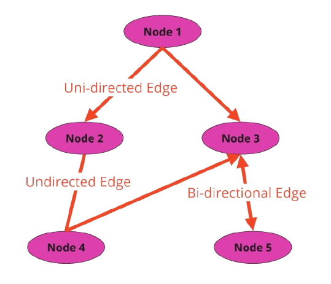
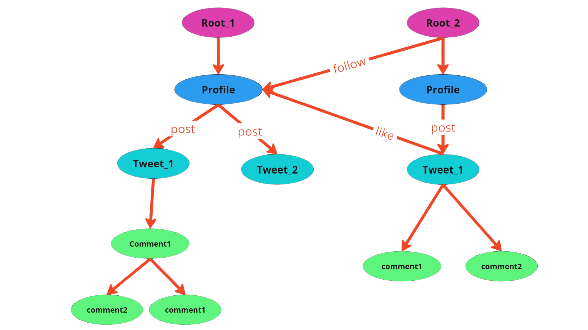

# Tutorial

## **Introduction to Graphs**

A **graph** is a mathematical structure used to model relationships between objects. It consists of two primary components:

- **Nodes (or Vertices)**: These are the individual entities or points in the graph. Each node represents an object, entity, or a piece of data.

- **Edges**: These are the connections or relationships between nodes. Edges can be directed (one-way) or undirected (two-way).

### **Key Characteristics of Graphs**

- **Directed vs. Undirected**:
      - A **directed graph** has edges with a direction, indicating a one-way relationship (e.g., "A points to B").
      - An **undirected graph** has edges with no direction, indicating a two-way relationship (e.g., "A is connected to B").

- **Weighted vs. Unweighted**:
      - A **weighted graph** assigns a weight or value to each edge (e.g., distance, cost, or capacity).
      - An **unweighted graph** treats all edges equally.

??? example "Graph"
      
      Sample Graph image will be updated soon

??? example "Family Graph"
      Sample Family Graph image will be updated soon
---

## **Introduction to Data-spatial Programming**

**Data Spatial Programming** organizes data as interconnected nodes within a spatial or graph-like structure. It focuses on the **relationships** between data points, rather than processing them **step-by-step**. This approach is ideal for complex systems like social networks or AI models, where data entities influence each other dynamically.

| Aspect      | Conventional Programming  | Data Spatial Programming |
| :---------: | :-------------: | :-------------: |
| Data Representation       | Data is stored in linear structures like arrays, tables, or objects.  | Data is represented as entities (nodes) in a multidimensional space (graphs).  |
| Focus       | Focuses on procedural logic and algorithmic problem-solving. | Focuses on relationships and interactions between data points. |
| Execution Model    | Runs sequentially, following explicit instructions. | Operates through spatial relationships, with data interacting dynamically. |
| Use Cases    | System programming, desktop applications, database manipulation. | Real-time network analysis, AI, graph-based applications, simulations. |

---

# **LittleX Architecture and Its Explanation**

## **Overview of LittleX Architecture**



### **Nodes**

#### **profile**
- Represents a user profile.
- **Attributes:**
      - `username`: Name of the user.
      - `count_tag`: Tracks hashtag usage as a dictionary.
      - `followees`: List of followed profiles.

- User Node
      ```jac
      node User {
            has username: str;
            has followers: list;
            has posts: list;
      }
      ```

#### **tweet**
- Represents a user's post/tweet.
- **Attributes:**
      - `content`: Tweet text.
      - `created_at`: Timestamp when the tweet was created.

#### **comment**
- Represents a comment on a tweet.
- **Attributes:**
      - `content`: Comment text.

---

### **Edges (Relationships)**

- **follow:** Connects one profile to another (followee).
- **like:** Represents a "like" relationship between a profile and a tweet.
- **post:** Represents a relationship where a profile posts a tweet.

- **Follow Edge**
      ```jac
      edge follow {}
      ```

### **Jaclang Implementation**

=== "Jaclang Installation"
      1. Install Jaclang
            ```bash
            pip install jaclang, graphviz
            ```
      2. Run code
            ```bash
            jac run filename.jac
            ```
      3. Visulalize Graph
            ```bash
            jac dot filename.jac > filename.dot
            ```
      4. Open the saved dot file and visualize

=== "Example 1"
    ```jac linenums="1"
    --8<-- "examples/data_spatial/create_node.jac"
    ```

## **Introduction to Jac-cloud**

### **Walkers**
- Walkers are simply agents that can walk on a graph and do tasks where needed.
- Walkers also inherits from classes in jaclang, but they do not require initialization.
- Abilities can be defined to run on different types of nodes.
- Jaseci stack automatically converts walkers into RESTful API Endpoints

#### **Profile Management**
- `visit_profile`: Access or create a new user profile.
- `load_user_profiles`: Loads all user profiles from the database.
- `update_profile`: Updates a profile’s username.
- `get_profile`: Retrieves and logs profile information.
- `follow_request` / `un_follow_request`: Allows users to follow or unfollow other profiles.

#### **Tweet Management**
- `create_tweet`: Allows a user to post a new tweet.
- `update_tweet`: Updates an existing tweet’s content.
- `remove_tweet`: Deletes a user’s tweet.
- `load_tweets`: Fetches all tweets from a user, including:
      - Comments.
      - Likes.
      - Content with timestamps.
- `like_tweet` / `remove_like`: Users can like or unlike tweets.
- `comment_tweet`: Users can comment on tweets.

#### **User Feed and Search**
- **`load_feed`:**
      - Fetches the latest tweets from the user and their followees.
      - Summarizes tweets using GPT-4o.
      - Provides search functionality using query-based filtering with `cosine_similarity`.
- **`summarise_tweets`:**
      - Summarizes major trends and events from fetched tweets in a concise line.
- **`search_tweets`:**
      - Filters tweets relevant to a query using vector embeddings.

#### **Interaction Loaders**
- `load_likes`: Fetches likes on a tweet.
- `load_comments`: Fetches comments on a tweet.
- `load_tweet`: Fetches details of a specific tweet, including content and author.

### **Jac Cloud Implementation**

=== "Jac-cloud Installation"
      1. Install Jaclang
            ```bash
            pip install jac-cloud
            ```
      2. Run code
            ```bash
            jac serve filename.jac
            ```
      3. Go to your browser and navigate to
            ```bash
            http://localhost:8000/docs
            ```

=== "Example 1"
    ```jac linenums="1"
    --8<-- "support\jac-lang.org\docs\learn\littleX\src\Jac_cloud_example.jac"
    ```
## **Introduction to MTLLM**
Integrates LLM into your existing application with minimal effort.

### **MTLLM Implementation**

=== "MTLLM Installation"
      1. Install MTLLM with ollama
            ```bash
            pip install mtllm[ollama]
            ```
      2. Run code
            ```bash
            jac run mtllm_example.jac
            ```

=== "Example 1"
    ```jac linenums="1"
    --8<-- "support\jac-lang.org\docs\learn\littleX\src\mtllm_example.jac"
    ```

## **Introduction to Jac Splice Orchestrator**

**JAC Cloud Orchestrator** (jac-splice-orc) is a system designed to **dynamically import** any Python module, deploy it as a Kubernetes Pod, and expose it as an independent gRPC service. This enables any Python module to be used as a microservice, providing flexibility and scalability in a cloud environment.

### **Jac Splice Orchestrator Implementation**

=== "Jac-splice-orc Installation"
      1. Install Jac Splice Orchestrator
            ```bash
            pip install jac-splice-orc
            ```
      2. Setup Configuration file and Create Cluster
            ```bash
            kind create cluster --name cluster_name --config kind-config.yaml
            ```
      3. Initialize Jac Splice Orchestrator
            ```bash
            jac orc_initialize cluster_name
            ```
      4. Run Jac file
            ```bash
            jac run filename.jac
            ```

=== "kind-config.yaml"
    ```yaml linenums="1"
    --8<-- "support\jac-lang.org\docs\learn\littleX\src\kind-config.yaml"
    ```

=== "Example"
    ```jac linenums="1"
    --8<-- "support\jac-lang.org\docs\learn\littleX\src\mtllm_example.jac"
    ```


