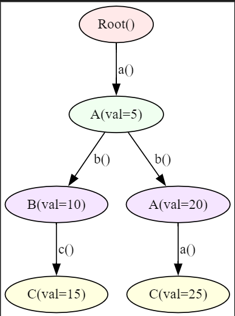
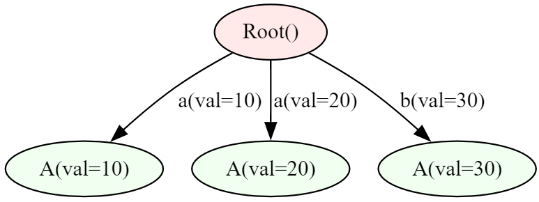

# Node and Edge Filtering

JacLang provides flexible filtering mechanisms to control graph traversal and operations, allowing precise selection of nodes and edges based on specific criteria. These filters enable developers to optimize traversal and focus only on relevant parts of the graph.

---

## 1. Node-Based Filtering

Node-based filtering restricts traversal to specific nodes that satisfy predefined conditions. This is useful when you need to:
- Limit traversal to nodes with certain attributes or properties.
- Filter nodes dynamically based on walker state or external context.

### Example:

We can filter specific types of nodes from a list of visitable nodes based on their type, and further apply conditions on node attributes to refine the results.
=== "Jac"
    ```jac linenums="1"
    --8<-- "examples/data_spatial/filtering.jac"
    ```
??? tip "Output"
    ```txt
    [A(val=20)]
    [C(val=25)]
    [C(val=15), C(val=25)]
    [C(val=25)]
    [C(val=15)]
    ```
??? example "Graph Image"
    

##2. Edge-Based Filtering

Edge filtering in JacLang allows developers to control traversal by selecting edges based on specific attributes or conditions. This is especially useful in scenarios where certain edges in the graph are more relevant to the task at hand, such as weighted graphs or context-sensitive connections.

---

### Example:
We can filter nodes based on specific edge attributes, such as filtering by edge values to retrieve a subset of connected nodes.
=== "Jac"
    ```jac linenums="1"
    --8<-- "examples/data_spatial/edge_filtering.jac"
    ```
??? tip "Output"
    ```txt
    [A(val=10), A(val=20), A(val=30)]
    [A(val=10), A(val=20)]
    [A(val=10)]
    [A(val=20)]
    ```
??? example "Graph Image"
    