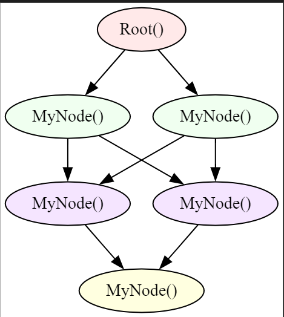

# <span style="color: orange">Nodes and Edges</span>

## Nodes 
Nodes are the fundamental elements of a graph in Jac, acting as starting points, connection hubs, and endpoints. They can be compared to custom classes in object-oriented programming (OOP). 

### Custom Node Types
- You can define custom node types to create specific instances within the graph. 
- Each node can have `attributes` (like fields in a class) and `abilities` (similar to methods in OOP).

### Abilities in Nodes
- **Callable Abilities:** They are similar to standard methods in OOP. Inside any ability, the node can refer to itself using the `self` keyword, much like in OOP. 

- **Visit-dependent Abilities:** These abilities are only triggered when a specific type of "walker" (discussed later) interacts with the node. This ensures that certain actions are performed only in response to a walker's visit. In these abilities, a special keyword `here` is used to reference the visiting walker. This allows you to access the walker's attributes and abilities directly during its interaction with the node.

- Nodes can connect in different ways: one node can link to multiple nodes, multiple nodes can link to one node, a group of nodes can connect to another group of nodes, or one node can connect to another single node.
=== "Jac"
    ```jac linenums="1"
    --8<-- "examples/data_spatial/create_node.jac"
    ```
??? example "Graph Image"
    

## Edges
Nodes can be linked using either *default edges* (generic connections) or *custom edges*, which have specific properties.
    ```jac
      node_1 ++> node_2; # uni directional edge
      node_1 <++> node_2; # bidirectional edge
    ```
