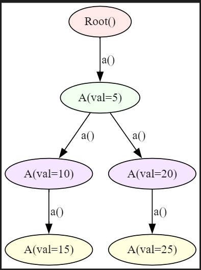

# <span style="color: orange">Walkers</span>
Walkers are "worker bots" that move (walk) along the graph while performing tasks on the nodes they visit.

They play a crucial role in executing visit-dependent abilities as discussed in nodes and facilitating interactions between graph nodes and themselves.

## Spawning a Walker
A walker can be spawned at any point on the graph with the ```spawn``` keyword.

=== "Jac"
    ```jac linenums="1"
    --8<-- "examples/data_spatial/define_walker.jac"
    ```
??? example "Graph Image"
    

## Graph Traversal Using Visit
Walkers navigate the graph using the ```visit``` keyword.
=== "visiting_node.jac"
    ```jac linenums="1"
        visit [node_name]; # Visits a particular node
    ```
=== "visiting_sucessor.jac"
    ```jac linenums="1"
        visit [node_name-->]; # Visits successive nodes of a node
    ```
=== "visiting_predecessor.jac"
    ```jac linenums="1"
        visit [<--node_name]; # Visits predecessor nodes of a node
    ```
### Example:
=== "Jac"
    ```jac linenums="1"
    --8<-- "examples/data_spatial/ds_entry_exit.jac"
    ```
??? tip "Output"
    ```txt
    Entering at the beginning of walker:  Root()
    Visiting node :  test_node(value=0)
    Visiting node :  test_node(value=1)
    Visiting node :  test_node(value=2)
    Visiting node :  test_node(value=3)
    Visiting node :  test_node(value=4)
    Visiting node :  test_node(value=5)
    Visiting node :  test_node(value=6)
    Visiting node :  test_node(value=7)
    Visiting node :  test_node(value=8)
    Visiting node :  test_node(value=9)
    Exiting at the end of walker:  test_node(value=9)
    test_walker(visited_nodes=[test_node(value=0), test_node(value=1), test_node(value=2), test_node(value=3), test_node(value=4), test_node(value=5), test_node(value=6), test_node(value=7), test_node(value=8), test_node(value=9)], entry_count=1, exit_count=1)
    ```

!!! Abstract  "can log_entry with entry"
    -  This ability is triggered once when the walker is spawned. It is essentially the "entry point" of the walker’s operation.
    In the example, it logs the entry at the beginning, increments entry_count by 1, and prints the node where the walker starts (in this case, the root node).
    !!! Info ""
        - This DS function is called once at the beginning of the walker’s traversal before visiting any nodes.

!!! Abstract "can log_visit with test_node exit"
    - This ability is executed each time the walker visits a node of type test_node during its traversal.
    In the example, whenever the walker visits a test_node, it prints the node and appends the node to visited_nodes.
    !!! Info ""
        - This DS function operates during traversal and is called on each node of type test_node the walker visits.

!!! Abstract "can log_exit with exit"
    - This ability is triggered once when the walker finishes its traversal, marking the end of its operation.
    In the example, it logs the exit point, increments exit_count by 1, and prints the final node visited.
    !!! Info ""
        - This DS function is executed at the end of the walker's execution, after all nodes have been visited.

## Attributes & Abilities
- Similar to nodes, walkers can have their own attributes and abilities including both callable and visit-dependent abilities.

- **Visit-dependent Abilities:**
    - Ensures the ability is executed only when the walker visits a node.
    - Can be defined within:
        - **Nodes:** Triggered upon a walker's arrival.
        - **Walkers:**  Specific to the walker’s operation during its visit.

## Reference Keywords:
- ```self``` : Refers to the walker object itself.
- ```here```: References the current node visited by the walker, enabling access to its attributes and callable abilities.
    This allows seamless interaction between walker and node attributes.

- Control Movement:
    - Use ```visit``` to:
        - Direct the walker to a specific node.
        - Walk along an edge connecting nodes.

- Remove Walkers:
    - Use ```disengage``` to remove a walker from the graph.

## Walkers in Action:
- Walkers prioritize their visit-dependent abilities first before executing the abilities of the visited node.
- This enables flexible task delegation:
    - Define visit-dependent tasks either within the walker or in the node.

By using these principles, walkers can efficiently traverse and interact with graphs, enabling dynamic workflows.
