## Enum
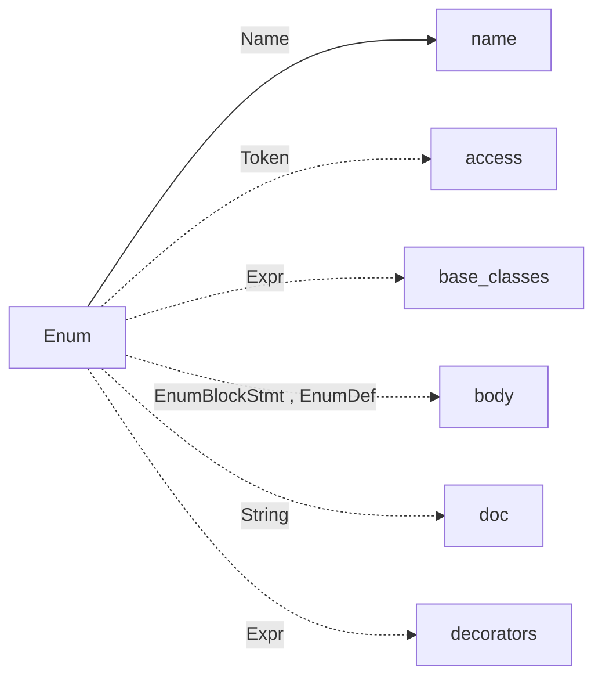

Enum node type for Jac Ast.

## Name
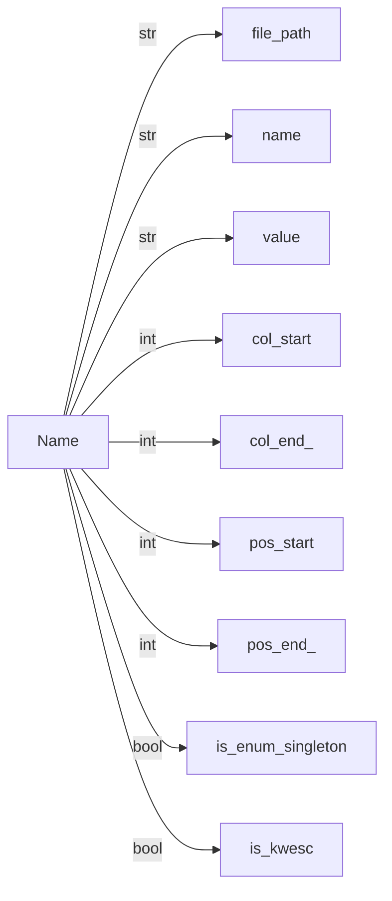

Name node type for Jac Ast.

## SubTag


SubTag node type for Jac Ast.

## SubNodeList


SubNodeList node type for Jac Ast.

## Module
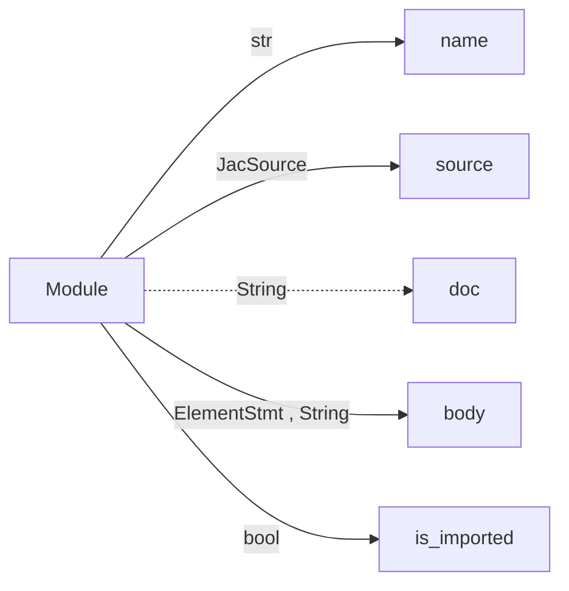

Whole Program node type for Jac Ast.

## GlobalVars
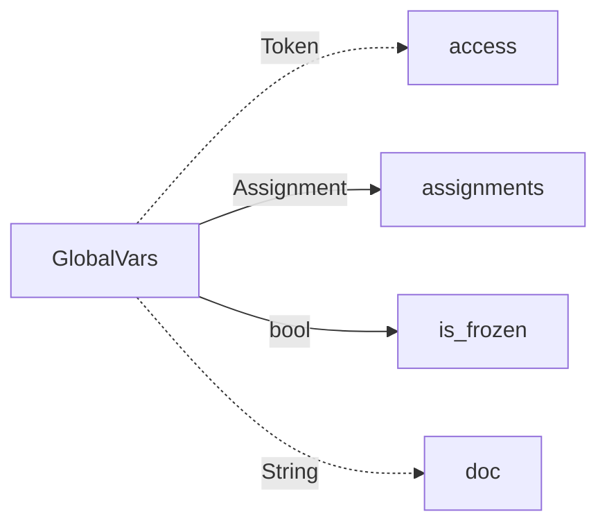

GlobalVars node type for Jac Ast.

## Test
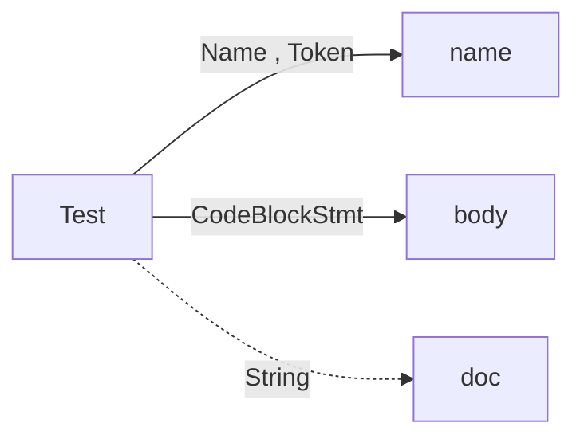

Test node type for Jac Ast.

## ModuleCode
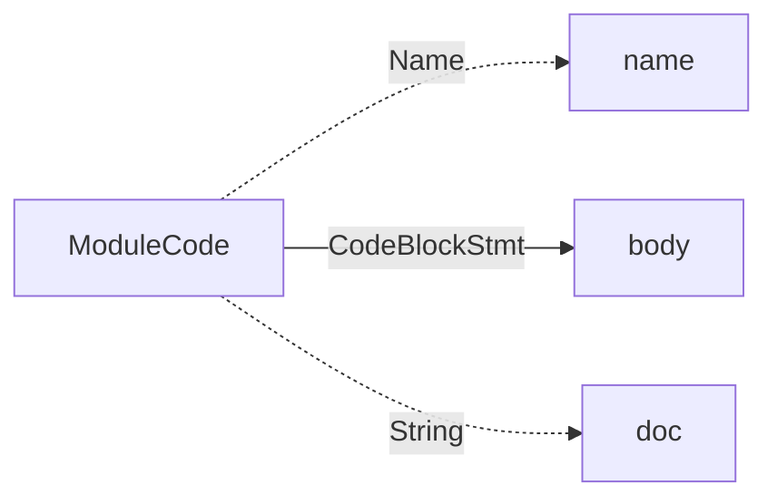

Free mod code for Jac Ast.

## PyInlineCode
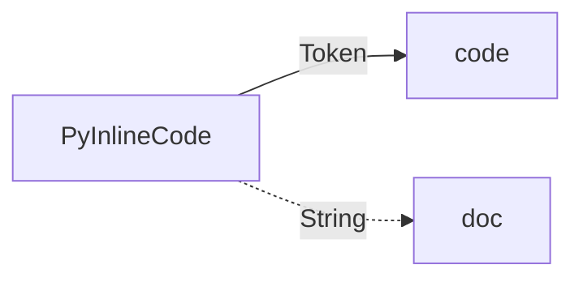

Inline Python code node type for Jac Ast.

## Import
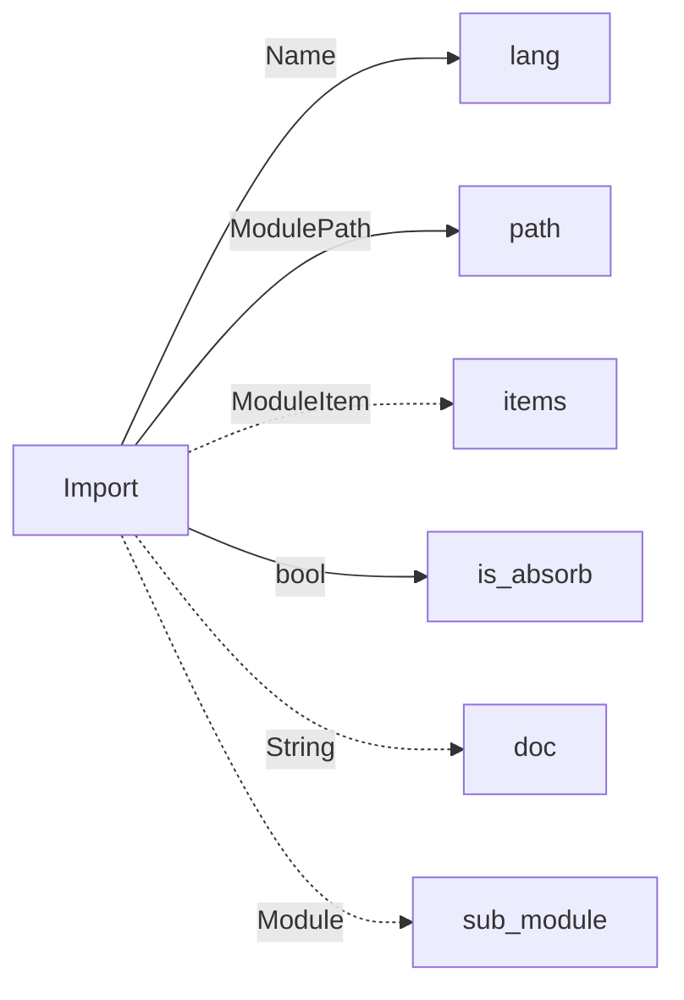

Import node type for Jac Ast.

## ModulePath
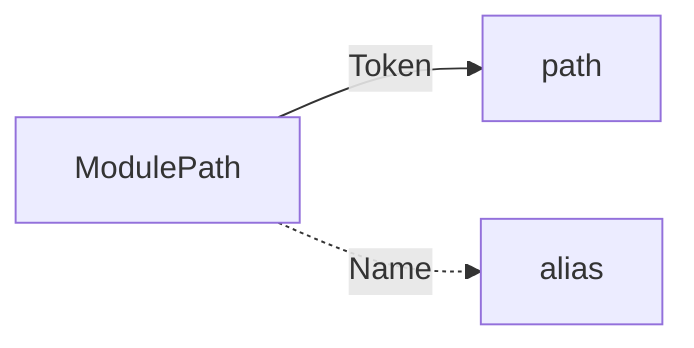

ModulePath node type for Jac Ast.

## ModuleItem
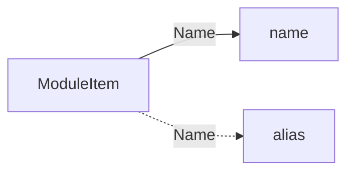

ModuleItem node type for Jac Ast.

## Architype
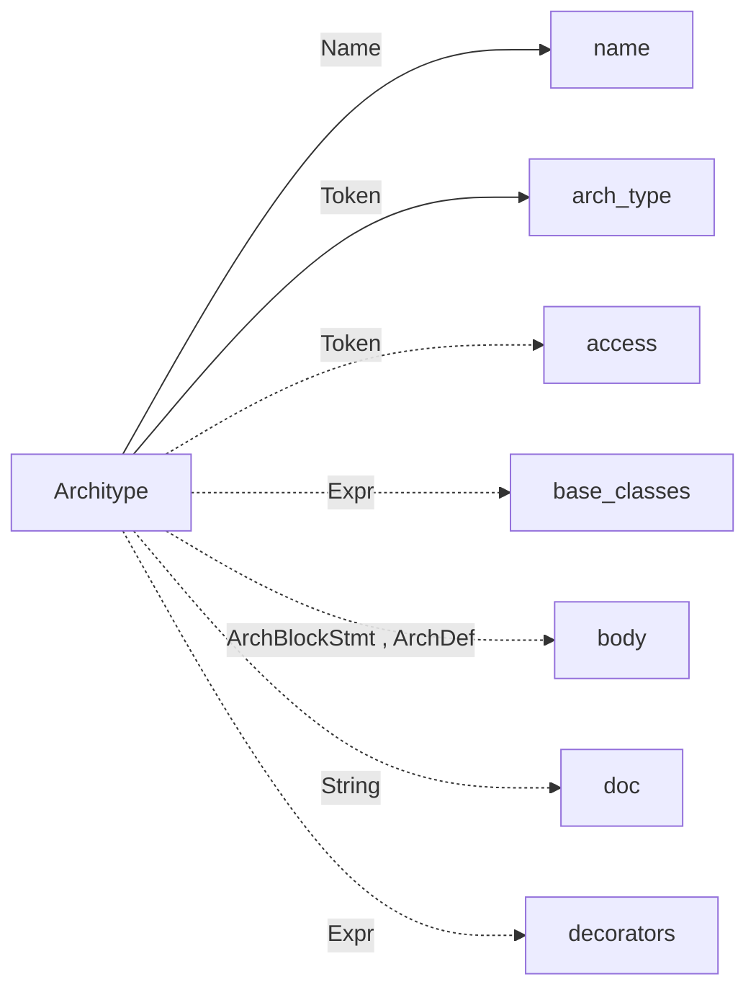

ObjectArch node type for Jac Ast.

## ArchDef
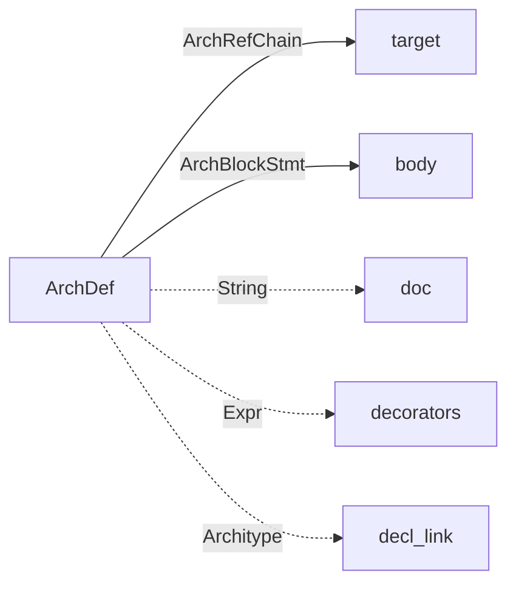

ArchDef node type for Jac Ast.

## EnumDef
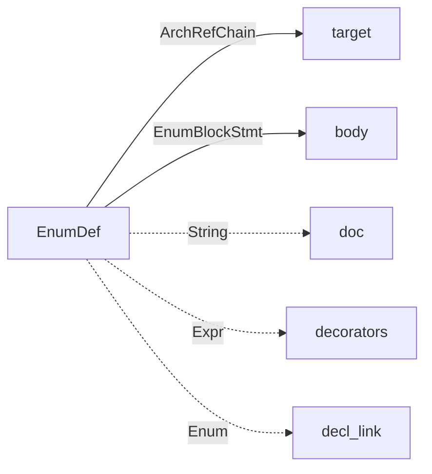

EnumDef node type for Jac Ast.

## Ability
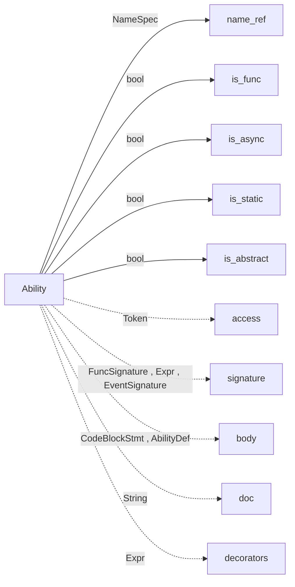

Ability node type for Jac Ast.

## AbilityDef
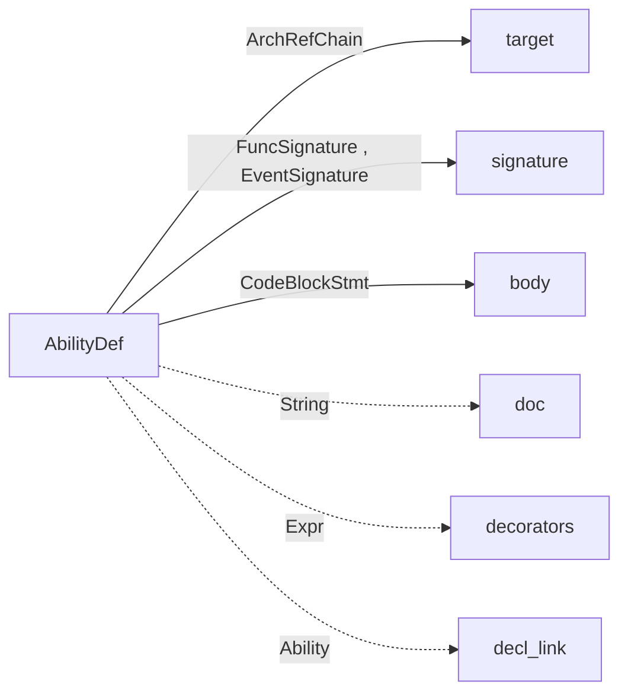

AbilityDef node type for Jac Ast.

## FuncSignature
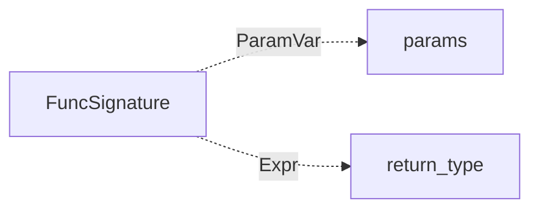

FuncSignature node type for Jac Ast.

## EventSignature
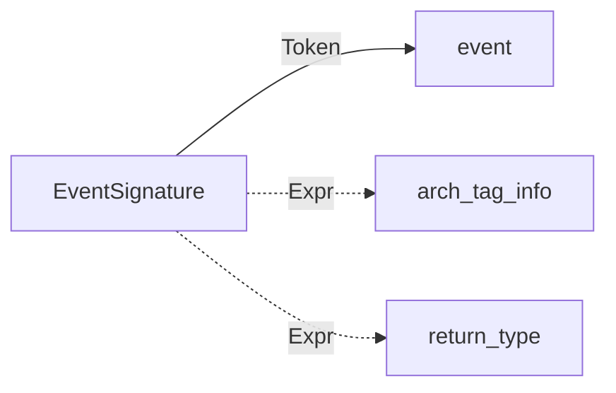

EventSignature node type for Jac Ast.

## ArchRef
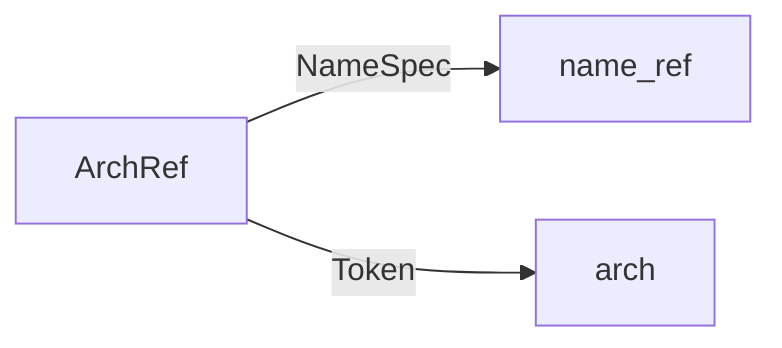

ArchRef node type for Jac Ast.

## ArchRefChain
```mermaid
flowchart LR
ArchRefChain -->|list - ArchRef| archs
```

Arch ref list node type for Jac Ast.

## ParamVar
```mermaid
flowchart LR
ParamVar -->|Name| name
ParamVar -.->|Token| unpack
ParamVar -->|Expr| type_tag
ParamVar -.->|Expr| value
```

ParamVar node type for Jac Ast.

## ArchHas
```mermaid
flowchart LR
ArchHas -->|bool| is_static
ArchHas -.->|Token| access
ArchHas -->|HasVar| vars
ArchHas -->|bool| is_frozen
ArchHas -.->|String| doc
```

HasStmt node type for Jac Ast.

## HasVar
```mermaid
flowchart LR
HasVar -->|Name| name
HasVar -->|Expr| type_tag
HasVar -.->|Expr| value
```

HasVar node type for Jac Ast.

## TypedCtxBlock
```mermaid
flowchart LR
TypedCtxBlock -->|Expr| type_ctx
TypedCtxBlock -->|CodeBlockStmt| body
```

TypedCtxBlock node type for Jac Ast.

## IfStmt
```mermaid
flowchart LR
IfStmt -->|Expr| condition
IfStmt -->|CodeBlockStmt| body
IfStmt -.->|ElseStmt , ElseIf| else_body
```

IfStmt node type for Jac Ast.

## ElseIf
```mermaid
flowchart LR
ElseIf -->|Expr| condition
ElseIf -->|CodeBlockStmt| body
ElseIf -.->|ElseStmt , ElseIf| else_body
```

ElseIfs node type for Jac Ast.

## ElseStmt
```mermaid
flowchart LR
ElseStmt -->|CodeBlockStmt| body
```

Else node type for Jac Ast.

## ExprStmt
```mermaid
flowchart LR
ExprStmt -->|Expr| expr
ExprStmt -->|bool| in_fstring
```

ExprStmt node type for Jac Ast.

## TryStmt
```mermaid
flowchart LR
TryStmt -->|CodeBlockStmt| body
TryStmt -.->|Except| excepts
TryStmt -.->|ElseStmt| else_body
TryStmt -.->|FinallyStmt| finally_body
```

TryStmt node type for Jac Ast.

## Except
```mermaid
flowchart LR
Except -->|Expr| ex_type
Except -.->|Name| name
Except -->|CodeBlockStmt| body
```

Except node type for Jac Ast.

## FinallyStmt
```mermaid
flowchart LR
FinallyStmt -->|CodeBlockStmt| body
```

FinallyStmt node type for Jac Ast.

## IterForStmt
```mermaid
flowchart LR
IterForStmt -->|Assignment| iter
IterForStmt -->|bool| is_async
IterForStmt -->|Expr| condition
IterForStmt -->|Assignment| count_by
IterForStmt -->|CodeBlockStmt| body
IterForStmt -.->|ElseStmt| else_body
```

IterFor node type for Jac Ast.

## InForStmt
```mermaid
flowchart LR
InForStmt -->|Expr| target
InForStmt -->|bool| is_async
InForStmt -->|Expr| collection
InForStmt -->|CodeBlockStmt| body
InForStmt -.->|ElseStmt| else_body
```

InFor node type for Jac Ast.

## WhileStmt
```mermaid
flowchart LR
WhileStmt -->|Expr| condition
WhileStmt -->|CodeBlockStmt| body
```

WhileStmt node type for Jac Ast.

## WithStmt
```mermaid
flowchart LR
WithStmt -->|bool| is_async
WithStmt -->|ExprAsItem| exprs
WithStmt -->|CodeBlockStmt| body
```

WithStmt node type for Jac Ast.

## ExprAsItem
```mermaid
flowchart LR
ExprAsItem -->|Expr| expr
ExprAsItem -.->|Expr| alias
```

ExprAsItem node type for Jac Ast.

## RaiseStmt
```mermaid
flowchart LR
RaiseStmt -.->|Expr| cause
RaiseStmt -.->|Expr| from_target
```

RaiseStmt node type for Jac Ast.

## AssertStmt
```mermaid
flowchart LR
AssertStmt -->|Expr| condition
AssertStmt -.->|Expr| error_msg
```

AssertStmt node type for Jac Ast.

## CtrlStmt
```mermaid
flowchart LR
CtrlStmt -->|Token| ctrl
```

CtrlStmt node type for Jac Ast.

## DeleteStmt
```mermaid
flowchart LR
DeleteStmt -->|Expr| target
```

DeleteStmt node type for Jac Ast.

## ReportStmt
```mermaid
flowchart LR
ReportStmt -->|Expr| expr
```

ReportStmt node type for Jac Ast.

## ReturnStmt
```mermaid
flowchart LR
ReturnStmt -.->|Expr| expr
```

ReturnStmt node type for Jac Ast.

## IgnoreStmt
```mermaid
flowchart LR
IgnoreStmt -->|Expr| target
```

IgnoreStmt node type for Jac Ast.

## VisitStmt
```mermaid
flowchart LR
VisitStmt -.->|Expr| vis_type
VisitStmt -->|Expr| target
VisitStmt -.->|ElseStmt| else_body
```

VisitStmt node type for Jac Ast.

## RevisitStmt
```mermaid
flowchart LR
RevisitStmt -.->|Expr| hops
RevisitStmt -.->|ElseStmt| else_body
```

ReVisitStmt node type for Jac Ast.

## AwaitExpr
```mermaid
flowchart LR
AwaitExpr -->|Expr| target
```

AwaitStmt node type for Jac Ast.

## GlobalStmt
```mermaid
flowchart LR
GlobalStmt -->|NameSpec| target
```

GlobalStmt node type for Jac Ast.

## NonLocalStmt
```mermaid
flowchart LR
NonLocalStmt -->|NameSpec| target
```

NonlocalStmt node type for Jac Ast.

## Assignment
```mermaid
flowchart LR
Assignment -->|Expr| target
Assignment -.->|Expr , YieldExpr| value
Assignment -.->|Expr| type_tag
Assignment -->|bool| mutable
Assignment -.->|Token| aug_op
```

Assignment node type for Jac Ast.

## BinaryExpr
```mermaid
flowchart LR
BinaryExpr -->|Expr| left
BinaryExpr -->|Expr| right
BinaryExpr -->|Token , DisconnectOp , ConnectOp| op
```

ExprBinary node type for Jac Ast.

## LambdaExpr
```mermaid
flowchart LR
LambdaExpr -->|FuncSignature| signature
LambdaExpr -->|Expr| body
```

ExprLambda node type for Jac Ast.

## UnaryExpr
```mermaid
flowchart LR
UnaryExpr -->|Expr| operand
UnaryExpr -->|Token| op
```

ExprUnary node type for Jac Ast.

## IfElseExpr
```mermaid
flowchart LR
IfElseExpr -->|Expr| condition
IfElseExpr -->|Expr| value
IfElseExpr -->|Expr| else_value
```

ExprIfElse node type for Jac Ast.

## MultiString
```mermaid
flowchart LR
MultiString -->|String , FString| strings
```

ExprMultiString node type for Jac Ast.

## FString
```mermaid
flowchart LR
FString -.->|String , ExprStmt| parts
```

FString node type for Jac Ast.

## ExprList
```mermaid
flowchart LR
ExprList -.->|Expr| values
```

ExprList node type for Jac Ast.

## ListVal
```mermaid
flowchart LR
ListVal -.->|Expr| values
```

ListVal node type for Jac Ast.

## SetVal
```mermaid
flowchart LR
SetVal -.->|Expr| values
```

SetVal node type for Jac Ast.

## TupleVal
```mermaid
flowchart LR
TupleVal -.->|Expr , KWPair , Expr| values
```

TupleVal node type for Jac Ast.

## DictVal
```mermaid
flowchart LR
DictVal -->|KVPair| kv_pairs
```

ExprDict node type for Jac Ast.

## KVPair
```mermaid
flowchart LR
KVPair -->|Expr| key
KVPair -->|Expr| value
```

ExprKVPair node type for Jac Ast.

## KWPair
```mermaid
flowchart LR
KWPair -->|NameSpec| key
KWPair -->|Expr| value
```

ExprKWPair node type for Jac Ast.

## InnerCompr
```mermaid
flowchart LR
InnerCompr -->|bool| is_async
InnerCompr -->|Expr| target
InnerCompr -->|Expr| collection
InnerCompr -.->|Expr| conditional
```

ListCompr node type for Jac Ast.

## ListCompr
```mermaid
flowchart LR
ListCompr -->|Expr| out_expr
ListCompr -->|InnerCompr| compr
```

ListCompr node type for Jac Ast.

## GenCompr
```mermaid
flowchart LR
GenCompr -->|Expr| out_expr
GenCompr -->|InnerCompr| compr
```

GenCompr node type for Jac Ast.

## SetCompr
```mermaid
flowchart LR
SetCompr -->|Expr| out_expr
SetCompr -->|InnerCompr| compr
```

SetCompr node type for Jac Ast.

## DictCompr
```mermaid
flowchart LR
DictCompr -->|KVPair| kv_pair
DictCompr -->|InnerCompr| compr
```

DictCompr node type for Jac Ast.

## AtomTrailer
```mermaid
flowchart LR
AtomTrailer -->|Expr| target
AtomTrailer -->|AtomExpr , Expr| right
AtomTrailer -->|bool| is_attr
AtomTrailer -->|bool| is_null_ok
```

AtomTrailer node type for Jac Ast.

## AtomUnit
```mermaid
flowchart LR
AtomUnit -->|Expr , YieldExpr| value
AtomUnit -->|bool| is_paren
```

AtomUnit node type for Jac Ast.

## YieldExpr
```mermaid
flowchart LR
YieldExpr -.->|Expr| expr
YieldExpr -->|bool| with_from
```

YieldStmt node type for Jac Ast.

## FuncCall
```mermaid
flowchart LR
FuncCall -->|Expr| target
FuncCall -.->|Expr , KWPair| params
```

FuncCall node type for Jac Ast.

## IndexSlice
```mermaid
flowchart LR
IndexSlice -.->|Expr| start
IndexSlice -.->|Expr| stop
IndexSlice -.->|Expr| step
IndexSlice -->|bool| is_range
```

IndexSlice node type for Jac Ast.

## SpecialVarRef
```mermaid
flowchart LR
SpecialVarRef -->|Token| var
```

HereRef node type for Jac Ast.

## EdgeOpRef
```mermaid
flowchart LR
EdgeOpRef -.->|Expr| filter_type
EdgeOpRef -.->|FilterCompr| filter_cond
EdgeOpRef -->|EdgeDir| edge_dir
```

EdgeOpRef node type for Jac Ast.

## DisconnectOp
```mermaid
flowchart LR
DisconnectOp -->|EdgeOpRef| edge_spec
```

DisconnectOpRef node type for Jac Ast.

## ConnectOp
```mermaid
flowchart LR
ConnectOp -.->|Expr| conn_type
ConnectOp -.->|AssignCompr| conn_assign
ConnectOp -->|EdgeDir| edge_dir
```

ConnectOpRef node type for Jac Ast.

## FilterCompr
```mermaid
flowchart LR
FilterCompr -->|BinaryExpr| compares
```

FilterCtx node type for Jac Ast.

## AssignCompr
```mermaid
flowchart LR
AssignCompr -->|KWPair| assigns
```

AssignCtx node type for Jac Ast.

## MatchStmt
```mermaid
flowchart LR
MatchStmt -->|Expr| target
MatchStmt -->|list - MatchCase| cases
```

MatchStmt node type for Jac Ast.

## MatchCase
```mermaid
flowchart LR
MatchCase -->|MatchPattern| pattern
MatchCase -.->|Expr| guard
MatchCase -->|CodeBlockStmt| body
```

MatchCase node type for Jac Ast.

## MatchOr
```mermaid
flowchart LR
MatchOr -->|list - MatchPattern| patterns
```

MatchOr node type for Jac Ast.

## MatchAs
```mermaid
flowchart LR
MatchAs -->|NameSpec| name
MatchAs -.->|MatchPattern| pattern
```

MatchAs node type for Jac Ast.

## MatchValue
```mermaid
flowchart LR
MatchValue -->|Expr| value
```

MatchValue node type for Jac Ast.

## MatchSingleton
```mermaid
flowchart LR
MatchSingleton -->|Bool , Null| value
```

MatchSingleton node type for Jac Ast.

## MatchSequence
```mermaid
flowchart LR
MatchSequence -->|list - MatchPattern| values
```

MatchSequence node type for Jac Ast.

## MatchMapping
```mermaid
flowchart LR
MatchMapping -->|list - MatchKVPair , MatchStar| values
```

MatchMapping node type for Jac Ast.

## MatchKVPair
```mermaid
flowchart LR
MatchKVPair -->|MatchPattern , NameSpec| key
MatchKVPair -->|MatchPattern| value
```

MatchKVPair node type for Jac Ast.

## MatchStar
```mermaid
flowchart LR
MatchStar -->|NameSpec| name
MatchStar -->|bool| is_list
```

MatchStar node type for Jac Ast.

## MatchArch
```mermaid
flowchart LR
MatchArch -->|NameSpec| name
MatchArch -.->|MatchPattern| arg_patterns
MatchArch -.->|MatchKVPair| kw_patterns
```

MatchClass node type for Jac Ast.

## Token
```mermaid
flowchart LR
Token -->|str| file_path
Token -->|str| name
Token -->|str| value
Token -->|int| col_start
Token -->|int| col_end_
Token -->|int| pos_start
Token -->|int| pos_end_
```

Token node type for Jac Ast.

## BuiltinType
```mermaid
flowchart LR
BuiltinType -->|str| file_path
BuiltinType -->|str| name
BuiltinType -->|str| value
BuiltinType -->|int| col_start
BuiltinType -->|int| col_end_
BuiltinType -->|int| pos_start
BuiltinType -->|int| pos_end_
BuiltinType -->|bool| is_enum_singleton
BuiltinType -->|bool| is_kwesc
```

Type node type for Jac Ast.

## Float
```mermaid
flowchart LR
Float -->|str| file_path
Float -->|str| name
Float -->|str| value
Float -->|int| col_start
Float -->|int| col_end_
Float -->|int| pos_start
Float -->|int| pos_end_
```

Float node type for Jac Ast.

## Int
```mermaid
flowchart LR
Int -->|str| file_path
Int -->|str| name
Int -->|str| value
Int -->|int| col_start
Int -->|int| col_end_
Int -->|int| pos_start
Int -->|int| pos_end_
```

Int node type for Jac Ast.

## String
```mermaid
flowchart LR
String -->|str| file_path
String -->|str| name
String -->|str| value
String -->|int| col_start
String -->|int| col_end_
String -->|int| pos_start
String -->|int| pos_end_
```

String node type for Jac Ast.

## Bool
```mermaid
flowchart LR
Bool -->|str| file_path
Bool -->|str| name
Bool -->|str| value
Bool -->|int| col_start
Bool -->|int| col_end_
Bool -->|int| pos_start
Bool -->|int| pos_end_
```

Bool node type for Jac Ast.

## Null
```mermaid
flowchart LR
Null -->|str| file_path
Null -->|str| name
Null -->|str| value
Null -->|int| col_start
Null -->|int| col_end_
Null -->|int| pos_start
Null -->|int| pos_end_
```

Semicolon node type for Jac Ast.

## Semi
```mermaid
flowchart LR
Semi -->|str| file_path
Semi -->|str| name
Semi -->|str| value
Semi -->|int| col_start
Semi -->|int| col_end_
Semi -->|int| pos_start
Semi -->|int| pos_end_
```

Semicolon node type for Jac Ast.

## CommentToken
```mermaid
flowchart LR
CommentToken -->|str| file_path
CommentToken -->|str| name
CommentToken -->|str| value
CommentToken -->|int| col_start
CommentToken -->|int| col_end_
CommentToken -->|int| pos_start
CommentToken -->|int| pos_end_
CommentToken -->|bool| is_inline
```

CommentToken node type for Jac Ast.


