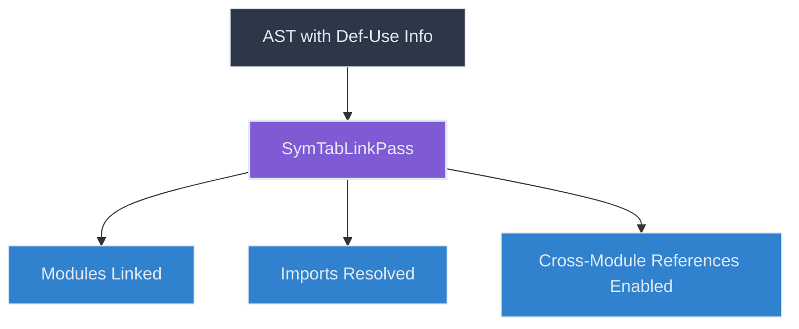
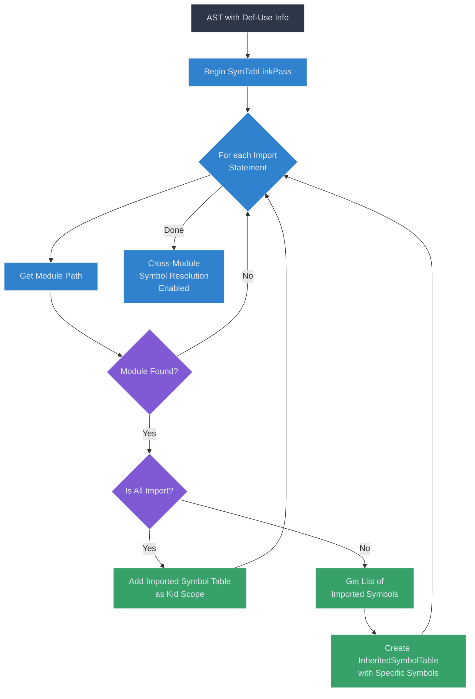
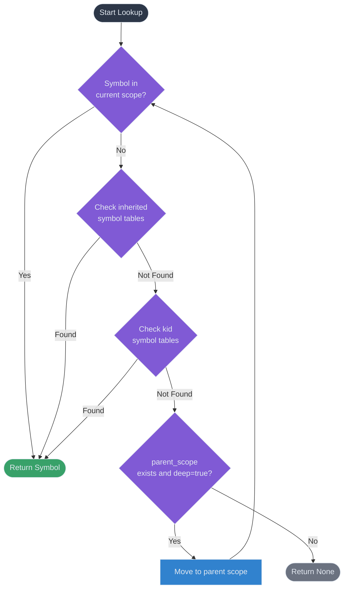
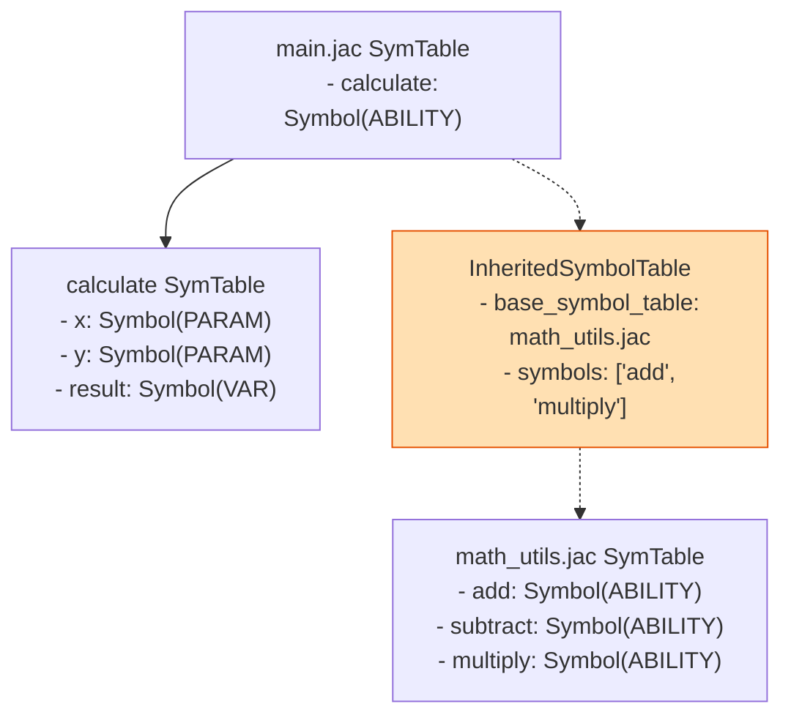

# Symbol Table Linking

After the `SymTabBuildPass` creates the initial symbol table structure and the `DefUsePass` connects symbol definitions with their uses, the `SymTabLinkPass` establishes connections between symbol tables across module boundaries. This pass is crucial for handling imports and enabling cross-module name resolution.

## The SymTabLinkPass

The `SymTabLinkPass` is responsible for:

1. Resolving imported modules and their symbols
2. Linking symbol tables from different modules
3. Handling different import styles (all imports vs. selective imports)
4. Managing aliased imports



## Key Mechanisms

### Import Resolution

The core functionality of `SymTabLinkPass` revolves around resolving import statements and linking the corresponding symbol tables:

```python
def enter_module_path(self, node: uni.ModulePath) -> None:
    """Link the symbol tables."""
    imp_node = node.parent_of_type(uni.Import)

    # Get path to the imported module
    rel_path = self._get_module_path(node, imp_node)
    if not rel_path or rel_path not in self.prog.mod.hub:
        return

    imported_mod_symtab = self.prog.mod.hub[rel_path].sym_tab
    # Skip if importing from itself
    if node.sym_tab == imported_mod_symtab:
        return

    # Determine if this is an "all import" (import everything)
    all_import = self._is_all_import(imp_node, node)
    symbols_str_list = self._get_imported_symbols(node)

    # Handle the import based on whether it's an all import or selective import
    if all_import:
        self._handle_all_import(node, imported_mod_symtab)
    else:
        self._handle_selective_import(
            node, imported_mod_symtab, symbols_str_list, imp_node
        )
```

This method:
1. Finds the import node
2. Resolves the path to the imported module
3. Gets the symbol table of the imported module
4. Determines the import style (all symbols or selective)
5. Links the symbol tables accordingly

### Module Path Resolution

The pass resolves the path to the imported module, handling both Jac and Python imports:

```python
def _get_module_path(
    self, node: uni.ModulePath, imp_node: uni.Import
) -> Optional[str]:
    """Get the path to the imported module."""
    if imp_node.is_jac:
        rel_path = node.resolve_relative_path()
        if os.path.isdir(rel_path):
            rel_path = f"{rel_path}/__init__.jac"
        if rel_path not in self.prog.mod.hub:
            self.log_error(
                f"Module {rel_path} not found in the program. Something went wrong.",
                node,
            )
            return None
        return rel_path
    else:
        # Python import
        if node.sym_name in self.prog.py_raise_map:
            return self.prog.py_raise_map[node.sym_name]

        full_path = f"{self.ir_out.get_href_path(node)}.{node.sym_name}"
        if full_path in self.prog.py_raise_map:
            return self.prog.py_raise_map[full_path]

        return None
```

This method handles:
- Resolving relative paths
- Handling directory imports
- Looking up module paths in the program's module hub
- Resolving Python import paths

### Import Style Detection

The pass distinguishes between different import styles:

```python
def _is_all_import(self, imp_node: uni.Import, node: uni.ModulePath) -> bool:
    """Determine if this is an all import (import everything from module)."""
    return (
        imp_node.is_jac and node.parent and isinstance(node.parent, uni.SubNodeList)
    ) or (imp_node.is_py and imp_node.from_loc is None and not imp_node.is_absorb)
```

This method detects whether:
- The import is a Jac "import all" statement (import module;)
- The import is a Python regular import (import module)

### Symbol List Extraction

For selective imports, the pass extracts the list of symbols to import:

```python
def _get_imported_symbols(self, node: uni.ModulePath) -> list[str]:
    """Get list of specific symbols being imported."""
    symbols = []
    if node.parent and isinstance(node.parent, uni.Import):
        for mod_items in node.parent.items.items:
            if isinstance(mod_items, uni.ModuleItem):
                symbols.append(mod_items.name.value)
    return symbols
```

This method builds a list of symbol names for selective imports, such as:
- from module import symbol1, symbol2; (Jac)
- from module import symbol1, symbol2 (Python)

### All Import Handling

For "all imports," the pass adds the imported module's symbol table as a child of the current module's symbol table:

```python
def _handle_all_import(
    self, node: uni.ModulePath, imported_mod_symtab: UniScopeNode
) -> None:
    """Handle an 'all import' by adding the imported symtable as a kid to the current sym table."""
    node.sym_tab.kid_scope.append(imported_mod_symtab)
```

This approach makes all symbols from the imported module accessible directly in the current module.

### Selective Import Handling

For selective imports, the pass creates an `InheritedSymbolTable` that references only the specified symbols:

```python
def _handle_selective_import(
    self,
    node: uni.ModulePath,
    imported_mod_symtab: UniScopeNode,
    symbols_str_list: list[str],
    imp_node: uni.Import,
) -> None:
    """Handle selective import of specific symbols."""
    # Check if we've already inherited from this symbol table
    for symtb in node.sym_tab.inherited_scope:
        if symtb.base_symbol_table == imported_mod_symtab:
            symtb.symbols.extend(symbols_str_list)
            return

    # If not inherited yet, add it to inherited scope
    node.sym_tab.inherited_scope.append(
        InheritedSymbolTable(
            base_symbol_table=imported_mod_symtab,
            # load_all_symbols needed for "from x import *" in Python imports
            load_all_symbols=imp_node.is_py and imp_node.is_absorb,
            symbols=symbols_str_list,
        )
    )
```

This method:
1. Checks if the current module already inherits from the imported module
2. If so, adds the new symbols to the existing inheritance
3. If not, creates a new `InheritedSymbolTable` with the specified symbols
4. Handles the special case of Python's "from x import *"

## Symbol Table Linking Flow

The overall flow of the symbol table linking process:



## Cross-Module Symbol Lookup

Once the symbol tables are linked, cross-module symbol lookup works through the enhanced symbol table hierarchy:



This lookup process now includes checking:
1. The current scope's `names_in_scope`
2. All inherited symbol tables through `inherited_scope`
3. All child symbol tables through `kid_scope` (for entire module imports)
4. Parent scopes recursively if `deep=True`

## The InheritedSymbolTable

The `InheritedSymbolTable` class is central to selective imports:

```python
class InheritedSymbolTable:
    """Inherited symbol table."""

    def __init__(
        self,
        base_symbol_table: UniScopeNode,
        load_all_symbols: bool = False,  # This is needed for python imports
        symbols: Optional[list[str]] = None,
    ) -> None:
        """Initialize."""
        self.base_symbol_table: UniScopeNode = base_symbol_table
        self.load_all_symbols: bool = load_all_symbols
        self.symbols: list[str] = symbols if symbols else []

    def lookup(self, name: str, deep: bool = False) -> Optional[Symbol]:
        """Lookup a variable in the symbol table."""
        if self.load_all_symbols:
            return self.base_symbol_table.lookup(name, deep)
        else:
            if name in self.symbols:
                return self.base_symbol_table.lookup(name, deep)
            else:
                return None
```

This class:
1. References the base symbol table of the imported module
2. Maintains a list of specific symbols to import
3. Provides a filtered lookup method that only returns symbols in the list
4. Supports "import all" mode through the `load_all_symbols` flag

## Example: Module Linking

Consider two Jac modules:

**math_utils.jac**:
```jac
can add(a: int, b: int) -> int {
    return a + b;
}

can subtract(a: int, b: int) -> int {
    return a - b;
}

can multiply(a: int, b: int) -> int {
    return a * b;
}
```

**main.jac**:
```jac
import math_utils with add, multiply;

can calculate(x: int, y: int) -> int {
    result = add(x, y) * multiply(x, y);
    return result;
}
```

Here's how `SymTabLinkPass` processes these modules:

1. Parse both modules and build their initial symbol tables
2. In `main.jac`, encounter `import math_utils with add, multiply;`
3. Resolve the path to `math_utils.jac`
4. Get the symbol table of `math_utils.jac`
5. Extract the imported symbols: `["add", "multiply"]`
6. Create an `InheritedSymbolTable` with:
   - `base_symbol_table` = `math_utils.jac`'s symbol table
   - `symbols` = `["add", "multiply"]`
7. Add this `InheritedSymbolTable` to `main.jac`'s `inherited_scope`

The resulting symbol table structure:



Now when `calculate` uses `add` and `multiply`:
1. The symbols are not found in `main.jac`'s `names_in_scope`
2. They are looked up in the `InheritedSymbolTable`
3. Since they are in the `symbols` list, they are found in `math_utils.jac`'s symbol table
4. The symbols are successfully resolved, allowing cross-module usage

## Conclusion

The `SymTabLinkPass` is essential for enabling modular Jac programs by connecting symbol tables across module boundaries. This pass:

- Enables imports between modules
- Supports selective imports to control symbol visibility
- Handles different import styles in both Jac and Python
- Creates a connected symbol table structure for cross-module name resolution

Once this pass is complete, the compiler has a complete view of the program's symbol structure, enabling accurate name resolution, type checking, and code generation across module boundaries.