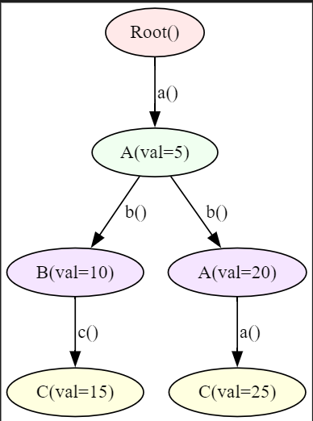
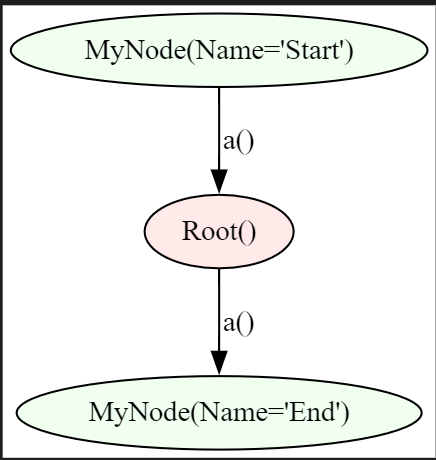
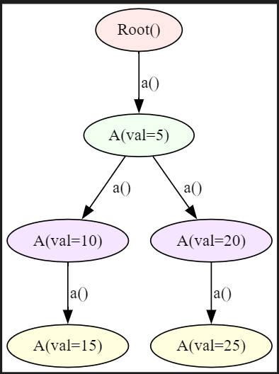
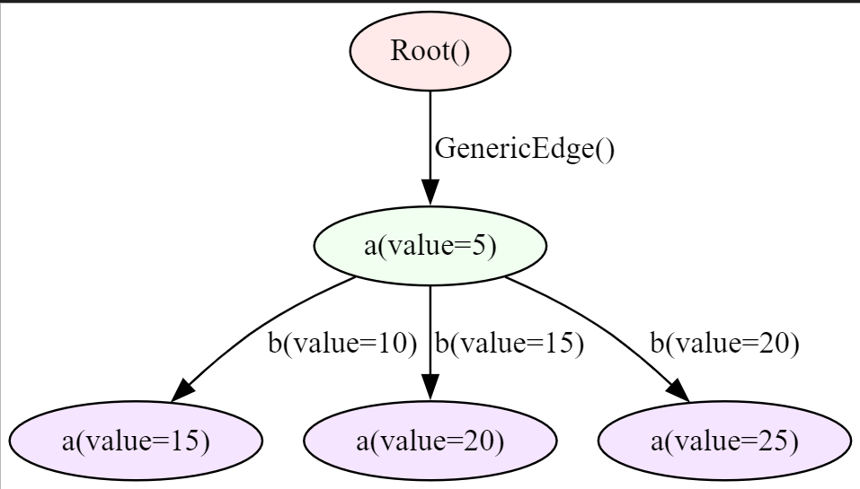

# <span style="color: orange">Examples
## <span style="color: orange">Node Creation and Connections
Nodes can be connected in various ways, including from a single node to a list of nodes, a list of nodes to a single node, a list of nodes to another list of nodes, or even a single node to a single node
=== "Jac"
    ```jac linenums="1"
    --8<-- "examples/data_spatial/create_node.jac"
    ```
??? example "Graph Image"
    

##  <span style="color: orange">Custom Edge Creation and Operations
We can establish connections between nodes or lists of nodes using custom edges instead of the default generic edges, allowing for more control and customization in the relationships between nodes.

=== "Jac"
    ```jac linenums="1"
    --8<-- "examples/data_spatial/custom_edge.jac"
    ```
Lines 17-21 demonstrate how to retrieve visitable or reachable nodes from a given node by applying specific edge conditions, such as filtering based on edge types or chaining multiple edge traversals.
??? example "Graph Image"
    

## <span style="color: orange">Filtering
We can filter specific types of nodes from a list of visitable nodes based on their type, and further apply conditions on node attributes to refine the results.
=== "Jac"
    ```jac linenums="1"
    --8<-- "examples/data_spatial/filtering.jac"
    ```
??? example "Graph Image"
    

##  <span style="color: orange">Visiting
We can retrieve all visitable nodes from a node in specific directions.
=== "Jac"
    ```jac linenums="1"
    --8<-- "examples/data_spatial/visiting.jac"
    ```
??? example "Graph Image"
    


##  <span style="color: orange">DS Entry-Exit

=== "Jac"
    ```jac linenums="1"
    --8<-- "examples/data_spatial/ds_entry_exit.jac"
    ```
??? tip "Output"
    ```txt
    Entering at the beginning of walker:  Root()
    Visiting node :  test_node(value=1)
    Visiting node :  test_node(value=0)
    Exiting at the end of walker:  test_node(value=0)
    test_walker(visited_nodes=[test_node(value=1), test_node(value=0)], entry_count=1, exit_count=1)
    ```

!!! Abstract  "can log_entry with entry"
    -  This ability is triggered once when the walker is spawned. It is essentially the "entry point" of the walker’s operation.
    In the example, it logs the entry at the beginning, increments entry_count by 1, and prints the node where the walker starts (in this case, the root node).
    !!! Info ""
        - This DS function is called once at the beginning of the walker’s traversal before visiting any nodes.

!!! Abstract "can log_visit with test_node exit"
    - This ability is executed each time the walker visits a node of type test_node during its traversal.
    In the example, whenever the walker visits a test_node, it prints the node and appends the node to visited_nodes.
    !!! Info ""
        - This DS function operates during traversal and is called on each node of type test_node the walker visits.

!!! Abstract "can log_exit with exit"
    - This ability is triggered once when the walker finishes its traversal, marking the end of its operation.
    In the example, it logs the exit point, increments exit_count by 1, and prints the final node visited.
    !!! Info ""
        - This DS function is executed at the end of the walker's execution, after all nodes have been visited.

##  <span style="color: orange">Walker Definition
=== "Jac"
    ```jac linenums="1"
    --8<-- "examples/data_spatial/define_walker.jac"
    ```
??? example "Graph Image"
    

## <span style="color: orange">Example 1
=== "Jac"
    ```jac linenums="1"
    --8<-- "examples/data_spatial/ds_example_1.jac"
    ```
??? example "Graph Image"
    

??? info "Code Explanation"
    - Create nodes
        1. `node_1 = a(value=5);` new node created with node class a, its value 5 and assigned to variable node_1.
        2. `node_2 = a();` New node created with node class a, its default value and assigned to variable node_2.

    - Connect nodes
        1. `root ++> node_1;`
        node_1 is connected to root node with generic edge.
        2. `node_1 +:b(value=10):+> node_3;` node_3 is connected to node_1 by custom edge with edge class b and its value 5.
        3. `node_1 +:b():+> node_2; `
        node_5 is connected to node_1 by custom edge with edge class b and its default value.

    - Delete edge
        1. `node_1 del --> node_2;`
        edge between node_1 and node_2 is deleted.

    - Delete node
        1. `del node_3;`  node_3 is deleted.


