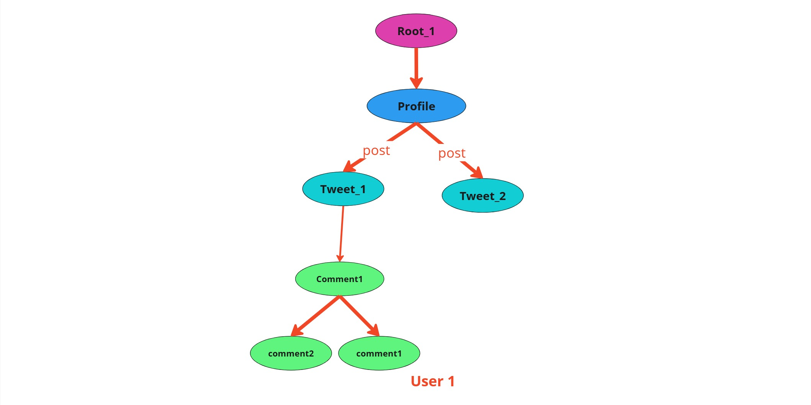
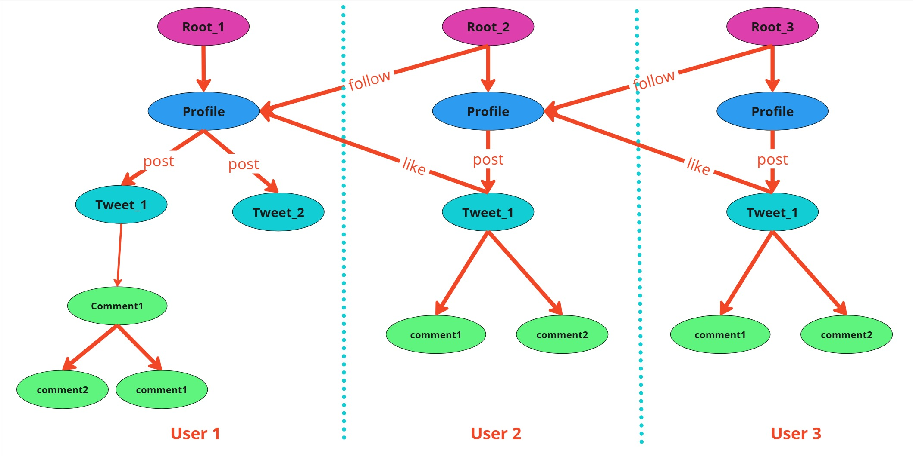
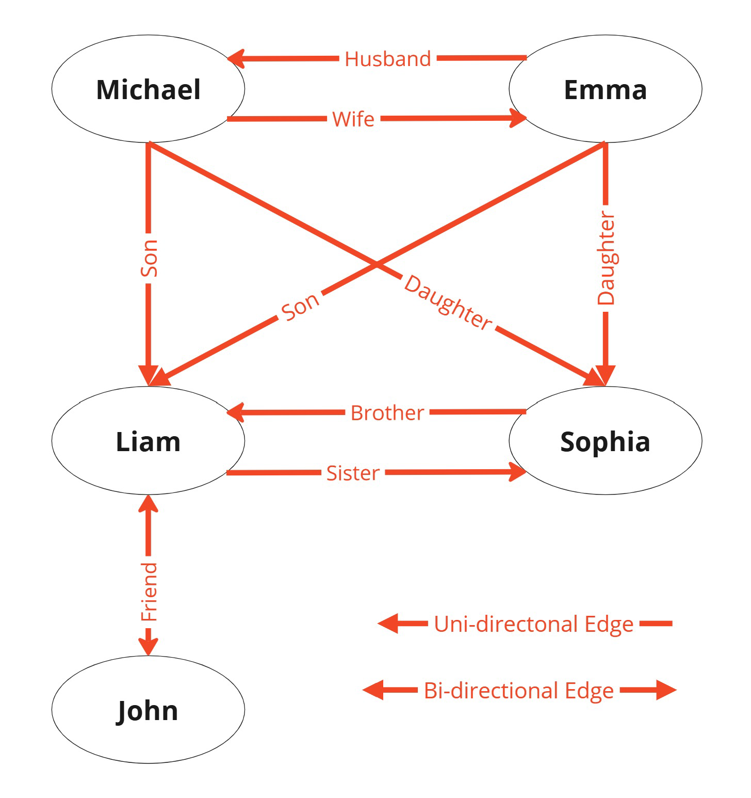

# **Building an Application with Jaseci**

This guide introduces how the Jaseci Stack accelerates application development by leveraging its graph-based programming model. With Jaseci, we can focus on implementing features instead of setting up complex systems. As you explore Jaseci’s features, you’ll uncover its wide range of use cases. This guide provides a quick introduction, helping you set up the Jaseci framework, define nodes, edges, and walkers, and craft application logic for your project.

## **What We Will Build**

We’ll develop a web application called **LittleX**, a streamlined and efficient version of Elon Musk’s X, using the Jaseci Stack. This project highlights the simplicity and power of Jaseci, enabling us to implement advanced features with minimal code and effort—tasks that typically require significant time in traditional frameworks.

## **Key Features:**
- **User authentication:** Sign up, log in, and profile management.
- **Content management:** Create, view, and interact with posts.
- **Social interactions:** Follow users and explore their content.

With Jaseci, we can focus on building these features seamlessly rather than dealing with the complexities of system setup. This guide focuses on the **backend** for LittleX, showcasing how Jaseci efficiently handles user authentication and database operations.

## Why Jaseci?

Jaseci empowers developers to build smarter applications with less hassle by:

- **Simplifying User Management:** It handles signup, login, and security out of the box.
- **Connecting Data Easily:** Perfect for building apps that need to model relationships, like social networks or recommendation systems.
- **Scalability Built-In:** Designed for cloud performance, so your app grows seamlessly with your users.
- **AI at Your Fingertips:** Adds intelligent features like personalization and moderation with minimal effort.

## **What You Need**

To get started with building **LittleX**, ensure you have the following:

- **About 15 minutes**: Time required to set up and explore the basics.
- **A favorite text editor or IDE**: Any development environment you are comfortable with.
- **Python 3.12 or later**: Jaseci is built on Python; ensure you have a compatible version installed.
- **Jaclang, Jac-cloud, MTLLM, Jac-splice-orc**: Jaseci stack libraries.
- **Node.js (optional)**: If you plan to integrate a frontend in future steps.

## **LittleX Architecture**

=== "Single user"
      
=== "Multiple user"
      

LittleX’s graph-based architecture uses nodes for entities like users and posts and edges for relationships like following or reacting. Nodes store attributes and behaviors, while edges capture properties like timestamps. Walkers traverse the graph, enabling dynamic actions and interactions. This design ensures efficient relationship handling, scalability, and extensibility for social media-like features.

## **Getting Started**

### **Set Up Jaseci**
```bash
pip install jaclang, jac-cloud, mtllm, jac-splice-orc
```

### **Lesson 1: Let's create our first Node**

**Jac lang**, language used in Jaseci stack, organizes data as interconnected nodes within a spatial or graph-like structure. It focuses on the **relationships** between data points, rather than processing them **step-by-step**.

**Nodes**: These are the individual entities or points in a graph. Each node represents an object, entity, or a piece of data.

First create a node with name Person and attributes name, age.
```jac
node Person{
      has name: str;
      has age: int;
}
```

* The `node` keyword defines a node entity in the graph (Person).
* The `has` keyword specifies the attributes of the node.
* `int` is used for integer values (years).
* `str` is used for string values (names).

Now Lets create required nodes for LittleX.

=== "Guide"
      Nodes are essential for representing entities in LittleX. Here are the nodes we need to create:

      - **Profile Node**
        * Represents the user.
        * Fields: username, count_tag(For personalised feed), followees
            ```jac
            node profile {
                  has username: str = "";
                  has count_tag: dict = {};
                  has followees: list = [];
            }
            ```

      - **Tweet Node**
        * Represents an individual tweet.
        * Fields: content, created_at (timestamp)
            ```bash
            node tweet {
                  has content: str;
                  has created_at: str = datetime.datetime.now().strftime("%Y-%m-%d %H:%M:%S");
            }
            ```

      - **Comment Node**
        * Represents comments for the tweets.
        * Fields: content.
            ```bash
            node comment {
                  has content: str;
            }
            ```
=== "LittleX Architecture Upto Now"
    ```jac linenums="1"
    --8<-- "support/jac-lang.org/docs/learn/littleX/src/LittleX_step2.jac"
    ```
For more explanation [visit](../data_spatial/examples.md)

### **Lesson 2: Creating Edges**

**Edges**: These are the connections or relationships between nodes. Edges can be unidirectional or bidirectional.


First create a edge with name Relation and attribute since.
```jac
edge Relation{
      has since: int;
}
```

* The `edge` keyword defines a relationship between nodes (Relation).
* The `has` keyword specifies the attributes of the edge.
* `int` is used for integer values (years).
* `str` is used for string values (names).

Now Lets create required edges for LittleX

=== "Guide"
      Edges define the relationships between nodes. Here are the edges we need to create:

      - **Follows Edge**
        * Represents the relationship between users who follow each other.
            ```bash
            edge follow {}
            ```

      - **Like Edge**
        * Represents the relationship between users and the tweets they posted.
            ```bash
            edge like {}
            ```

      - **Post Edge**
        * Link the comments back to tweets.
            ```bash
            edge post {}
            ```
=== "LittleX.jac Upto Now"
    ```jac linenums="1"
    --8<-- "support/jac-lang.org/docs/learn/littleX/src/LittleX_step3.jac"
    ```
For more explanation [visit](../data_spatial/examples.md)

### **Lesson 3: Creating our first Walker**
Walkers are graph-traversing agents in Jaclang that perform tasks without requiring initialization and can define abilities for various node types. The Jaseci stack automatically converts walkers into RESTful API endpoints.

First create a walker with name Relation and attribute since.
```jac
walker Relation{
      has since: int;
}
```
Now Lets create required walkers for LittleX.

=== "Guide"
      Nodes are essential for representing entities in LittleX. Here are the nodes we need to create:

      - **Visit Profile Walker**
        * Visits or creates a new profile node for a user.
        * Ensures profiles exist in the system for any user action.
            ```py
            walker visit_profile {
                  can visit_profile with `root entry {
                        visit [-->(`?profile)] else {
                              logger.info("Creating new profile");
                              new_profile = here ++> profile();
                              visit new_profile;
                        }
                  }
            }
            ```
        * If current walker enter via `root`, `visit_profile` ability will be executed.
        * `visit [-->(``?profile)] else {}` Checks whether profile node exist from root, if yes, visit to that profile node. Otherwise execute to else part.
        * `here ++> profile()` It creates a profile node and connects with current node(`root`).
        * `visit new_profile` Walker visit to that node (`profile`).

      - **Load User Profile Walker**
        * Loads all profiles from the database.
        * Useful for managing or listing all users in the system.
            ```py
            walker load_user_profiles {
                  obj __specs__ {
                        static has auth: bool = False;
                  }
                  can load_profiles with `root entry {
                        self.profiles: list = [];

                        for user in NodeAnchor.Collection.find({"name": "profile"}) {
                              user_node = user.architype;
                              self.profiles.append(
                              {"name": user_node.username, "id": jid(user_node)}
                              );
                        }
                        report self.profiles;
                  }
            }
            ```
        * `static has auth: bool = False` Set diable authentication for that walker.
        * `NodeAnchor.Collection.find({"name": "profile"})` Get list of profiles.
        * `user.architype` Get architype of user node.
        * `jid(user_node)` Get the unique id of an object.

      - **Update Profile Walker**
        * Updates a user's profile, specifically the username.
            ```py
            walker update_profile :visit_profile: {
                  has new_username: str;

                  can update_profile with profile entry {
                        logger.info("Updating profile");
                        here.username = self.new_username;
                        report here;
                  }
            }
            ```
        * `can update_profile with profile entry{}` If current walker enter via `profile` node, `update_profile` ability will be executed.
        * `here.username = self.new_username` Update username.

      - **Get Profile Walker**
        * Retrieves profile details and logs them.
            ```bash
            walker get_profile :visit_profile: {
                  can get_profile with profile entry {
                        logger.info(f"prfile info: {here}");
                        report here;
                  }
            }
            ```

      - **Follow Request Walker**
        * Adds a user to the followees list and creates a follow edge.
            ```bash
            walker follow_request :visit_profile: {
                  has profile_id: str;

                  can follow with profile entry {
                        here.followees.append(self.profile_id);
                        logger.info(f"New followee addded: {self.profile_id}");
                        here +:follow():+> &self.profile_id;
                        report here;
                  }
            }
            ```
        * `here.followees.append(self.profile_id)` Add the profile id to the followees list.
        * `here +:follow():+> &self.profile_id` Create a follow edge from `profile` node.

      - **Unfollow Request Walker**
        * Removes a user from the followees list and deletes the follow edge.
            ```bash
            walker un_follow_request :visit_profile: {
                  has profile_id: str;

                  can un_follow with profile entry {
                        here.followees.remove(self.profile_id);
                        logger.info(f"Followe removed: {self.profile_id}");
                        here del-:follow:-> &self.profile_id;
                        report here;
                  }
            }
            ```
        * `here.followees.remove(self.profile_id)` Remove the profile id from the followees list.
        * `here del-:follow:-> &self.profile_id` Delete the follow edge from `profile` node.

      - **Create Tweet Walker**
        * Creates a new tweet for a profile and adds it to the graph using a post edge.
            ```bash
            walker create_tweet :visit_profile: {
                  has content: str;

                  can tweet with profile entry {
                        tweet_node = here +:post:+> tweet(content=self.content);
                        visit tweet_node;
                  }

                  can report_tweet with tweet entry {
                        logger.info(f"Creating new tweet: {here.content}");
                        report here;
                  }
            }
            ```
        * `tweet_node = here +:post:+> tweet(content=self.content)` Create a new tweet with content.
        * `visit tweet_node` Visit the newly created tweet node.

      - **Update Tweet Walker**
        * Updates the content of an existing tweet by its ID.
            ```bash
            walker update_tweet :visit_profile: {
                  has tweet_id: str;
                  has updated_content: str;

                  can visit_tweet with profile entry {
                        tweet_node = &self.tweet_id;
                        visit tweet_node;
                        logger.info(f"Tweet deleted: {tweet_node}");
                  }
                  can update_tweet with tweet entry {
                        here.content = self.updated_content;
                        report here;
                  }
            }
            ```
        * `tweet_node = &self.tweet_id` Get the tweet node by its ID.
        * `visit tweet_node` Visit the tweet node.
        * `here.content = self.updated_content` Update the content of the tweet node.

      - **Remove Tweet Walker**
        * Deletes a tweet by removing its connection to the profile.
            ```bash
            walker remove_tweet :visit_profile: {
                  has tweet_id: str;

                  can remove_tweet with profile entry {
                        tweet_node = &self.tweet_id;
                        here del--> tweet_node;
                        logger.info(f"Tweet deleted: {tweet_node}");
                  }
            }
            ```
        * `tweet_node = &self.tweet_id` Get the tweet node by its ID.
        * `here del--> tweet_node` Remove the connection between the profile and the tweet node.

      - **Like Tweet Walker**
        * Adds a like edge between a tweet and the profile liking it.
            ```bash
            walker like_tweet :visit_profile: {
                  has tweet_id: str;

                  can like with profile entry {
                        tweet_node = &self.tweet_id;
                        tweet_node +:like():+> here;
                        logger.info(f"liked to a tweet: {tweet_node}");
                        report tweet_node;
                  }
            }
            ```
        * `tweet_node = &self.tweet_id` Get the tweet node by its ID.
        * `tweet_node +:like():+> here` Add a like edge between the tweet and user.

      - **Remove Like Walker**
        * Removes the like edge
            ```bash
            walker remove_like :visit_profile: {
                  has tweet_id: str;

                  can remove_like with profile entry {
                        tweet_node = &self.tweet_id;
                        tweet_node del-:like:-> here;
                        logger.info(f"Reomve liked to a tweet: {tweet_node}");
                        report tweet_node;
                  }
            }
            ```
        * `tweet_node = &self.tweet_id` Get the tweet node by its ID.
        * `tweet_node del-:like:-> here` Remove the like edge between the tweet and user.

      - **Comment Tweet Walker**
        * Adds a comment to a tweet by creating a comment node and connecting it to the tweet.
            ```bash
            walker comment_tweet :visit_profile: {
                  has tweet_id: str;
                  has content: str;

                  can add_comment with profile entry {
                        comment_node = here ++> comment(content=self.content);
                        tweet_node = &self.tweet_id;
                        tweet_node ++> comment_node[0];
                        logger.info(f"comment added: {comment_node[0]}");
                        report comment_node[0];
                  }
            }
            ```
        * `comment_node = here ++> comment(content=self.content)` Create a new comment node with content.
        * `tweet_node = &self.tweet_id` Get the tweet node by its ID.
        * `tweet_node ++> comment_node[0]` Add a comment edge between the tweet and user.

      - **Load Like Walker**
        * Gathers all profiles that liked a specific tweet.
            ```bash
            walker load_likes {
                  has likes: list = [];

                  can load_likes with tweet entry {
                        visit [-:like:->];
                  }

                  can load_profile with profile entry {
                        self.likes.append({"username": here.username});
                  }
            }
            ```
        * `visit [-:like:->]` Visit all like edges connected to the tweet.
        * `self.likes.append({"username": here.username})` Add the profile to the likes list.

      - **Load Tweet Walker**
        * Loads detailed information about a tweet, including its content and author.
            ```bash
            walker load_tweet {
                  has tweet_info: dict = {};

                  can load_tweets with tweet entry {
                        self.tweet_info["content"] = here;
                        visit [<-:post:-];
                  }

                  can load_profile with profile entry {
                        self.tweet_info["username"] = here.username;
                  }
            }
            ```
        * `self.tweet_info["content"] = here;` Get the tweet content.
        * `visit [<-:post:-]` Visit all post edges connected to the tweet.
        * `self.tweet_info["username"] = here.username;` Get the tweet author.

      - **Load Comments Walker**
        * Retrieves all comments on a tweet, including the commenter's username.
            ```bash
            walker load_comments {
                  has comments: list = [];

                  can load_comments with tweet entry {
                        visit [-->](`?comment);
                  }

                  can report_comments with comment entry {
                        commenter = [<--](`?profile);
                        self.comments.append(
                              {"commenter": commenter[0].username, "comment": here}
                        );
                  }
            }
            ```
        * `visit [-->](`?comment)` Visit all comment edges connected to the tweet.
        * `commenter = [<--](`?profile)` Get the commenter's profile.

      - **Load Feed Walker**
        * Fetches all tweets for a profile, including their comments and likes.
            ```bash
            walker load_feed :visit_profile: {
                  has search_query: str = "";

                  can load with profile entry {
                        self.feeds: list = [];
                        user_tweets = here spawn load_tweets();
                        self.feeds.extend(user_tweets.tweets);

                        for user in here.followees {
                              user_node = &user;
                              user_tweets = user_node spawn load_tweets();
                              self.feeds.extend(user_tweets.tweets);
                        }
                        tweets = [feed['tweet']['content'].content for feed in self.feeds];
                        self.summary: str = summarise_tweets(tweets);
                        here.summary_count +=1;###

                        # Filter tweets based on search query
                        if (self.search_query) {
                              tweet_embeddings = model.encode(tweets);
                              filtered_results = search_tweets(
                              self.search_query,
                              self.feeds,
                              tweet_embeddings
                              );
                              report {"feeds": filtered_results, "summary": self.summary};
                        } else {
                              report {"feeds": self.feeds, "summary": self.summary};
                        }

                  }
            }
            ```
        * `user_tweets = here spawn load_tweets();` Spawn load_tweets walker with current node.
        * `self.feeds.extend(user_tweets.tweets);` Add the user's tweets to the
            profile's feed.
        * `user_node = &user;` Get the user node.
        * `self.summary: str = summarise_tweets(tweets);` Summarize the tweets.
        * `if (self.search_query) { ... } else { ... }` If a search query is provided, filter the tweets based on the query. Otherwise, return all tweets.

=== "LittleX.jac Upto Now"
    ```jac linenums="1"
    --8<-- "support/jac-lang.org/docs/learn/littleX/src/LittleX_step4.jac"
    ```

**Test functionality**
Using tools like Swagger or Postman, you've tested these APIs to confirm their functionality.

### **Lesson 4: Exploring Graph Security**

Up until this point, you’ve successfully created a single-user social media application where a user can post tweets, like them, and interact with comments.

Now, imagine scaling this application to handle multiple users. Questions arise, such as:

- How do you ensure users cannot modify or view others' data without permission?
- How do you securely enable collaboration, such as liking or commenting on someone else's tweet?

This is where graph security in Jaclang simplifies managing access and permissions between users' graphs.

Jaclang provides explicit access control to ensure data privacy and controlled interaction between users. Permissions define what other users can do with specific parts of a graph.

**Access Levels**

- **`NO_ACCESS`:** No access to the current archetype.
- **`READ`:** Read-only access to the current archetype.
- **`CONNECT`:** Allows other users' nodes to connect to the current node.
- **`WRITE`:** Full access, including modification of the current archetype.

**Granting and Managing Access**

By default, users cannot access other users' nodes. To grant access, permission mapping must be added explicitly.

- **Grant Access Using Walkers**
      ```jac
      Jac.allow_root(here, NodeAnchor.ref(self.root_ref_jid), self.access);
      ```
- **Remove Access**
      ```jac
      Jac.disallow_root(here, NodeAnchor.ref(self.root_ref_jid));
      ```
- **Grant Read Access to All**
      ```jac
      Jac.unrestrict(here, "READ");
      ```
- **Restrict Access**
      ```jac
      Jac.restrict(here);
      ```

=== "Guide"
      **Scenarios**

      - Posting a Tweet (Granting Read Access)

        * When a user creates a tweet, it is private by default.
        * To make it viewable by others, the system explicitly grants READ access to the tweet.
        * **Create Tweet Walker**
                  ```bash
                  walker create_tweet :visit_profile: {
                        has content: str;

                        can tweet with profile entry {
                              tweet_node = here +:post:+> tweet(content=self.content);
                              visit tweet_node;
                        }

                        can report_tweet with tweet entry {
                              logger.info(f"Creating new tweet: {here.content}");
                              Jac.unrestrict(here, level="READ");
                              report here;
                        }
                  }
                  ```
        * `Jac.unrestrict(here, level="READ")` Unrestrict that tweet node to everyone with read access.

      - Liking a Tweet (Granting Connect Access)

        * To let a user like someone else's tweet, Jaclang temporarily grants CONNECT access to the tweet node.
        * This allows the liking user to create a connection to the tweet without modifying its content.
        * **Like Tweet Walker**
                  ```bash
                  walker like_tweet :visit_profile: {
                        has tweet_id: str;

                        can like with profile entry {
                              tweet_node = &self.tweet_id;
                              Jac.unrestrict(tweet_node, level="CONNECT");
                              tweet_node +:like():+> here;
                              logger.info(f"liked to a tweet: {tweet_node}");
                              report tweet_node;
                        }
                  }
                  ```
        * `Jac.unrestrict(tweet_node, level="CONNECT")` Unrestrict the tweet node to Connect level.

      - Commenting on a Tweet

        * Similar to liking, commenting requires CONNECT access.
        * A new comment node is created and linked to the tweet while granting READ access for others to view it.
        * **Comment Tweet Walker**
                  ```bash
                  walker comment_tweet :visit_profile: {
                        has tweet_id: str;
                        has content: str;

                        can add_comment with profile entry {
                              comment_node = here ++> comment(content=self.content);
                              tweet_node = &self.tweet_id;
                              Jac.unrestrict(tweet_node, level="CONNECT");
                              tweet_node ++> comment_node[0];
                              logger.info(f"comment added: {comment_node[0]}");
                              report comment_node[0];
                        }
                  }
                  ```
        * `Jac.unrestrict(tweet_node, level="CONNECT")` Unrestrict the tweet node to connect level.

      - Loading Feeds (Read Access for Followers)

        * When a user views their feed, Jaclang unrestricts their READ access to tweets and profiles of people they follow.
        * This ensures the feed is populated with the right content while maintaining privacy for others.
        * **Load Like Walker**
                  ```bash
                  walker load_likes {
                        has likes: list = [];

                        can load_likes with tweet entry {
                              visit [-:like:->];
                        }

                        can load_profile with profile entry {
                              Jac.unrestrict(here, level="READ");
                              self.likes.append({"username": here.username});
                        }
                  }
                  ```
            * `Jac.unrestrict(here, level="READ")` Unrestrict the profile node to everyone with read access.

        * **Load Comments Walker**
            * Retrieves all comments on a tweet, including the commenter's username.
                  ```bash
                  walker load_comments {
                        has comments: list = [];

                        can load_comments with tweet entry {
                              visit [-->](`?comment);
                        }

                        can report_comments with comment entry {
                              Jac.unrestrict(here, level="READ");
                              commenter = [<--](`?profile);
                              self.comments.append(
                                    {"commenter": commenter[0].username, "comment": here}
                              );
                        }
                  }
                  ```
            * `Jac.unrestrict(here, level="READ")` Unrestrict the comment node to everyone with read access.

        * **Load Feed Walker**
                  ```bash
                  walker load_feed :visit_profile: {
                        has search_query: str = "";

                        can load with profile entry {
                              self.feeds: list = [];
                              user_tweets = here spawn load_tweets();
                              self.feeds.extend(user_tweets.tweets);

                              for user in here.followees {
                                    user_node = &user;
                                    Jac.unrestrict(user_node, level="READ");
                                    logger.info("Acess has given to profile node");
                                    user_tweets = user_node spawn load_tweets();
                                    self.feeds.extend(user_tweets.tweets);
                              }
                              tweets = [feed['tweet']['content'].content for feed in self.feeds];
                              self.summary: str = summarise_tweets(tweets);
                              here.summary_count +=1;###

                              # Filter tweets based on search query
                              if (self.search_query) {
                                    tweet_embeddings = model.encode(tweets);
                                    filtered_results = search_tweets(
                                    self.search_query,
                                    self.feeds,
                                    tweet_embeddings
                                    );
                                    report {"feeds": filtered_results, "summary": self.summary};
                              } else {
                                    report {"feeds": self.feeds, "summary": self.summary};
                              }

                        }
                  }
                  ```
            * `Jac.unrestrict(user_node, level="READ");` Give the user node read access.

=== "LittleX.jac Upto Now"
    ```jac linenums="1"
    --8<-- "support/jac-lang.org/docs/learn/littleX/src/LittleX_step4.jac"
    ```

### **Lesson 5: Adding node abilities**
Nodes in Jaclang can have abilities defined to perform specific tasks. These abilities are structured as entry and exit points.

Imagine a smart home system where each room is represented as a node. Walkers traverse these nodes, performing tasks like turning lights on or off, adjusting temperature, or sending alerts when entering or exiting a room.

**Entry**
When someone enters a room:

- **Lights Turn On:** The system detects entry and automatically switches on the lights to ensure the person feels welcomed.
- **Room Occupied:** The system marks the room as occupied in its database or tracking system.

You enter the Living Room, and the system turns on the lights and logs your presence.

**Exit**
When someone exits a room:

- **Lights Turn Off:** The system detects the exit and switches off the lights to save energy.
- **Room Vacant:** It marks the room as unoccupied in its tracking system.

You leave the Living Room, and the system turns off the lights and updates its records to show the room is vacant.

=== "Guide"
      ```bash
      node profile {
            has username: str = "";
            has count_tag: dict = {};
            has followees: list = [];

            can get with get_profile entry {
                  logger.info(f"profile info: Username: {here.username}, Followees: {here.followees}");
            }

            can confirm with update_profile exit {
                  logger.info(f"Profile updated");
            }
      }
      ```

=== "LittleX.jac Upto Now"
    ```jac linenums="1"
    --8<-- "support/jac-lang.org/docs/learn/littleX/src/LittleX_step6.jac"
    ```

### **Lesson 6: Let's add some AI magic to our application using the power of MTLLM:**

In this lesson, we'll explore how to leverage AI to enhance your application. Using the power of MTLLM's Llama model, you can summarize tweets to quickly understand trends, major events, and notable interactions in one line.

**Why This Feature Matters**

Think of your application as a personalized newsfeed or trend analyzer.

- **Save Time:** Instead of scrolling through dozens of tweets, users get a quick summary of what's happening.
- **Gain Insights:** By distilling key information, the application helps users make sense of large volumes of data.
- **Engage Users:** AI-powered summaries make the experience dynamic and intelligent, setting your platform apart from others.

=== "Guide"
      - **Import Lamma with MTLLM**
      ```bash
      import:py from mtllm.llms {Ollama}
      glob llm = Ollama(host="http://127.0.0.1:11434", model_name="llama3.2:1b");
      ```
      - **Summarize Tweets Using Lamma:**
        * Summarize the latest trends, events, and interactions in tweets
            ```bash
            can 'Summarize latest trends, major events, and notable interactions from the recent tweets in one line.'
                  summarise_tweets(tweets: list[str]) -> 'Summarisation': str by llm();
            ```
=== "LittleX.jac Upto Now"
    ```jac linenums="1"
    --8<-- "support/jac-lang.org/docs/learn/littleX/src/LittleX_step4.jac"
    ```

### **Lesson 7: Integrating Jac Splice Orchestrator**

**JAC Cloud Orchestrator (jac-splice-orc)** transforms Python modules into scalable, cloud-based microservices. By deploying them as Kubernetes Pods and exposing them via gRPC, it empowers developers to seamlessly integrate dynamic, distributed services into their applications.

**Why is it important?**

- **Scalability at its Core**: Handles dynamic workloads by effortlessly scaling microservices.
- **Seamless Integration**: Makes advanced cloud-based service deployment intuitive and efficient, reducing the operational overhead.
- **Flexible and Dynamic**: Allows you to import Python modules dynamically, adapting to evolving application requirements.
- **Optimized for Developers**: Simplifies complex backend orchestration, enabling more focus on feature development and innovation.

=== "Guide"
      1. Setup Configuration file and Create Cluster
            ```bash
            kind create cluster --name cluster_name --config kind-config.yaml
            ```
      2. Initialize Jac Splice Orchestrator
            ```bash
            jac orc_initialize cluster_name
            ```

=== "kind-config.yaml"
    ```yaml linenums="1"
    --8<-- "support/jac-lang.org/docs/learn/littleX/src/kind-config.yaml"
    ```