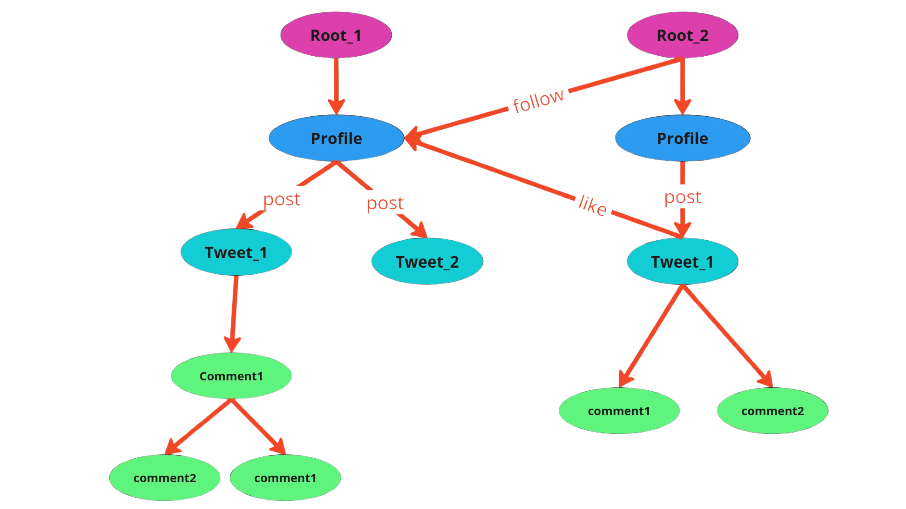

# **Build LittleX**

Hello everyone! We are going to build a social media app with Jaseci stack!

If you’ve ever thought about creating your own social media platform like Instagram, Twitter, or Facebook, you’re in the right place! In this post, I’ll break down the architecture of a social media app in a simple and beginner-friendly way. Let’s dive right in!

## **What is App Architecture?**

App architecture is like the blueprint of your app. It defines how all the different parts of your app work together, ensuring it runs smoothly, is scalable, and is easy to maintain. For a social media app, we need to think about:

- **Frontend:** What the users see and interact with (the interface).

- **Backend:** The brains of the app that process data and make everything work.

- **Database:** Where all the app’s data is stored (users, posts, likes, etc.).

Now let’s break these down step by step.

### **1. Frontend – The User Interface (UI)**

The frontend is what users see and use. It’s where they log in, post updates, like photos, and comment on posts. Think of it as the app’s face.

What do we need in the Frontend?

- **Login and Signup Screens:** Let users create accounts and log in securely.
- **Feed Display:** A timeline that shows posts (text, images, or videos).
- **User Profiles:** A page showing the user’s profile picture, bio, posts, and followers.
- **Post Interaction:** Buttons for liking, commenting, and sharing posts.

**Typical Technologies used for Frontend:**
Use HTML, CSS, and JavaScript with a framework like React or Vue.js.

**How does it work?**

The frontend sends requests to the backend when users perform actions (e.g., liking a post). It then receives data (e.g., updated like count) and displays it to the user.

### **2. Backend – The Brains of the App**

The backend handles the logic and processes all the requests from the frontend. It connects to the database and decides what information to send back.

**What do we need in the Backend?**

- **User Authentication:** Manage login, signup, and password recovery securely.
- **Post Management:** Handle uploading, editing, and deleting posts.
- **Social Features:** Enable users to follow/unfollow others, Allow likes, comments, and sharing.

**Typical Technologies used for Backend:**

- **Languages:** Python (with FastAPI or Django), Node.js, or Go.
- **Frameworks:** Use a REST API or GraphQL for communication with the frontend.

**How does it work?**

When a user logs in, the backend verifies their credentials. When a user uploads a photo, the backend processes it and saves it to the database or storage. When a user views their feed, the backend fetches posts from the database and sends them to the frontend.

### **3. Database – Storing the Data**

The database is where all the app’s data lives. This includes user profiles, posts, likes, comments, and more.

**What do we need in the Database?**

- **Users Table:** Stores user information like name, email, profile picture, and bio.
- **Posts Table:** Stores posts with text, images, or videos and the user who created them.
- **Likes and Comments Table:**  Keeps track of which user liked or commented on which post.

**Typical Technologies for Database:**

- **Relational Databases (structured data):** PostgreSQL, MySQL.
- **NoSQL Databases (unstructured data):** MongoDB or Cassandra.

we discussed the architecture of a social media app. Now, we're going to build the backend of LittleX—a minimal social media platform. **The exciting part?** We're using **Jaseci Stack**, an **open-source** comprehensive technology **stack** that simplifies backend development by reducing complexity in modern **AI-powered** and **cloud-native** applications. Let's dive right in!

**What is LittleX?**

LittleX is a basic social media platform that allows users to:

- Sign up, log in, and manage their profiles.
- Create, view, and interact with posts.
- Follow other users and explore their content.

For this post, we'll only build the backend. LittleX will leverage Jaseci's powerful tools to manage user authentication and database interactions seamlessly.

**Why Jaseci?**

Jaseci simplifies backend development with:

- **Built-in User Management System:** No need to reinvent the wheel for user signup and login. It also includes Authentication, Secure APIs without external libraries
- **Data spatial Programming:** Perfect for modeling social connections like followers and posts.
- **Cloud-Native:** Built for scalability and performance in the cloud.
- **AI-Powered:** Integrates with AI services for advanced features like content moderation and personalized recommendations
- **Orchestrator:** Dynamically turns Python modules into Kubernetes-deployed gRPC microservices
- **Ease of Scaling:** A robust foundation for future features.

With Jaseci, we can focus on implementing features instead of setting up complex systems.

**LittleX Architecture**


LittleX’s graph-based architecture uses nodes for entities like users and posts and edges for relationships
like following or reacting. Nodes store attributes and behaviors, while edges capture properties like
timestamps. Walkers traverse the graph, enabling dynamic actions and interactions. This design ensures
efficient relationship handling, scalability, and extensibility for social media-like features.

**Key Components for LittleX Backend**

**1. Create Nodes**

Nodes represent the entities in LittleX, such as tweets, users, and hashtags.
These are fundamental building blocks in Jaseci for storing and managing data relationships.

**2. Create Edges**

Edges represent the relationships between nodes, like a user posting a tweet or a user following another user.

**3. Create Walker APIs**

Walkers in Jaseci act as APIs or functions that handle the logic of the application.
For example, a walker to fetch tweets, post a comment, or like a tweet.

**4. Integrating AI to Summarize Tweets:**

Using Jaseci’s AI integration capabilities, we can build an AI-powered summarization feature.
This enhances user experience by providing concise summaries of lengthy tweets.

## **Getting Started**

### **Step 1: Set Up Jaseci**
```bash
pip install jaclang, jac-cloud, mtllm, jac-splice-orc
```

### **Step 2: Creating Nodes**

=== "Each part"
      Nodes are essential for representing entities in LittleX. Here are the nodes we need to create:

      - **Profile Node:**
            - Represents the user.
            - Fields: username, count_tag(For personalised feed), followees
            ```jac
            node profile {
                  has username: str = "";
                  has count_tag: dict = {};
                  has followees: list = [];
            }
            ```

      - **Tweet Node:**
            - Represents an individual tweet.
            - Fields: content, created_at (timestamp)
            ```bash
            node tweet {
                  has content: str;
                  has created_at: str = datetime.datetime.now().strftime("%Y-%m-%d %H:%M:%S");
            }
            ```

      - **Comment Node:**
            - Represents comments for the tweets.
            - Fields: content.
            ```bash
            node comment {
                  has content: str;
            }
            ```
=== "LittleX.jac Upto Step 2"
    ```jac linenums="1"
    --8<-- "support/jac-lang.org/docs/learn/littleX/src/LittleX_step2.jac"
    ```

### **Step 3: Creating Edges**

=== "Each part"
      Edges define the relationships between nodes. Here are the nodes we need to create:

      - **Follows Edge:**
            - Represents the relationship between users who follow each other.
            ```bash
            edge follow {}
            ```

      - **Like Edge:**
            - Represents the relationship between users and the tweets they posted.
            ```bash
            edge like {}
            ```

      - **Post Edge:**
            - Link the comments back to tweets
            ```bash
            edge post {}
            ```
=== "LittleX.jac Upto Step 2"
    ```jac linenums="1"
    --8<-- "support/jac-lang.org/docs/learn/littleX/src/LittleX_step3.jac"
    ```

### **Step 4: Creating APIs(Walkers)**

=== "Each part"
      Nodes are essential for representing entities in LittleX. Here are the nodes we need to create:

      - **Visit Profile Walker:**
            - Visits or creates a new profile node for a user.
            - Ensures profiles exist in the system for any user action.
            ```py
            walker visit_profile {
                  can visit_profile with `root entry {
                        visit [-->(`?profile)] else {
                              logger.info("Creating new profile");
                              new_profile = here ++> profile();
                              visit new_profile;
                        }
                  }
            }
            ```
            - If current walker enter via `root`, `visit_profile` ability will be executed.
            - `visit [-->(``?profile)] else {}` Checks whether profile node exist from root, if yes, visit to that profile node. Otherwise execute to else part.
            - `here ++> profile()` It creates a profile node and connects with current node(`root`).
            - `visit new_profile` Walker visit to that node (`profile`)

      - **Load User Profile Walker:**
            - Loads all profiles from the database.
            - Useful for managing or listing all users in the system.
            ```py
            walker load_user_profiles {
                  obj __specs__ {
                        static has auth: bool = False;
                  }
                  can load_profiles with `root entry {
                        self.profiles: list = [];

                        for user in NodeAnchor.Collection.find({"name": "profile"}) {
                              user_node = user.architype;
                              self.profiles.append(
                              {"name": user_node.username, "id": jid(user_node)}
                              );
                        }
                        report self.profiles;
                  }
            }
            ```
            - `static has auth: bool = False` Set diable authentication for that walker.
            - `NodeAnchor.Collection.find({"name": "profile"})` Get list of profiles.
            - `user.architype` Get architype of user node.
            - `jid(user_node)` Get the unique id of an object.

      - **Update Profile Walker:**
            - Updates a user's profile, specifically the username.
            ```py
            walker update_profile :visit_profile: {
                  has new_username: str;

                  can update_profile with profile entry {
                        logger.info("Updating profile");
                        here.username = self.new_username;
                        report here;
                  }
            }
            ```
            - `can update_profile with profile entry{}` If current walker enter via `profile` node, `update_profile` ability will be executed.
            - `here.username = self.new_username` Update username.

      - **Get Profile Walker:**
            - Retrieves profile details and logs them.
            ```bash
            walker get_profile :visit_profile: {
                  can get_profile with profile entry {
                        logger.info(f"prfile info: {here}");
                        report here;
                  }
            }
            ```

      - **Follow Request Walker:**
            - Adds a user to the followees list and creates a follow edge.
            ```bash
            walker follow_request :visit_profile: {
                  has profile_id: str;

                  can follow with profile entry {
                        here.followees.append(self.profile_id);
                        logger.info(f"New followee addded: {self.profile_id}");
                        here +:follow():+> &self.profile_id;
                        report here;
                  }
            }
            ```
            - `here.followees.append(self.profile_id)` Add the profile id to the followees list
            - `here +:follow():+> &self.profile_id` Create a follow edge from `profile` node.

      - **Unfollow Request Walker:**
            - Removes a user from the followees list and deletes the follow edge.
            ```bash
            walker un_follow_request :visit_profile: {
                  has profile_id: str;

                  can un_follow with profile entry {
                        here.followees.remove(self.profile_id);
                        logger.info(f"Followe removed: {self.profile_id}");
                        here del-:follow:-> &self.profile_id;
                        report here;
                  }
            }
            ```
            - `here.followees.remove(self.profile_id)` Remove the profile id from the followees list
            - `here del-:follow:-> &self.profile_id` Delete the follow edge from `profile` node.

      - **Create Tweet Walker:**
            - Creates a new tweet for a profile and adds it to the graph using a post edge.
            ```bash
            walker create_tweet :visit_profile: {
                  has content: str;

                  can tweet with profile entry {
                        tweet_node = here +:post:+> tweet(content=self.content);
                        visit tweet_node;
                  }

                  can report_tweet with tweet entry {
                        logger.info(f"Creating new tweet: {here.content}");
                        Jac.unrestrict(here, level="READ");
                        report here;
                  }
            }
            ```
            - `tweet_node = here +:post:+> tweet(content=self.content)` Create a new tweet with content.
            - `visit tweet_node` Visit the newly created tweet node.
            - `Jac.unrestrict(here, level="READ")` Unrestrict that tweet node to everyone with read access.

      - **Update Tweet Walker:**
            - Updates the content of an existing tweet by its ID.
            ```bash
            walker update_tweet :visit_profile: {
                  has tweet_id: str;
                  has updated_content: str;

                  can visit_tweet with profile entry {
                        tweet_node = &self.tweet_id;
                        visit tweet_node;
                        logger.info(f"Tweet deleted: {tweet_node}");
                  }
                  can update_tweet with tweet entry {
                        here.content = self.updated_content;
                        report here;
                  }
            }
            ```
            - `tweet_node = &self.tweet_id` Get the tweet node by its ID.
            - `visit tweet_node` Visit the tweet node.
            - `here.content = self.updated_content` Update the content of the tweet node.

      - **Remove Tweet Walker:**
            - Deletes a tweet by removing its connection to the profile.
            ```bash
            walker remove_tweet :visit_profile: {
                  has tweet_id: str;

                  can remove_tweet with profile entry {
                        tweet_node = &self.tweet_id;
                        here del--> tweet_node;
                        logger.info(f"Tweet deleted: {tweet_node}");
                  }
            }
            ```
            - `tweet_node = &self.tweet_id` Get the tweet node by its ID.
            - `here del--> tweet_node` Remove the connection between the profile and the tweet node.

      - **Like Tweet Walker:**
            - Adds a like edge between a tweet and the profile liking it.
            ```bash
            walker like_tweet :visit_profile: {
                  has tweet_id: str;

                  can like with profile entry {
                        tweet_node = &self.tweet_id;
                        Jac.unrestrict(tweet_node, level="CONNECT");
                        tweet_node +:like():+> here;
                        logger.info(f"liked to a tweet: {tweet_node}");
                        report tweet_node;
                  }
            }
            ```
            - `tweet_node = &self.tweet_id` Get the tweet node by its ID.
            - `Jac.unrestrict(tweet_node, level="CONNECT")` Unrestrict the tweet node to Connect level.
            - `tweet_node +:like():+> here` Add a like edge between the tweet and user.

      - **Remove Like Walker:**
            - Removes the like edge
            ```bash
            walker remove_like :visit_profile: {
                  has tweet_id: str;

                  can remove_like with profile entry {
                        tweet_node = &self.tweet_id;
                        tweet_node del-:like:-> here;
                        logger.info(f"Reomve liked to a tweet: {tweet_node}");
                        report tweet_node;
                  }
            }
            ```
            - `tweet_node = &self.tweet_id` Get the tweet node by its ID.
            - `tweet_node del-:like:-> here` Remove the like edge between the tweet and user.

      - **Comment Tweet Walker:**
            - Adds a comment to a tweet by creating a comment node and connecting it to the tweet.
            ```bash
            walker comment_tweet :visit_profile: {
                  has tweet_id: str;
                  has content: str;

                  can add_comment with profile entry {
                        comment_node = here ++> comment(content=self.content);
                        tweet_node = &self.tweet_id;
                        Jac.unrestrict(tweet_node, level="CONNECT");
                        tweet_node ++> comment_node[0];
                        logger.info(f"comment added: {comment_node[0]}");
                        report comment_node[0];
                  }
            }
            ```
            - `comment_node = here ++> comment(content=self.content)` Create a new comment node with content
            - `tweet_node = &self.tweet_id` Get the tweet node by its ID.
            - `Jac.unrestrict(tweet_node, level="CONNECT")` Unrestrict the tweet node to connect level.
            - `tweet_node ++> comment_node[0]` Add a comment edge between the tweet and user.

      - **Load Like Walker:**
            - Gathers all profiles that liked a specific tweet.
            ```bash
            walker load_likes {
                  has likes: list = [];

                  can load_likes with tweet entry {
                        visit [-:like:->];
                  }

                  can load_profile with profile entry {
                        Jac.unrestrict(here, level="READ");
                        self.likes.append({"username": here.username});
                  }
            }
            ```
            - `visit [-:like:->]` Visit all like edges connected to the tweet.
            - `Jac.unrestrict(here, level="READ")` Unrestrict the profile node to everyone with read access
            - `self.likes.append({"username": here.username})` Add the profile to the likes list

      - **Load Tweet Walker:**
            - Loads detailed information about a tweet, including its content and author.
            ```bash
            walker load_tweet {
                  has tweet_info: dict = {};

                  can load_tweets with tweet entry {
                        self.tweet_info["content"] = here;
                        visit [<-:post:-];
                  }

                  can load_profile with profile entry {
                        self.tweet_info["username"] = here.username;
                  }
            }
            ```
            - `self.tweet_info["content"] = here;` Get the tweet content
            - `visit [<-:post:-]` Visit all post edges connected to the tweet.
            - `self.tweet_info["username"] = here.username;` Get the tweet author

      - **Load Comments Walker:**
            - Retrieves all comments on a tweet, including the commenter's username.
            ```bash
            walker load_comments {
                  has comments: list = [];

                  can load_comments with tweet entry {
                        visit [-->](`?comment);
                  }

                  can report_comments with comment entry {
                        Jac.unrestrict(here, level="READ");
                        commenter = [<--](`?profile);
                        self.comments.append(
                              {"commenter": commenter[0].username, "comment": here}
                        );
                  }
            }
            ```
            - `visit [-->](`?comment)` Visit all comment edges connected to the tweet.
            - `Jac.unrestrict(here, level="READ")` Unrestrict the comment node to everyone with read access
            - `commenter = [<--](`?profile)` Get the commenter's profile

      - **Load Feed Walker:**
            - Fetches all tweets for a profile, including their comments and likes.
            ```bash
            walker load_feed :visit_profile: {
                  has search_query: str = "";

                  can load with profile entry {
                        self.feeds: list = [];
                        user_tweets = here spawn load_tweets();
                        self.feeds.extend(user_tweets.tweets);

                        for user in here.followees {
                              user_node = &user;
                              Jac.unrestrict(user_node, level="READ");
                              logger.info("Acess has given to profile node");
                              user_tweets = user_node spawn load_tweets();
                              self.feeds.extend(user_tweets.tweets);
                        }
                        tweets = [feed['tweet']['content'].content for feed in self.feeds];
                        self.summary: str = summarise_tweets(tweets);
                        here.summary_count +=1;###

                        # Filter tweets based on search query
                        if (self.search_query) {
                              tweet_embeddings = model.encode(tweets);
                              filtered_results = search_tweets(
                              self.search_query,
                              self.feeds,
                              tweet_embeddings
                              );
                              report {"feeds": filtered_results, "summary": self.summary};
                        } else {
                              report {"feeds": self.feeds, "summary": self.summary};
                        }

                  }
            }
            ```
            - `user_tweets = here spawn load_tweets();` Spawn load_tweets walker with current node.
            - `self.feeds.extend(user_tweets.tweets);` Add the user's tweets to the
            profile's feed.
            - `user_node = &user;` Get the user node.
            - `Jac.unrestrict(user_node, level="READ");` Give the user node read access
            - `self.summary: str = summarise_tweets(tweets);` Summarize the tweets.
            - `if (self.search_query) { ... } else { ... }` If a search query is provided, filter the tweets based on the query. Otherwise, return all tweets.

=== "LittleX.jac Upto Step 2"
    ```jac linenums="1"
    --8<-- "support/jac-lang.org/docs/learn/littleX/src/LittleX_step4.jac"
    ```

### **Step 5: Integrating AI to Summarize Tweets:**
=== "Each part"
      - **Import Lamma with MTLLM**
      ```bash
      import:py from mtllm.llms {Ollama}
      glob llm = Ollama(host="http://127.0.0.1:11434", model_name="llama3.2:1b");
      ```
      - **Summarize Tweets Using Lamma:**
            - Summarize tweets
            ```bash
            can 'Summarize latest trends, major events, and notable interactions from the recent tweets in one line.'
                  summarise_tweets(tweets: list[str]) -> 'Summarisation': str by llm();
            ```
=== "LittleX.jac Upto Step 5"
    ```jac linenums="1"
    --8<-- "support/jac-lang.org/docs/learn/littleX/src/LittleX_step5.jac"
    ```
### **Step 6: Exploring Graph Security**

### **Step 7: Adding node abilities**
=== "Each part 7"
      ```bash
      node profile {
            has username: str = "";
            has count_tag: dict = {};
            has followees: list = [];

            can get with get_profile entry {
                  logger.info(f"profile info: Username: {here.username}, Followees: {here.followees}");
            }

            can confirm with update_profile exit {
                  logger.info(f"Profile updated");
            }
      }
      ```

=== "LittleX.jac Upto Step 6"
    ```jac linenums="1"
    --8<-- "support/jac-lang.org/docs/learn/littleX/src/LittleX_step6.jac"
    ```

### **Step 8: Integrating Jac Splice Orchestrator**

Will be updated after jac-splice-orc finalised