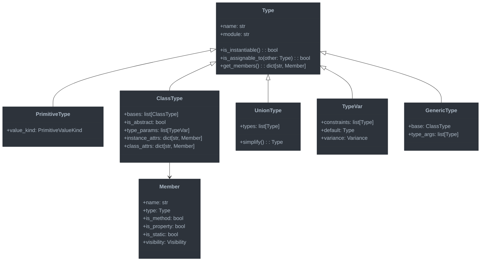

# Type System Foundation

This document outlines the core foundation of the advanced type checking system for Jaclang.

## Overview

The type system foundation provides the fundamental building blocks for representing types, establishing their relationships, and supporting type operations. This layer serves as the basis for all type checking and inference activities.

## Key Components



## Implementation Details

### 1. Core Type Classes

We'll implement the following core classes to represent types:

#### `Type` (Base Abstract Class)

The foundation of our type system, providing common functionality and interfaces:

```python
class Type:
    def __init__(self, name: str, module: str = ""):
        self.name = name
        self.module = module

    def is_instantiable(self) -> bool:
        """Determine if this type can be instantiated."""
        return True

    def is_assignable_to(self, other: "Type") -> bool:
        """Determine if a value of this type can be assigned to the other type."""
        return self == other

    def get_members(self) -> dict[str, "Member"]:
        """Get all accessible members of this type."""
        return {}
```

#### `PrimitiveType`

Represents built-in primitive types like `int`, `float`, `str`, etc.:

```python
class PrimitiveType(Type):
    def __init__(self, name: str, value_kind: PrimitiveValueKind):
        super().__init__(name)
        self.value_kind = value_kind
```

#### `ClassType`

Represents user-defined classes, including architypes and enums:

```python
class ClassType(Type):
    def __init__(
        self,
        name: str,
        module: str = "",
        bases: list["ClassType"] = None,
        is_abstract: bool = False,
        type_params: list["TypeVar"] = None,
    ):
        super().__init__(name, module)
        self.bases = bases or []
        self.is_abstract = is_abstract
        self.type_params = type_params or []
        self.instance_attrs = {}
        self.class_attrs = {}

    def is_instantiable(self) -> bool:
        return not self.is_abstract

    def is_assignable_to(self, other: Type) -> bool:
        if self == other:
            return True

        if isinstance(other, ClassType):
            # Check if other is a base class of self
            for base in self.bases:
                if base.is_assignable_to(other):
                    return True

        return False

    def get_members(self) -> dict[str, "Member"]:
        members = {}

        # Add members from base classes
        for base in self.bases:
            members.update(base.get_members())

        # Add our own instance attributes
        members.update(self.instance_attrs)

        return members
```

### 2. Type Registry

Central repository for types, providing lookup and caching:

```python
class TypeRegistry:
    def __init__(self):
        self.types_by_name = {}
        self.types_by_node = {}

    def register_type(self, type_obj: Type, node: Optional[uni.UniNode] = None) -> None:
        key = f"{type_obj.module}.{type_obj.name}" if type_obj.module else type_obj.name
        self.types_by_name[key] = type_obj

        if node:
            self.types_by_node[node] = type_obj

    def lookup_by_name(self, name: str, module: str = "") -> Optional[Type]:
        key = f"{module}.{name}" if module else name
        return self.types_by_name.get(key)

    def lookup_by_node(self, node: uni.UniNode) -> Optional[Type]:
        return self.types_by_node.get(node)
```

### 3. Type Relations

#### Subtyping

Subtyping rules define when one type can be used in place of another:

```python
def is_subtype(sub_type: Type, super_type: Type) -> bool:
    """Check if sub_type is a subtype of super_type."""

    # Direct assignability check
    if sub_type.is_assignable_to(super_type):
        return True

    # Handle union types
    if isinstance(super_type, UnionType):
        return any(is_subtype(sub_type, t) for t in super_type.types)

    # Handle generics
    if (isinstance(sub_type, GenericType) and
        isinstance(super_type, GenericType) and
        sub_type.base == super_type.base):

        # Check variance of type parameters
        for i, (t1, t2) in enumerate(zip(sub_type.type_args, super_type.type_args)):
            param = sub_type.base.type_params[i]

            if param.variance == Variance.INVARIANT:
                if t1 != t2:
                    return False
            elif param.variance == Variance.COVARIANT:
                if not is_subtype(t1, t2):
                    return False
            elif param.variance == Variance.CONTRAVARIANT:
                if not is_subtype(t2, t1):
                    return False

        return True

    return False
```

#### Type Substitution

Support for substituting type variables with concrete types:

```python
def substitute_type_vars(
    type_obj: Type,
    substitutions: dict[TypeVar, Type]
) -> Type:
    """Apply type variable substitutions to a type."""

    if isinstance(type_obj, TypeVar) and type_obj in substitutions:
        return substitutions[type_obj]

    if isinstance(type_obj, GenericType):
        new_args = [substitute_type_vars(arg, substitutions) for arg in type_obj.type_args]
        return GenericType(type_obj.base, new_args)

    if isinstance(type_obj, UnionType):
        new_types = [substitute_type_vars(t, substitutions) for t in type_obj.types]
        return UnionType(new_types)

    return type_obj
```

### 4. Special Types

#### `AnyType`

Represents the `Any` type which is compatible with any other type:

```python
class AnyType(Type):
    def __init__(self):
        super().__init__("Any")

    def is_assignable_to(self, other: Type) -> bool:
        return True

    def is_compatible_with(self, other: Type) -> bool:
        return True
```

#### `NeverType`

Represents a type that cannot exist at runtime (for unreachable code):

```python
class NeverType(Type):
    def __init__(self):
        super().__init__("Never")

    def is_instantiable(self) -> bool:
        return False

    def is_assignable_to(self, other: Type) -> bool:
        return True  # Never can be assigned to anything
```

#### `UnknownType`

Used during type inference when a type cannot be determined:

```python
class UnknownType(Type):
    def __init__(self):
        super().__init__("Unknown")
```

## Integration with Jac Language Features

### Architypes

Architypes will be represented as `ClassType` with appropriate method and attribute information:

```python
def create_architype_type(node: uni.Architype) -> ClassType:
    """Convert a Jac Architype node to a ClassType."""

    # Create base class types
    bases = []
    if node.base_classes:
        for base_ref in node.base_classes.items:
            if isinstance(base_ref, uni.NameAtom):
                # Look up base class type
                # (this would use the type registry in practice)
                base_type = ClassType(base_ref.value)
                bases.append(base_type)

    # Create the class type
    arch_type = ClassType(
        name=node.name.value,
        module=node.loc.mod_path,
        bases=bases,
        is_abstract=node.is_abstract
    )

    # Process has statements to add attributes
    for kid in node.kid:
        if isinstance(kid, uni.ArchHas):
            for var in kid.vars.items:
                # Create a member for each has variable
                member = Member(
                    name=var.name.value,
                    type=get_type_from_type_tag(var.type_tag.tag),
                    is_static=kid.is_static,
                    visibility=get_visibility_from_access(kid.access)
                )

                if kid.is_static:
                    arch_type.class_attrs[member.name] = member
                else:
                    arch_type.instance_attrs[member.name] = member

    # Process abilities to add methods
    for kid in node.kid:
        if isinstance(kid, uni.Ability):
            # Create a member for each ability
            method_type = create_function_type(kid)
            member = Member(
                name=kid.name_ref.value,
                type=method_type,
                is_method=True,
                is_static=kid.is_static,
                visibility=get_visibility_from_access(kid.access)
            )

            if kid.is_static:
                arch_type.class_attrs[member.name] = member
            else:
                arch_type.instance_attrs[member.name] = member

    return arch_type
```

### Enums

Similarly, enums will be represented with appropriate type infrastructure:

```python
def create_enum_type(node: uni.Enum) -> ClassType:
    """Convert a Jac Enum node to a ClassType."""

    # Similar to architype handling, but with enum-specific logic
    enum_type = ClassType(
        name=node.name.value,
        module=node.loc.mod_path
    )

    # Process enum values
    for kid in node.kid:
        if isinstance(kid, uni.Assignment) and kid.is_enum_stmt:
            # Add enum value as a class attribute
            member = Member(
                name=kid.target.items[0].value,
                type=enum_type,  # Enum values have the enum's own type
                is_static=True,
                visibility=get_visibility_from_access(node.access)
            )
            enum_type.class_attrs[member.name] = member

    return enum_type
```

## Next Steps

This type system foundation will be used by:

1. The type inference engine to determine types of expressions
2. The constraint solver to verify type compatibility
3. The error reporter to generate helpful type-related errors

The next document will detail the Type Inference Engine which builds upon this foundation.