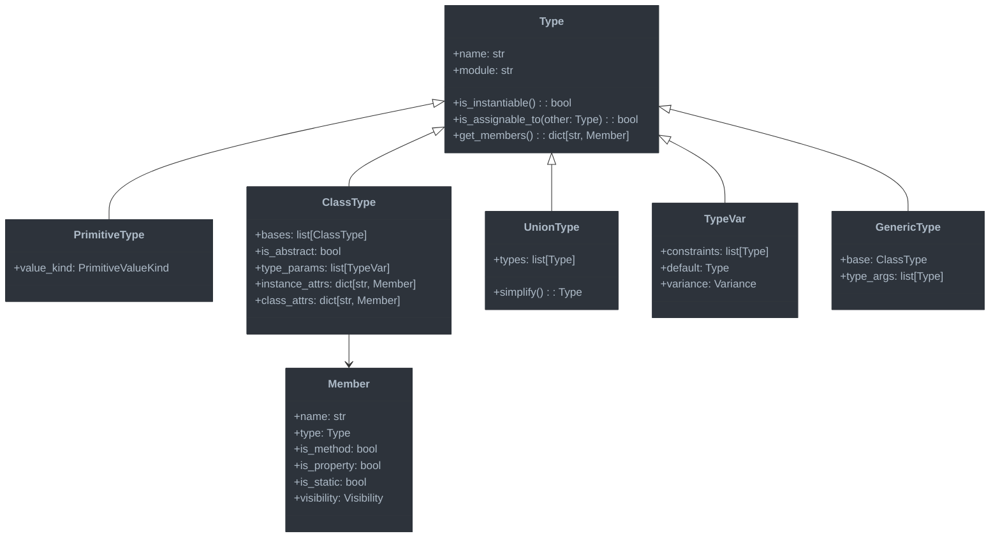

# Type System Foundation

This document outlines the core foundation of the advanced type checking system for Jaclang.

## Overview

The type system foundation provides the fundamental building blocks for representing types, establishing their relationships, and supporting type operations. This layer serves as the basis for all type checking and inference activities.

## What is a Type System?

A type system is a set of rules that assigns a property called a "type" to various constructs in a program, such as variables, expressions, functions, or modules. These types define the operations that can be performed on the data, help detect errors, and enable compiler optimizations.

### Purpose of Type Systems

Type systems serve multiple important purposes in programming languages:

1. **Error Detection**: Catching type-related errors before runtime (using a value in a way inconsistent with its type)
2. **Documentation**: Making code more self-documenting by explicitly stating expectations
3. **Abstraction**: Supporting abstraction by focusing on behavior rather than implementation
4. **Optimization**: Enabling compiler optimizations based on type information
5. **Safety**: Preventing certain classes of bugs and security vulnerabilities

### Type System Design Choices

When designing a type system, several key decisions must be made:

1. **Static vs. Dynamic Typing**:
   - Static typing: Types are checked at compile time (what we're implementing)
   - Dynamic typing: Types are checked at runtime

2. **Strong vs. Weak Typing**:
   - Strong typing: Restricts operations between incompatible types
   - Weak typing: Allows implicit conversions between types

3. **Nominal vs. Structural Typing**:
   - Nominal typing: Types are compatible based on explicit declarations
   - Structural typing: Types are compatible based on their structure (shape)

4. **Type Inference**:
   - How much type information can be inferred vs. explicitly annotated

### Type System Components

A comprehensive type system consists of:

1. **Type Representations**: Data structures for representing types
2. **Type Rules**: Rules governing type compatibility and operations
3. **Type Operations**: Functions for manipulating and reasoning about types
4. **Type Environment**: Context tracking variable and function types

## Jaclang Type System Goals

Our type system for Jaclang aims to:

1. Provide a balance between safety and expressiveness
2. Support Python-like syntax with stronger static guarantees
3. Handle the unique features of Jac (architypes, abilities, etc.)
4. Enable rich IDE features through type information
5. Produce helpful error messages that guide developers
6. Support gradual typing to allow incremental adoption

## Key Components



### Understanding the Type Hierarchy

The diagram above illustrates the core type system architecture. Let's explore the key concepts:

#### The Base Type Abstraction

At the heart of any type system is a representation of types. Our base `Type` class serves as an abstraction for all possible types in the language:

- **Name and Module**: Types have identifiers and belong to modules, enabling lookup and organization
- **Instantiability**: Some types (like interfaces or abstract classes) can't be directly instantiated
- **Assignability**: The fundamental relationship determining if a value of one type can be used where another is expected
- **Members**: Types expose properties, methods, and other accessible members

#### Type Varieties

Different programming constructs require different type representations:

1. **PrimitiveType**: Represents built-in types like integers, strings, and booleans
   - These have distinct runtime behavior and often special compiler handling

2. **ClassType**: Represents user-defined classes and structures
   - Includes inheritance relationships (bases)
   - Tracks instance-level and class-level members
   - May be abstract, preventing direct instantiation

3. **UnionType**: Represents values that could be one of several types
   - Example: `int | str` means a value could be either an integer or a string
   - Simplification merges redundant or overlapping types

4. **TypeVar**: Represents a placeholder type used in generics
   - May have constraints limiting what types can be substituted
   - May have variance properties affecting subtyping relationships

5. **GenericType**: Represents a parameterized type with concrete type arguments
   - Example: `List[int]` is a generic list type specialized for integers

#### Type Members

The `Member` class represents elements accessible through a type:

- Methods and properties accessed via dot notation
- Information about visibility controlling access
- Static vs. instance distinction affecting how they're accessed

#### Why This Design?

This type system architecture was chosen because:

1. **Extensibility**: New types can be added by subclassing the base `Type`
2. **Composability**: Types can be combined (e.g., unions, generics)
3. **Accurate Modeling**: The hierarchy reflects the conceptual relationships between different type varieties
4. **Separation of Concerns**: Each type class handles its specific behaviors

## Implementation Details

### 1. Core Type Classes

We'll implement the following core classes to represent types:

#### `Type` (Base Abstract Class)

The foundation of our type system, providing common functionality and interfaces:

```python
class Type:
    def __init__(self, name: str, module: str = ""):
        self.name = name
        self.module = module

    def is_instantiable(self) -> bool:
        """Determine if this type can be instantiated."""
        return True

    def is_assignable_to(self, other: "Type") -> bool:
        """Determine if a value of this type can be assigned to the other type."""
        return self == other

    def get_members(self) -> dict[str, "Member"]:
        """Get all accessible members of this type."""
        return {}
```

#### `PrimitiveType`

Represents built-in primitive types like `int`, `float`, `str`, etc.:

```python
class PrimitiveType(Type):
    def __init__(self, name: str, value_kind: PrimitiveValueKind):
        super().__init__(name)
        self.value_kind = value_kind
```

#### `ClassType`

Represents user-defined classes, including architypes and enums:

```python
class ClassType(Type):
    def __init__(
        self,
        name: str,
        module: str = "",
        bases: list["ClassType"] = None,
        is_abstract: bool = False,
        type_params: list["TypeVar"] = None,
    ):
        super().__init__(name, module)
        self.bases = bases or []
        self.is_abstract = is_abstract
        self.type_params = type_params or []
        self.instance_attrs = {}
        self.class_attrs = {}

    def is_instantiable(self) -> bool:
        return not self.is_abstract

    def is_assignable_to(self, other: Type) -> bool:
        if self == other:
            return True

        if isinstance(other, ClassType):
            # Check if other is a base class of self
            for base in self.bases:
                if base.is_assignable_to(other):
                    return True

        return False

    def get_members(self) -> dict[str, "Member"]:
        members = {}

        # Add members from base classes
        for base in self.bases:
            members.update(base.get_members())

        # Add our own instance attributes
        members.update(self.instance_attrs)

        return members
```

### 2. Type Registry

Central repository for types, providing lookup and caching:

```python
class TypeRegistry:
    def __init__(self):
        self.types_by_name = {}
        self.types_by_node = {}

    def register_type(self, type_obj: Type, node: Optional[uni.UniNode] = None) -> None:
        key = f"{type_obj.module}.{type_obj.name}" if type_obj.module else type_obj.name
        self.types_by_name[key] = type_obj

        if node:
            self.types_by_node[node] = type_obj

    def lookup_by_name(self, name: str, module: str = "") -> Optional[Type]:
        key = f"{module}.{name}" if module else name
        return self.types_by_name.get(key)

    def lookup_by_node(self, node: uni.UniNode) -> Optional[Type]:
        return self.types_by_node.get(node)
```

### 3. Type Relations

#### Subtyping

Subtyping rules define when one type can be used in place of another:

```python
def is_subtype(sub_type: Type, super_type: Type) -> bool:
    """Check if sub_type is a subtype of super_type."""

    # Direct assignability check
    if sub_type.is_assignable_to(super_type):
        return True

    # Handle union types
    if isinstance(super_type, UnionType):
        return any(is_subtype(sub_type, t) for t in super_type.types)

    # Handle generics
    if (isinstance(sub_type, GenericType) and
        isinstance(super_type, GenericType) and
        sub_type.base == super_type.base):

        # Check variance of type parameters
        for i, (t1, t2) in enumerate(zip(sub_type.type_args, super_type.type_args)):
            param = sub_type.base.type_params[i]

            if param.variance == Variance.INVARIANT:
                if t1 != t2:
                    return False
            elif param.variance == Variance.COVARIANT:
                if not is_subtype(t1, t2):
                    return False
            elif param.variance == Variance.CONTRAVARIANT:
                if not is_subtype(t2, t1):
                    return False

        return True

    return False
```

##### Understanding Subtyping and Variance

Subtyping is a fundamental concept in type systems that enables polymorphism. A type `S` is a subtype of `T` if a value of type `S` can be safely used wherever a value of type `T` is expected.

Several key principles govern subtyping:

1. **Liskov Substitution Principle**: Any property provable about objects of type T should also be provable for objects of type S.

2. **Variance**: How subtyping relationships between complex types relate to subtyping relationships between their components:

   - **Covariance**: If S is a subtype of T, then Container[S] is a subtype of Container[T]
     - Example: If `Cat` is a subtype of `Animal`, then `List[Cat]` is a subtype of `List[Animal]`
     - Typically safe for "read-only" containers

   - **Contravariance**: If S is a subtype of T, then Container[T] is a subtype of Container[S]
     - Example: If `Cat` is a subtype of `Animal`, then `Function[Animal]` is a subtype of `Function[Cat]`
     - Typically applies to function parameters

   - **Invariance**: No subtyping relationship exists between Container[S] and Container[T] regardless of relationship between S and T
     - Example: Even if `Cat` is a subtype of `Animal`, `Set[Cat]` is not related to `Set[Animal]`
     - Used when both reading and writing to the container

3. **Union Types**: A value of type `S` can be used where a union type `T1 | T2 | ... | Tn` is expected if `S` is a subtype of any of the types in the union.

Understanding subtyping is crucial for ensuring type safety while maintaining flexibility in a statically-typed language.

#### Type Substitution

Support for substituting type variables with concrete types:

```python
def substitute_type_vars(
    type_obj: Type,
    substitutions: dict[TypeVar, Type]
) -> Type:
    """Apply type variable substitutions to a type."""

    if isinstance(type_obj, TypeVar) and type_obj in substitutions:
        return substitutions[type_obj]

    if isinstance(type_obj, GenericType):
        new_args = [substitute_type_vars(arg, substitutions) for arg in type_obj.type_args]
        return GenericType(type_obj.base, new_args)

    if isinstance(type_obj, UnionType):
        new_types = [substitute_type_vars(t, substitutions) for t in type_obj.types]
        return UnionType(new_types)

    return type_obj
```

##### The Role of Type Substitution

Type substitution is the process of replacing type variables with concrete types. This is essential for:

1. **Generic Instantiation**: When a generic class or function is used with specific types
   - Example: Converting `List[T]` to `List[int]` when T is bound to int

2. **Type Inference**: Figuring out what concrete types should replace type variables based on usage
   - Example: Inferring `T` is `str` in `identity(x)` when `x` is a string

3. **Constraint Solving**: Finding type variable values that satisfy all constraints in a program
   - Example: Determining that `T` must be `int` based on operations performed on values of type `T`

The substitution process must:
- Handle nested types (generics containing generics)
- Preserve the structure of complex types
- Respect variance annotations when relevant
- Deal with partial substitutions where only some type variables are known

In the implementation above, we recursively traverse the type structure, replacing type variables according to the provided substitution map while maintaining the overall type structure.

### 4. Special Types

#### `AnyType`

Represents the `Any` type which is compatible with any other type:

```python
class AnyType(Type):
    def __init__(self):
        super().__init__("Any")

    def is_assignable_to(self, other: Type) -> bool:
        return True

    def is_compatible_with(self, other: Type) -> bool:
        return True
```

#### `NeverType`

Represents a type that cannot exist at runtime (for unreachable code):

```python
class NeverType(Type):
    def __init__(self):
        super().__init__("Never")

    def is_instantiable(self) -> bool:
        return False

    def is_assignable_to(self, other: Type) -> bool:
        return True  # Never can be assigned to anything
```

#### `UnknownType`

Used during type inference when a type cannot be determined:

```python
class UnknownType(Type):
    def __init__(self):
        super().__init__("Unknown")
```

##### Special Types and Their Purposes

Special types serve unique roles in type systems:

1. **Any Type**: The "top" type in the type hierarchy
   - Acts as an escape hatch from the type system
   - Enables gradual typing and migration from untyped code
   - Still provides basic type information unlike removing types altogether
   - Should be used sparingly as it reduces type safety

2. **Never Type**: The "bottom" type in the type hierarchy
   - Represents code paths that cannot be reached (after a throw or exit)
   - Used for functions that never return normally (always throw exceptions)
   - Serves as the return type of expressions that raise exceptions
   - Mathematically useful in type inference algorithms

3. **Unknown Type**: Used during type checking
   - Different from `Any` in that it doesn't suppress errors
   - Represents a type that couldn't be determined yet
   - Used during incremental type checking and inference
   - Helps generate better error messages by tracking what's unknown vs. explicitly "any"

These special types create a complete lattice structure for the type system, which helps with:
- Type inference algorithms
- Handling error cases gracefully
- Supporting gradual and incremental typing
- Representing edge cases in the language semantics

## Integration with Jac Language Features

### Architypes

Architypes will be represented as `ClassType` with appropriate method and attribute information:

```python
def create_architype_type(node: uni.Architype) -> ClassType:
    """Convert a Jac Architype node to a ClassType."""

    # Create base class types
    bases = []
    if node.base_classes:
        for base_ref in node.base_classes.items:
            if isinstance(base_ref, uni.NameAtom):
                # Look up base class type
                # (this would use the type registry in practice)
                base_type = ClassType(base_ref.value)
                bases.append(base_type)

    # Create the class type
    arch_type = ClassType(
        name=node.name.value,
        module=node.loc.mod_path,
        bases=bases,
        is_abstract=node.is_abstract
    )

    # Process has statements to add attributes
    for kid in node.kid:
        if isinstance(kid, uni.ArchHas):
            for var in kid.vars.items:
                # Create a member for each has variable
                member = Member(
                    name=var.name.value,
                    type=get_type_from_type_tag(var.type_tag.tag),
                    is_static=kid.is_static,
                    visibility=get_visibility_from_access(kid.access)
                )

                if kid.is_static:
                    arch_type.class_attrs[member.name] = member
                else:
                    arch_type.instance_attrs[member.name] = member

    # Process abilities to add methods
    for kid in node.kid:
        if isinstance(kid, uni.Ability):
            # Create a member for each ability
            method_type = create_function_type(kid)
            member = Member(
                name=kid.name_ref.value,
                type=method_type,
                is_method=True,
                is_static=kid.is_static,
                visibility=get_visibility_from_access(kid.access)
            )

            if kid.is_static:
                arch_type.class_attrs[member.name] = member
            else:
                arch_type.instance_attrs[member.name] = member

    return arch_type
```

### Enums

Similarly, enums will be represented with appropriate type infrastructure:

```python
def create_enum_type(node: uni.Enum) -> ClassType:
    """Convert a Jac Enum node to a ClassType."""

    # Similar to architype handling, but with enum-specific logic
    enum_type = ClassType(
        name=node.name.value,
        module=node.loc.mod_path
    )

    # Process enum values
    for kid in node.kid:
        if isinstance(kid, uni.Assignment) and kid.is_enum_stmt:
            # Add enum value as a class attribute
            member = Member(
                name=kid.target.items[0].value,
                type=enum_type,  # Enum values have the enum's own type
                is_static=True,
                visibility=get_visibility_from_access(node.access)
            )
            enum_type.class_attrs[member.name] = member

    return enum_type
```

### Type System Adaptation for Jac Language Features

Adapting a type system to Jac's unique features requires special consideration:

#### Architypes vs Traditional Classes

Jac architypes differ from traditional OOP classes:

1. **Graph-Oriented Design**: Architypes often represent nodes or edges in a graph
2. **Abilities vs Methods**: "Abilities" in Jac have some semantic differences from methods
3. **State Management**: "Has" declarations define state with additional properties

Our type system accommodates these differences by:

1. Mapping architypes to `ClassType` but preserving Jac-specific semantics
2. Supporting the visibility and access modifiers specific to Jac
3. Tracking static vs instance abilities/attributes properly

#### Special Jac Constructs

Other unique Jac features with typing implications:

1. **Walker Types**: Graph traversal objects need special typing consideration
2. **Abilities with Specialized Behaviors**: Some abilities have language-level semantics
3. **Context and Scope Rules**: Jac has graph-specific scoping that affects typing

The type system must encode these relationships while enabling:
- Type checking of graph traversals
- Verification of architype relationships
- Validation of operations between connected nodes

#### Implementation Approach

Our approach uses adapter patterns to convert between:
1. The Jac AST representation (uni nodes)
2. Our type system representations

This separation allows the type system to:
- Remain conceptually clean and based on established type theory
- Accommodate Jac's unique semantics through mapping logic
- Support IDE features like code completion for Jac constructs

## Type System Benefits for Development

A well-designed type system for Jac provides several benefits:

### Error Detection

Catching errors early in the development process:
- Incorrect assignments between incompatible types
- Invalid method calls or property accesses
- Missing implementation of abstract abilities
- Parameter type mismatches in ability calls

### Development Experience

Improving the developer experience:
- Auto-completion based on available members
- Hover information showing type details
- Jump-to-definition for types and members
- Refactoring support with type awareness

### Documentation and Readability

Enhancing code understanding:
- Explicit type annotations serve as documentation
- Type information clarifies intended usage
- IDE integration shows type information during development
- Generated API documentation includes type details

## Next Steps

This type system foundation will be used by:

1. **Type Inference Engine**: Determining types of expressions automatically
2. **Constraint Solver**: Verifying type compatibility across the codebase
3. **Error Reporter**: Generating helpful and actionable type-related errors

### Moving Forward

The next steps in implementing the type system include:

1. Implementing the core type classes and relationships
2. Building the type registry and environment
3. Developing type conversion and inference rules
4. Creating the integration with the Jac compiler pipeline

The next document, [Type Inference Engine](02-type-inference-engine.md), will detail the algorithms and approaches used to automatically determine types from context and usage.

## Conclusion

A robust type system foundation is crucial for building a reliable and helpful type checker. By starting with clear abstractions and well-defined relationships between types, we create a solid base for more advanced type checking features.

The approach outlined in this document:
- Establishes a flexible type representation system
- Defines clear rules for type relationships
- Accommodates Jac's unique language features
- Enables rich tooling and developer assistance

As we continue building on this foundation, we'll create a type checking system that enhances the Jac programming experience while maintaining the language's flexibility and expressive power.