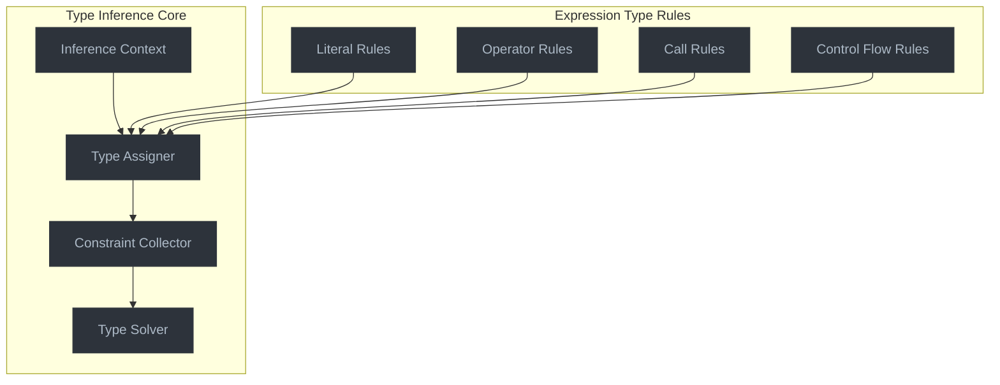

# Type Inference Engine

This document outlines the Type Inference Engine, the component responsible for determining types of expressions and statements.

## Overview

The Type Inference Engine analyzes the AST to assign types to expressions, variables, and other language constructs. It uses a combination of:

1. **Forward type propagation**: Using known types of variables and literals to determine types of derived expressions
2. **Backward type inference**: Using contextual type expectations to infer types of subexpressions
3. **Constraint-based inference**: Collecting and solving type constraints to determine the most specific types

## Architecture



## Key Components

### 1. Inference Context

The inference context manages the state of type inference for a given scope:

```python
class InferenceContext:
    def __init__(self, type_registry: TypeRegistry, parent: Optional["InferenceContext"] = None):
        self.type_registry = type_registry
        self.parent = parent
        self.type_assignments = {}  # Maps nodes to types
        self.constraints = []  # Type constraints to solve

    def assign_type(self, node: uni.UniNode, type_obj: Type) -> None:
        """Assign a type to a node."""
        self.type_assignments[node] = type_obj

    def lookup_type(self, node: uni.UniNode) -> Optional[Type]:
        """Look up the assigned type of a node."""
        if node in self.type_assignments:
            return self.type_assignments[node]
        elif self.parent:
            return self.parent.lookup_type(node)
        return None

    def add_constraint(self, constraint: TypeConstraint) -> None:
        """Add a type constraint to solve."""
        self.constraints.append(constraint)
```

### 2. Type Assigner

The type assigner traverses the AST and assigns types to expressions:

```python
class TypeAssigner:
    def __init__(self, context: InferenceContext):
        self.context = context

    def assign_types(self, node: uni.UniNode) -> None:
        """Assign types to all expressions in the node."""
        if isinstance(node, uni.Module):
            self.assign_module_types(node)
        elif isinstance(node, uni.Architype):
            self.assign_architype_types(node)
        elif isinstance(node, uni.Ability):
            self.assign_ability_types(node)
        # ... and so on for other node types

    def assign_expr_type(self, expr: uni.Expr, expected_type: Optional[Type] = None) -> Type:
        """Assign a type to an expression."""
        # Check if we've already assigned a type
        if existing_type := self.context.lookup_type(expr):
            return existing_type

        # Assign type based on expression kind
        if isinstance(expr, uni.Int):
            return self.assign_int_type(expr)
        elif isinstance(expr, uni.Float):
            return self.assign_float_type(expr)
        elif isinstance(expr, uni.String):
            return self.assign_string_type(expr)
        elif isinstance(expr, uni.Name):
            return self.assign_name_type(expr)
        elif isinstance(expr, uni.BinaryExpr):
            return self.assign_binary_expr_type(expr, expected_type)
        elif isinstance(expr, uni.AtomTrailer):
            return self.assign_atom_trailer_type(expr, expected_type)
        elif isinstance(expr, uni.FuncCall):
            return self.assign_func_call_type(expr, expected_type)
        # ... and so on for other expression types

        # If we can't determine the type, use Unknown
        unknown_type = UnknownType()
        self.context.assign_type(expr, unknown_type)
        return unknown_type
```

### 3. Type Inference Rules

#### Literal Type Rules

```python
def assign_int_type(self, expr: uni.Int) -> Type:
    """Assign type to integer literal."""
    int_type = self.context.type_registry.lookup_by_name("int")
    self.context.assign_type(expr, int_type)
    return int_type

def assign_float_type(self, expr: uni.Float) -> Type:
    """Assign type to float literal."""
    float_type = self.context.type_registry.lookup_by_name("float")
    self.context.assign_type(expr, float_type)
    return float_type

def assign_string_type(self, expr: uni.String) -> Type:
    """Assign type to string literal."""
    str_type = self.context.type_registry.lookup_by_name("str")
    self.context.assign_type(expr, str_type)
    return str_type
```

#### Binary Operation Rules

```python
def assign_binary_expr_type(self, expr: uni.BinaryExpr, expected_type: Optional[Type] = None) -> Type:
    """Assign type to binary expression."""
    left_type = self.assign_expr_type(expr.left)
    right_type = self.assign_expr_type(expr.right)

    # Determine the result type based on operation and operand types
    if expr.op.value in ["+", "-", "*", "/"]:
        # Numeric operations
        if is_subtype(left_type, self.context.type_registry.lookup_by_name("float")) or is_subtype(right_type, self.context.type_registry.lookup_by_name("float")):
            result_type = self.context.type_registry.lookup_by_name("float")
        else:
            result_type = self.context.type_registry.lookup_by_name("int")
    elif expr.op.value in ["==", "!=", "<", ">", "<=", ">="]:
        # Comparison operations
        result_type = self.context.type_registry.lookup_by_name("bool")
    elif expr.op.value in ["and", "or"]:
        # Boolean operations
        result_type = self.context.type_registry.lookup_by_name("bool")
    else:
        # For other operations, add constraints and use a placeholder type
        self.context.add_constraint(BinaryOpConstraint(expr, left_type, right_type))
        result_type = expected_type if expected_type else UnknownType()

    self.context.assign_type(expr, result_type)
    return result_type
```

#### Function Call Rules

```python
def assign_func_call_type(self, expr: uni.FuncCall, expected_type: Optional[Type] = None) -> Type:
    """Assign type to function call."""
    target_type = self.assign_expr_type(expr.target)

    # Assign types to arguments
    arg_types = []
    if expr.params:
        for param in expr.params.items:
            if isinstance(param, uni.KWPair):
                arg_type = self.assign_expr_type(param.value)
            else:
                arg_type = self.assign_expr_type(param)
            arg_types.append(arg_type)

    # Function calls depend on the callable type
    if isinstance(target_type, FunctionType):
        # Check if arguments match parameters
        self.context.add_constraint(CallableConstraint(expr, target_type, arg_types))
        result_type = target_type.return_type
    elif isinstance(target_type, ClassType):
        # Constructor call - return the class instance type
        self.context.add_constraint(ConstructorConstraint(expr, target_type, arg_types))
        result_type = target_type
    else:
        # Unknown callable, add a constraint and use the expected type or unknown
        self.context.add_constraint(CallableConstraint(expr, target_type, arg_types))
        result_type = expected_type if expected_type else UnknownType()

    self.context.assign_type(expr, result_type)
    return result_type
```

### 4. Constraint Collection and Solving

```python
class TypeConstraint:
    """Base class for type constraints."""
    def is_satisfied(self) -> bool:
        """Check if the constraint is satisfied."""
        raise NotImplementedError

    def solve(self, context: InferenceContext) -> None:
        """Solve the constraint, updating types in the context."""
        raise NotImplementedError

class SubtypeConstraint(TypeConstraint):
    """Constraint that one type is a subtype of another."""
    def __init__(self, sub_node: uni.UniNode, sub_type: Type, super_node: uni.UniNode, super_type: Type):
        self.sub_node = sub_node
        self.sub_type = sub_type
        self.super_node = super_node
        self.super_type = super_type

    def is_satisfied(self) -> bool:
        return is_subtype(self.sub_type, self.super_type)

    def solve(self, context: InferenceContext) -> None:
        if not self.is_satisfied():
            # If constraint isn't satisfied, update types
            # This might involve finding a common supertype, etc.
            pass
```

```python
class TypeSolver:
    """Solves type constraints to infer types."""
    def __init__(self, context: InferenceContext):
        self.context = context

    def solve_constraints(self) -> bool:
        """Solve all constraints in the context, return True if all satisfied."""
        all_satisfied = True

        # Simple fixed-point iteration to solve constraints
        changes_made = True
        while changes_made:
            changes_made = False

            for constraint in self.context.constraints:
                if not constraint.is_satisfied():
                    # Try to solve the constraint
                    constraint.solve(self.context)
                    changes_made = True

                    # Check if now satisfied
                    if not constraint.is_satisfied():
                        all_satisfied = False

        return all_satisfied
```

## Advanced Type Inference Features

### Flow-Sensitive Typing

To handle control flow affecting types:

```python
class TypeNarrower:
    """Narrows types based on control flow."""
    def __init__(self, context: InferenceContext):
        self.context = context

    def narrow_if_condition(self, condition: uni.Expr, then_branch: list[uni.UniNode], else_branch: Optional[list[uni.UniNode]]) -> None:
        """Narrow types based on if-condition."""
        if isinstance(condition, uni.BinaryExpr) and condition.op.value == "is":
            # Handle 'is' comparison
            if isinstance(condition.left, uni.Name):
                var_node = condition.left
                type_node = condition.right

                # Create a narrower type for the then branch
                if isinstance(type_node, uni.Name):
                    narrowed_type = self.context.type_registry.lookup_by_name(type_node.value)
                    if narrowed_type:
                        # Create a branch-specific context with the narrowed type
                        then_context = self.context.create_branch_context()
                        then_context.assign_type(var_node, narrowed_type)
```

### Type Inference for Type Parameters

For handling generic types:

```python
def infer_type_args(
    self,
    generic_type: GenericType,
    concrete_args: list[Type]
) -> dict[TypeVar, Type]:
    """Infer type arguments for a generic type."""
    substitutions = {}

    # Match each type parameter with its concrete argument
    for i, param in enumerate(generic_type.base.type_params):
        if i < len(concrete_args):
            substitutions[param] = concrete_args[i]

    return substitutions
```

## Integration with AST Traversal

The type inference engine integrates with the existing AST traversal mechanism:

```python
class TypeInferencePass(UniPass):
    """Pass to perform type inference."""

    def before_pass(self) -> None:
        """Initialize type registry and context."""
        self.type_registry = TypeRegistry()
        self.initialize_builtin_types()
        self.context = InferenceContext(self.type_registry)

    def process(self, node: uni.UniNode) -> None:
        """Process a node during traversal."""
        # 1. Assign initial types where possible
        assigner = TypeAssigner(self.context)
        assigner.assign_types(node)

        # 2. Solve constraints
        solver = TypeSolver(self.context)
        solver.solve_constraints()

        # 3. Store the inferred types in the AST nodes
        for ast_node, type_obj in self.context.type_assignments.items():
            ast_node.expr_type = str(type_obj)
            if isinstance(type_obj, ClassType):
                # Store symbol table reference for class types
                ast_node.type_sym_tab = type_obj.sym_tab

    def initialize_builtin_types(self) -> None:
        """Register all builtin types."""
        # Register primitive types
        self.type_registry.register_type(PrimitiveType("int", PrimitiveValueKind.INTEGER))
        self.type_registry.register_type(PrimitiveType("float", PrimitiveValueKind.FLOAT))
        self.type_registry.register_type(PrimitiveType("str", PrimitiveValueKind.STRING))
        self.type_registry.register_type(PrimitiveType("bool", PrimitiveValueKind.BOOLEAN))
        self.type_registry.register_type(PrimitiveType("None", PrimitiveValueKind.NONE))

        # Register special types
        self.type_registry.register_type(AnyType())
        self.type_registry.register_type(NeverType())
```

## Next Steps

The type inference engine builds on the type system foundation and provides the core functionality for determining types. The next document will cover the Type Checking Pipeline, which integrates the type inference engine into the compiler's pass system.