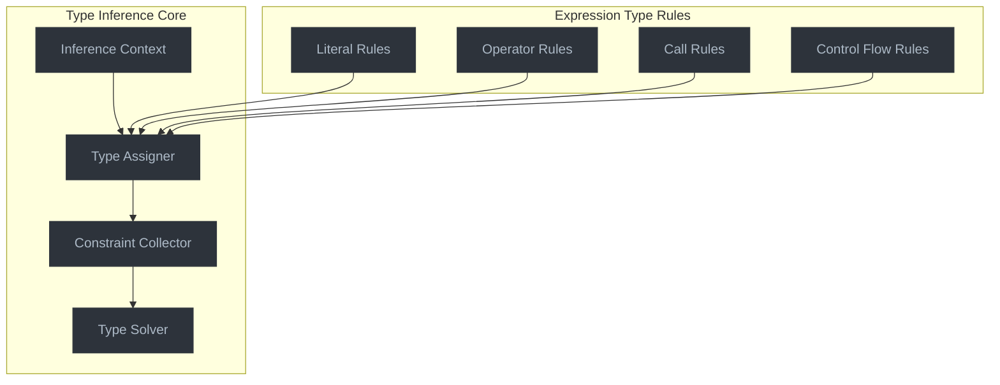

# Type Inference Engine

This document outlines the Type Inference Engine, the component responsible for determining types of expressions and statements.

## Overview

The Type Inference Engine analyzes the AST to assign types to expressions, variables, and other language constructs. It uses a combination of:

1. **Forward type propagation**: Using known types of variables and literals to determine types of derived expressions
2. **Backward type inference**: Using contextual type expectations to infer types of subexpressions
3. **Constraint-based inference**: Collecting and solving type constraints to determine the most specific types

## Type Inference Foundations

### What is Type Inference?

Type inference is the process of automatically deducing the type of an expression without requiring explicit type annotations. This allows developers to write more concise code while maintaining the benefits of static typing.

For example, in the statement `x = 5`, a type inference engine would deduce that `x` has type `int` without requiring the programmer to write `x: int = 5`.

### Why Type Inference Matters

Type inference provides several important benefits:

1. **Reduced Syntactic Overhead**: Programmers can omit type annotations where they're obvious
2. **Improved Readability**: Code remains clean and concise, focusing on logic rather than types
3. **DRY Principle**: Avoids repeating type information that can be derived from context
4. **Gradual Typing Support**: Allows incremental addition of types to a codebase

### Approaches to Type Inference

There are several fundamental approaches to type inference:

#### 1. Local Type Inference

Simplest form that uses immediately available information:
- Types of literals (`42` is an integer, `"hello"` is a string)
- Types from function signatures and variable declarations
- Combining types in expressions (e.g., int + int = int)

#### 2. Bidirectional Type Checking

Combines two modes of analysis:
- **Synthesis**: Determining a type from an expression (bottom-up)
- **Checking**: Verifying an expression against an expected type (top-down)

This approach is particularly effective for handling function arguments, generics, and overloaded operators.

#### 3. Constraint-Based Inference

Collects type equations and constraints from the program:
- **Constraint Generation**: Create equations based on how expressions are used
- **Constraint Solving**: Solve the system of equations to find compatible types
- **Unification**: Combine type variables that must represent the same type

#### 4. Hindley-Milner Type Inference

A powerful algorithm used in languages like Haskell and ML:
- Provides complete type inference without requiring annotations
- Uses parametric polymorphism with type variables
- Performs generalization of types in let-bindings

Our approach for Jaclang combines local and constraint-based inference to balance simplicity and power.

### Challenges in Type Inference

Type inference faces several key challenges:

1. **Type Ambiguity**: Some expressions can have multiple valid types
2. **Context Dependence**: The type of an expression may depend on how it's used
3. **Recursive Definitions**: Types of recursive functions or data structures
4. **Overloaded Operations**: Operators or functions with multiple type signatures
5. **Flow Sensitivity**: Types that change based on control flow

In the sections that follow, we'll explore how our type inference engine addresses these challenges.

## Architecture



## Key Components

### 1. Inference Context

The inference context manages the state of type inference for a given scope:

```python
class InferenceContext:
    def __init__(self, type_registry: TypeRegistry, parent: Optional["InferenceContext"] = None):
        self.type_registry = type_registry
        self.parent = parent
        self.type_assignments = {}  # Maps nodes to types
        self.constraints = []  # Type constraints to solve

    def assign_type(self, node: uni.UniNode, type_obj: Type) -> None:
        """Assign a type to a node."""
        self.type_assignments[node] = type_obj

    def lookup_type(self, node: uni.UniNode) -> Optional[Type]:
        """Look up the assigned type of a node."""
        if node in self.type_assignments:
            return self.type_assignments[node]
        elif self.parent:
            return self.parent.lookup_type(node)
        return None

    def add_constraint(self, constraint: TypeConstraint) -> None:
        """Add a type constraint to solve."""
        self.constraints.append(constraint)
```

#### Understanding Inference Context

The `InferenceContext` is the environment in which type inference occurs. It serves several critical functions:

1. **Type Storage**: It maps AST nodes to their inferred types, providing a centralized repository of typing information.

2. **Scope Handling**: The context forms a hierarchical structure through the `parent` relationship, modeling lexical scoping:
   - Local variables have types stored in the innermost context
   - Accessing a variable traverses contexts from innermost to outermost
   - This mirrors how variable lookup works at runtime

3. **Constraint Collection**: It accumulates type constraints that will be solved to refine initially inferred types.

The context design follows a few key principles:

- **Immutability of Parent Contexts**: Child contexts can see parent types but cannot modify them
- **Separation of Concerns**: Type assignment is separate from constraint solving
- **Progressive Refinement**: Types can be updated as more information becomes available

### 2. Type Assigner

The type assigner traverses the AST and assigns types to expressions:

```python
class TypeAssigner:
    def __init__(self, context: InferenceContext):
        self.context = context

    def assign_types(self, node: uni.UniNode) -> None:
        """Assign types to all expressions in the node."""
        if isinstance(node, uni.Module):
            self.assign_module_types(node)
        elif isinstance(node, uni.Architype):
            self.assign_architype_types(node)
        elif isinstance(node, uni.Ability):
            self.assign_ability_types(node)
        # ... and so on for other node types

    def assign_expr_type(self, expr: uni.Expr, expected_type: Optional[Type] = None) -> Type:
        """Assign a type to an expression."""
        # Check if we've already assigned a type
        if existing_type := self.context.lookup_type(expr):
            return existing_type

        # Assign type based on expression kind
        if isinstance(expr, uni.Int):
            return self.assign_int_type(expr)
        elif isinstance(expr, uni.Float):
            return self.assign_float_type(expr)
        elif isinstance(expr, uni.String):
            return self.assign_string_type(expr)
        elif isinstance(expr, uni.Name):
            return self.assign_name_type(expr)
        elif isinstance(expr, uni.BinaryExpr):
            return self.assign_binary_expr_type(expr, expected_type)
        elif isinstance(expr, uni.AtomTrailer):
            return self.assign_atom_trailer_type(expr, expected_type)
        elif isinstance(expr, uni.FuncCall):
            return self.assign_func_call_type(expr, expected_type)
        # ... and so on for other expression types

        # If we can't determine the type, use Unknown
        unknown_type = UnknownType()
        self.context.assign_type(expr, unknown_type)
        return unknown_type
```

#### The Role of Type Assignment

The `TypeAssigner` implements the core type inference algorithm by systematically traversing the abstract syntax tree and determining the type of each expression. It employs several key techniques:

1. **Visitor Pattern**: The assigner uses a visitor-like pattern to handle different node types with specialized methods.

2. **Bidirectional Type Checking**: Notice the `expected_type` parameter which enables:
   - **Bottom-up synthesis**: Inferring types based on expression structure
   - **Top-down checking**: Using contextual expectations to guide inference

3. **Progressive Refinement**: The type assigner:
   - Starts with precise types for literals (e.g., int, float, string)
   - Propagates these types through expressions following typing rules
   - Collects constraints for expressions with uncertain types
   - Falls back to `UnknownType` when insufficient information exists

4. **Memoization**: The assigner caches previously inferred types, avoiding redundant computation and ensuring consistency.

The type assigner's role is central to the inference process because it:
- Establishes initial types based on local information
- Drives the collection of constraints based on expression relationships
- Balances using known information with deferring complex decisions to the constraint solver

### 3. Type Inference Rules

#### Literal Type Rules

```python
def assign_int_type(self, expr: uni.Int) -> Type:
    """Assign type to integer literal."""
    int_type = self.context.type_registry.lookup_by_name("int")
    self.context.assign_type(expr, int_type)
    return int_type

def assign_float_type(self, expr: uni.Float) -> Type:
    """Assign type to float literal."""
    float_type = self.context.type_registry.lookup_by_name("float")
    self.context.assign_type(expr, float_type)
    return float_type

def assign_string_type(self, expr: uni.String) -> Type:
    """Assign type to string literal."""
    str_type = self.context.type_registry.lookup_by_name("str")
    self.context.assign_type(expr, str_type)
    return str_type
```

##### Understanding Type Rules

Type rules define how types are propagated through different language constructs. They are the core logic of the type inference engine, encoding the typing semantics of the language.

###### Literal Types: The Foundation

Literals provide the most straightforward typing rules, serving as the "atoms" from which more complex types are built:

- **Precise Types**: Literals always have a specific, known type (42 is always an int)
- **No Context Dependence**: Their type doesn't depend on how they're used
- **No Type Variables**: They don't contain parametric or generic elements

In formal type theory, we might express literal typing rules using inference rules notation:

```
-----------  (Int-Literal)
Γ ⊢ n : int

------------  (Float-Literal)
Γ ⊢ f : float

-------------  (String-Literal)
Γ ⊢ s : string
```

Where `Γ` represents the typing context, and `⊢` means "proves that" or "judges that."

#### Binary Operation Rules

```python
def assign_binary_expr_type(self, expr: uni.BinaryExpr, expected_type: Optional[Type] = None) -> Type:
    """Assign type to binary expression."""
    left_type = self.assign_expr_type(expr.left)
    right_type = self.assign_expr_type(expr.right)

    # Determine the result type based on operation and operand types
    if expr.op.value in ["+", "-", "*", "/"]:
        # Numeric operations
        if is_subtype(left_type, self.context.type_registry.lookup_by_name("float")) or is_subtype(right_type, self.context.type_registry.lookup_by_name("float")):
            result_type = self.context.type_registry.lookup_by_name("float")
        else:
            result_type = self.context.type_registry.lookup_by_name("int")
    elif expr.op.value in ["==", "!=", "<", ">", "<=", ">="]:
        # Comparison operations
        result_type = self.context.type_registry.lookup_by_name("bool")
    elif expr.op.value in ["and", "or"]:
        # Boolean operations
        result_type = self.context.type_registry.lookup_by_name("bool")
    else:
        # For other operations, add constraints and use a placeholder type
        self.context.add_constraint(BinaryOpConstraint(expr, left_type, right_type))
        result_type = expected_type if expected_type else UnknownType()

    self.context.assign_type(expr, result_type)
    return result_type
```

##### Binary Operations: Combining Types

Binary operations demonstrate how types combine based on both:
1. The operator being used
2. The types of the operands

Key aspects of binary operation typing:

- **Type Propagation**: The types of operands influence the result type
- **Type Coercion**: Some operations promote types (int + float → float)
- **Operation Groups**: Different categories of operations follow different rules
- **Type Constraints**: Some operations require compatible operand types

In formal notation:

```
Γ ⊢ e₁ : int    Γ ⊢ e₂ : int
---------------------------  (Int-Addition)
      Γ ⊢ e₁ + e₂ : int

Γ ⊢ e₁ : float  Γ ⊢ e₂ : (int or float)
-------------------------------------  (Float-Addition)
           Γ ⊢ e₁ + e₂ : float

Γ ⊢ e₁ : T₁    Γ ⊢ e₂ : T₂    T₁ and T₂ are comparable
--------------------------------------------------  (Comparison)
            Γ ⊢ e₁ == e₂ : bool
```

Our implementation handles these rules by:
1. First inferring the types of both operands
2. Using pattern matching on the operator
3. Applying type coercion rules where appropriate
4. Creating constraints for operations with more complex typing rules

#### Function Call Rules

```python
def assign_func_call_type(self, expr: uni.FuncCall, expected_type: Optional[Type] = None) -> Type:
    """Assign type to function call."""
    target_type = self.assign_expr_type(expr.target)

    # Assign types to arguments
    arg_types = []
    if expr.params:
        for param in expr.params.items:
            if isinstance(param, uni.KWPair):
                arg_type = self.assign_expr_type(param.value)
            else:
                arg_type = self.assign_expr_type(param)
            arg_types.append(arg_type)

    # Function calls depend on the callable type
    if isinstance(target_type, FunctionType):
        # Check if arguments match parameters
        self.context.add_constraint(CallableConstraint(expr, target_type, arg_types))
        result_type = target_type.return_type
    elif isinstance(target_type, ClassType):
        # Constructor call - return the class instance type
        self.context.add_constraint(ConstructorConstraint(expr, target_type, arg_types))
        result_type = target_type
    else:
        # Unknown callable, add a constraint and use the expected type or unknown
        self.context.add_constraint(CallableConstraint(expr, target_type, arg_types))
        result_type = expected_type if expected_type else UnknownType()

    self.context.assign_type(expr, result_type)
    return result_type
```

##### Function Calls: Complex Type Relationships

Function calls represent one of the most complex typing scenarios because they involve:

1. **Function Type Determination**: Identifying what's being called (function, method, constructor)
2. **Argument Type Resolution**: Determining types of all arguments
3. **Parameter Matching**: Ensuring arguments are compatible with parameters
4. **Return Type Determination**: Inferring the result type of the call

Key aspects of function call typing:

- **Polymorphism**: Functions may be generic, requiring type parameter resolution
- **Overloading**: Multiple functions with the same name but different signatures
- **Default Arguments**: Some parameters may be optional
- **Contextual Typing**: Return type expectations may influence parameter inference

The implementation addresses these complexities by:

1. First determining the type of the callable entity
2. Processing argument types, handling both positional and keyword arguments
3. Creating appropriate constraints based on callable kind (function, constructor, etc.)
4. Using the callable's return type or falling back to expected/unknown types

This approach allows us to handle:
- Regular function calls
- Method calls on objects
- Constructor calls to create new instances
- Calls to higher-order functions and lambdas

### 4. Constraint Collection and Solving

```python
class TypeConstraint:
    """Base class for type constraints."""
    def is_satisfied(self) -> bool:
        """Check if the constraint is satisfied."""
        raise NotImplementedError

    def solve(self, context: InferenceContext) -> None:
        """Solve the constraint, updating types in the context."""
        raise NotImplementedError

class SubtypeConstraint(TypeConstraint):
    """Constraint that one type is a subtype of another."""
    def __init__(self, sub_node: uni.UniNode, sub_type: Type, super_node: uni.UniNode, super_type: Type):
        self.sub_node = sub_node
        self.sub_type = sub_type
        self.super_node = super_node
        self.super_type = super_type

    def is_satisfied(self) -> bool:
        return is_subtype(self.sub_type, self.super_type)

    def solve(self, context: InferenceContext) -> None:
        if not self.is_satisfied():
            # If constraint isn't satisfied, update types
            # This might involve finding a common supertype, etc.
            pass
```

```python
class TypeSolver:
    """Solves type constraints to infer types."""
    def __init__(self, context: InferenceContext):
        self.context = context

    def solve_constraints(self) -> bool:
        """Solve all constraints in the context, return True if all satisfied."""
        all_satisfied = True

        # Simple fixed-point iteration to solve constraints
        changes_made = True
        while changes_made:
            changes_made = False

            for constraint in self.context.constraints:
                if not constraint.is_satisfied():
                    # Try to solve the constraint
                    constraint.solve(self.context)
                    changes_made = True

                    # Check if now satisfied
                    if not constraint.is_satisfied():
                        all_satisfied = False

        return all_satisfied
```

#### Understanding Constraint-Based Type Inference

Constraint-based type inference is a powerful approach that separates the problem into two phases:

1. **Constraint Generation**: Creating a set of equations or constraints that the types must satisfy
2. **Constraint Solving**: Finding a solution that satisfies all constraints

This separation offers several advantages:

- **Decoupled Analysis**: Initial type assignments and final resolution are separated
- **Deferred Decisions**: Complex type decisions can be postponed until more information is available
- **Global Optimization**: The solver can consider all constraints together to find optimal solutions
- **Iterative Refinement**: Types can be progressively improved as constraints are solved

##### Types of Constraints

Our system uses several kinds of type constraints:

1. **Subtype Constraints**: Require that one type is a subtype of another
   - Example: In `x = y`, the type of `y` must be a subtype of the type of `x`

2. **Equality Constraints**: Require that two types are identical
   - Example: In a binary operation like `x + x`, both operands might need the same type

3. **Callable Constraints**: Ensure arguments are compatible with parameter types
   - Example: In `f(x, y)`, the argument types must match the function's parameter types

4. **Constructor Constraints**: Verify that constructor arguments match class parameters
   - Example: In `new Person("John", 30)`, arguments must match the constructor's signature

##### The Constraint Solving Process

The constraint solver uses a fixed-point algorithm:

1. Iterate through all unsatisfied constraints
2. Attempt to solve each constraint by refining types
3. Continue until no more changes are made or a maximum iteration count is reached

This process handles interdependent constraints where solving one constraint might help solve others.

For example:
- If we know `x: T1` and `y: T2` and have a constraint `T1 = T2`
- Solving this might make both `x` and `y` have type `T1`
- This could help satisfy another constraint involving `y`

The solver employs several techniques:
- **Unification**: Finding the most general type that satisfies equality constraints
- **Least Upper Bound**: Finding the most specific common supertype for subtyping constraints
- **Type Variable Resolution**: Determining concrete types for type variables
- **Structural Matching**: Matching structure-compatible types (for structural typing)

## Advanced Type Inference Features

### Flow-Sensitive Typing

To handle control flow affecting types:

```python
class TypeNarrower:
    """Narrows types based on control flow."""
    def __init__(self, context: InferenceContext):
        self.context = context

    def narrow_if_condition(self, condition: uni.Expr, then_branch: list[uni.UniNode], else_branch: Optional[list[uni.UniNode]]) -> None:
        """Narrow types based on if-condition."""
        if isinstance(condition, uni.BinaryExpr) and condition.op.value == "is":
            # Handle 'is' comparison
            if isinstance(condition.left, uni.Name):
                var_node = condition.left
                type_node = condition.right

                # Create a narrower type for the then branch
                if isinstance(type_node, uni.Name):
                    narrowed_type = self.context.type_registry.lookup_by_name(type_node.value)
                    if narrowed_type:
                        # Create a branch-specific context with the narrowed type
                        then_context = self.context.create_branch_context()
                        then_context.assign_type(var_node, narrowed_type)
```

#### Understanding Flow-Sensitive Typing

Flow-sensitive typing refines types based on control flow, allowing variables to have different types in different branches of code. This increases type precision and reduces the need for type casts.

##### Type Narrowing

Type narrowing occurs when the type of a variable becomes more specific within a certain code path:

```python
x = get_value()  # x: Union[int, str]
if isinstance(x, int):
    # Here x is narrowed to int
    print(x + 10)  # Safe!
else:
    # Here x is narrowed to str
    print(x.upper())  # Safe!
```

Key aspects of flow-sensitive typing:

1. **Branch-Specific Contexts**: The type narrower creates separate type contexts for different code branches

2. **Condition Analysis**: It analyzes conditions to determine type refinements:
   - `isinstance(x, Type)` checks
   - `x is None` checks
   - Truthiness checks (implying non-None)
   - Equality comparisons with typed values

3. **Union Type Refinement**: It's especially useful for narrowing union types:
   - Union[int, str] can be narrowed to int or str
   - Optional[T] (Union[T, None]) can be narrowed to T or None

This approach enables safer code with fewer explicit type casts while maintaining static type safety.

### Type Inference for Type Parameters

For handling generic types:

```python
def infer_type_args(
    self,
    generic_type: GenericType,
    concrete_args: list[Type]
) -> dict[TypeVar, Type]:
    """Infer type arguments for a generic type."""
    substitutions = {}

    # Match each type parameter with its concrete argument
    for i, param in enumerate(generic_type.base.type_params):
        if i < len(concrete_args):
            substitutions[param] = concrete_args[i]

    return substitutions
```

#### Understanding Generic Type Inference

Generic type inference determines concrete types for type parameters in generic classes and functions. This is critical for languages with parametric polymorphism.

##### Type Argument Deduction

Type arguments can be deduced from:

1. **Explicit Type Arguments**: When provided in syntax like `List<int>`

2. **Context of Use**: Inferring based on how the generic is used:
   ```python
   def identity<T>(x: T) -> T: return x
   result = identity(42)  # Infers T = int
   ```

3. **Target Type**: Using the expected type to guide inference:
   ```python
   List<int> nums = map(int, ["1", "2"])  # Infers map returns List<int>
   ```

The implementation uses several strategies:

1. **Positional Matching**: Matching type parameters to provided concrete types by position

2. **Constraint Satisfaction**: Ensuring inferred types satisfy constraints on type parameters

3. **Context Propagation**: Using contextual types to guide inference of generic functions

4. **Default Type Application**: Using default type arguments when provided

This enables expressive and concise use of generic types without excessive type annotations, improving both safety and readability.

## Integration with AST Traversal

The type inference engine integrates with the existing AST traversal mechanism:

```python
class TypeInferencePass(UniPass):
    """Pass to perform type inference."""

    def before_pass(self) -> None:
        """Initialize type registry and context."""
        self.type_registry = TypeRegistry()
        self.initialize_builtin_types()
        self.context = InferenceContext(self.type_registry)

    def process(self, node: uni.UniNode) -> None:
        """Process a node during traversal."""
        # 1. Assign initial types where possible
        assigner = TypeAssigner(self.context)
        assigner.assign_types(node)

        # 2. Solve constraints
        solver = TypeSolver(self.context)
        solver.solve_constraints()

        # 3. Store the inferred types in the AST nodes
        for ast_node, type_obj in self.context.type_assignments.items():
            ast_node.expr_type = str(type_obj)
            if isinstance(type_obj, ClassType):
                # Store symbol table reference for class types
                ast_node.type_sym_tab = type_obj.sym_tab

    def initialize_builtin_types(self) -> None:
        """Register all builtin types."""
        # Register primitive types
        self.type_registry.register_type(PrimitiveType("int", PrimitiveValueKind.INTEGER))
        self.type_registry.register_type(PrimitiveType("float", PrimitiveValueKind.FLOAT))
        self.type_registry.register_type(PrimitiveType("str", PrimitiveValueKind.STRING))
        self.type_registry.register_type(PrimitiveType("bool", PrimitiveValueKind.BOOLEAN))
        self.type_registry.register_type(PrimitiveType("None", PrimitiveValueKind.NONE))

        # Register special types
        self.type_registry.register_type(AnyType())
        self.type_registry.register_type(NeverType())
```

### Compiler Integration and Pass Architecture

The type inference engine is integrated into the compiler pipeline as a dedicated pass. This architecture offers several advantages:

#### Pass-Based Compiler Architecture

Modern compilers are typically structured as a series of passes, each handling a specific aspect of the compilation process:

1. **Lexical Analysis**: Converts source code to tokens
2. **Parsing**: Builds an abstract syntax tree from tokens
3. **Semantic Analysis**: Includes type checking and inference
4. **Optimization**: Improves code performance
5. **Code Generation**: Produces target code

The type inference engine fits within the semantic analysis phase, after parsing but before optimization and code generation.

#### Benefits of the Pass Architecture

This approach provides several advantages:

1. **Separation of Concerns**: Each pass handles one aspect of the compilation process
2. **Reusability**: Passes can be reused across different compilation pipelines
3. **Testability**: Individual passes can be tested in isolation
4. **Extensibility**: New language features can be added by modifying specific passes
5. **Incremental Processing**: Some passes can operate incrementally for faster compilation

#### AST Annotation vs. Separate Data Structures

There are two common approaches to storing type information:

1. **AST Annotation** (our approach): Directly attaches type information to AST nodes
   - Advantages: Simplicity, direct access to types when processing nodes
   - Disadvantages: Potentially clutters the AST

2. **Separate Type Environment**: Maintains types in a separate data structure
   - Advantages: Cleaner AST, easier to manage different analyses
   - Disadvantages: Requires lookups to find types for nodes

Our implementation uses AST annotation for simplicity and performance, attaching:
- The inferred type as a string representation
- References to symbol tables for named types
- Additional type-related metadata as needed

#### Initialization and Builtin Types

The pass initializes the type system with:

1. **Primitive Types**: int, float, str, bool, None
2. **Special Types**: Any, Never, etc.
3. **Standard Library Types**: Built-in collections and utilities

This initialization ensures that all basic types are available for inference before processing user code.

## Type Inference in Action

Let's walk through a simple example to illustrate how type inference works in practice:

```python
def calculate(a, b):
    result = a + b
    if result > 100:
        return "Large result"
    return result
```

Here's how the type inference process would unfold:

1. **Initial Analysis**:
   - Function parameters `a` and `b` have unknown types
   - `result` is assigned the expression `a + b`, also with unknown type
   - Return type is initially unknown

2. **Constraint Collection**:
   - From `a + b`: The operator `+` requires compatible operands
   - From `result > 100`: `result` must be comparable with `int`
   - From `return "Large result"`: Function returns `str` in one branch
   - From `return result`: Function returns same type as `result` in another branch

3. **Constraint Solving**:
   - `result > 100` suggests `result` is numeric, likely `int` or `float`
   - `a + b` produces `result`, so `a` and `b` are likely numeric
   - Return type must be a union of `str` and the type of `result`

4. **Final Inference**:
   - `a` and `b` inferred as `int` (simplest solution)
   - `result` inferred as `int`
   - Return type inferred as `Union[int, str]`

This example demonstrates how the system:
- Propagates types from known values (like the literal `100`)
- Collects constraints from operations (like `+` and `>`)
- Handles flow-sensitive typing (different returns in different branches)
- Infers the most specific types that satisfy all constraints

## Challenges and Solutions

Type inference engines face several challenges:

### 1. Recursive Types and Functions

**Challenge**: Inferring types for recursive functions can lead to infinite loops

**Solution**: Use a fix-point algorithm with a finite number of iterations, or introduce a "delayed" constraint that waits for other constraints to be solved first.

### 2. Type Ambiguity

**Challenge**: Some expressions have multiple valid typings

**Solution**: Choose the most specific type that satisfies all constraints, or use union types when necessary. In some cases, require explicit annotations.

### 3. Performance Concerns

**Challenge**: Type inference can be computationally expensive for large codebases

**Solution**: Implement incremental type checking, caching of inferred types, and limit the complexity of constraint solving with timeout mechanisms.

### 4. Error Recovery

**Challenge**: Continuing inference after encountering type errors

**Solution**: Use the `UnknownType` to represent types that couldn't be inferred due to errors, allowing the inference process to continue and potentially find more errors.

## Next Steps

The type inference engine builds on the type system foundation and provides the core functionality for determining types. The next document will cover the Type Checking Pipeline, which integrates the type inference engine into the compiler's pass system.

## Conclusion

Type inference is a powerful feature that enhances both the developer experience and the safety of statically typed languages. By automatically deducing types, it allows programmers to write concise code without sacrificing type safety.

Our implementation:

1. **Combines Multiple Approaches**: Using local inference, bidirectional checking, and constraint solving
2. **Balances Simplicity and Power**: Providing robust inference without excessive complexity
3. **Integrates with the Compiler Pipeline**: Fitting naturally into the pass-based architecture
4. **Supports Advanced Features**: Including flow-sensitive typing and generic type inference

As we continue to refine the type inference engine, we'll focus on:
- Improving performance for large codebases
- Enhancing error messages for inference failures
- Supporting more complex type features like higher-kinded types
- Implementing incremental type checking for better IDE support

The next document, [Type Checking Pipeline](03-type-checking-pipeline.md), will detail how the type inference engine fits into the compiler's overall type checking process.