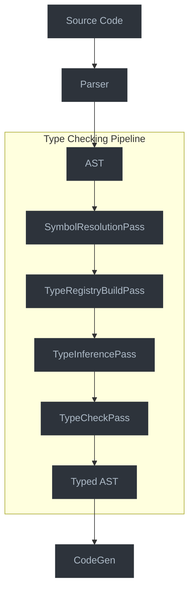

# Type Checking Pipeline

This document outlines the Type Checking Pipeline, which integrates the type system and inference engine into the Jaclang compiler's pass system.

## Overview

The Type Checking Pipeline coordinates the execution of type-related passes within the compiler, orchestrating the process of:

1. Building symbol tables
2. Resolving symbols and types
3. Performing type inference
4. Checking type compatibility
5. Reporting type errors

## Architecture



## Pipeline Integration

### Integration with Compiler Passes

The type checking pipeline will integrate with the existing compiler pass system:

```python
# Add these passes to program.py
type_checker_sched = [
    # Current passes
    InheritancePass,
    FuseTypeInfoPass,
    AccessCheckPass,

    # New passes
    TypeRegistryBuildPass,
    TypeInferencePass,
    TypeCheckPass
]
```

### Type Registry Build Pass

First, we build a comprehensive registry of all types in the program:

```python
class TypeRegistryBuildPass(UniPass):
    """Pass to build the type registry from all symbols."""

    def before_pass(self) -> None:
        """Initialize the pass."""
        self.type_registry = TypeRegistry()
        self.register_builtin_types()

        # Store the registry in the module's py_info for later passes
        if isinstance(self.ir_out, uni.Module):
            self.ir_out.py_info.type_registry = self.type_registry

    def process(self, node: uni.UniNode) -> None:
        """Process a node during traversal."""
        # Register types from declarations
        if isinstance(node, uni.Architype):
            self.register_architype(node)
        elif isinstance(node, uni.Enum):
            self.register_enum(node)
        elif isinstance(node, uni.GlobalVars):
            self.register_global_vars(node)

    def register_architype(self, node: uni.Architype) -> None:
        """Register an architype as a type."""
        # Create the class type for this architype
        class_type = create_architype_type(node)

        # Add it to the registry
        self.type_registry.register_type(class_type, node)

    def register_enum(self, node: uni.Enum) -> None:
        """Register an enum as a type."""
        # Create the class type for this enum
        enum_type = create_enum_type(node)

        # Add it to the registry
        self.type_registry.register_type(enum_type, node)

    def register_builtin_types(self) -> None:
        """Register builtin types in the registry."""
        # Register primitive types
        primitive_types = [
            ("int", PrimitiveValueKind.INTEGER),
            ("float", PrimitiveValueKind.FLOAT),
            ("str", PrimitiveValueKind.STRING),
            ("bool", PrimitiveValueKind.BOOLEAN),
            ("None", PrimitiveValueKind.NONE),
        ]

        for name, kind in primitive_types:
            self.type_registry.register_type(PrimitiveType(name, kind))

        # Register special types
        self.type_registry.register_type(AnyType())
        self.type_registry.register_type(NeverType())
        self.type_registry.register_type(UnknownType())
```

### Type Inference Pass

Next, we use the type inference engine to determine types:

```python
class TypeInferencePass(UniPass):
    """Pass to infer types for expressions and variables."""

    def before_pass(self) -> None:
        """Initialize the pass."""
        # Get the type registry from the previous pass
        if isinstance(self.ir_out, uni.Module):
            self.type_registry = self.ir_out.py_info.type_registry
        else:
            self.type_registry = TypeRegistry()
            self.register_builtin_types()

        # Create the inference context
        self.context = InferenceContext(self.type_registry)

        # Create the type assigner
        self.assigner = TypeAssigner(self.context)

    def process(self, node: uni.UniNode) -> None:
        """Process a node during traversal."""
        # Assign types to expressions
        if isinstance(node, uni.Expr):
            self.assigner.assign_expr_type(node)

        # Handle declarations
        elif isinstance(node, uni.HasVar):
            self.infer_var_type(node)
        elif isinstance(node, uni.ParamVar):
            self.infer_param_type(node)
        elif isinstance(node, uni.Ability):
            self.infer_ability_type(node)
        elif isinstance(node, uni.Assignment):
            self.infer_assignment_type(node)

    def after_pass(self) -> None:
        """After processing the entire AST, solve constraints."""
        # Solve type constraints
        solver = TypeSolver(self.context)
        solved = solver.solve_constraints()

        # Store inferred types in the AST nodes
        for node, type_obj in self.context.type_assignments.items():
            if hasattr(node, "expr_type"):
                node.expr_type = str(type_obj)

            # Store a reference to the type's symbol table if applicable
            if hasattr(node, "type_sym_tab") and isinstance(type_obj, ClassType):
                node.type_sym_tab = type_obj.sym_tab

        # Log any unsolved constraints as warnings
        if not solved:
            for constraint in self.context.constraints:
                if not constraint.is_satisfied():
                    self.log_warning(f"Could not fully resolve type constraint: {constraint}")
```

### Type Check Pass

Finally, we validate the compatibility of inferred types:

```python
class TypeCheckPass(UniPass):
    """Pass to check type compatibility and report errors."""

    def before_pass(self) -> None:
        """Initialize the pass."""
        # Get type registry and assignments from previous passes
        if isinstance(self.ir_out, uni.Module):
            self.type_registry = self.ir_out.py_info.type_registry
        else:
            self.type_registry = TypeRegistry()

        # Create error reporter
        self.error_reporter = TypeErrorReporter(self)

    def process(self, node: uni.UniNode) -> None:
        """Process a node during traversal."""
        if isinstance(node, uni.Assignment):
            self.check_assignment(node)
        elif isinstance(node, uni.FuncCall):
            self.check_call(node)
        elif isinstance(node, uni.BinaryExpr):
            self.check_binary_expr(node)
        elif isinstance(node, uni.ReturnStmt):
            self.check_return(node)
        elif isinstance(node, uni.IfStmt):
            self.check_if_condition(node)
        # ... and so on for other node types that need checking

    def check_assignment(self, node: uni.Assignment) -> None:
        """Check type compatibility in assignment."""
        if node.value and node.target and len(node.target.items) > 0:
            # Get the target and value types
            target_node = node.target.items[0]
            value_node = node.value

            target_type_str = getattr(target_node, "expr_type", "unknown")
            value_type_str = getattr(value_node, "expr_type", "unknown")

            # Check if the target type exists
            target_type = self.type_registry.lookup_by_name(target_type_str)
            value_type = self.type_registry.lookup_by_name(value_type_str)

            if target_type and value_type:
                # Check if value type is assignable to target type
                if not is_subtype(value_type, target_type):
                    self.error_reporter.report_incompatible_assignment(
                        node, target_type, value_type
                    )

    def check_call(self, node: uni.FuncCall) -> None:
        """Check type compatibility in function call."""
        # Get the callable type
        callable_node = node.target
        callable_type_str = getattr(callable_node, "expr_type", "unknown")
        callable_type = self.type_registry.lookup_by_name(callable_type_str)

        if callable_type and isinstance(callable_type, FunctionType):
            # Check number of arguments
            if node.params:
                arg_count = len(node.params.items)
                param_count = len(callable_type.param_types)

                if arg_count < callable_type.min_args or arg_count > param_count and not callable_type.has_varargs:
                    self.error_reporter.report_argument_count_mismatch(
                        node, callable_type, arg_count
                    )

                # Check argument types
                for i, arg in enumerate(node.params.items):
                    if i < param_count:
                        # Get argument type
                        arg_type_str = getattr(arg, "expr_type", "unknown")
                        arg_type = self.type_registry.lookup_by_name(arg_type_str)

                        # Get parameter type
                        param_type = callable_type.param_types[i]

                        if arg_type and not is_subtype(arg_type, param_type):
                            self.error_reporter.report_incompatible_argument(
                                node, i, param_type, arg_type
                            )
```

## Type Checking Modes

The type checking pipeline supports multiple modes with different levels of strictness:

```python
class TypeCheckingMode(Enum):
    """Different modes for type checking."""

    NORMAL = "normal"    # Standard type checking
    STRICT = "strict"    # More strict checks (e.g., no Any, all return paths)
    PERMISSIVE = "permissive"  # More lenient (e.g., allow implicit Any)
```

```python
class TypeCheckOptions:
    """Options for type checking."""

    def __init__(self):
        self.mode = TypeCheckingMode.NORMAL
        self.ignore_missing_imports = True
        self.allow_implicit_any = False
        self.warn_unreachable_code = True
        self.strict_optional = False
        self.warn_redundant_casts = True
```

## Incremental Type Checking

For better IDE integration, we support incremental type checking:

```python
class IncrementalTypeChecker:
    """Support for incremental type checking."""

    def __init__(self, type_registry: TypeRegistry):
        self.type_registry = type_registry
        self.file_dependencies = {}  # Maps files to their dependencies
        self.node_dependencies = {}  # Maps nodes to dependent nodes
        self.cached_types = {}  # Caches inferred types

    def add_file_dependency(self, file_path: str, dependency_path: str) -> None:
        """Record that file_path depends on dependency_path."""
        if file_path not in self.file_dependencies:
            self.file_dependencies[file_path] = set()
        self.file_dependencies[file_path].add(dependency_path)

    def invalidate_file(self, file_path: str) -> list[str]:
        """Invalidate cached information for a file and determine what needs rechecking."""
        files_to_recheck = {file_path}

        # Find all files that depend on this file
        for dep_file, deps in self.file_dependencies.items():
            if file_path in deps:
                files_to_recheck.add(dep_file)

        # Clear cached types for these files
        for file in files_to_recheck:
            self.clear_file_cache(file)

        return list(files_to_recheck)

    def clear_file_cache(self, file_path: str) -> None:
        """Clear cached information for a file."""
        # Remove type cache entries for nodes in this file
        self.cached_types = {
            node: type_obj
            for node, type_obj in self.cached_types.items()
            if getattr(node, "loc", None) and node.loc.mod_path != file_path
        }
```

## Next Steps

The type checking pipeline integrates all pieces of the type system into a cohesive workflow within the compiler. The next document will cover the Error Reporting System, which provides detailed and actionable feedback for type errors.