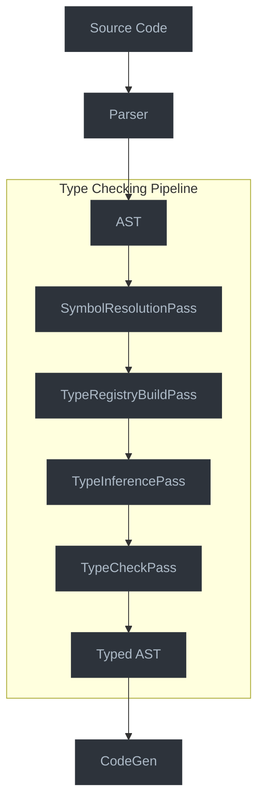

# Type Checking Pipeline

This document outlines the Type Checking Pipeline, which integrates the type system and inference engine into the Jaclang compiler's pass system.

## Overview

The Type Checking Pipeline coordinates the execution of type-related passes within the compiler, orchestrating the process of:

1. Building symbol tables
2. Resolving symbols and types
3. Performing type inference
4. Checking type compatibility
5. Reporting type errors

## Type Checking in Modern Compilers

### The Role of Type Checking

Type checking serves as a crucial phase in the compilation process, providing several critical benefits:

1. **Early Error Detection**: Catching type-related errors at compile time prevents runtime errors
2. **Program Correctness**: Verifying that operations are used with compatible types ensures logical consistency
3. **Performance Optimization**: Type information enables compiler optimizations like specialized code generation
4. **Documentation**: Types serve as machine-verified documentation about code behavior
5. **Refactoring Support**: Type checking makes large-scale code changes safer by catching incompatibilities

### Design Philosophy of Type Checking Systems

When designing a type checking system, several key principles should be considered:

1. **Soundness vs. Completeness**:
   - A *sound* type system never accepts an ill-typed program
   - A *complete* type system accepts all well-typed programs
   - Most practical type systems prioritize soundness but may sacrifice completeness for usability

2. **Gradual vs. Strict Typing**:
   - *Gradual typing* permits mixing typed and untyped code with runtime checks at the boundaries
   - *Strict typing* requires all code to be statically typed
   - The choice affects developer experience and migration paths for existing code

3. **Expressiveness vs. Simplicity**:
   - More expressive type systems can capture more program properties but increase complexity
   - Simpler type systems are easier to understand but may reject valid programs
   - Finding the right balance is key to adoption and usability

### Pipeline Architecture in Compilers

Modern compilers typically organize processing into a series of passes, each with a specific responsibility:

1. **Why Pipelines Matter**:
   - **Separation of Concerns**: Each pass focuses on a specific transformation
   - **Modularity**: Passes can be added, removed, or reordered as needed
   - **Testability**: Individual passes can be tested in isolation
   - **Parallelization**: Some passes can be executed concurrently

2. **Stages in a Typical Compiler Pipeline**:
   - **Lexical Analysis**: Converting source text to tokens
   - **Syntax Analysis**: Building an abstract syntax tree (AST)
   - **Semantic Analysis**: Resolving names and checking types
   - **Optimization**: Transforming code for performance
   - **Code Generation**: Producing target machine code

The type checking pipeline operates within the semantic analysis phase, where it verifies that the program is semantically valid according to the language's type system.

## Architecture



## Pipeline Integration

### Integration with Compiler Passes

The type checking pipeline will integrate with the existing compiler pass system:

```python
# Add these passes to program.py
type_checker_sched = [
    # Current passes
    InheritancePass,
    FuseTypeInfoPass,
    AccessCheckPass,

    # New passes
    TypeRegistryBuildPass,
    TypeInferencePass,
    TypeCheckPass
]
```

#### Understanding Pass Scheduling

The ordering of compiler passes is critical for correct type checking. Each pass builds upon the information collected by previous passes:

1. **InheritancePass**: Establishes inheritance relationships between classes
   - Required before type checking to understand subtyping relationships
   - Resolves base class references and builds inheritance hierarchy

2. **FuseTypeInfoPass**: Merges type information from different sources
   - Combines explicit annotations with inferred types
   - Resolves type aliases and imports

3. **AccessCheckPass**: Verifies visibility and access rules
   - Ensures private/protected members are accessed appropriately
   - Must run before type checking to prevent illegal access

The new type checking passes then build on this foundation:

4. **TypeRegistryBuildPass**: Creates a central registry of all types
5. **TypeInferencePass**: Determines types for expressions without annotations
6. **TypeCheckPass**: Verifies type compatibility across the program

This sequence represents a careful balance between:
- Dependencies between passes (each pass requires information from previous passes)
- Information flow (passes build up increasingly detailed type information)
- Error detection (earlier passes catch fundamental errors, later passes catch more nuanced issues)

### Type Registry Build Pass

First, we build a comprehensive registry of all types in the program:

```python
class TypeRegistryBuildPass(UniPass):
    """Pass to build the type registry from all symbols."""

    def before_pass(self) -> None:
        """Initialize the pass."""
        self.type_registry = TypeRegistry()
        self.register_builtin_types()

        # Store the registry in the module's py_info for later passes
        if isinstance(self.ir_out, uni.Module):
            self.ir_out.py_info.type_registry = self.type_registry

    def process(self, node: uni.UniNode) -> None:
        """Process a node during traversal."""
        # Register types from declarations
        if isinstance(node, uni.Architype):
            self.register_architype(node)
        elif isinstance(node, uni.Enum):
            self.register_enum(node)
        elif isinstance(node, uni.GlobalVars):
            self.register_global_vars(node)

    def register_architype(self, node: uni.Architype) -> None:
        """Register an architype as a type."""
        # Create the class type for this architype
        class_type = create_architype_type(node)

        # Add it to the registry
        self.type_registry.register_type(class_type, node)

    def register_enum(self, node: uni.Enum) -> None:
        """Register an enum as a type."""
        # Create the class type for this enum
        enum_type = create_enum_type(node)

        # Add it to the registry
        self.type_registry.register_type(enum_type, node)

    def register_builtin_types(self) -> None:
        """Register builtin types in the registry."""
        # Register primitive types
        primitive_types = [
            ("int", PrimitiveValueKind.INTEGER),
            ("float", PrimitiveValueKind.FLOAT),
            ("str", PrimitiveValueKind.STRING),
            ("bool", PrimitiveValueKind.BOOLEAN),
            ("None", PrimitiveValueKind.NONE),
        ]

        for name, kind in primitive_types:
            self.type_registry.register_type(PrimitiveType(name, kind))

        # Register special types
        self.type_registry.register_type(AnyType())
        self.type_registry.register_type(NeverType())
        self.type_registry.register_type(UnknownType())
```

#### The Type Registry: A Central Type Repository

The `TypeRegistryBuildPass` creates a comprehensive catalog of all types used in the program. This registry serves several critical purposes:

1. **Global Type Resolution**: Provides a single source of truth for all types
   - Ensures consistent type representation across the program
   - Enables lookup of types by name or AST node

2. **Type Relationship Management**: Tracks relationships between types
   - Stores inheritance hierarchies
   - Maintains information about generics and their type parameters

3. **Access to Type Information**: Gives other passes efficient access to types
   - Type inference uses it to look up known types
   - Type checking uses it to verify type compatibility

The implementation follows key design patterns:

- **Visitor Pattern**: The pass traverses the AST, handling each type of declaration differently
- **Factory Methods**: Each registration method creates the appropriate type representation
- **Singleton Registry**: A single registry instance is shared across all passes
- **Eager Registration**: All types are registered upfront, before inference or checking

This approach provides several benefits:

- **Separation of Concerns**: Type registration is separate from type checking
- **Efficiency**: Types can be looked up quickly by name or node
- **Completeness**: All types are registered, including built-ins and user-defined types
- **Extensibility**: New types can be added to the registry by additional passes

### Type Inference Pass

Next, we use the type inference engine to determine types:

```python
class TypeInferencePass(UniPass):
    """Pass to infer types for expressions and variables."""

    def before_pass(self) -> None:
        """Initialize the pass."""
        # Get the type registry from the previous pass
        if isinstance(self.ir_out, uni.Module):
            self.type_registry = self.ir_out.py_info.type_registry
        else:
            self.type_registry = TypeRegistry()
            self.register_builtin_types()

        # Create the inference context
        self.context = InferenceContext(self.type_registry)

        # Create the type assigner
        self.assigner = TypeAssigner(self.context)

    def process(self, node: uni.UniNode) -> None:
        """Process a node during traversal."""
        # Assign types to expressions
        if isinstance(node, uni.Expr):
            self.assigner.assign_expr_type(node)

        # Handle declarations
        elif isinstance(node, uni.HasVar):
            self.infer_var_type(node)
        elif isinstance(node, uni.ParamVar):
            self.infer_param_type(node)
        elif isinstance(node, uni.Ability):
            self.infer_ability_type(node)
        elif isinstance(node, uni.Assignment):
            self.infer_assignment_type(node)

    def after_pass(self) -> None:
        """After processing the entire AST, solve constraints."""
        # Solve type constraints
        solver = TypeSolver(self.context)
        solved = solver.solve_constraints()

        # Store inferred types in the AST nodes
        for node, type_obj in self.context.type_assignments.items():
            if hasattr(node, "expr_type"):
                node.expr_type = str(type_obj)

            # Store a reference to the type's symbol table if applicable
            if hasattr(node, "type_sym_tab") and isinstance(type_obj, ClassType):
                node.type_sym_tab = type_obj.sym_tab

        # Log any unsolved constraints as warnings
        if not solved:
            for constraint in self.context.constraints:
                if not constraint.is_satisfied():
                    self.log_warning(f"Could not fully resolve type constraint: {constraint}")
```

#### Type Inference: Determining Missing Type Information

The `TypeInferencePass` employs sophisticated algorithms to determine types for expressions and variables that lack explicit annotations. It builds upon the established type registry to provide a comprehensive typing of the program.

##### Multi-Phase Inference Strategy

The inference pass operates in multiple phases:

1. **AST Traversal Phase**:
   - Systematically visits each node in the AST
   - Assigns initial types based on local information
   - Collects type constraints based on usage patterns

2. **Constraint Solving Phase** (in `after_pass`):
   - Processes all collected constraints together
   - Iteratively refines types to satisfy constraints
   - Resolves interdependent type relationships

This two-phase approach allows the inference engine to:
- Gather contextual information from the entire program
- Make more informed decisions when types are ambiguous
- Handle circular dependencies through fixed-point iteration

##### Handling Different Node Types

The pass uses specialized handling for different kinds of AST nodes:

- **Expressions**: Direct type assignment based on expression structure
- **Variables**: Infer types from initialization or usage
- **Parameters**: Use explicit annotations or infer from function body
- **Abilities**: Determine return types and parameter types
- **Assignments**: Propagate types between variables

##### Constraint Collection and Satisfaction

During traversal, the pass collects constraints like:
- "Variable x must have same type as expression y"
- "Function return value must be subtype of declared return type"
- "Arguments to function call must match parameter types"

These constraints are then solved together to find the most specific types that satisfy all constraints, handling cases where local information alone is insufficient.

##### AST Annotation

After inference, the pass annotates the AST with the inferred types:
- Stores type information directly on AST nodes
- Links types to their symbol table entries
- Preserves the connection between AST nodes and their types

This rich annotation enables subsequent compiler passes to access type information efficiently without recalculating it.

### Type Check Pass

Finally, we validate the compatibility of inferred types:

```python
class TypeCheckPass(UniPass):
    """Pass to check type compatibility and report errors."""

    def before_pass(self) -> None:
        """Initialize the pass."""
        # Get type registry and assignments from previous passes
        if isinstance(self.ir_out, uni.Module):
            self.type_registry = self.ir_out.py_info.type_registry
        else:
            self.type_registry = TypeRegistry()

        # Create error reporter
        self.error_reporter = TypeErrorReporter(self)

    def process(self, node: uni.UniNode) -> None:
        """Process a node during traversal."""
        if isinstance(node, uni.Assignment):
            self.check_assignment(node)
        elif isinstance(node, uni.FuncCall):
            self.check_call(node)
        elif isinstance(node, uni.BinaryExpr):
            self.check_binary_expr(node)
        elif isinstance(node, uni.ReturnStmt):
            self.check_return(node)
        elif isinstance(node, uni.IfStmt):
            self.check_if_condition(node)
        # ... and so on for other node types that need checking

    def check_assignment(self, node: uni.Assignment) -> None:
        """Check type compatibility in assignment."""
        if node.value and node.target and len(node.target.items) > 0:
            # Get the target and value types
            target_node = node.target.items[0]
            value_node = node.value

            target_type_str = getattr(target_node, "expr_type", "unknown")
            value_type_str = getattr(value_node, "expr_type", "unknown")

            # Check if the target type exists
            target_type = self.type_registry.lookup_by_name(target_type_str)
            value_type = self.type_registry.lookup_by_name(value_type_str)

            if target_type and value_type:
                # Check if value type is assignable to target type
                if not is_subtype(value_type, target_type):
                    self.error_reporter.report_incompatible_assignment(
                        node, target_type, value_type
                    )

    def check_call(self, node: uni.FuncCall) -> None:
        """Check type compatibility in function call."""
        # Get the callable type
        callable_node = node.target
        callable_type_str = getattr(callable_node, "expr_type", "unknown")
        callable_type = self.type_registry.lookup_by_name(callable_type_str)

        if callable_type and isinstance(callable_type, FunctionType):
            # Check number of arguments
            if node.params:
                arg_count = len(node.params.items)
                param_count = len(callable_type.param_types)

                if arg_count < callable_type.min_args or arg_count > param_count and not callable_type.has_varargs:
                    self.error_reporter.report_argument_count_mismatch(
                        node, callable_type, arg_count
                    )

                # Check argument types
                for i, arg in enumerate(node.params.items):
                    if i < param_count:
                        # Get argument type
                        arg_type_str = getattr(arg, "expr_type", "unknown")
                        arg_type = self.type_registry.lookup_by_name(arg_type_str)

                        # Get parameter type
                        param_type = callable_type.param_types[i]

                        if arg_type and not is_subtype(arg_type, param_type):
                            self.error_reporter.report_incompatible_argument(
                                node, i, param_type, arg_type
                            )
```

#### Type Checking: Enforcing Type Compatibility

The `TypeCheckPass` enforces the type system rules by verifying that operations only use types in compatible ways. This pass relies on the types determined by the inference pass and validates their usage throughout the program.

##### Systematic Verification Approach

The type checker methodically examines each construct in the program:

1. **Assignment Checks**: Verifies that assigned values match variable types
   - Ensures the right-hand side is a subtype of the left-hand side
   - Handles complex assignments like unpacking and multiple assignment

2. **Function Call Checks**: Validates arguments against parameter types
   - Verifies argument count matches parameter count (accounting for defaults and varargs)
   - Ensures each argument is compatible with its corresponding parameter
   - Handles overloaded functions by selecting the correct overload

3. **Expression Checks**: Ensures operations use compatible operands
   - Validates that binary operations have compatible operand types
   - Checks that unary operations apply to appropriate types
   - Verifies that indexed access applies to container types

4. **Control Flow Checks**: Validates types in control flow constructs
   - Ensures conditions evaluate to boolean-compatible types
   - Verifies consistency in return types across different code paths
   - Checks exhaustiveness of pattern matching when applicable

##### Error Detection and Handling

When type incompatibilities are detected, the pass:

1. Reports detailed error information through the `TypeErrorReporter`
2. Attempts to continue checking to find additional errors
3. Provides context about why types are incompatible

This approach helps developers fix multiple type errors in a single compilation cycle rather than presenting errors one at a time.

##### Type Compatibility Rules

The core of type checking involves determining when types are compatible. Key rules include:

1. **Subtyping**: A type S is compatible with T if S is a subtype of T
   - Class inheritance: Child classes can be used where parent classes are expected
   - Primitive widening: Integers can be used where floats are expected
   - Special types: Never is a subtype of all types; all types are subtypes of Any

2. **Type Conversion**: Some types can be implicitly converted to others
   - Numeric conversions (int to float)
   - String conversions for string concatenation
   - User-defined conversions through special methods

3. **Compatibility Rules**: Specific rules for different operations
   - Addition requires addable types (numeric or string)
   - Comparison requires comparable types
   - Boolean contexts accept any type with a truth value

## Type Checking Modes

The type checking pipeline supports multiple modes with different levels of strictness:

```python
class TypeCheckingMode(Enum):
    """Different modes for type checking."""

    NORMAL = "normal"    # Standard type checking
    STRICT = "strict"    # More strict checks (e.g., no Any, all return paths)
    PERMISSIVE = "permissive"  # More lenient (e.g., allow implicit Any)
```

```python
class TypeCheckOptions:
    """Options for type checking."""

    def __init__(self):
        self.mode = TypeCheckingMode.NORMAL
        self.ignore_missing_imports = True
        self.allow_implicit_any = False
        self.warn_unreachable_code = True
        self.strict_optional = False
        self.warn_redundant_casts = True
```

### Understanding Type Checking Modes

Type checkers often provide different modes to balance strictness, correctness, and developer productivity. These modes allow tailoring the type checking behavior to different scenarios and development stages.

#### Strictness Levels and Their Purposes

Different strictness levels serve different needs:

1. **Normal Mode (Default)**
   - Balanced approach for everyday development
   - Catches common type errors while avoiding excessive restrictions
   - Prioritizes practical error detection over theoretical purity
   - Example: Allows using `Any` type when necessary but reports errors for clear type mismatches

2. **Strict Mode**
   - Maximizes type safety, suitable for critical code paths
   - Enforces more rigorous type discipline
   - May reject code that would work at runtime but has theoretical type issues
   - Example: Disallows `Any` usage, requires exhaustive null/undefined checks, enforces explicit return types

3. **Permissive Mode**
   - Focuses on finding only the most obvious errors
   - Useful during initial migration of untyped code or early development
   - Prioritizes developer velocity over comprehensive type safety
   - Example: Allows implicit `Any` types, permits lenient type compatibility rules

#### Configurable Type Checking Options

The `TypeCheckOptions` class provides fine-grained control over the type checking behavior:

1. **Missing Imports Handling**
   - `ignore_missing_imports`: When true, assumes imported modules have correct types even if unavailable
   - Useful when using third-party libraries without type definitions

2. **Implicit Any Control**
   - `allow_implicit_any`: When true, allows variables without explicit types to default to `Any`
   - Enables gradual typing by allowing parts of the codebase to remain untyped

3. **Unreachable Code Detection**
   - `warn_unreachable_code`: Flags code paths that can never be executed
   - Helps identify logical errors or redundant code

4. **Null Checking Strictness**
   - `strict_optional`: When true, requires explicit handling of `None` values
   - Helps prevent null reference errors, similar to Kotlin's nullable types or Rust's Option

5. **Cast Optimization**
   - `warn_redundant_casts`: Flags type casts that aren't necessary
   - Improves code clarity by eliminating superfluous type assertions

#### Implementation Strategy

To implement different checking modes, the type checker:

1. Initializes with the selected mode and options
2. Uses conditional checks based on current options
3. Adjusts error reporting severity based on the mode
4. Applies different type compatibility rules depending on strictness

For example, in strict mode, a function without an explicit return type might trigger an error, while in permissive mode it would be allowed to default to returning `Any`.

This flexible approach allows teams to:
- Apply stricter checking to critical code paths
- Use more permissive checking during initial development
- Gradually increase strictness as code matures
- Customize checking to fit their specific development workflow

## Incremental Type Checking

For better IDE integration, we support incremental type checking:

```python
class IncrementalTypeChecker:
    """Support for incremental type checking."""

    def __init__(self, type_registry: TypeRegistry):
        self.type_registry = type_registry
        self.file_dependencies = {}  # Maps files to their dependencies
        self.node_dependencies = {}  # Maps nodes to dependent nodes
        self.cached_types = {}  # Caches inferred types

    def add_file_dependency(self, file_path: str, dependency_path: str) -> None:
        """Record that file_path depends on dependency_path."""
        if file_path not in self.file_dependencies:
            self.file_dependencies[file_path] = set()
        self.file_dependencies[file_path].add(dependency_path)

    def invalidate_file(self, file_path: str) -> list[str]:
        """Invalidate cached information for a file and determine what needs rechecking."""
        files_to_recheck = {file_path}

        # Find all files that depend on this file
        for dep_file, deps in self.file_dependencies.items():
            if file_path in deps:
                files_to_recheck.add(dep_file)

        # Clear cached types for these files
        for file in files_to_recheck:
            self.clear_file_cache(file)

        return list(files_to_recheck)

    def clear_file_cache(self, file_path: str) -> None:
        """Clear cached information for a file."""
        # Remove type cache entries for nodes in this file
        self.cached_types = {
            node: type_obj
            for node, type_obj in self.cached_types.items()
            if getattr(node, "loc", None) and node.loc.mod_path != file_path
        }
```

### The Need for Incremental Type Checking

Traditional batch-mode type checking, which processes an entire codebase at once, becomes impractical in modern development environments where:

1. Developers expect near-instantaneous feedback as they type
2. Code changes happen frequently and are often localized
3. Codebases continue to grow in size and complexity

Incremental type checking addresses these challenges by:
- Only rechecking the parts of the code affected by recent changes
- Reusing previously computed type information for unchanged code
- Providing much faster feedback during active development

#### Key Concepts in Incremental Type Checking

Several fundamental concepts enable effective incremental type checking:

##### 1. Dependency Tracking

To determine what needs to be rechecked when a file changes, the system must understand dependencies between files:

- **Import Dependencies**: When file A imports from file B, changes to B may affect A
- **Inheritance Dependencies**: When a class in file A extends a class in file B
- **Type Usage Dependencies**: When file A uses types defined in file B

Our implementation tracks these dependencies in the `file_dependencies` map, recording which files depend on which other files.

##### 2. Fine-Grained Invalidation

Efficient incremental checking requires precise invalidation of cached information:

- **File-Level Invalidation**: When a file changes, its cached type information is invalidated
- **Dependency Propagation**: Files that depend on changed files are also invalidated
- **Selective Rechecking**: Only invalidated files are rechecked, not the entire program

The `invalidate_file` method implements this strategy by identifying all files affected by a change and clearing their cached information.

##### 3. Type Caching

To avoid recomputing types for unchanged code, the system caches type information:

- **AST Node Mapping**: Types are cached for individual AST nodes
- **Persistent Cache**: The cache persists between checking runs
- **Cache Consistency**: The cache is kept in sync with the current state of the code

The `cached_types` map stores type information for each processed node, allowing rapid retrieval during subsequent checks.

#### Challenges in Incremental Type Checking

Implementing incremental type checking involves several challenges:

1. **Ensuring Correctness**: Incremental results must match full checking results
   - Solution: Rigorous tracking of dependencies to ensure all affected code is rechecked

2. **Dependency Granularity**: Too coarse-grained tracking leads to over-invalidation, too fine-grained is complex
   - Solution: File-level dependencies for simplicity, with optional finer granularity for performance-critical cases

3. **Memory Usage**: Caching type information requires significant memory
   - Solution: Efficient type representation and optional cache eviction strategies for large codebases

4. **Cross-Module Dependencies**: Changes in one module may affect others
   - Solution: Tracking both internal and external dependencies, with interface-based optimization

#### Integration with IDE Features

Incremental type checking enables several IDE features:

1. **Real-Time Error Reporting**: Showing type errors as the developer types
2. **Quick Fixes**: Proposing automatic fixes for type errors
3. **Autocompletion**: Providing type-aware code completion suggestions
4. **Hover Information**: Showing type information when hovering over identifiers

These features enhance the development experience by providing immediate feedback and guidance, making static typing more productive rather than burdensome.

## Advanced Type Checking Features

Beyond the core type checking functionality, our pipeline supports several advanced features that enhance type safety and developer productivity.

### Structural Type Checking

In addition to nominal typing (based on explicit type declarations), our system supports limited structural typing, where compatibility is determined by the structure of types rather than their names:

```python
def is_structurally_compatible(type1: Type, type2: Type) -> bool:
    """Check if two types are structurally compatible."""
    # Two types are structurally compatible if they have the same members
    # with compatible types, regardless of their names

    members1 = type1.get_members()
    members2 = type2.get_members()

    # Check that all required members in type2 exist in type1 with compatible types
    for name, member2 in members2.items():
        if name not in members1:
            return False

        member1 = members1[name]
        if not is_subtype(member1.type, member2.type):
            return False

    return True
```

This enables more flexible code that focuses on capability rather than exact type identity, similar to interfaces in TypeScript or protocols in Python.

### Type Narrowing

Our type checker supports type narrowing based on runtime checks:

```python
def narrow_type_from_isinstance(node: uni.Name, check_type: Type, context: TypeContext) -> Type:
    """Narrow a type based on an isinstance check."""
    original_type = context.get_type(node)

    # If the original type is a union, narrow it to only the types that are subtypes of check_type
    if isinstance(original_type, UnionType):
        narrowed_types = [t for t in original_type.types if is_subtype(t, check_type)]
        if narrowed_types:
            return UnionType(narrowed_types)

    # If the original type is a subtype of check_type, return it unchanged
    if is_subtype(original_type, check_type):
        return original_type

    # If there's no overlap, this branch is unreachable
    return NeverType()
```

This allows for code patterns like type guards, improving type precision in conditional branches.

### Non-Null Checking

To prevent null reference errors, our type checker includes specialized handling for `None` values:

```python
def check_non_null_usage(node: uni.AtomTrailer, context: TypeContext) -> None:
    """Check that a potentially null value is not used unsafely."""
    base_type = context.get_type(node.atom)

    # If the base could be None, require an explicit check
    if isinstance(base_type, UnionType) and any(isinstance(t, NoneType) for t in base_type.types):
        if not context.has_null_check(node.atom):
            context.report_error(f"Potential null reference: {node.atom.value} may be None")
```

This helps catch a common source of runtime errors at compile time.

## Next Steps

The type checking pipeline integrates all pieces of the type system into a cohesive workflow within the compiler. The next document will cover the Error Reporting System, which provides detailed and actionable feedback for type errors.

## Implementation Strategy and Best Practices

When implementing the type checking pipeline, several best practices should be followed to ensure robustness, maintainability, and performance:

### 1. Pass Independence and Composition

Each pass in the pipeline should:
- Have a clearly defined responsibility
- Depend only on the output of previous passes, not their implementation details
- Produce well-documented outputs for subsequent passes
- Be independently testable

This approach enables easier maintenance, better testing, and more flexible pipeline configuration.

### 2. Error Recovery and Graceful Degradation

Type checking should be resilient to partial or incorrect information:
- Continue checking after encountering errors
- Fall back to more general types when specific types cannot be determined
- Avoid cascading errors from a single type error
- Prioritize errors that are likely to be primary causes rather than symptoms

This improves the developer experience by showing multiple relevant errors at once rather than requiring fixing one error at a time.

### 3. Performance Considerations

Type checking can be computationally expensive, so performance optimization is essential:
- Use efficient data structures for type representation and lookup
- Implement lazy evaluation where appropriate
- Cache intermediate results to avoid redundant computation
- Consider parallel processing for independent modules
- Prioritize user-visible responsiveness, especially in IDE scenarios

### 4. Testing Strategies

Comprehensive testing of the type checking pipeline should include:
- Unit tests for individual type operations (subtyping, unification, etc.)
- Integration tests for the interaction between passes
- Regression tests for previously encountered bugs
- Performance benchmarks for large codebases
- Negative tests that verify errors are correctly reported for invalid code

## Conclusion

A well-implemented type checking pipeline is a cornerstone of modern language design, providing crucial safety guarantees while enhancing developer productivity. The pipeline described in this document achieves several important goals:

### Balance of Precision and Practicality

Our type checking pipeline strikes a careful balance between:
- Theoretical soundness that guarantees type safety
- Practical flexibility that supports real-world development patterns
- Performance efficiency that enables seamless integration with development tools

This balance is achieved through:
- Multiple type checking modes with configurable strictness
- Incremental checking that provides rapid feedback
- Advanced features like structural typing and type narrowing
- Graceful handling of partial type information

### Extensibility and Future Growth

The pipeline is designed with extensibility in mind:
- New passes can be added to support additional language features
- The type system can be extended with new type varieties
- Type checking rules can be refined or specialized for domain-specific needs
- Integration points exist for IDE features and other developer tools

### Developer Experience Focus

Throughout the design, we've prioritized developer experience:
- Clear, actionable error messages
- Performance optimized for interactive use
- Flexible strictness levels to match development workflow
- Incremental checking for immediate feedback

The type checking pipeline forms the backbone of the Jaclang type system, enabling developers to write safer, more maintainable code with the confidence that many errors will be caught before runtime. By combining traditional type checking approaches with innovative features tailored to Jac's unique characteristics, the pipeline provides a solid foundation for building reliable applications in diverse domains.

In the [next document](04-error-reporting-system.md), we'll explore how the Error Reporting System transforms type errors into helpful, actionable feedback that guides developers toward correct solutions.