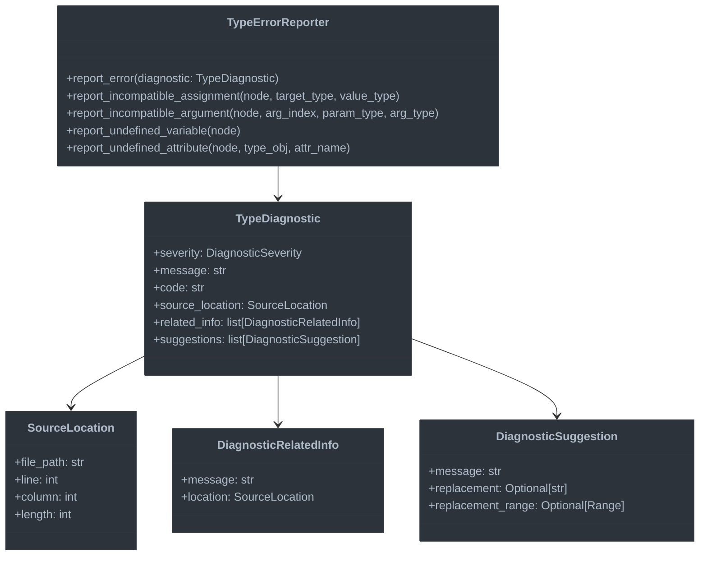

# Error Reporting System

This document outlines the Error Reporting System, which provides detailed diagnostic information for type-related issues.

## Overview

The Error Reporting System converts type inconsistencies into actionable error messages with:
- Precise location information
- Clear descriptions of the problem
- Suggestions for fixing the issue

## Architecture



## Key Components

### 1. Type Diagnostic Model

```python
class DiagnosticSeverity(Enum):
    """Severity levels for diagnostics."""
    ERROR = "error"
    WARNING = "warning"
    INFORMATION = "information"
    HINT = "hint"

class SourceLocation:
    """Location in source code."""
    def __init__(self, file_path: str, line: int, column: int, length: int = 1):
        self.file_path = file_path
        self.line = line  # 1-based line number
        self.column = column  # 1-based column number
        self.length = length

    @classmethod
    def from_node(cls, node: uni.UniNode) -> "SourceLocation":
        """Create a source location from a node."""
        return cls(
            file_path=node.loc.mod_path,
            line=node.loc.first_line,
            column=node.loc.col_start,
            length=node.loc.col_end - node.loc.col_start if node.loc.col_end > 0 else 1
        )

class DiagnosticRelatedInfo:
    """Additional information related to a diagnostic."""
    def __init__(self, message: str, location: SourceLocation):
        self.message = message
        self.location = location

class DiagnosticSuggestion:
    """Suggestion for fixing an issue."""
    def __init__(
        self,
        message: str,
        replacement: Optional[str] = None,
        replacement_range: Optional[tuple[SourceLocation, SourceLocation]] = None
    ):
        self.message = message
        self.replacement = replacement
        self.replacement_range = replacement_range

class TypeDiagnostic:
    """A diagnostic for a type-related issue."""
    def __init__(
        self,
        severity: DiagnosticSeverity,
        message: str,
        code: str,
        source_location: SourceLocation,
        related_info: Optional[list[DiagnosticRelatedInfo]] = None,
        suggestions: Optional[list[DiagnosticSuggestion]] = None
    ):
        self.severity = severity
        self.message = message
        self.code = code
        self.source_location = source_location
        self.related_info = related_info or []
        self.suggestions = suggestions or []
```

### 2. Type Error Reporter

```python
class TypeErrorReporter:
    """Reports type errors with contextual information."""

    def __init__(self, pass_context: UniPass):
        self.pass_context = pass_context
        self.error_count = 0
        self.warning_count = 0

    def report_error(self, diagnostic: TypeDiagnostic) -> None:
        """Report a diagnostic error."""
        if diagnostic.severity == DiagnosticSeverity.ERROR:
            self.error_count += 1
            self.pass_context.log_error(
                f"{diagnostic.message} ({diagnostic.code})",
                line=diagnostic.source_location.line,
                col=diagnostic.source_location.column,
                file_path=diagnostic.source_location.file_path
            )
        else:
            self.warning_count += 1
            self.pass_context.log_warning(
                f"{diagnostic.message} ({diagnostic.code})",
                line=diagnostic.source_location.line,
                col=diagnostic.source_location.column,
                file_path=diagnostic.source_location.file_path
            )

    def report_incompatible_assignment(
        self,
        node: uni.Assignment,
        target_type: Type,
        value_type: Type
    ) -> None:
        """Report an incompatible assignment."""
        self.report_error(TypeDiagnostic(
            severity=DiagnosticSeverity.ERROR,
            message=f"Cannot assign value of type '{value_type.name}' to variable of type '{target_type.name}'",
            code="E1001",
            source_location=SourceLocation.from_node(node),
            related_info=self._get_assignment_info(node, target_type, value_type),
            suggestions=self._get_assignment_suggestions(node, target_type, value_type)
        ))

    def _get_assignment_info(
        self,
        node: uni.Assignment,
        target_type: Type,
        value_type: Type
    ) -> list[DiagnosticRelatedInfo]:
        """Get related information for an assignment error."""
        info = []

        # Add info about the target variable declaration if available
        if hasattr(node.target.items[0], "sym") and node.target.items[0].sym:
            sym = node.target.items[0].sym
            if hasattr(sym.decl, "loc"):
                info.append(DiagnosticRelatedInfo(
                    message=f"Variable '{sym.sym_name}' declared here with type '{target_type.name}'",
                    location=SourceLocation.from_node(sym.decl)
                ))

        return info

    def _get_assignment_suggestions(
        self,
        node: uni.Assignment,
        target_type: Type,
        value_type: Type
    ) -> list[DiagnosticSuggestion]:
        """Get suggestions for fixing an assignment error."""
        suggestions = []

        # If a cast might help
        if is_numeric_type(target_type) and is_numeric_type(value_type):
            suggestions.append(DiagnosticSuggestion(
                message=f"Consider using an explicit cast to '{target_type.name}'",
                replacement=f"{target_type.name}({node.value.unparse()})",
                replacement_range=(
                    SourceLocation.from_node(node.value),
                    SourceLocation.from_node(node.value)
                )
            ))

        return suggestions
```

### 3. Common Error Types

The system handles many types of errors, including:

```python
def report_undefined_variable(self, node: uni.Name) -> None:
    """Report an undefined variable."""
    self.report_error(TypeDiagnostic(
        severity=DiagnosticSeverity.ERROR,
        message=f"Name '{node.value}' is not defined",
        code="E1002",
        source_location=SourceLocation.from_node(node),
        suggestions=self._get_undefined_var_suggestions(node)
    ))

def report_incompatible_argument(
    self,
    node: uni.FuncCall,
    arg_index: int,
    param_type: Type,
    arg_type: Type
) -> None:
    """Report an incompatible function argument."""
    arg_node = node.params.items[arg_index]
    self.report_error(TypeDiagnostic(
        severity=DiagnosticSeverity.ERROR,
        message=f"Argument {arg_index + 1} has type '{arg_type.name}', but function expects '{param_type.name}'",
        code="E1003",
        source_location=SourceLocation.from_node(arg_node)
    ))

def report_undefined_attribute(
    self,
    node: uni.AtomTrailer,
    type_obj: Type,
    attr_name: str
) -> None:
    """Report an undefined attribute access."""
    self.report_error(TypeDiagnostic(
        severity=DiagnosticSeverity.ERROR,
        message=f"Type '{type_obj.name}' has no attribute '{attr_name}'",
        code="E1004",
        source_location=SourceLocation.from_node(node.right),
        suggestions=self._get_attribute_suggestions(node, type_obj, attr_name)
    ))
```

## Error Code System

The error reporting uses a consistent code system for categorization:

| Code Range | Category |
|------------|----------|
| E1000-E1099 | Type compatibility errors |
| E1100-E1199 | Symbol resolution errors |
| E1200-E1299 | Generic type errors |
| E1300-E1399 | Jac-specific type errors |
| W1000-W1099 | Type compatibility warnings |

## Error Message Formatting

Error messages follow consistent templates:

- **Assignment errors**: "Cannot assign value of type 'X' to variable of type 'Y'"
- **Function call errors**: "Argument N has type 'X', but function expects 'Y'"
- **Type errors with suggestion**: "Type 'X' has no method 'foo'. Did you mean 'bar'?"

## Integration into Compiler Pipeline

The error reporter is integrated into the type checking pass:

```python
class TypeCheckPass(UniPass):
    """Pass to check type compatibility and report errors."""

    def before_pass(self) -> None:
        """Initialize the pass."""
        # ... other initialization ...
        self.error_reporter = TypeErrorReporter(self)

    def check_assignment(self, node: uni.Assignment) -> None:
        """Check type compatibility in assignment."""
        # ... type compatibility check ...
        if not is_subtype(value_type, target_type):
            self.error_reporter.report_incompatible_assignment(
                node, target_type, value_type
            )
```

## Next Steps

The error reporting system provides actionable feedback to users. The next document will cover Special Features, focusing on Jac-specific language constructs.