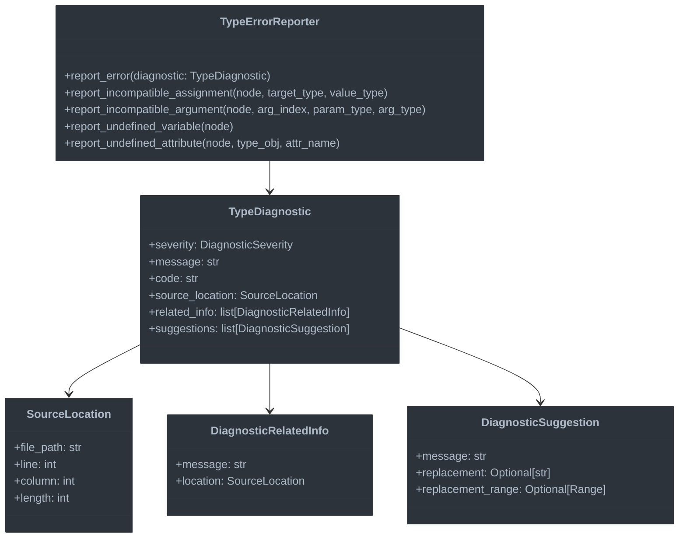

# Error Reporting System

This document outlines the Error Reporting System, which provides detailed diagnostic information for type-related issues.

## Overview

The Error Reporting System converts type inconsistencies into actionable error messages with:
- Precise location information
- Clear descriptions of the problem
- Suggestions for fixing the issue

## Principles of Effective Error Reporting

Error reporting is a crucial but often underappreciated component of type system design. Well-designed error messages can dramatically improve the developer experience and accelerate the learning curve for a new language.

### The Purpose of Type Error Messages

Type error messages serve multiple important purposes:

1. **Identifying Problems**: Alerting developers to potential issues in their code
2. **Educational Tool**: Teaching users about the language's type system rules
3. **Debugging Aid**: Helping to trace the source of complex type mismatches
4. **Documentation**: Implicitly documenting expected types and behaviors
5. **User Experience**: Shaping the developer's perception of the language and its type system

A compiler with poor error messages can make even a well-designed language frustrating to use, while excellent error reporting can compensate for some shortcomings in language design.

### Principles of User-Friendly Error Messages

Creating helpful error messages requires following several key principles:

#### 1. Clarity and Precision

Error messages should:
- Use clear, direct language
- Identify the exact problem without technical jargon
- Specify the exact location of the error
- Avoid overwhelming users with excessive information

Bad: "Type mismatch at line 42"
Good: "Cannot assign value of type 'string' to variable 'count' of type 'number' at line 42:10"

#### 2. Context and Related Information

Effective error reporting provides relevant context:
- Show the source code where the error occurred
- Highlight the specific problematic expression or statement
- Link to related locations (e.g., where a variable was declared)
- Show the types involved in a mismatch

For example, in an incompatible assignment, showing both the variable declaration and the assignment location helps users understand the error.

#### 3. Actionable Suggestions

Whenever possible, error messages should include suggestions for fixing the issue:
- Provide concrete code examples of possible fixes
- Suggest common solutions to the specific error
- Offer "Did you mean?" suggestions for likely typos or similar names
- Include automatic fix actions when integrated with an IDE

#### 4. Consistency and Categorization

A systematic approach to error design includes:
- Consistent message structure across similar errors
- Unique error codes for programmatic handling
- Categorization of errors by type and severity
- Progressive disclosure of more detailed information when needed

### Common Challenges in Type Error Reporting

Type error reporting faces several inherent challenges:

#### 1. Error Cascading

A single type error can cause many downstream errors, overwhelming the user with messages.

Solution: Use error recovery strategies to continue type checking, but prioritize and filter errors to show the most likely root causes first.

#### 2. Abstraction Leakage

Error messages can expose complex internal type system details that confuse users.

Solution: Present errors in terms of the user's code and mental model, hiding unnecessary implementation details.

#### 3. Generic Types and Inference

Error messages for generics and inferred types can become extremely verbose and complex.

Solution: Use simplification strategies to present the most relevant parts of complex types, with options to see more details.

#### 4. Error Localization

Determining the best location to report an error (where the user should make changes) is often ambiguous.

Solution: Heuristics to identify the most actionable location, with related information showing the error's propagation path.

## Architecture



## Key Components

### 1. Type Diagnostic Model

```python
class DiagnosticSeverity(Enum):
    """Severity levels for diagnostics."""
    ERROR = "error"
    WARNING = "warning"
    INFORMATION = "information"
    HINT = "hint"

class SourceLocation:
    """Location in source code."""
    def __init__(self, file_path: str, line: int, column: int, length: int = 1):
        self.file_path = file_path
        self.line = line  # 1-based line number
        self.column = column  # 1-based column number
        self.length = length

    @classmethod
    def from_node(cls, node: uni.UniNode) -> "SourceLocation":
        """Create a source location from a node."""
        return cls(
            file_path=node.loc.mod_path,
            line=node.loc.first_line,
            column=node.loc.col_start,
            length=node.loc.col_end - node.loc.col_start if node.loc.col_end > 0 else 1
        )

class DiagnosticRelatedInfo:
    """Additional information related to a diagnostic."""
    def __init__(self, message: str, location: SourceLocation):
        self.message = message
        self.location = location

class DiagnosticSuggestion:
    """Suggestion for fixing an issue."""
    def __init__(
        self,
        message: str,
        replacement: Optional[str] = None,
        replacement_range: Optional[tuple[SourceLocation, SourceLocation]] = None
    ):
        self.message = message
        self.replacement = replacement
        self.replacement_range = replacement_range

class TypeDiagnostic:
    """A diagnostic for a type-related issue."""
    def __init__(
        self,
        severity: DiagnosticSeverity,
        message: str,
        code: str,
        source_location: SourceLocation,
        related_info: Optional[list[DiagnosticRelatedInfo]] = None,
        suggestions: Optional[list[DiagnosticSuggestion]] = None
    ):
        self.severity = severity
        self.message = message
        self.code = code
        self.source_location = source_location
        self.related_info = related_info or []
        self.suggestions = suggestions or []
```

#### Understanding the Diagnostic Model Design

The diagnostic model forms the foundation of our error reporting system, providing a structured representation of type errors that can be rendered in various formats (console, IDE, documentation, etc.). Let's explore the key design decisions and their rationales:

##### Severity Levels: Beyond Binary Error Reporting

Traditional compilers often use binary error/warning classifications, but modern type systems benefit from finer-grained severity levels:

- **ERROR**: Issues that prevent successful compilation or would cause runtime errors
- **WARNING**: Potentially problematic code that will compile but might cause issues
- **INFORMATION**: Non-problematic notes that provide useful context
- **HINT**: Suggestions for improving code quality or performance

This granularity allows:
1. More nuanced communication with developers
2. Configurable filtering based on development phase (e.g., strict in CI, more lenient during development)
3. Progressive introduction of stricter type checks by first adding them as warnings

##### Source Location: Precise Error Positioning

Accurate source location information is crucial for effective error reporting:

- **File Path**: Essential for multi-file projects
- **Line and Column**: Identifies the precise position (using 1-based indexing to match editor conventions)
- **Length**: Enables highlighting the exact span of problematic code

The `from_node` factory method simplifies creating locations from AST nodes, abstracting away the details of how location information is stored in the AST.

##### Related Information: Connecting the Dots

Type errors often involve multiple parts of the code that need to be understood together:

- A variable assignment might relate to the variable's declaration
- A function call argument might be incompatible with the function's definition
- A type mismatch might occur because of a constraint defined elsewhere

The `DiagnosticRelatedInfo` class connects these related locations, creating a complete picture of the issue. This helps developers understand errors in complex codebases where relevant information may be spread across multiple files.

##### Diagnostic Suggestions: Beyond Error Reporting to Error Solving

The most user-friendly error systems don't just report problems—they help solve them:

- **Message**: Explains the suggested fix in human terms
- **Replacement**: Provides the actual code that would fix the issue
- **Replacement Range**: Specifies exactly what code should be replaced

This enables:
1. One-click fixes in IDE integrations
2. Automated fixing of simple issues via command-line tools
3. Clear guidance even in non-IDE environments

##### The Complete Diagnostic: Putting It All Together

The `TypeDiagnostic` class combines all these elements into a comprehensive representation of a type error:

- Core information (severity, message, code, location)
- Related information (connections to other relevant code)
- Suggestions (potential fixes)

This structured approach enables:
1. Consistent formatting across different error types
2. Flexible rendering in different environments
3. Programmatic analysis and filtering of errors
4. Integration with external tools like IDEs and linters

### 2. Type Error Reporter

```python
class TypeErrorReporter:
    """Reports type errors with contextual information."""

    def __init__(self, pass_context: UniPass):
        self.pass_context = pass_context
        self.error_count = 0
        self.warning_count = 0

    def report_error(self, diagnostic: TypeDiagnostic) -> None:
        """Report a diagnostic error."""
        if diagnostic.severity == DiagnosticSeverity.ERROR:
            self.error_count += 1
            self.pass_context.log_error(
                f"{diagnostic.message} ({diagnostic.code})",
                line=diagnostic.source_location.line,
                col=diagnostic.source_location.column,
                file_path=diagnostic.source_location.file_path
            )
        else:
            self.warning_count += 1
            self.pass_context.log_warning(
                f"{diagnostic.message} ({diagnostic.code})",
                line=diagnostic.source_location.line,
                col=diagnostic.source_location.column,
                file_path=diagnostic.source_location.file_path
            )

    def report_incompatible_assignment(
        self,
        node: uni.Assignment,
        target_type: Type,
        value_type: Type
    ) -> None:
        """Report an incompatible assignment."""
        self.report_error(TypeDiagnostic(
            severity=DiagnosticSeverity.ERROR,
            message=f"Cannot assign value of type '{value_type.name}' to variable of type '{target_type.name}'",
            code="E1001",
            source_location=SourceLocation.from_node(node),
            related_info=self._get_assignment_info(node, target_type, value_type),
            suggestions=self._get_assignment_suggestions(node, target_type, value_type)
        ))

    def _get_assignment_info(
        self,
        node: uni.Assignment,
        target_type: Type,
        value_type: Type
    ) -> list[DiagnosticRelatedInfo]:
        """Get related information for an assignment error."""
        info = []

        # Add info about the target variable declaration if available
        if hasattr(node.target.items[0], "sym") and node.target.items[0].sym:
            sym = node.target.items[0].sym
            if hasattr(sym.decl, "loc"):
                info.append(DiagnosticRelatedInfo(
                    message=f"Variable '{sym.sym_name}' declared here with type '{target_type.name}'",
                    location=SourceLocation.from_node(sym.decl)
                ))

        return info

    def _get_assignment_suggestions(
        self,
        node: uni.Assignment,
        target_type: Type,
        value_type: Type
    ) -> list[DiagnosticSuggestion]:
        """Get suggestions for fixing an assignment error."""
        suggestions = []

        # If a cast might help
        if is_numeric_type(target_type) and is_numeric_type(value_type):
            suggestions.append(DiagnosticSuggestion(
                message=f"Consider using an explicit cast to '{target_type.name}'",
                replacement=f"{target_type.name}({node.value.unparse()})",
                replacement_range=(
                    SourceLocation.from_node(node.value),
                    SourceLocation.from_node(node.value)
                )
            ))

        return suggestions
```

#### The Role of the Error Reporter

The `TypeErrorReporter` serves as the bridge between the type checking logic and the error reporting system. It transforms abstract type inconsistencies into concrete, actionable diagnostics.

##### Separation of Concerns in Error Reporting

This design follows a key principle: separate the detection of errors from their reporting:

1. **Type Checker**: Responsible for detecting type inconsistencies
2. **Error Reporter**: Responsible for creating informative diagnostics
3. **Compiler Infrastructure**: Responsible for displaying/logging the errors

This separation provides several advantages:
- The type checker remains focused on type rules rather than error formatting
- Error reporting can be consistently implemented across different error types
- The reporting format can be changed without modifying the type checker

##### Specialized Error Reporting Methods

Rather than generic error reporting, the reporter provides specialized methods for common error types:

- `report_incompatible_assignment`: For type mismatches in assignments
- `report_incompatible_argument`: For function call argument type mismatches
- `report_undefined_variable`: For references to undeclared variables
- `report_undefined_attribute`: For accessing non-existent properties

This approach:
1. Ensures consistent formatting for similar errors
2. Encapsulates the logic for generating related information and suggestions
3. Makes the type checker code cleaner and more readable
4. Centralizes error reporting improvements

##### Context-Aware Error Enhancement

The error reporter doesn't just report the immediate error; it enhances errors with valuable context:

1. **Related Information**: The `_get_assignment_info` method finds the variable declaration to help developers understand the type constraint.

2. **Smart Suggestions**: The `_get_assignment_suggestions` method analyzes the types involved and suggests fixes like explicit casts when appropriate.

This context-awareness is powerful because:
- It uses information from the symbol table and type system
- It adapts suggestions based on the specific types involved
- It provides concrete code examples rather than vague guidance

##### Error Tracking and Statistics

The reporter tracks error and warning counts, which serves multiple purposes:

- Determining if compilation should continue or abort
- Generating summary statistics for complex codebases
- Enabling error limiting to prevent overwhelming output
- Supporting error-free compilation requirements in CI/CD pipelines

### 3. Common Error Types

The system handles many types of errors, including:

```python
def report_undefined_variable(self, node: uni.Name) -> None:
    """Report an undefined variable."""
    self.report_error(TypeDiagnostic(
        severity=DiagnosticSeverity.ERROR,
        message=f"Name '{node.value}' is not defined",
        code="E1002",
        source_location=SourceLocation.from_node(node),
        suggestions=self._get_undefined_var_suggestions(node)
    ))

def report_incompatible_argument(
    self,
    node: uni.FuncCall,
    arg_index: int,
    param_type: Type,
    arg_type: Type
) -> None:
    """Report an incompatible function argument."""
    arg_node = node.params.items[arg_index]
    self.report_error(TypeDiagnostic(
        severity=DiagnosticSeverity.ERROR,
        message=f"Argument {arg_index + 1} has type '{arg_type.name}', but function expects '{param_type.name}'",
        code="E1003",
        source_location=SourceLocation.from_node(arg_node)
    ))

def report_undefined_attribute(
    self,
    node: uni.AtomTrailer,
    type_obj: Type,
    attr_name: str
) -> None:
    """Report an undefined attribute access."""
    self.report_error(TypeDiagnostic(
        severity=DiagnosticSeverity.ERROR,
        message=f"Type '{type_obj.name}' has no attribute '{attr_name}'",
        code="E1004",
        source_location=SourceLocation.from_node(node.right),
        suggestions=self._get_attribute_suggestions(node, type_obj, attr_name)
    ))
```

#### Taxonomy of Type Errors

Understanding the different categories of type errors helps in designing a comprehensive error reporting system. Let's explore the key categories:

##### 1. Symbol Resolution Errors

These errors occur when the code references identifiers that don't exist in the current scope:

- **Undefined Variables**: References to variables that haven't been declared
- **Undefined Attributes**: Accessing properties that don't exist on a type
- **Undefined Types**: Using type names that aren't defined
- **Import Errors**: References to modules that don't exist or can't be imported

These errors often indicate typos, missing imports, or scope issues. The error reporter can enhance these errors by:
- Suggesting similar names that might have been intended
- Checking if the symbol exists in another scope
- Suggesting imports if the name exists in a known but unimported module

##### 2. Type Compatibility Errors

These occur when values are used in contexts where their types are incompatible:

- **Assignment Type Mismatches**: Assigning incompatible values to variables
- **Function Argument Mismatches**: Passing arguments that don't match parameter types
- **Return Type Mismatches**: Returning values incompatible with the function's return type
- **Operation Type Errors**: Using operators with incompatible operand types

These errors are often more complex because they involve understanding type relationships. Helpful error reporting should:
- Clearly show both the expected and actual types
- Explain why the types are incompatible (e.g., missing properties, wrong primitive type)
- Suggest potential fixes (casts, conversions, alternative functions)

##### 3. Generic and Parametric Type Errors

These involve issues with generic types and type parameters:

- **Type Argument Errors**: Incorrect number or kind of type arguments
- **Constraint Violations**: Type arguments that don't satisfy constraints
- **Inference Failures**: Cases where type inference can't determine type arguments

These are among the hardest errors to report clearly because they involve complex type relationships. Good error reporting should:
- Simplify complex generic types to make them more readable
- Clearly indicate which constraint was violated and why
- Show how the compiler attempted to infer types and where it failed

##### 4. Special Language Feature Errors

These are specific to particular language features:

- **Null Safety Errors**: Using potentially null values without checks
- **Pattern Matching Errors**: Non-exhaustive pattern matches
- **Modifier Conflicts**: Incompatible type modifiers or annotations

For these specialized errors, the error reporting should:
- Explain the language feature when it might be unfamiliar
- Provide examples of correct usage
- Suggest specific fixes for the particular feature

## Error Code System

The error reporting uses a consistent code system for categorization:

| Code Range | Category |
|------------|----------|
| E1000-E1099 | Type compatibility errors |
| E1100-E1199 | Symbol resolution errors |
| E1200-E1299 | Generic type errors |
| E1300-E1399 | Jac-specific type errors |
| W1000-W1099 | Type compatibility warnings |

### Design and Benefits of Error Codes

Error codes serve multiple important purposes beyond simple categorization:

#### 1. Systematic Organization

A well-designed error code system organizes errors in a logical way:

- **Hierarchical Structure**: The first digit indicates the major category (E1xxx for type errors)
- **Subcategories**: The second digit indicates the specific category within types
- **Specific Errors**: The last two digits identify the specific error

This structure makes it easier to:
- Understand the general area of the problem from just the code
- Organize documentation and knowledge bases around error codes
- Track error patterns across a codebase

#### 2. Documentation and Searchability

Error codes serve as unique identifiers that facilitate:

- **Documentation Lookup**: Users can find detailed explanations by searching for the exact code
- **Knowledge Base Integration**: Error codes can link to specific sections in documentation
- **Community Support**: Users can more precisely describe their issues in forums and bug reports

For example, a user encountering "E1003" can search directly for this code in documentation or online resources.

#### 3. Stability and Versioning

Error codes provide stability even as error messages evolve:

- **Message Improvement**: The human-readable message can be improved over time while maintaining the same code
- **Translations**: Error messages can be translated while keeping the same error code
- **Backwards Compatibility**: Tools that depend on specific error codes continue to work even as messages change

#### 4. Programmatic Processing

Error codes enable automated handling of errors:

- **IDE Integration**: IDEs can map error codes to quick-fixes
- **Error Suppression**: Specific errors can be suppressed by code (e.g., `@suppress("E1003")`)
- **CI/CD Filtering**: Build systems can be configured to treat certain error codes as warnings
- **Analytics**: Error frequencies can be tracked to prioritize compiler improvements

### Error Code Design Best Practices

When designing an error code system:

1. **Reserve Ranges**: Allow space for expansion within categories
2. **Keep Consistent**: Ensure similar errors have similar codes
3. **Make Memorable**: Where possible, make codes somewhat meaningful (e.g., E1004 for attribute errors, where "4" could be associated with "attributes")
4. **Document Thoroughly**: Maintain a complete registry of all error codes with examples
5. **Stay Stable**: Once published, avoid changing the meaning of an error code

## Error Message Formatting

Error messages follow consistent templates:

- **Assignment errors**: "Cannot assign value of type 'X' to variable of type 'Y'"
- **Function call errors**: "Argument N has type 'X', but function expects 'Y'"
- **Type errors with suggestion**: "Type 'X' has no method 'foo'. Did you mean 'bar'?"

### Crafting Effective Error Messages

Creating consistent, helpful error messages is both an art and a science. Here are principles and patterns for effective message design:

#### 1. Message Structure Templates

Consistent message structures help users quickly understand errors:

```
[Error Category]: [Specific Issue] at [Location]
```

For example:
- "Type Error: Cannot convert 'string' to 'number' at line.ts:42:10"
- "Name Error: Variable 'counter' is not defined at counter.ts:15:3"

Within each error category, specialized templates provide more precise information:

- **Assignment**: "Cannot assign [value_type] to [target_type]"
- **Function Calls**: "Argument [position] ([arg_type]) is not assignable to parameter [param_name] ([param_type])"
- **Property Access**: "[base_type] has no property [property_name]"

#### 2. Contextual Enhancement

Error messages should adapt based on the context:

- **For Novice-Friendly Errors**: Include additional explanations
  - "Cannot assign string to number (strings and numbers cannot be used interchangeably)"

- **For Common Mistakes**: Provide specific guidance
  - "Object is possibly undefined. Did you forget to check with 'if (obj !== null)' first?"

- **For Complex Types**: Simplify when possible
  - Present "Promise<Array<{name: string, age: number}>>" as "Promise<Array<User>>" when User is the relevant type

#### 3. Message Wording Guidelines

Effective error messages follow these wording guidelines:

- **Be Direct**: Start with the problem ("Cannot assign..." rather than "There is a problem with...")
- **Be Specific**: Use precise type names and details ("'string'" rather than "invalid type")
- **Be Objective**: Describe the issue, not the user's mistake ("Types are incompatible" rather than "You used the wrong type")
- **Be Constructive**: Focus on what needs to be fixed rather than what went wrong
- **Be Concise**: Keep messages as short as possible while maintaining clarity

#### 4. Visual Formatting

When rendered in console or IDE environments, error messages benefit from visual formatting:

- **Error Code Highlighting**: Make the error code visually distinct (e.g., colored or bolded)
- **Type Highlighting**: Highlight the incompatible types in different colors
- **Code Context**: Show the relevant line of code with the problematic part underlined
- **Multi-line Formatting**: Use indentation and line breaks for complex errors
- **Severity Indicators**: Use different colors or symbols for errors vs. warnings

## Integration into Compiler Pipeline

The error reporter is integrated into the type checking pass:

```python
class TypeCheckPass(UniPass):
    """Pass to check type compatibility and report errors."""

    def before_pass(self) -> None:
        """Initialize the pass."""
        # ... other initialization ...
        self.error_reporter = TypeErrorReporter(self)

    def check_assignment(self, node: uni.Assignment) -> None:
        """Check type compatibility in assignment."""
        # ... type compatibility check ...
        if not is_subtype(value_type, target_type):
            self.error_reporter.report_incompatible_assignment(
                node, target_type, value_type
            )
```

### Error Reporting Integration Patterns

Integrating error reporting into a compiler pipeline requires careful design. Here are key patterns and considerations:

#### 1. Error Collection vs. Immediate Reporting

There are two main approaches to error handling in a compiler:

- **Immediate Reporting**: Report errors as soon as they're encountered
  - Advantages: Simpler implementation, immediate feedback
  - Disadvantages: May lead to cascading errors, harder to prioritize or filter

- **Error Collection**: Gather all errors first, then report them later
  - Advantages: Can prioritize errors, filter duplicates, limit cascades
  - Disadvantages: More complex, requires storing error information

Our implementation uses a hybrid approach: errors are reported through the error reporter, which can implement filtering and prioritization strategies.

#### 2. Error Limits and Cascades

To prevent overwhelming users with errors:

- **Implement Error Limits**: Stop reporting after a certain number of errors (e.g., 20)
- **Detect Error Cascades**: Identify when multiple errors are likely caused by the same root issue
- **Skip Subsequent Checks**: After a critical error, skip certain subsequent checks that would be affected

For example, after reporting an undefined variable, skip type checking for expressions using that variable.

#### 3. Incremental Reporting for IDEs

For IDE integration, error reporting should support incremental operation:

- **Efficient Updates**: Only recompute errors for changed files
- **Persistent Error State**: Maintain error state between compilations
- **Event-Based Notification**: Notify listeners when errors change
- **Cancellation Support**: Allow cancelling error reporting when new changes occur

#### 4. Global Error State

The compiler needs to track global error state:

- **Error Count Tracking**: Keep track of error and warning counts
- **Compilation Success**: Determine if compilation should succeed despite warnings
- **Exit Codes**: Set appropriate exit codes for command-line usage
- **Summary Statistics**: Provide summary information about error distribution

## Advanced Error Reporting Features

### 1. Machine-Readable Output

For integration with CI/CD systems and other tools, the error reporting system should support machine-readable output formats:

```python
def export_diagnostics_as_json(diagnostics: list[TypeDiagnostic]) -> str:
    """Export diagnostics as JSON for machine consumption."""
    return json.dumps([
        {
            "severity": d.severity.value,
            "message": d.message,
            "code": d.code,
            "location": {
                "file": d.source_location.file_path,
                "line": d.source_location.line,
                "column": d.source_location.column,
                "length": d.source_location.length
            },
            "relatedInformation": [
                {
                    "message": ri.message,
                    "location": {
                        "file": ri.location.file_path,
                        "line": ri.location.line,
                        "column": ri.location.column
                    }
                } for ri in d.related_info
            ],
            "suggestions": [
                {
                    "message": s.message,
                    "replacement": s.replacement,
                    "replacementRange": s.replacement_range
                } for s in d.suggestions
            ]
        } for d in diagnostics
    ])
```

This enables:
- Integration with build systems and error tracking tools
- Custom rendering in various environments
- Automated error analysis

### 2. Error Explanation System

For complex errors, provide an explanation system that offers more details:

```python
def get_detailed_explanation(error_code: str) -> str:
    """Get a detailed explanation for an error code."""
    explanations = {
        "E1001": """
        # Type Incompatibility in Assignment

        This error occurs when you try to assign a value to a variable of an incompatible type.

        ## Example

        ```
        let x: number = "hello";  // Error: Cannot assign string to number
        ```

        ## Common Causes

        1. Mistakenly using a string where a number is expected
        2. Forgetting to convert types before assignment
        3. Incorrect type annotations

        ## How to Fix

        - Ensure the value matches the variable's type
        - Use explicit conversion if appropriate: `Number(value)`
        - Check if the type annotation is correct
        """
    }
    return explanations.get(error_code, "No detailed explanation available.")
```

This supports:
- In-IDE expandable error details
- Comprehensive documentation for each error
- Educational content for language learners

### 3. Error Suppression System

Allow developers to suppress specific errors when necessary:

```python
def is_error_suppressed(node: uni.UniNode, error_code: str) -> bool:
    """Check if a specific error is suppressed for this node."""
    # Check for suppression comments or annotations
    if hasattr(node, "comments"):
        for comment in node.comments:
            if f"@suppress({error_code})" in comment.value:
                return True

    # Check for file-level suppressions
    if hasattr(node, "loc") and node.loc.mod_path in global_suppressions:
        if error_code in global_suppressions[node.loc.mod_path]:
            return True

    return False
```

This enables:
- Handling of exceptional cases where errors are unavoidable
- Gradual adoption of stricter type checking
- Working around limitations in the type system

## Conclusion: Building a User-Centered Error Reporting System

An effective error reporting system is one of the most important yet often underappreciated aspects of programming language design. It serves as the primary interface between the type system and the developer, translating complex type theory into actionable guidance.

### The Impact of Quality Error Reporting

The quality of error reporting can dramatically affect:

1. **Learning Curve**: Well-designed errors accelerate language learning by explaining concepts
2. **Development Speed**: Actionable errors reduce time spent debugging type issues
3. **User Satisfaction**: Clear error messages improve the perceived quality of the language
4. **Adoption Rate**: Languages with helpful errors face fewer barriers to adoption

Research has shown that frustration with error messages is one of the top reasons developers abandon new languages or tools.

### Key Elements of Our Approach

Our error reporting system design emphasizes:

1. **Structured Diagnostics**: A comprehensive model that captures all aspects of an error
2. **Contextual Information**: Relating errors to their causes across the codebase
3. **Actionable Suggestions**: Providing concrete fixes rather than just identifying problems
4. **Consistent Formatting**: Using templates and patterns for predictable error messages
5. **Systematic Error Codes**: Organizing errors into categories with unique identifiers
6. **Flexible Integration**: Supporting various output formats and environments
7. **Educational Content**: Including explanatory information to help users learn

### Future Directions

As the type checker evolves, the error reporting system can be enhanced in several ways:

1. **Machine Learning Improvements**: Using ML to suggest more accurate fixes based on common patterns
2. **Interactive Errors**: Creating interactive error exploration in IDE environments
3. **Personalized Reporting**: Adapting error verbosity based on user experience level
4. **Error Analytics**: Gathering anonymized data on common errors to improve the language
5. **Collaborative Fixing**: Enabling sharing and community contributions to error explanations

### Building Your Own Error Reporting System

When designing an error reporting system for your own language or tool:

1. Start with user research to understand common pain points
2. Design error templates before implementing specific errors
3. Test error messages with real users of varying experience levels
4. Iterate based on feedback, especially from beginners
5. Build a comprehensive catalog of error codes and explanations
6. Remember that clear error messages are a feature, not just a debugging tool

By viewing error reporting as a first-class concern rather than an afterthought, we create a more usable, approachable type system that helps developers rather than hindering them.

## Next Steps

The error reporting system provides actionable feedback to users. The next document will cover [Special Features](05-special-features.md), focusing on Jac-specific language constructs and how they interact with the type system.