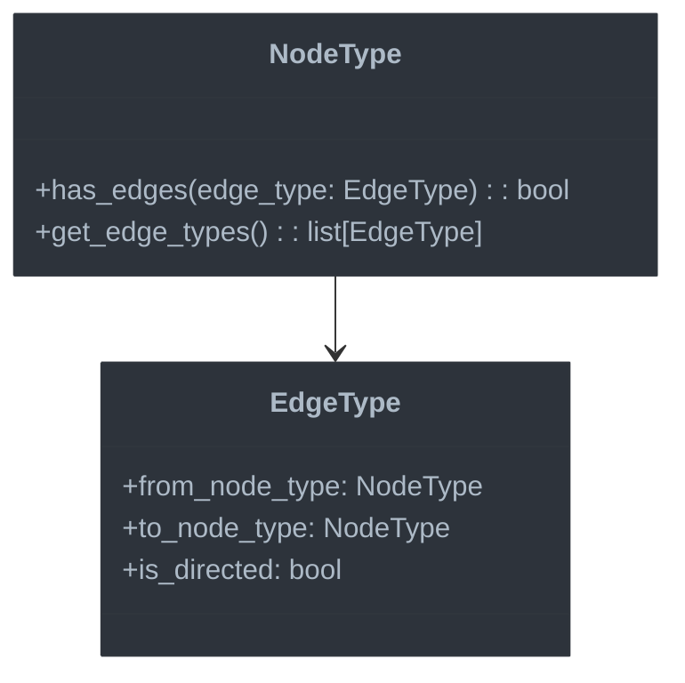

# Special Features

This document covers type checking support for Jac-specific language features that distinguish it from standard Python.

## Overview

Jaclang has several unique language constructs that need specialized type checking support:

1. **Architypes** - Object-oriented node and edge types
2. **Graph traversals** - Node-edge navigation operations
3. **Connection operators** - For manipulating graph connections
4. **Walkers** - Specialized graph traversal objects
5. **Abilities** - Methods with special graph semantics

## Type Checking for Domain-Specific Language Features

When designing a type system for a language with specialized features, the challenge extends beyond standard programming constructs. This section explores the principles and approaches for adding type safety to domain-specific language features.

### Key Considerations for Specialized Type Checking

#### 1. Extending the Type System Core

Adding domain-specific types to a language requires careful integration with the core type system:

- **Type Hierarchy Integration**: New types should fit naturally into the existing type hierarchy
- **Subtyping Relationships**: Define clear relationships between specialized and standard types
- **Type Operations**: Extend type operations (assignment, comparison, etc.) to handle new types
- **Type Compatibility Rules**: Define when specialized types are compatible with each other and standard types

#### 2. Balancing Static and Dynamic Checking

For domain-specific features, finding the right balance between static and dynamic checking is crucial:

- **Static Verification**: Maximize compile-time verification for common errors
- **Dynamic Fallbacks**: Allow dynamic checking for cases that are inherently runtime-dependent
- **Progressive Typing**: Support gradual typing with appropriate default assumptions
- **Extensibility Points**: Provide mechanisms for user-defined type extensions

#### 3. Domain-Specific Type Rules

Each domain requires its own set of type rules that reflect its semantics:

- **Domain Constraints**: Encode domain-specific constraints in the type system
- **Operation Semantics**: Define type behavior for specialized operations
- **Contextual Rules**: Apply different type rules based on usage context
- **Specialized Error Messages**: Provide domain-specific error messages that use appropriate terminology

#### 4. Documentation and Discoverability

Specialized type features need clear documentation and discovery mechanisms:

- **Type Hints and Autocompletion**: Help users understand available types and operations
- **Contextual Documentation**: Provide context-sensitive help for domain-specific errors
- **Examples and Patterns**: Document common patterns and idioms for type-safe usage
- **Migration Paths**: Guide users in adding types to existing untyped domain code

### The Jac Approach: Graph-Oriented Type Checking

For Jaclang, we focus on graph-based programming, which introduces unique type checking challenges:

1. **Graph Structure Types**: Nodes and edges have specialized relationship constraints
2. **Traversal Safety**: Ensuring graph traversals maintain type safety
3. **Connection Verification**: Verifying that only compatible nodes can be connected
4. **Walker Context**: Tracking the current node type during traversals
5. **Ability Specialization**: Handling methods with graph-specific semantics

Let's explore how these specialized features are integrated into the type system.

## Type Checking for Architypes



### Understanding Graph Type Systems

Before diving into the implementation, it's important to understand the type system challenges specific to graph databases:

#### The Graph Data Model

Graph databases represent data as:
- **Nodes**: Entities with properties
- **Edges**: Relationships between nodes, often with their own properties
- **Labels/Types**: Categories that classify nodes and edges
- **Properties**: Attributes attached to nodes and edges

Unlike relational databases with rigid schemas, graphs are often more flexible. However, type checking can provide crucial guarantees about graph structure and operations.

#### Type Challenges in Graph Systems

Graph data introduces several type checking challenges:

1. **Structural Validity**: Ensuring edges connect appropriate node types
2. **Directional Semantics**: Handling directed vs. undirected relationships
3. **Traversal Safety**: Guaranteeing the types of nodes reached through traversals
4. **Property Consistency**: Verifying that required properties exist and have correct types
5. **Query Type Safety**: Inferring result types of graph queries and traversals

#### Type System Approaches for Graphs

Different graph systems take various approaches to typing:

- **Schema-Based**: Define a strict schema upfront (e.g., Neo4j schema constraints)
- **Type Inference**: Infer types from data (e.g., GraphQL type generation)
- **Hybrid Systems**: Combine explicit schemas with inference (our approach)
- **Optional Typing**: Allow gradual addition of type information

For Jaclang, we've chosen a statically typed approach for graph structures, with architypes representing node and edge types.

### Node Types

```python
class NodeType(ClassType):
    """Type representing a node architype."""

    def __init__(self, name: str, module: str = "", bases: list[ClassType] = None, is_abstract: bool = False):
        super().__init__(name, module, bases, is_abstract)
        self.connected_edges: dict[str, EdgeType] = {}

    def add_edge_connection(self, edge_name: str, edge_type: "EdgeType") -> None:
        """Register a connection to an edge type."""
        self.connected_edges[edge_name] = edge_type

    def has_edge(self, edge_name: str) -> bool:
        """Check if this node type can connect to a specific edge type."""
        return edge_name in self.connected_edges

    def get_edge_types(self) -> list["EdgeType"]:
        """Get all edge types this node can connect to."""
        return list(self.connected_edges.values())
```

#### Implementing Node Type Checking

The `NodeType` class extends our core `ClassType` to add graph-specific capabilities. Let's examine the key design considerations:

##### 1. Type Inheritance from Base ClassType

By extending `ClassType`, a `NodeType` inherits all the standard class type functionality:
- Property and method type checking
- Inheritance and polymorphism
- Interface/protocol compliance

This allows node types to be used wherever class types are expected, maintaining compatibility with the broader type system.

##### 2. Edge Connection Tracking

The `connected_edges` dictionary maintains the crucial graph-specific information:

- **Keys**: Edge names (identifiers)
- **Values**: EdgeType instances that describe the allowed connections

This data structure enables:
- Checking if specific edge types can connect to this node
- Validating traversal operations that follow specific edges
- Determining the potential node types reachable from this node

##### 3. Type Safety for Graph Operations

The methods implement common graph type safety checks:

- `add_edge_connection`: Registers allowed edge connections during type building
- `has_edge`: Validates if a specific edge type connection is permitted
- `get_edge_types`: Provides the complete list of allowable connections

##### 4. Implementation Considerations

When implementing your own node type checking, consider:

- **Bidirectional References**: Node types reference edge types and vice versa
- **Lazy Resolution**: You may need to handle forward references when edges refer to nodes not yet defined
- **Inheritance**: Consider how node type inheritance affects allowed edge connections
- **Type Parameters**: For generic node types, determine how type parameters flow to edge connections

### Edge Types

```python
class EdgeType(ClassType):
    """Type representing an edge architype."""

    def __init__(
        self,
        name: str,
        module: str = "",
        bases: list[ClassType] = None,
        is_abstract: bool = False,
        from_node_type: Optional[NodeType] = None,
        to_node_type: Optional[NodeType] = None,
        is_directed: bool = True
    ):
        super().__init__(name, module, bases, is_abstract)
        self.from_node_type = from_node_type
        self.to_node_type = to_node_type
        self.is_directed = is_directed

    def can_connect(self, source: NodeType, target: NodeType) -> bool:
        """Check if this edge can connect the given node types."""
        if not self.from_node_type or not self.to_node_type:
            return True  # Unspecified connection types allow any nodes

        source_ok = is_subtype(source, self.from_node_type)
        target_ok = is_subtype(target, self.to_node_type)

        if self.is_directed:
            return source_ok and target_ok
        else:
            # For undirected edges, either direction works
            return (source_ok and target_ok) or (is_subtype(source, self.to_node_type) and is_subtype(target, self.from_node_type))
```

#### Edge Type Checking Design

Edges represent relationships between nodes and have their own type constraints. Let's explore the implementation details:

##### 1. Core Edge Type Properties

The `EdgeType` class has several properties essential for type checking:

- **from_node_type**: The allowed source node type for this edge
- **to_node_type**: The allowed target node type for this edge
- **is_directed**: Whether the edge has directional semantics

These properties define the structural constraints of the graph by specifying which node types can be connected.

##### 2. Connection Verification

The `can_connect` method is the heart of edge type checking:

1. It first checks if connection types are specified (unspecified types allow any connections)
2. It verifies that the source node is compatible with the expected source type
3. It verifies that the target node is compatible with the expected target type
4. For undirected edges, it also checks the reverse direction

This method enables the type checker to verify that graph connections maintain type safety.

##### 3. Subtyping and Edge Compatibility

Note the use of `is_subtype` to check node compatibility:

```python
source_ok = is_subtype(source, self.from_node_type)
```

This leverages the type system's subtyping rules to enable flexibility:
- A node of a subclass type can be used where a superclass node type is expected
- This allows for polymorphic graph structures while maintaining type safety

##### 4. Handling Undirected Edges

For undirected edges, the implementation includes additional logic:

```python
# For undirected edges, either direction works
return (source_ok and target_ok) or (is_subtype(source, self.to_node_type) and is_subtype(target, self.from_node_type))
```

This reflects the semantic reality that undirected edges can be traversed in either direction, while still maintaining type compatibility.

##### 5. Implementation Challenges and Solutions

When implementing edge type checking, consider these challenges:

- **Circular Type References**: Edges reference nodes which reference edges
- **Type Variance**: Determining whether edge connections should be invariant, covariant, or contravariant
- **Optional Connections**: Handling optional/nullable node connections
- **Edge Inheritance**: Defining how edge subtyping affects connection constraints

A robust implementation addresses these challenges through carefully designed type relationships and verification logic.

## Graph Traversal Type Checking

### Edge Traversal Expressions

```python
def check_edge_ref_trailer(self, node: uni.EdgeRefTrailer, type_scope: TypeChecker) -> Type:
    """Type check an edge reference trailer expression."""
    # Get the type of the source node
    source_type = type_scope.check_expr(node.chain[0])

    if not isinstance(source_type, NodeType):
        type_scope.error_reporter.report_error(
            f"Cannot traverse edges from non-node type '{source_type.name}'",
            node.chain[0]
        )
        return UnknownType()

    # Handle traversal through filter
    if len(node.chain) > 1 and isinstance(node.chain[1], uni.FilterCompr):
        filter_expr = node.chain[1]

        # Check if a specific edge type is requested
        edge_type = None
        if filter_expr.f_type:
            edge_type_name = get_type_name_from_expr(filter_expr.f_type)
            edge_type = type_scope.lookup_type(edge_type_name)

            if not edge_type or not isinstance(edge_type, EdgeType):
                type_scope.error_reporter.report_error(
                    f"Unknown edge type '{edge_type_name}'",
                    filter_expr.f_type
                )
                return UnknownType()

        # If edges only, return a list of edge types
        if node.edges_only:
            if edge_type:
                return ListType(edge_type)
            else:
                # Any edge type
                return ListType(type_scope.lookup_base_type("Edge"))
        else:
            # Return list of connected node types
            if edge_type and isinstance(edge_type, EdgeType):
                if node.chain[0] == source_type:
                    # Outgoing edge
                    return ListType(edge_type.to_node_type or type_scope.lookup_base_type("Node"))
                else:
                    # Incoming edge
                    return ListType(edge_type.from_node_type or type_scope.lookup_base_type("Node"))
            else:
                # No specific edge type, return generic node list
                return ListType(type_scope.lookup_base_type("Node"))

    # Default case - generic node list
    return ListType(type_scope.lookup_base_type("Node"))
```

### Type Checking Graph Traversals: Principles and Challenges

Graph traversals present unique type checking challenges because they involve moving through a potentially complex network of nodes and edges. Let's explore the key type checking concepts for graph traversals:

#### The Type Safety Challenge of Traversals

In a graph database context, traversals must maintain type safety across several dimensions:

1. **Source Type Validation**: Ensuring traversals start from valid node types
2. **Edge Type Constraints**: Verifying that traversed edges exist and are accessible from the source
3. **Target Type Inference**: Determining the types of nodes reached after traversal
4. **Filter Type Checking**: Validating type compatibility in traversal filters and conditions
5. **Result Collection Types**: Inferring the type of collections resulting from traversals

#### Type Inference for Graph Traversals

The `check_edge_ref_trailer` method demonstrates how to infer types for traversal expressions. Let's break down its approach:

##### 1. Source Node Type Verification

The method first verifies that the traversal starts from a valid node:

```python
source_type = type_scope.check_expr(node.chain[0])
if not isinstance(source_type, NodeType):
    type_scope.error_reporter.report_error(
        f"Cannot traverse edges from non-node type '{source_type.name}'",
        node.chain[0]
    )
    return UnknownType()
```

This provides an immediate type safety guarantee: traversals can only begin from node types.

##### 2. Edge Type Resolution and Validation

For filtered traversals, the method checks if a specific edge type is requested:

```python
if filter_expr.f_type:
    edge_type_name = get_type_name_from_expr(filter_expr.f_type)
    edge_type = type_scope.lookup_type(edge_type_name)

    if not edge_type or not isinstance(edge_type, EdgeType):
        type_scope.error_reporter.report_error(
            f"Unknown edge type '{edge_type_name}'",
            filter_expr.f_type
        )
        return UnknownType()
```

This ensures that:
- The specified edge type exists
- It is actually an edge type (not some other type)

##### 3. Traversal Direction and Result Type Inference

The method then determines the result type based on:
- Whether the traversal returns edges or nodes (`edges_only` flag)
- The specific edge type being traversed
- The direction of traversal

```python
if edge_type and isinstance(edge_type, EdgeType):
    if node.chain[0] == source_type:
        # Outgoing edge
        return ListType(edge_type.to_node_type or type_scope.lookup_base_type("Node"))
    else:
        # Incoming edge
        return ListType(edge_type.from_node_type or type_scope.lookup_base_type("Node"))
```

This sophisticated type inference enables precise static typing of traversal results.

##### 4. Fallback Types for Unspecified Traversals

For cases where specific edge types aren't provided, the method falls back to more general types:

```python
# No specific edge type, return generic node list
return ListType(type_scope.lookup_base_type("Node"))
```

This balances static safety with flexibility, allowing dynamic traversals while still providing some type guarantees.

#### Implementation Considerations for Traversal Type Checking

When implementing traversal type checking for your own graph language, consider:

1. **Type Narrowing**: Traverse expressions may allow narrowing down result types based on filters
2. **Path Type Tracking**: For multi-step traversals, you may need to track the entire path type
3. **Recursive Traversal Types**: For recursive traversals, consider using fixed-point type computation
4. **Type Variables**: For generic traversal patterns, you might need parametric types
5. **Union Types**: When multiple edge types can be followed, the result might be a union of node types

## Connection Operators

```python
def check_connect_op(self, node: uni.ConnectOp, type_scope: TypeChecker) -> Type:
    """Type check a connect operation."""
    # In a context like: n1 -[EdgeType(...)]->, where n1 is a node

    if not node.conn_type:
        # No specific edge type, use generic Edge
        return type_scope.lookup_base_type("Edge")

    # Get the specified edge type
    edge_type_name = get_type_name_from_expr(node.conn_type)
    edge_type = type_scope.lookup_type(edge_type_name)

    if not edge_type or not isinstance(edge_type, EdgeType):
        type_scope.error_reporter.report_error(
            f"Unknown edge type '{edge_type_name}'",
            node.conn_type
        )
        return type_scope.lookup_base_type("Edge")

    return edge_type

def check_binary_expr_with_connect(self, node: uni.BinaryExpr, type_scope: TypeChecker) -> Type:
    """Type check a binary expression with a connect operator."""
    # Expression like: n1 -[EdgeType(...)]->> n2

    left_type = type_scope.check_expr(node.left)
    right_type = type_scope.check_expr(node.right)

    # Check if both sides are nodes
    if not isinstance(left_type, NodeType):
        type_scope.error_reporter.report_error(
            f"Left side of connection must be a node type, got '{left_type.name}'",
            node.left
        )

    if not isinstance(right_type, NodeType):
        type_scope.error_reporter.report_error(
            f"Right side of connection must be a node type, got '{right_type.name}'",
            node.right
        )

    # Get the edge type from the operator
    if isinstance(node.op, uni.ConnectOp):
        edge_type = self.check_connect_op(node.op, type_scope)

        # Check if this edge type can connect these nodes
        if isinstance(edge_type, EdgeType) and isinstance(left_type, NodeType) and isinstance(right_type, NodeType):
            if not edge_type.can_connect(left_type, right_type):
                type_scope.error_reporter.report_error(
                    f"Edge type '{edge_type.name}' cannot connect from '{left_type.name}' to '{right_type.name}'",
                    node
                )

        return edge_type

    return UnknownType()
```

### Type Safety for Graph Modifications

Graph operations that create or modify connections between nodes require specialized type checking to maintain data integrity. Let's explore the type checking approach for connection operators:

#### Connection Operators and Type Safety

Connection operators pose unique type checking challenges:

1. **Endpoint Type Compatibility**: Both ends of a connection must be compatible node types
2. **Edge Type Validation**: The connecting edge must be a valid edge type
3. **Structural Constraints**: The edge type must allow connecting the specific node types
4. **Direction Semantics**: For directed edges, source and target must be properly ordered

#### Type Checking the Connection Operation

The `check_connect_op` method checks the individual connection operator:

```python
def check_connect_op(self, node: uni.ConnectOp, type_scope: TypeChecker) -> Type:
    # ...
    if not node.conn_type:
        # No specific edge type, use generic Edge
        return type_scope.lookup_base_type("Edge")
    # ...
```

Key aspects of this approach include:

1. **Default Edge Type**: Providing a sensible fallback when no specific edge type is specified
2. **Type Resolution**: Looking up the specified edge type in the type scope
3. **Type Validation**: Ensuring the specified type is actually an edge type
4. **Error Reporting**: Providing a clear error message for unknown edge types

#### Complete Connection Expression Type Checking

The `check_binary_expr_with_connect` method checks the entire connection expression:

```python
def check_binary_expr_with_connect(self, node: uni.BinaryExpr, type_scope: TypeChecker) -> Type:
    # ...
    left_type = type_scope.check_expr(node.left)
    right_type = type_scope.check_expr(node.right)
    # ...
```

This comprehensive check:

1. Verifies both sides of the connection are node types
2. Checks the edge type of the connection operator
3. Validates that the specific edge can connect these node types
4. Returns the edge type as the result type of the expression

#### The Crucial Connection Compatibility Check

The heart of connection type safety is this compatibility check:

```python
if not edge_type.can_connect(left_type, right_type):
    type_scope.error_reporter.report_error(
        f"Edge type '{edge_type.name}' cannot connect from '{left_type.name}' to '{right_type.name}'",
        node
    )
```

This leverages the `can_connect` method from the `EdgeType` class to enforce graph structural constraints:
- It ensures that source nodes can only be connected to allowed target nodes
- It prevents creation of invalid graph structures
- It applies edge-specific connection rules like direction

#### Error Messages for Connection Issues

Notice the specificity of the error message:

```
Edge type 'Friendship' cannot connect from 'Company' to 'Person'
```

This clear, domain-specific error helps developers understand exactly what's wrong with their connection attempt, rather than a generic type mismatch.

#### Design Considerations for Connection Type Checking

When implementing connection operator type checking:

1. **Balance Safety and Flexibility**: Decide whether to allow untyped edge connections
2. **Weight vs. Edge Objects**: Choose how to represent edge properties (as weight values or full objects)
3. **Connection Constraints**: Consider additional constraints beyond simple type compatibility (cardinality, uniqueness)
4. **Inference Opportunities**: Look for opportunities to infer edge types from connected nodes
5. **Modification vs. Creation**: Apply different rules for creating new connections vs. modifying existing ones

## Walker Type Checking

```python
class WalkerType(ClassType):
    """Type representing a walker."""

    def __init__(self, name: str, module: str = "", bases: list[ClassType] = None, is_abstract: bool = False):
        super().__init__(name, module, bases, is_abstract)
        self.current_node_type: Optional[NodeType] = None

    def with_current_node(self, node_type: NodeType) -> "WalkerType":
        """Create a new walker type with the specified current node type."""
        result = WalkerType(self.name, self.module, self.bases, self.is_abstract)
        result.instance_attrs = self.instance_attrs.copy()
        result.class_attrs = self.class_attrs.copy()
        result.current_node_type = node_type
        return result

def check_visit_stmt(self, node: uni.VisitStmt, type_scope: TypeChecker) -> None:
    """Type check a visit statement."""
    # Get the type of the target
    target_type = type_scope.check_expr(node.target)

    # Target should be a node or list of nodes
    if isinstance(target_type, ListType) and isinstance(target_type.element_type, NodeType):
        node_type = target_type.element_type
    elif isinstance(target_type, NodeType):
        node_type = target_type
    else:
        type_scope.error_reporter.report_error(
            f"Visit target must be a node or list of nodes, got '{target_type.name}'",
            node.target
        )
        return

    # Update the current node type in the walker
    walker_type = type_scope.current_type
    if isinstance(walker_type, WalkerType):
        # Create a new walker type with updated current node
        type_scope.with_type(walker_type.with_current_node(node_type))
```

### Advanced Type Checking: Context-Sensitive Types

Walker types introduce a more advanced type checking concept: context-sensitive types. Unlike standard types that remain fixed throughout their scope, walker types change their behavior depending on the current execution context. Let's explore this powerful type checking pattern:

#### Understanding Context-Sensitive Type Systems

Context-sensitive types adapt based on execution state or environment, enabling type checking that accounts for runtime conditions in a static manner. This concept appears in several modern type systems:

- **Flow-sensitive typing**: Types that change based on control flow conditions
- **Dependent types**: Types that depend on values
- **Session types**: Types that change based on the stage of a protocol
- **Location-sensitive types**: Types that incorporate information about where the program is executing

#### Walker Types as Context-Sensitive Types

The `WalkerType` represents an agent that traverses a graph, and its typing context is influenced by its current position in the graph:

```python
class WalkerType(ClassType):
    """Type representing a walker."""
    # ...
    self.current_node_type: Optional[NodeType] = None
```

This `current_node_type` field tracks the walker's position, enabling the type checker to:
1. Verify operations are valid for the walker's current node type
2. Determine which methods and properties are accessible
3. Type check traversals from the current position

#### The Immutable Context Pattern

Notice that our implementation follows an immutable context pattern:

```python
def with_current_node(self, node_type: NodeType) -> "WalkerType":
    """Create a new walker type with the specified current node type."""
    result = WalkerType(self.name, self.module, self.bases, self.is_abstract)
    # Copy attributes
    result.instance_attrs = self.instance_attrs.copy()
    result.class_attrs = self.class_attrs.copy()
    # Set new context
    result.current_node_type = node_type
    return result
```

Instead of modifying the walker type directly, we create a new instance with the updated context. This approach:
1. Prevents unintended side effects from context changes
2. Makes context transitions explicit and traceable
3. Enables easier reasoning about type state at different program points
4. Simplifies handling of branches where different contexts might exist

#### Context Updates in Type Checking

The `check_visit_stmt` method demonstrates how context transitions occur during type checking:

```python
def check_visit_stmt(self, node: uni.VisitStmt, type_scope: TypeChecker) -> None:
    # ...
    # Update the current node type in the walker
    walker_type = type_scope.current_type
    if isinstance(walker_type, WalkerType):
        # Create a new walker type with updated current node
        type_scope.with_type(walker_type.with_current_node(node_type))
```

When a walker visits a new node, the type context is updated to reflect the new position. This enables subsequent type checking to account for the new context.

#### Context-Aware Type Safety

This context-sensitive approach enables several powerful type safety features:

1. **Position-Aware Method Checking**: Methods that require specific node types can be verified
2. **Traversal Validation**: Ensure traversals are possible from the current position
3. **Property Access Safety**: Verify that accessed properties exist on the current node
4. **Action Verification**: Confirm that actions are valid for the current node type

#### Implementing Context-Sensitive Types

When implementing context-sensitive typing for your own language, consider:

1. **Context Representation**: Choose how to represent and store contextual information
2. **Context Transitions**: Define rules for how context changes and when
3. **Context Merging**: Determine how to handle control flow joins (when branches merge)
4. **Context Invariants**: Identify properties that should remain true across context changes
5. **Context Errors**: Design clear error messages for context-specific type violations

## Ability Type Checking

```python
class AbilityType(FunctionType):
    """Type representing an ability (a special method in Jac)."""

    def __init__(
        self,
        name: str,
        param_types: list[Type],
        return_type: Type,
        is_static: bool = False,
        is_async: bool = False,
        min_args: int = 0,
        has_varargs: bool = False,
        has_kwargs: bool = False,
        is_abstract: bool = False,
        is_override: bool = False
    ):
        super().__init__(
            name, param_types, return_type, is_static, is_async,
            min_args, has_varargs, has_kwargs
        )
        self.is_abstract = is_abstract
        self.is_override = is_override

def check_ability(self, node: uni.Ability, type_scope: TypeChecker) -> AbilityType:
    """Type check an ability declaration."""
    # Process parameters
    param_types = []
    min_args = 0
    has_varargs = False
    has_kwargs = False

    if node.signature and isinstance(node.signature, uni.FuncSignature) and node.signature.params:
        for i, param in enumerate(node.signature.params.items):
            # Skip 'self' parameter for instance methods
            if i == 0 and not node.is_static:
                continue

            param_type = UnknownType()
            if param.type_tag:
                param_type_node = param.type_tag.tag
                param_type = type_scope.get_type_from_annotation(param_type_node)

            param_types.append(param_type)

            # Track minimum args (those without defaults)
            if not param.value:
                min_args += 1

            # Check for *args and **kwargs
            if param.unpack and param.unpack.value == "*":
                has_varargs = True
            elif param.unpack and param.unpack.value == "**":
                has_kwargs = True

    # Process return type
    return_type = type_scope.lookup_base_type("None")  # Default is None
    if node.signature and node.signature.return_type:
        return_type = type_scope.get_type_from_annotation(node.signature.return_type)

    # Create the ability type
    ability_type = AbilityType(
        name=node.name_ref.value,
        param_types=param_types,
        return_type=return_type,
        is_static=node.is_static,
        is_async=node.is_async,
        min_args=min_args,
        has_varargs=has_varargs,
        has_kwargs=has_kwargs,
        is_abstract=node.is_abstract,
        is_override=node.is_override
    )

    # Check for abstract vs implementation
    if node.is_abstract and node.body:
        type_scope.error_reporter.report_error(
            "Abstract ability cannot have an implementation",
            node
        )
    elif not node.is_abstract and not node.body and not node.is_override:
        type_scope.error_reporter.report_error(
            "Non-abstract ability must have an implementation",
            node
        )

    # Check override
    if node.is_override:
        # Find method in parent classes
        parent_method = None
        for base in type_scope.current_type.bases:
            if node.name_ref.value in base.get_members():
                member = base.get_members()[node.name_ref.value]
                if member.is_method:
                    parent_method = member.type
                    break

        if not parent_method:
            type_scope.error_reporter.report_error(
                f"Method '{node.name_ref.value}' cannot override - no matching method in parent classes",
                node.name_ref
            )
        elif isinstance(parent_method, AbilityType) or isinstance(parent_method, FunctionType):
            # Check signature compatibility
            if not is_compatible_signature(ability_type, parent_method):
                type_scope.error_reporter.report_error(
                    f"Override for '{node.name_ref.value}' has incompatible signature",
                    node.signature
                )

    return ability_type
```

### Extending Type Checking for Domain-Specific Methods

"Abilities" in Jac are specialized methods with domain-specific semantics related to graph operations. They demonstrate how to extend a general-purpose type system to accommodate domain-specific concepts. Let's explore the key principles of type checking domain-specific methods:

#### Domain-Specific Method Types

The `AbilityType` extends the standard `FunctionType` with additional attributes relevant to the domain:

```python
class AbilityType(FunctionType):
    # ...
    self.is_abstract = is_abstract
    self.is_override = is_override
```

These domain-specific attributes enable:
1. **Abstract Abilities**: Methods that declare behavior without implementation
2. **Override Semantics**: Special rules for overriding abilities in derived types

By extending rather than replacing the function type, we maintain compatibility with the broader type system while adding specialized behavior.

#### Enhanced Type Checking for Domain Methods

The `check_ability` method performs standard function type checking plus domain-specific checks:

```python
# Process parameters
param_types = []
min_args = 0
has_varargs = False
has_kwargs = False

if node.signature and isinstance(node.signature, uni.FuncSignature) and node.signature.params:
    for i, param in enumerate(node.signature.params.items):
        # Skip 'self' parameter for instance methods
        if i == 0 and not node.is_static:
            continue
        # ...
```

Note how domain concepts like skipping the 'self' parameter are integrated into the standard parameter processing.

#### Domain-Specific Constraints

Domain methods often have additional constraints beyond standard methods:

```python
# Check for abstract vs implementation
if node.is_abstract and node.body:
    type_scope.error_reporter.report_error(
        "Abstract ability cannot have an implementation",
        node
    )
```

These domain rules ensure that abilities follow the expected semantics of the domain, such as:
- Abstract abilities cannot have implementations
- Non-abstract abilities must have implementations (unless overriding)

#### Inheritance and Override Checking

Domain-specific methods often have specialized inheritance rules:

```python
# Check override
if node.is_override:
    # Find method in parent classes
    parent_method = None
    for base in type_scope.current_type.bases:
        if node.name_ref.value in base.get_members():
            # ...
```

This advanced override checking:
1. Verifies that an overridden method actually exists in a parent class
2. Ensures the override has a compatible signature
3. Provides domain-specific error messages for override issues

#### Method Signature Compatibility

The compatibility check for method signatures considers domain-specific rules:

```python
if not is_compatible_signature(ability_type, parent_method):
    type_scope.error_reporter.report_error(
        f"Override for '{node.name_ref.value}' has incompatible signature",
        node.signature
    )
```

This might include domain-specific compatibility rules like:
- Covariant return types (allowing more specific returns in overrides)
- Contravariant parameter types (allowing more general parameters in overrides)
- Special handling for domain-specific parameter types

#### Implementing Domain-Specific Method Checking

When extending type checking for your own domain-specific methods:

1. **Identify Domain Constraints**: Determine what special rules apply to your domain methods
2. **Extend Base Types**: Create domain method types that extend standard function types
3. **Add Domain Attributes**: Include domain-specific attributes that affect type checking
4. **Implement Specialized Checks**: Add validation for domain-specific constraints
5. **Enhance Error Messages**: Provide clear, domain-aware error messages
6. **Document Semantics**: Clearly document how domain methods differ from standard ones

## Putting It All Together: Integrated Graph Type Checking

The special features we've examined create an integrated type system for graph programming. By combining:

1. **Graph Structure Types**: Node and edge types with connection constraints
2. **Traversal Type Inference**: Type-safe navigation through the graph
3. **Connection Validation**: Ensuring only valid connections are created
4. **Context-Sensitive Walkers**: Tracking position during traversal
5. **Domain-Specific Abilities**: Methods with graph semantics

We create a comprehensive type checking system that provides safety guarantees for graph operations while maintaining compatibility with standard type checking principles.

This approach demonstrates how to build domain-specific type checking on top of a general-purpose type system, a pattern that can be applied to many specialized programming domains.

## Next Steps

The special features module builds on the core type checking infrastructure to provide Jac-specific functionality. The next document will cover External Integration, which enables the type checker to be used in editors, IDEs, and CI/CD pipelines.