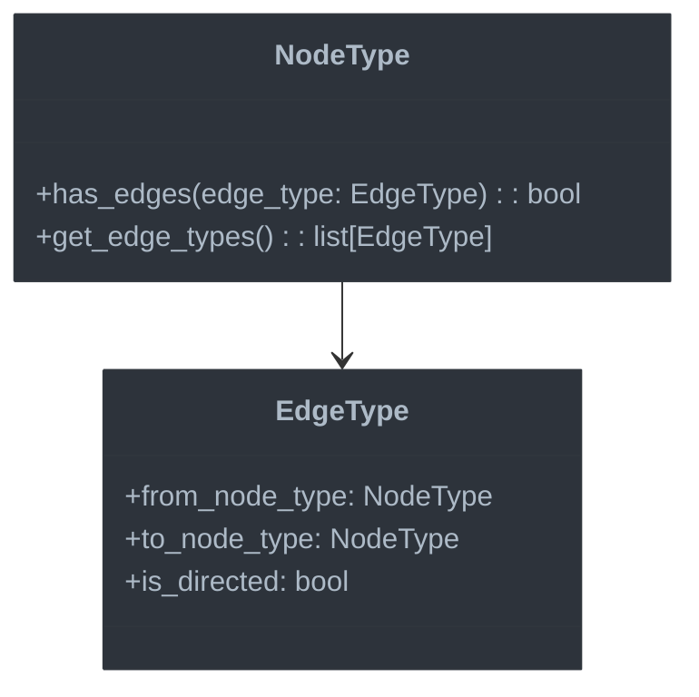

# Special Features

This document covers type checking support for Jac-specific language features that distinguish it from standard Python.

## Overview

Jaclang has several unique language constructs that need specialized type checking support:

1. **Architypes** - Object-oriented node and edge types
2. **Graph traversals** - Node-edge navigation operations
3. **Connection operators** - For manipulating graph connections
4. **Walkers** - Specialized graph traversal objects
5. **Abilities** - Methods with special graph semantics

## Type Checking for Architypes



### Node Types

```python
class NodeType(ClassType):
    """Type representing a node architype."""

    def __init__(self, name: str, module: str = "", bases: list[ClassType] = None, is_abstract: bool = False):
        super().__init__(name, module, bases, is_abstract)
        self.connected_edges: dict[str, EdgeType] = {}

    def add_edge_connection(self, edge_name: str, edge_type: "EdgeType") -> None:
        """Register a connection to an edge type."""
        self.connected_edges[edge_name] = edge_type

    def has_edge(self, edge_name: str) -> bool:
        """Check if this node type can connect to a specific edge type."""
        return edge_name in self.connected_edges

    def get_edge_types(self) -> list["EdgeType"]:
        """Get all edge types this node can connect to."""
        return list(self.connected_edges.values())
```

### Edge Types

```python
class EdgeType(ClassType):
    """Type representing an edge architype."""

    def __init__(
        self,
        name: str,
        module: str = "",
        bases: list[ClassType] = None,
        is_abstract: bool = False,
        from_node_type: Optional[NodeType] = None,
        to_node_type: Optional[NodeType] = None,
        is_directed: bool = True
    ):
        super().__init__(name, module, bases, is_abstract)
        self.from_node_type = from_node_type
        self.to_node_type = to_node_type
        self.is_directed = is_directed

    def can_connect(self, source: NodeType, target: NodeType) -> bool:
        """Check if this edge can connect the given node types."""
        if not self.from_node_type or not self.to_node_type:
            return True  # Unspecified connection types allow any nodes

        source_ok = is_subtype(source, self.from_node_type)
        target_ok = is_subtype(target, self.to_node_type)

        if self.is_directed:
            return source_ok and target_ok
        else:
            # For undirected edges, either direction works
            return (source_ok and target_ok) or (is_subtype(source, self.to_node_type) and is_subtype(target, self.from_node_type))
```

## Graph Traversal Type Checking

### Edge Traversal Expressions

```python
def check_edge_ref_trailer(self, node: uni.EdgeRefTrailer, type_scope: TypeChecker) -> Type:
    """Type check an edge reference trailer expression."""
    # Get the type of the source node
    source_type = type_scope.check_expr(node.chain[0])

    if not isinstance(source_type, NodeType):
        type_scope.error_reporter.report_error(
            f"Cannot traverse edges from non-node type '{source_type.name}'",
            node.chain[0]
        )
        return UnknownType()

    # Handle traversal through filter
    if len(node.chain) > 1 and isinstance(node.chain[1], uni.FilterCompr):
        filter_expr = node.chain[1]

        # Check if a specific edge type is requested
        edge_type = None
        if filter_expr.f_type:
            edge_type_name = get_type_name_from_expr(filter_expr.f_type)
            edge_type = type_scope.lookup_type(edge_type_name)

            if not edge_type or not isinstance(edge_type, EdgeType):
                type_scope.error_reporter.report_error(
                    f"Unknown edge type '{edge_type_name}'",
                    filter_expr.f_type
                )
                return UnknownType()

        # If edges only, return a list of edge types
        if node.edges_only:
            if edge_type:
                return ListType(edge_type)
            else:
                # Any edge type
                return ListType(type_scope.lookup_base_type("Edge"))
        else:
            # Return list of connected node types
            if edge_type and isinstance(edge_type, EdgeType):
                if node.chain[0] == source_type:
                    # Outgoing edge
                    return ListType(edge_type.to_node_type or type_scope.lookup_base_type("Node"))
                else:
                    # Incoming edge
                    return ListType(edge_type.from_node_type or type_scope.lookup_base_type("Node"))
            else:
                # No specific edge type, return generic node list
                return ListType(type_scope.lookup_base_type("Node"))

    # Default case - generic node list
    return ListType(type_scope.lookup_base_type("Node"))
```

## Connection Operators

```python
def check_connect_op(self, node: uni.ConnectOp, type_scope: TypeChecker) -> Type:
    """Type check a connect operation."""
    # In a context like: n1 -[EdgeType(...)]->, where n1 is a node

    if not node.conn_type:
        # No specific edge type, use generic Edge
        return type_scope.lookup_base_type("Edge")

    # Get the specified edge type
    edge_type_name = get_type_name_from_expr(node.conn_type)
    edge_type = type_scope.lookup_type(edge_type_name)

    if not edge_type or not isinstance(edge_type, EdgeType):
        type_scope.error_reporter.report_error(
            f"Unknown edge type '{edge_type_name}'",
            node.conn_type
        )
        return type_scope.lookup_base_type("Edge")

    return edge_type

def check_binary_expr_with_connect(self, node: uni.BinaryExpr, type_scope: TypeChecker) -> Type:
    """Type check a binary expression with a connect operator."""
    # Expression like: n1 -[EdgeType(...)]->> n2

    left_type = type_scope.check_expr(node.left)
    right_type = type_scope.check_expr(node.right)

    # Check if both sides are nodes
    if not isinstance(left_type, NodeType):
        type_scope.error_reporter.report_error(
            f"Left side of connection must be a node type, got '{left_type.name}'",
            node.left
        )

    if not isinstance(right_type, NodeType):
        type_scope.error_reporter.report_error(
            f"Right side of connection must be a node type, got '{right_type.name}'",
            node.right
        )

    # Get the edge type from the operator
    if isinstance(node.op, uni.ConnectOp):
        edge_type = self.check_connect_op(node.op, type_scope)

        # Check if this edge type can connect these nodes
        if isinstance(edge_type, EdgeType) and isinstance(left_type, NodeType) and isinstance(right_type, NodeType):
            if not edge_type.can_connect(left_type, right_type):
                type_scope.error_reporter.report_error(
                    f"Edge type '{edge_type.name}' cannot connect from '{left_type.name}' to '{right_type.name}'",
                    node
                )

        return edge_type

    return UnknownType()
```

## Walker Type Checking

```python
class WalkerType(ClassType):
    """Type representing a walker."""

    def __init__(self, name: str, module: str = "", bases: list[ClassType] = None, is_abstract: bool = False):
        super().__init__(name, module, bases, is_abstract)
        self.current_node_type: Optional[NodeType] = None

    def with_current_node(self, node_type: NodeType) -> "WalkerType":
        """Create a new walker type with the specified current node type."""
        result = WalkerType(self.name, self.module, self.bases, self.is_abstract)
        result.instance_attrs = self.instance_attrs.copy()
        result.class_attrs = self.class_attrs.copy()
        result.current_node_type = node_type
        return result

def check_visit_stmt(self, node: uni.VisitStmt, type_scope: TypeChecker) -> None:
    """Type check a visit statement."""
    # Get the type of the target
    target_type = type_scope.check_expr(node.target)

    # Target should be a node or list of nodes
    if isinstance(target_type, ListType) and isinstance(target_type.element_type, NodeType):
        node_type = target_type.element_type
    elif isinstance(target_type, NodeType):
        node_type = target_type
    else:
        type_scope.error_reporter.report_error(
            f"Visit target must be a node or list of nodes, got '{target_type.name}'",
            node.target
        )
        return

    # Update the current node type in the walker
    walker_type = type_scope.current_type
    if isinstance(walker_type, WalkerType):
        # Create a new walker type with updated current node
        type_scope.with_type(walker_type.with_current_node(node_type))
```

## Ability Type Checking

```python
class AbilityType(FunctionType):
    """Type representing an ability (a special method in Jac)."""

    def __init__(
        self,
        name: str,
        param_types: list[Type],
        return_type: Type,
        is_static: bool = False,
        is_async: bool = False,
        min_args: int = 0,
        has_varargs: bool = False,
        has_kwargs: bool = False,
        is_abstract: bool = False,
        is_override: bool = False
    ):
        super().__init__(
            name, param_types, return_type, is_static, is_async,
            min_args, has_varargs, has_kwargs
        )
        self.is_abstract = is_abstract
        self.is_override = is_override

def check_ability(self, node: uni.Ability, type_scope: TypeChecker) -> AbilityType:
    """Type check an ability declaration."""
    # Process parameters
    param_types = []
    min_args = 0
    has_varargs = False
    has_kwargs = False

    if node.signature and isinstance(node.signature, uni.FuncSignature) and node.signature.params:
        for i, param in enumerate(node.signature.params.items):
            # Skip 'self' parameter for instance methods
            if i == 0 and not node.is_static:
                continue

            param_type = UnknownType()
            if param.type_tag:
                param_type_node = param.type_tag.tag
                param_type = type_scope.get_type_from_annotation(param_type_node)

            param_types.append(param_type)

            # Track minimum args (those without defaults)
            if not param.value:
                min_args += 1

            # Check for *args and **kwargs
            if param.unpack and param.unpack.value == "*":
                has_varargs = True
            elif param.unpack and param.unpack.value == "**":
                has_kwargs = True

    # Process return type
    return_type = type_scope.lookup_base_type("None")  # Default is None
    if node.signature and node.signature.return_type:
        return_type = type_scope.get_type_from_annotation(node.signature.return_type)

    # Create the ability type
    ability_type = AbilityType(
        name=node.name_ref.value,
        param_types=param_types,
        return_type=return_type,
        is_static=node.is_static,
        is_async=node.is_async,
        min_args=min_args,
        has_varargs=has_varargs,
        has_kwargs=has_kwargs,
        is_abstract=node.is_abstract,
        is_override=node.is_override
    )

    # Check for abstract vs implementation
    if node.is_abstract and node.body:
        type_scope.error_reporter.report_error(
            "Abstract ability cannot have an implementation",
            node
        )
    elif not node.is_abstract and not node.body and not node.is_override:
        type_scope.error_reporter.report_error(
            "Non-abstract ability must have an implementation",
            node
        )

    # Check override
    if node.is_override:
        # Find method in parent classes
        parent_method = None
        for base in type_scope.current_type.bases:
            if node.name_ref.value in base.get_members():
                member = base.get_members()[node.name_ref.value]
                if member.is_method:
                    parent_method = member.type
                    break

        if not parent_method:
            type_scope.error_reporter.report_error(
                f"Method '{node.name_ref.value}' cannot override - no matching method in parent classes",
                node.name_ref
            )
        elif isinstance(parent_method, AbilityType) or isinstance(parent_method, FunctionType):
            # Check signature compatibility
            if not is_compatible_signature(ability_type, parent_method):
                type_scope.error_reporter.report_error(
                    f"Override for '{node.name_ref.value}' has incompatible signature",
                    node.signature
                )

    return ability_type
```

## Next Steps

The special features module builds on the core type checking infrastructure to provide Jac-specific functionality. The next document will cover External Integration, which enables the type checker to be used in editors, IDEs, and CI/CD pipelines.