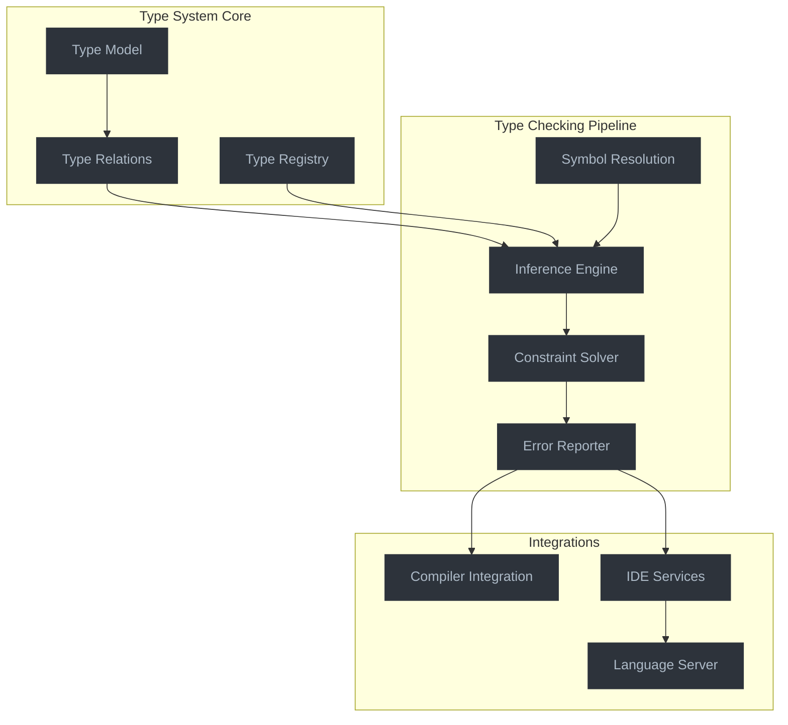

# Advanced Type Checking System for Jaclang

This document outlines a comprehensive implementation plan for a robust type checking system for the Jaclang compiler, inspired by Pyright. The system will provide deep static analysis capabilities similar to modern type checkers while maintaining compatibility with the existing Jac language features.

## Current State

The current type checking system in Jaclang:
- Relies on mypy for basic type checking
- Uses Python's type annotation system
- Has limited integration with Jac-specific language features
- Doesn't provide comprehensive error reporting or code intelligence

## Goals

Our enhanced type checking system aims to:

1. Provide accurate and comprehensive type analysis
2. Support all Jac-specific language constructs
3. Improve error messages and actionable feedback
4. Enable code intelligence features (completion, hover info, etc.)
5. Maintain modularity and extensibility
6. Optimize performance for larger codebases

## Implementation Plan Overview

The implementation consists of several phases, each detailed in its own document:

1. [Type System Foundation](01-type-system-foundation.md) - Core type model and relationships
2. [Type Inference Engine](02-type-inference-engine.md) - Rules and algorithms for type inference
3. [Type Checking Pipeline](03-type-checking-pipeline.md) - Integration with compiler passes
4. [Error Reporting System](04-error-reporting-system.md) - Actionable and informative messages
5. [Special Features](05-special-features.md) - Support for Jac-specific constructs
6. [External Integration](06-external-integration.md) - IDE services and tooling

## Architecture Overview

