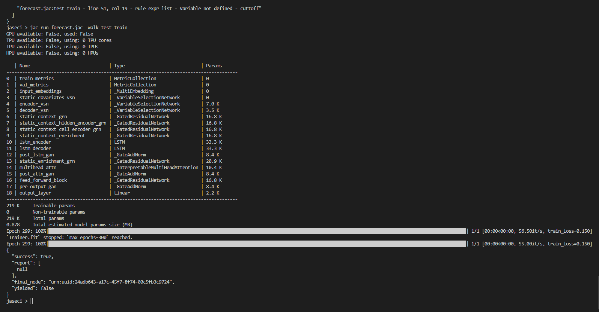

The `forecast` module offers accurate and efficient time-series forecasting. Using this module, you can process time-stamped data and predict future values with precision. This module has enabled you to train with your own time series data.

## Install and Import

Time series forecasting module comes together with Jaseci miscellaneous package. You can install it together with `jac_misc`;

```
pip install jac_misc['forecast`]
```

or

```
pip install jac_misc['all']
```

Also `forecast` module requires some additional packages, run following to install them;

```
pip install darts==0.24.0
pip install jaseci
```

For importing the module, open jaseci shell run following command.

```
actions load module jac_misc.forecast
```

## Working with Jaseci Forecasting Module


### Preprocessing data

Example:

```jac
walker preprocess{
    can forecast.preprocess;
    variables = {'variable1': [3, 2, 1, 0, 5, 6, 9], 'variable2': [4, 5, 6, 8, 5, 7, 8]};
    times = ['2022-05-01', '2022-05-02', '2022-05-03', '2022-05-04', '2022-05-05', '2022-05-06', '2022-05-07'];
    report forecast.preprocess(times,variables);
}
```

### Splitting into Train and Validation

Example:

```jac
walker split{
    can forecast.split;
    can forecast.preprocess;

    variables = {'variable1': [3, 2, 1, 0, 5, 6, 9]};
    times = ['2022-05-01', '2022-05-02', '2022-05-03', '2022-05-04', '2022-05-05', '2022-05-06', '2022-05-07'];
    cuttoff = '2022-05-03';

    forecast.preprocess(times,variables);
    report forecast.split(cuttoff,"True");
}
```

### Normalizing/Scaling Data

Example:

```jac
walker scale{
    can forecast.scale;
    can forecast.preprocess;

    variables = {'variable1': [3, 2, 1, 0, 5, 6, 9], 'variable2': [4, 5, 6, 8, 5, 7, 8]};
    times = ['2022-05-01', '2022-05-02', '2022-05-03', '2022-05-04', '2022-05-05', '2022-05-06', '2022-05-07'];
    forecast.preprocess(times,variables);

    report forecast.scale();
}
```

### Choosing the model


Example:

```jac
walker create_model{
    can forecast.create_model;
    has params_dict = {"input_chunk": 4, "output_chunk":1, "hidden_size":64, "quantiles":[0.01, 0.05, 0.1, 0.15, 0.2, 0.25, 0.3, 0.4, 0.5, 0.6, 0.7, 0.75, 0.8, 0.85, 0.9, 0.95, 0.99]};

    report forecast.create_model("transformer", params_dict);
}
```

### Training the model

```jac
walker test_train{
    can forecast.preprocess;
    can forecast.split;
    can forecast.create_model;
    can forecast.train;

    has covariate1 = "year";
    has covariate2 = "month";
    has params_dict = {"input_chunk": 4, "output_chunk":1, "hidden_size":64, "quantiles":[0.01, 0.05, 0.1, 0.15, 0.2, 0.25, 0.3, 0.4, 0.5, 0.6, 0.7, 0.75, 0.8, 0.85, 0.9, 0.95, 0.99]};
    has variables = {'variable1': [3, 2, 1, 0, 5, 6, 9], 'variable2': [4, 5, 6, 8, 5, 7, 8]};
    has times = ['2022-05-01', '2022-05-02', '2022-05-03', '2022-05-04', '2022-05-05', '2022-05-06', '2022-05-07'];
    cuttoff = '2022-05-06';

    forecast.preprocess(times,variables);
    forecast.split(cuttoff,"True");
    forecast.create_model("transformer", params_dict);

    report forecast.train(covariate1,covariate2);
}
```

This function will train the model and it will take a while depending on the size of the training data.



### Evaluation

Example:

```
walker test_evaluate{
    can forecast.preprocess;
    can forecast.split;
    can forecast.create_model;
    can forecast.train;
    can forecast.evaluate;

    has covariate1 = "year";
    has covariate2 = "month";
    has params_dict = {"input_chunk": 4, "output_chunk":1, "hidden_size":64, "quantiles":[0.01, 0.05, 0.1, 0.15, 0.2, 0.25, 0.3, 0.4, 0.5, 0.6, 0.7, 0.75, 0.8, 0.85, 0.9, 0.95, 0.99]};
    has variables = {'variable1':[0.5, 0.6, 0.8, 1.1, 1.5, 2.1, 2.1, 2.2, 1.9, 1.8]};
    has times = ['2022-05-01', '2022-05-02', '2022-05-03', '2022-05-04', '2022-05-05', '2022-05-06', '2022-05-07', '2022-05-08', '2022-05-09', '2022-05-10'];
    cuttoff = '2022-05-06';

    forecast.preprocess(times,variables);
    forecast.split(cuttoff,"True");
    forecast.create_model("transformer", params_dict);

    forecast.train(covariate1,covariate2);
    report forecast.evaluate(2);
}
```

This will return the MAPE value.

### Forecasting for future

Example:

```jac
walker test_predict{
    can forecast.preprocess;
    can forecast.split;
    can forecast.create_model;
    can forecast.train;
    can forecast.predict;

    has covariate1 = "year";
    has covariate2 = "month";
    has params_dict = {"input_chunk": 4, "output_chunk":1, "hidden_size":64, "quantiles":[0.01, 0.05, 0.1, 0.15, 0.2, 0.25, 0.3, 0.4, 0.5, 0.6, 0.7, 0.75, 0.8, 0.85, 0.9, 0.95, 0.99]};
    has variables = {'variable1':[0.5, 0.6, 0.8, 1.1, 1.5, 2.1, 2.1, 2.2, 1.9, 1.8]};
    has times = ['2022-05-01', '2022-05-02', '2022-05-03', '2022-05-04', '2022-05-05', '2022-05-06', '2022-05-07', '2022-05-08', '2022-05-09', '2022-05-10'];
    cuttoff = '2022-05-06';

    forecast.preprocess(times,variables);
    forecast.split(cuttoff,"True");
    forecast.create_model("transformer", params_dict);

    forecast.train(covariate1,covariate2);
    report forecast.predict(2);
}
```