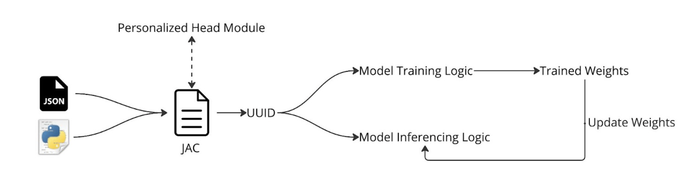
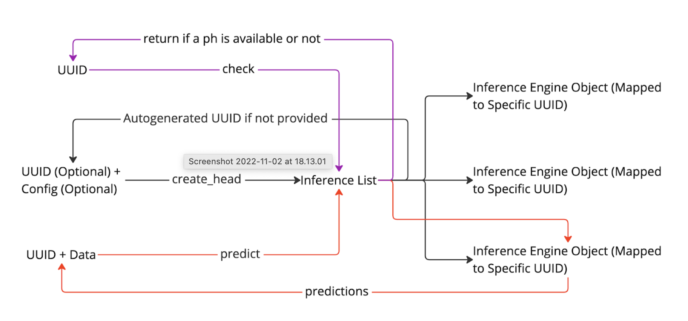
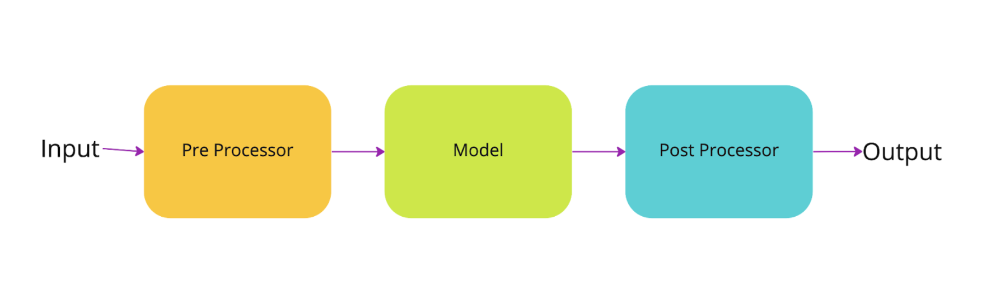
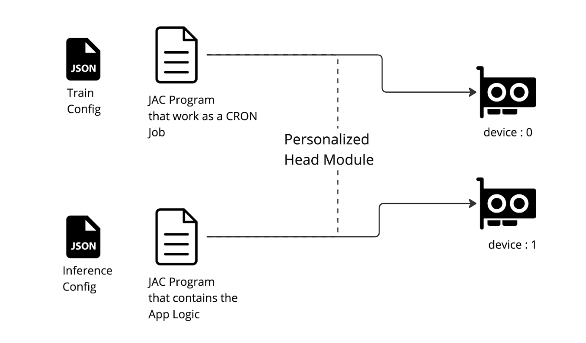

# Personalized Head (PH) Module

**What is Personalized Head:**
Using the Personalized Head module, you can create a custom model head which you can train over the time.
You can use your own custom models and datasets to create a personalized head with just using a configuration
file and a python file.



**PH Actions:**


**How Inferecing Works:**


**Recommended way of Using PH Head in your App:**


## **How to Use**

### **1. Using the 'Personalized Head' as a Transformer Head**

Default Model for the Personalized Head is a Transformer Head. For training the model, you need to create a python file which contains the torch.utils.data.Dataset inherited class. But in the following example we will use the inbuilt SnipsDataloader class.


### **1.1. Create your JAC Program**

```python
# Path: ./main.jac

walker identify_intent{
  has input_text;
  can ph.create_head_list, ph.create_head, ph.predict, ph.train_head;

  root {
      # This creates a headlist. you can pass a deafault config override here.
      ph.create_head_list({
          "Model":{
              "args":{
                  "batch_first": true,
                  "embedding_length": 768
              }
          }
      });

      # creating a head named 'ph' with the head_list config.
      # but you can pass a custom config here for a specific head.
      uid = ph.create_head(uuid='ph');

      # predicting using the default weights of the head.
      pred = ph.predict(uuid=uid, data=input_text);
      report pred;

      # training the head for 3 epochs. default is 100. you can override other parameters too. 
      # refer the default config. and using the snips dataset. check the example folder for train.json.
      ph.train_head('ph', {
          "Trainer":{
              "trainer":{
                  "epochs": 3
              },
              "dataloader":{
                  "args":{"train_json": "train.json"}
              }
          }
      });
      # if the model has improved, ph will load the best weights.

      # predicting using the trained weights of the head.
      pred = ph.predict(uuid=uid, data=input_text);
      report pred;
  }
}

walker init {
  has input_text;
  root {
      spawn here walker::identify_intent(input_text=input_text);
  }
}
```

and ```Viola!``` you have created a personalized head.
Refer this [Link]() for the example of the above code.

### **1.2. Running your JAC Program**

- Open the terminal and run Jaseci Command Line Tool using the command below.

```bash
jsctl -m
```

- Load the 'personalized_head' module using the command below.

```bash
actions load module jaseci_ai_kit.ph
```

- Run the JAC program using the command below.

```bash
jac run main.jac -ctx '{"input_text": "I want to order a pizza"}'
```
## **2. Using the 'Personalized Head' as a Custom Model**

You can use the personalized head as a full custom model other than being a transformer head of a model. For an example you can create your own YOLO model, that you can train and inference. Follow the steps below to use the personalized head as a standalone module with custom model. Example shows how to use the personalized head as a MNIST Classification model.

### **2.1. Creating Custom Python Model**

Python File contains the torch.nn.Module class which is the model. You can use any model you want. and a torch.utils.data.Dataset class which is the dataset. You can use any dataset you want. and Preprocessor and Postprocessor classes which are used in inferencing. You can use any preprocessor and postprocessor you want but with the same method format. follow it to create your custom python model.

```python
# Path: ./custom.py
import torch
from torch.nn import functional as F
from torchvision import datasets, transforms
import os
import PIL

class CustomModel(torch.nn.Module):
    def __init__(self, num_classes=10):
        super().__init__()
        self.conv1 = torch.nn.Conv2d(1, 10, kernel_size=5)
        self.conv2 = torch.nn.Conv2d(10, 20, kernel_size=5)
        self.conv2_drop = torch.nn.Dropout2d()
        self.fc1 = torch.nn.Linear(320, 50)
        self.fc2 = torch.nn.Linear(50, num_classes)

    def forward(self, x):
        x = F.relu(F.max_pool2d(self.conv1(x), 2))
        x = F.relu(F.max_pool2d(self.conv2_drop(self.conv2(x)), 2))
        x = x.view(-1, 320)
        x = F.relu(self.fc1(x))
        x = F.dropout(x, training=self.training)
        x = self.fc2(x)
        return F.log_softmax(x, dim=1)


class CustomDataset(torch.utils.data.Dataset):
    def __init__(self, data_dir):
        trsfm = transforms.Compose([
            transforms.ToTensor(),
            transforms.Normalize((0.1307,), (0.3081,))
        ])
        self.data_dir = data_dir
        os.makedirs(self.data_dir, exist_ok=True)
        self.dataset = datasets.MNIST(
            self.data_dir, train=True, download=True, transform=trsfm)

    def __len__(self):
        return len(self.dataset)

    def __getitem__(self, idx):
        return self.dataset[idx]


class CustomPreProcessor:
    def __init__(self):
        self.trsfm = transforms.Compose([
            transforms.Grayscale(),
            transforms.Resize((28, 28)),
            transforms.ToTensor(),
            transforms.Normalize((0.1307,), (0.3081,))
        ])

    def process(self, x):
        img = PIL.Image.open(x)
        return self.trsfm(img)


class CustomPostProcessor:
    def __init__(self):
        pass

    def process(self, x):
        x = x.argmax(dim=1)
        x = x.detach().cpu().numpy()[0]
        return x.tolist()
```
### **2.2. Create your JAC program**

```python
# Path: ./main.jac
walker identify_number {
  has input_image;
  can ph.create_head_list, ph.create_head, ph.predict, ph.train_head;
  can file.load_str;

  root {
    #loading the python script
    python_file = file.load_str("custom.py");

    #creating a head_list
    ph.create_head_list({
        "Model":{
            "args": {
                "num_classes": 10
            },
            "type": "CustomModel"
        },
        "Inference":{
            "postprocess": {
                "type": "CustomProcessor",
                "args": {}
            },
            "preprocess": {
                "type": "CustomProcessor",
                "args": {}
            }
        }
    }, python_file);

    #creating the head
    uid = ph.create_head(uuid='mnist');
    #making the prediction using default weights
    pred = ph.predict(uuid=uid, data=input_image);
    report pred;

      # training the head
    ph.train_head('mnist', {
        "Trainer":{
            "name": "MnistTrainer",
            "trainer":{
                "epochs": 3
            },
            "dataloader": {
                "args":{
                    "data_dir": "data/"
                },
                "type": "CustomDataLoader"
            }
        }
    });

    #predicting again
    pred = ph.predict(uuid=uid, data=input_image);
    report pred;
  }
}

walker init {
  has input_image;
  has output;

  root {
      spawn here walker::identify_number(input_image=input_image);
  }
}
```

### **1.3. Running your JAC Program**

- Open the terminal and run Jaseci Command Line Tool using the command below.

```bash
jsctl -m
```

- Load the 'personalized_head' module using the command below.

```bash
actions load module jaseci_ai_kit.ph
```

- Run the JAC program using the command below.

```bash
jac run main.jac -ctx '{"input_image": "test.jpg"}'
```

### **Configuration File Structure**
```yaml
# PATH: ./config.yaml

# Inference Configuration
Inference:
  postprocess:
    args:
      to_list: true # converts the output to list as Jaseci doesnt support tensor
    type: SnipsPostProcessor #(V2VPostrProcessor, CustomProcessor)
  preprocess:
    type: SnipsPreProcessor #(V2VPreProcessor, CustomProcessor)
  weights: '' # if you want to use a pretrained weights, you can specify the path here (cannot be used in remote yet)

# Model Configuration
Model:
  args:
    batch_first: true
    embedding_length: 768
    n_classes: 10
    ph_ff_dim: 512
    ph_nhead: 8
    ph_nlayers: 1
  type: PHClassifier # (PHVector2Vector, PHClassifier, CustomModel)

# Training Configuration (Optional: If you want to train the model)
Trainer:
  dataloader:
    args:
      batch_size: 32
      num_workers: 1
      shuffle: true
      train_json: train.json
      validation_split: 0.2
    type: SnipsDataLoader #(CustomDataLoader)
  loss: nll_loss
  lr_scheduler:
    args:
      gamma: 0.1
      step_size: 50
    type: StepLR
  metrics:
  - accuracy
  - top_k_acc
  n_gpu: 1
  name: SnipsModelTrainer
  optimizer:
    args:
      amsgrad: true
      lr: 0.001
      weight_decay: 0
    type: Adam
  trainer:
    early_stop: 10
    epochs: 100
    monitor: min val_loss
    save_period: 1
    tensorboard: true
    verbosity: 2
```
## Todo
- [ ] Need to work on the Concurrency, Currently cannot use the service while training is going on using a single script. Workaround need 2 JAC Scripts running for separate tasks. And if we are running the service with multiple workers, the personalized heads won’t be shared among all the workers.
- [X] Lots of Boilerplate coding (need to simplify)
- [X] Need to add the ability to change specific attributes without writing the whole Trainer configuration
- [ ] Logging should be changed to a standard format of jaseci.
- [ ] Current way of connecting 2 models is through loading 2 modules and combining them in the JAC code. But this can be made into a combined module (Compositor is Proposed), where you can pass a model config to the compositor to create the Model Inference & Training Pipeline.
- [ ] Dynamic device selection for each personalized head (for multi GPU usage)