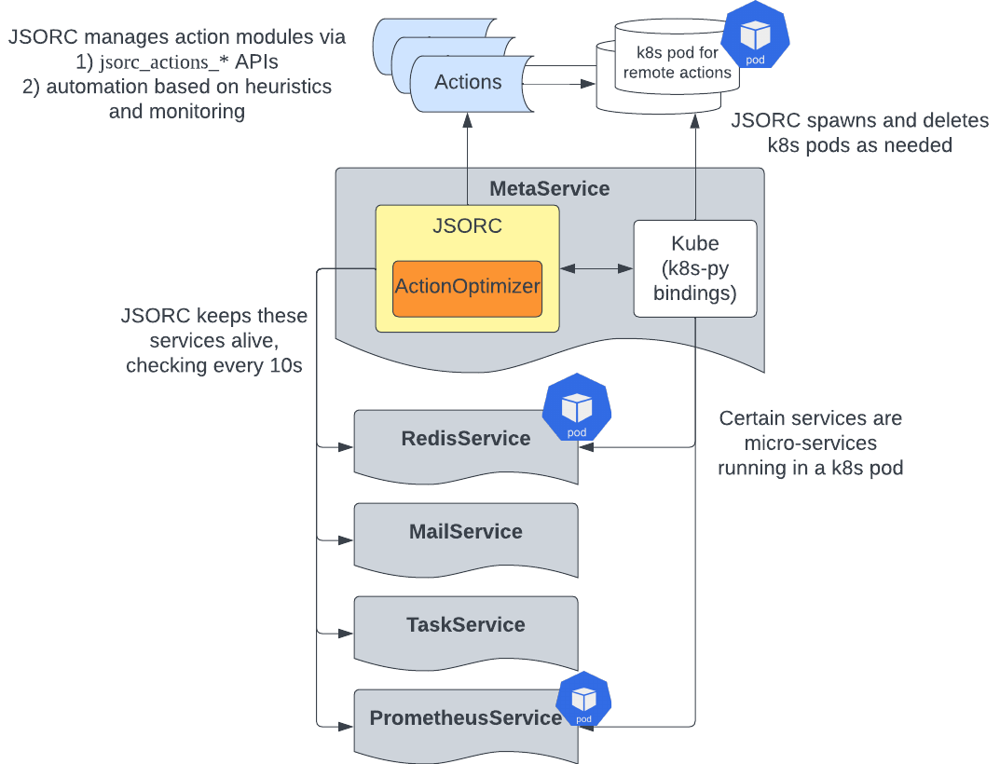

## JSORC Action Optimizer

### What is JSORC?
JSORC is short for the JaSeci ORChestrator.
It is a key component of the jaseci runtime system that oversees the various components and services of the Jaseci runtime system.

### Jaseci Actions
Jaseci actions are extension to the core Jaseci runtime.
Jaseci actions are used to introduce external libraries and functionalities to your jaseci applications.
Examples include AI models and useful python packages (such as numpy and scipy).
As a jaseci developer, one can use the standard jaseci action APIs to load and unlod actions.
Refer to the actions section of the jaseci documentation for more details.

### Why do we need JSORC?
With standard actions APIs, developers need to manually make decision on whether the action should be a local action or remote action and explictly manage any remote instances if needed.
This introduces complexity for the developers as well as potential impact on performance.
JSORC solves this by subsuming this responsibility and automatically manage actions based on its observations of the state of the runtime system.

### JSORC API details
With JSORC, we introduce a new set of APIs for loading and unloading actions:

- `jsorc_actions_load`

    Load an action module via JSORC. Different from the standard actions load API, only the action module's name and the local/remote mode are required. JSORC will locate the python module path or spawn a remote pod automatically depending on the option specified.
    ```bash
    # Load a module action
    jsorc actions load use_enc -mode module

    # Load a remote action. Note that no URL is needed.
    jsorc actions load use_enc -mode remote
    ```
- `jsorc_actions_status`

    Retrieve the current status of a particular action
    ```bash
    jsorc actions status use_enc
    ```

- `jsorc_actions_unload`

    Unload an action module.
    ```bash
    # Auto unload
    jsorc actions unload use_enc -mode auto
    ```

- `jsorc_actions_config`

    Before JSORC can manage an action, its config needed to be loaded.
    ```bash
    jsorc actions config use_enc jaseci_ai_kit.config
    ```

A set of APIs for setting a custom actions management policy

- jsorc_actionpolicy_set

    Specify an automatic action management policy for JSORC. Currently only default is supported, more policies to be added soon.
    ```bash
    jsorc actionpolicy set default
    ```
- jsorc_actionpolicy_get

    Get the current active action management policy.
    ```bash
    jsorc actionpolicy get
    ```

There are also a set of APIs for performance tracking and becnhmarking:

- jsorc_trackact_start/stop

    JSORC can track all action calls happen in your program. You can start and stop this tracking
    ```bash
    jsorc trackact start
    jsorc trackact stop
    ```

- jsorc_becnhmark_start/stop/report

    Activate performance benchmark mode for JSORC, where request level latency and throughput performance will be monitored and reported.
    ```bash
    jsorc benchmark start
    jsorc benchmark stop
    jsorc benchmark report
    ```

- jsorc_tracksys_start/stop/report

    Activate system status tracking mode for JSORC, where JSORC leverages prometheus to record various metrics about the cluster (e.g. CPU, memory and network utilization)

- jsorc_loadtest (for experimentation/research only)

    Execute designed performance load test.

For more examples of these APIs, check out the JSORC unit tests (https://github.com/Jaseci-Labs/jaseci/blob/main/jaseci_serv/jaseci_serv/jsorc/tests/test_jsorc_api_kube.py).

### JSORC Architecture


Above is a overview diagram of the JSORC implementation architecture.
JSORC is housed inside the MetaService.
MetaService/JSORC is reponsible for keeping the other services alive at runtime.
Currently these services include Redis, Mail, Task and Prometheus, as illustrated in the diagram.
JSORC uses the `Kube` class to manage the cluster it is in.
The `Kube` class leverages the kubernetes python client to monitor the cluster and create, update and delete resources.
In addition, JSORC also manages the action modules.
It does this via two venues.
First, user can call the set of jsorc action management APIs (listed above, `jsorc_actions_*`).
These APIs provide a simpler interface to load and unload action modules as JSORC subsumes some of the responsibilities.
Second, by setting the approriate action policy, JSORC can also automatically manage the action modules based on certain heurisitcs (more details on this to be added).

### Activate JSORC
JSORC is currently turned off by default.
The activation of JSORC is controlled by the field `automation` in `jaseci_core/jaseci/svc/config.py`.
So to activate JSORC, you can do one of the following two things:

1. For an existing jaseci instance, you need to make two API calls to activate JSORC (you can also do these via the equivalent commands in jsctl):
    1. Update the jsorc config to set automation as True
    ```bash
    POST request to /config_set/ with payload
    {
        "name": "META_CONFIG",
        "value": "{\"automation\": true, \"backoff_interval\": 10, \"namespace\": \"default\", \"keep_alive\": [\"promon\", \"redis\", \"task\", \"mail\"], \"kubernetes\": {\"in_cluster\": true, \"config\": null}}"
        }
    ```
    Note that the `value` field here is a string that can be parsed as JSON.
    There is also a `config_get` API that you can use to get the current value of the `META_CONFIG`

    2. Refresh the service
    ```bash
    POST request to /service_refresh/ with payload
    {
        "name": "meta"
    }
    ```
    This will restart the meta service which controls JSORC.

    If the requests are successful, you should see JSORC checks if the services are alive and create them if not in the pod logs of jaseci.

2. If (and only if) you are starting a jaseci instance with a fresh DB and redis stack, you can set the `automation` field to be `True` in the source code (config.py) and then stand up the jaseci instance.

Note: use this manifest (https://github.com/Jaseci-Labs/jaseci/blob/main/scripts/jsorc/jaseci.yaml) if you wish to have JSORC spawn redis.

### Relevant Source Code (for contributors)
* jaseci/svc/common.py
* jaseci/svc/meta.py
* jaseci/svc/config.py

### Todos
* Include jaseci-db in JSORC's purview.
* Expose prometheus dashboard (potentially grafana) at a fixed url.