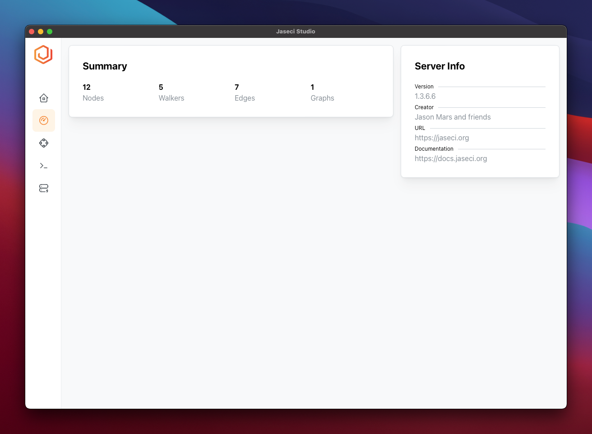
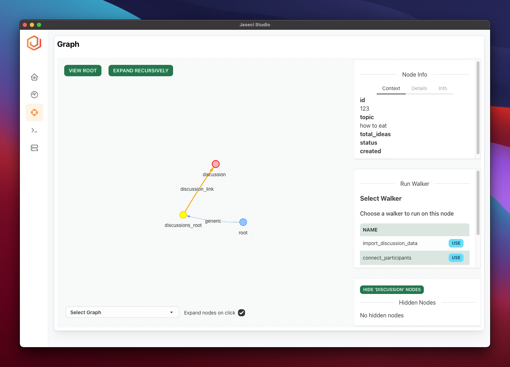

## Features

1. Login
2. Summary View
   1. See number of distinct nodes, edges and walkers and graphs
3. Graph Viewer
   1. View node and edge information (context, details, info)
   2. Run walker on node
   3. View Root
   4. Switch Graph
   5. Node Interactions
      1. Expand/Collapse
      2. Expand Node Recursively
   6. Hide groups of node
   7. Expand node or view only connected nodes on click
4. Logs Viewer
   1. Filter logs
   2. Scroll to top / bottom / pause logs
   3. Filter by level

## Screenshots

---

### Login

---

---

### Summary

---

---

### Graph Viewer

---

---

### Logs Viewer

---

---

### Login

---

