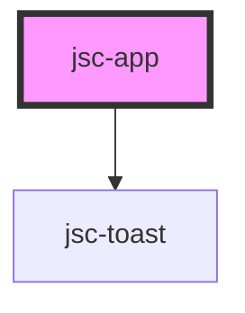

# jsc-app

<!-- Auto Generated Below -->

## Properties

| Property | Attribute | Description | Type                | Default     |
| -------- | --------- | ----------- | ------------------- | ----------- |
| `markup` | --        |             | `JaseciComponent[]` | `undefined` |

## Events

| Event      | Description | Type                  |
| ---------- | ----------- | --------------------- |
| `onRender` |             | `CustomEvent<string>` |

## Methods

### `setGlobalConfig(config: Record<string, any> & { css: Record<string, string>; }) => Promise<void>`

#### Returns

Type: `Promise<void>`

### `setMarkup(value: any) => Promise<void>`

#### Returns

Type: `Promise<void>`

## Dependencies

### Depends on

- [jsc-toast](../jsc-toast)

### Graph

----------------------------------------------

*Built with [StencilJS](https://stenciljs.com/)*
