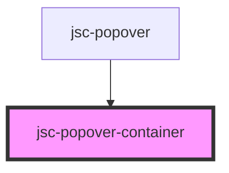

# jsc-popover-container

<!-- Auto Generated Below -->

## Properties

| Property       | Attribute | Description | Type         | Default     |
| -------------- | --------- | ----------- | ------------ | ----------- |
| `closePopover` | --        |             | `() => void` | `undefined` |
| `label`        | `label`   |             | `string`     | `undefined` |
| `left`         | `left`    |             | `string`     | `undefined` |
| `open`         | `open`    |             | `boolean`    | `undefined` |
| `top`          | `top`     |             | `string`     | `undefined` |

## Methods

### `playExitAnimation() => Promise<any>`

#### Returns

Type: `Promise<any>`

### `playPresenceAnimation() => Promise<void>`

#### Returns

Type: `Promise<void>`

## Dependencies

### Used by

 - [jsc-popover](../jsc-popover)

### Graph

----------------------------------------------

*Built with [StencilJS](https://stenciljs.com/)*
