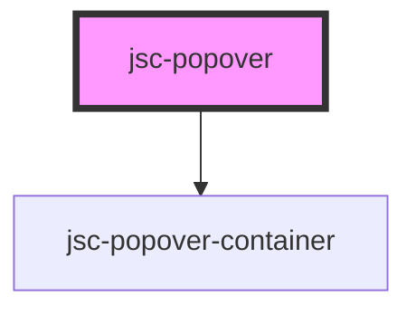

# my-component

<!-- Auto Generated Below -->

## Properties

| Property     | Attribute    | Description | Type     | Default              |
| ------------ | ------------ | ----------- | -------- | -------------------- |
| `css`        | `css`        |             | `string` | `JSON.stringify({})` |
| `events`     | `events`     |             | `string` | `undefined`          |
| `left`       | `left`       |             | `string` | `undefined`          |
| `listeners`  | `listeners`  |             | `string` | `undefined`          |
| `name`       | `name`       |             | `string` | `undefined`          |
| `open`       | `open`       |             | `string` | `undefined`          |
| `operations` | `operations` |             | `any`    | `undefined`          |
| `target`     | `target`     |             | `string` | `undefined`          |
| `title`      | `title`      |             | `string` | `undefined`          |
| `top`        | `top`        |             | `string` | `undefined`          |

## Methods

### `closePopover() => Promise<void>`

#### Returns

Type: `Promise<void>`

### `openPopover() => Promise<void>`

#### Returns

Type: `Promise<void>`

### `togglePopover() => Promise<void>`

#### Returns

Type: `Promise<void>`

## Dependencies

### Depends on

- [jsc-popover-container](../jsc-popover-container)

### Graph

----------------------------------------------

*Built with [StencilJS](https://stenciljs.com/)*
