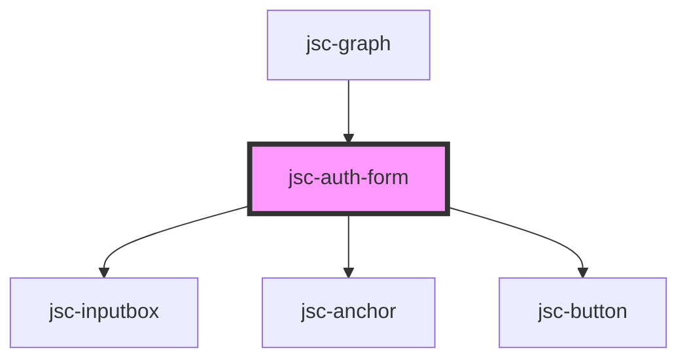

# my-component

<!-- Auto Generated Below -->

## Properties

| Property            | Attribute            | Description | Type                  | Default              |
| ------------------- | -------------------- | ----------- | --------------------- | -------------------- |
| `css`               | `css`                |             | `string`              | `JSON.stringify({})` |
| `events`            | `events`             |             | `string`              | `undefined`          |
| `hideNameField`     | `hidenamefield`      |             | `string`              | `'false'`            |
| `mode`              | `mode`               |             | `"login" \| "signup"` | `'login'`            |
| `name`              | `name`               |             | `string`              | `undefined`          |
| `operations`        | `operations`         |             | `any`                 | `undefined`          |
| `redirectURL`       | `redirect-u-r-l`     |             | `string`              | `undefined`          |
| `requireActivation` | `require-activation` |             | `"false" \| "true"`   | `'false'`            |
| `serverURL`         | `serverurl`          |             | `string`              | `undefined`          |
| `tokenKey`          | `tokenkey`           |             | `string`              | `'token'`            |

## Events

| Event              | Description | Type                  |
| ------------------ | ----------- | --------------------- |
| `serverUrlChanged` |             | `CustomEvent<string>` |

## Dependencies

### Used by

 - [jsc-graph](../jsc-graph)

### Depends on

- [jsc-inputbox](../jsc-input)
- [jsc-anchor](../jsc-anchor)
- [jsc-button](../jsc-button)

### Graph

----------------------------------------------

*Built with [StencilJS](https://stenciljs.com/)*
