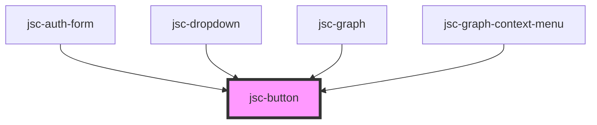

# my-component

<!-- Auto Generated Below -->

## Properties

| Property          | Attribute         | Description | Type                                                                                                       | Default              |
| ----------------- | ----------------- | ----------- | ---------------------------------------------------------------------------------------------------------- | -------------------- |
| `active`          | `active`          |             | `string`                                                                                                   | `undefined`          |
| `block`           | `block`           |             | `string`                                                                                                   | `undefined`          |
| `color`           | `color`           |             | `string`                                                                                                   | `undefined`          |
| `css`             | `css`             |             | `string`                                                                                                   | `JSON.stringify({})` |
| `events`          | `events`          |             | `string`                                                                                                   | `undefined`          |
| `fullWidth`       | `fullwidth`       |             | `string`                                                                                                   | `undefined`          |
| `label`           | `label`           |             | `string`                                                                                                   | `undefined`          |
| `name`            | `name`            |             | `string`                                                                                                   | `undefined`          |
| `noRadius`        | `no-radius`       |             | `string`                                                                                                   | `undefined`          |
| `operations`      | `operations`      |             | `string`                                                                                                   | `undefined`          |
| `palette`         | `palette`         |             | `"accent" \| "error" \| "ghost" \| "info" \| "link" \| "primary" \| "secondary" \| "success" \| "warning"` | `undefined`          |
| `size`            | `size`            |             | `"lg" \| "md" \| "sm" \| "xs"`                                                                             | `'md'`               |
| `tooltip`         | `tooltip`         |             | `string`                                                                                                   | `undefined`          |
| `tooltipPalette`  | `tooltippalette`  |             | `string`                                                                                                   | `undefined`          |
| `tooltipPosition` | `tooltipposition` |             | `string`                                                                                                   | `undefined`          |
| `variant`         | `variant`         |             | `"default" \| "ghost" \| "link"`                                                                           | `'default'`          |

## Dependencies

### Used by

 - [jsc-auth-form](../jsc-auth-form)
 - [jsc-dropdown](../jsc-dropdown)
 - [jsc-graph](../jsc-graph)
 - [jsc-graph-context-menu](../jsc-graph)

### Graph

----------------------------------------------

*Built with [StencilJS](https://stenciljs.com/)*
