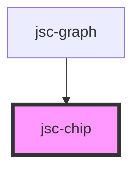

# my-component

<!-- Auto Generated Below -->

## Properties

| Property     | Attribute    | Description | Type     | Default              |
| ------------ | ------------ | ----------- | -------- | -------------------- |
| `css`        | `css`        |             | `string` | `JSON.stringify({})` |
| `events`     | `events`     |             | `string` | `undefined`          |
| `label`      | `label`      |             | `string` | `undefined`          |
| `name`       | `name`       |             | `string` | `undefined`          |
| `operations` | `operations` |             | `any`    | `undefined`          |

## Dependencies

### Used by

 - [jsc-graph](../jsc-graph)

### Graph

----------------------------------------------

*Built with [StencilJS](https://stenciljs.com/)*
