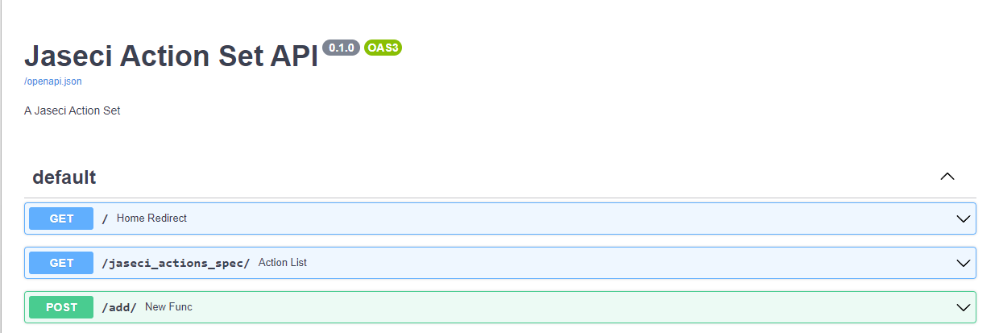
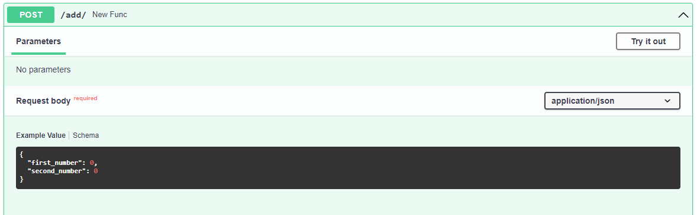

# Build a Custom Jaseci Action Module

In this tutorial, you are going to learn how to build a custom jaseci module with python. In this application I will teach you how to create a basic calculator module for jaseci.

## Preparation
Let's start by creating a folder called `calculator` in your root directory of your application. After creating the folder let's create a file name `calculator.py` inside of the `calculator` folder.

> **Note**
>
> We are using python to create the custom jaseci module so you will need .py files and not jac.

After creating the file, open the file in a code editor and let's start coding our module.

```py
from jaseci.actions.live_actions import jaseci_action
```
First, we will have to import jaseci_actions to the `calculator.py` file. We will be using jaseci actions to load the module into jaseci.

```py
@jaseci_action(act_group=["calculator"], allow_remote=True)
```
In this block:
- `act_group` is the name of the action module.
- `allow_remote` indicates whether you want this action to be able to run remotely or not.


We will be adding onto the file.
```py
@jaseci_action(act_group=["calculator"], allow_remote=True)
def add(first_number: int, second_number: int):
    return first_number + second_number
```

What this functions does, it adds the two numbers from the parameter and returns the sum of each number.

> **Note**
>
> Practice adding data type to the parameters for e.g. `first_number: int` because jaseci_actions use this as validation, remotely and also through the jaseci application.

## Loading the custom module
There are currently two ways to load a custom action module into your jac program:
* directly loading from the python source code (load local)
* host the action as a running microservice (load remote)

In this section we will walk through each of the methods.
### Load local
```bash
jsctl
jaseci > actions load local calculator/calculator.py
```
In this case, we are loading the module directly from its source code python file with `actions load local`, followed by the filepath

```
{
  "success": true
}
```
You should see this after running the command. If you see this you have successfully build and load a custom  jaseci module.


### Load remote
Alternatively, we can first launch the custom module as a standalone service
```bash
uvicorn calculator:serv_actions
```

> **Note**
>
> `calculator` is the module name and `serv_actions` will allow you to run all functions remotely at one time. Run this inside the `calculator.py` directory.

You should an output similar to the one below:
```
WARNING:  ASGI app factory detected. Using it, but please consider setting the --factory flag explicitly.
INFO:     Started server process [5514]
INFO:     Waiting for application startup.
INFO:     Application startup complete.
INFO:     Uvicorn running on http://127.0.0.1:8000 (Press CTRL+C to quit)
```

Go to http://localhost:8000/docs and you should see a documentation page that looks like this


This is an automatically generated documentation page for the custom module you have just created.
It lists all custom actions, e.g. the `add` one we created just now.
You can also use this docs page to do quick testing of each action by expanding on that action and then click on `Try it out` in the top-right corner.



## Use the custom module in a Jac program
Now we have the actions loaded, let's create a simple jac program to utilize it.

Create a file name `main.jac` and add the following code.

```js
walker init {
    can calculator.add;
    report calculator.add(1,1);
}
```
The `can` keyword is used to declare any custom actions needed for the walker. In this case,
``` js
can calculator.add;
```
enables the use of the `add` action from the `calculator` action module.

> **Note**
>
> Remember the `act_group` parameter used in the `@jaseci_action` decorator earlier? That sepcifies the name of the action module and the same name needs to be used here in the `can` statement. The actual name of the python file itself is only relevant when using `actions load local` and does not need to be the same as `act_group`.

`report calculator.add(1,1);` then reports the result.

Run the walker with
```
jaseci > jac run main.jac
```
You should see an output similar to the one below.
```bash
{
  "success": true,
  "report": [
    2
  ],
  "final_node": "urn:uuid:04e97f70-26b3-467e-a291-bd03b18e7a6d",
  "yielded": false
}
```