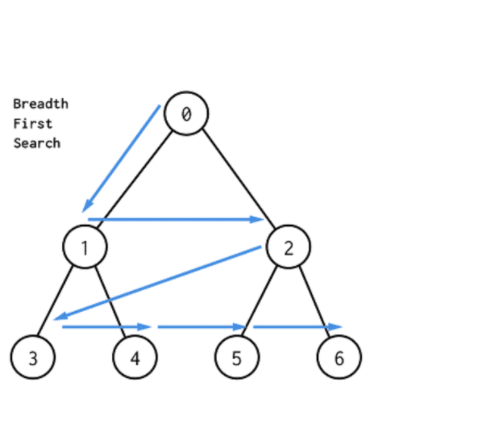
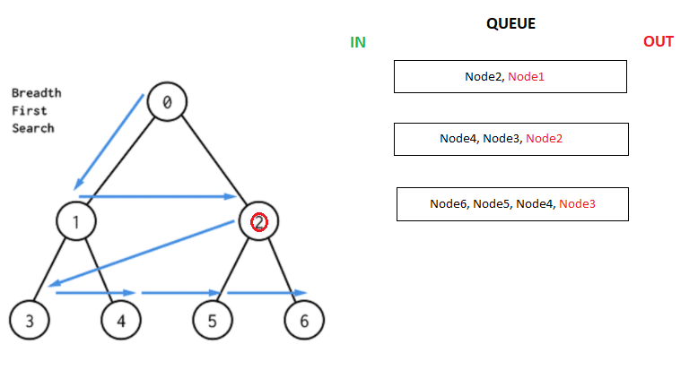

# Traversing a Graph

* Take is used for nodes/Edge trversal in a walker 
* Only until all other walker logic is executed, then all queued up take operations are executed.
* An operation would tell the walker to move/traverse on to the next node with the given filter provided when using take.
* When using the take command, you have the ability to filter by edges or edges that have a specific node attached.

Consider the following diagram



The take command performs a breath first search to add take operations to the queue. Let's define a walker that traverses the various nodes and prints the node data. We'll assume this walker spawns and starts from the root `node 0`.

**Traversing to a generic node from a walker**

```jac
# generic definition of the nodes. Nodes of type 'myNode' will have a 'data' property

node myNode: has anchor data;

walker myWalker{
    myNode{
        take -->;
        std.out(here.data);
    }
}
```

With the assumption that this walker starts from `node 0`, this is how the take operations are queued and executed.


Upon spawning, the walker executes whatever logic it has to when on node of type myNode and in the logic of the above code snippet, the walker executes a take operation then prints the node data.

However, due to the way the take command works, the data is first printed before any traversal occurs. This is becasue the take command is asynchronous and doesn't execute right away. Instead, it queues up any traversal that needs to occur, executes any logic that come after the take command and once that is complete, dequeues and executes the next operation, which would be the traversal to node1.


At node 1 the walker executes a similar logic, queuing up nodes 3 and 4 then printing the value of node 1 before any traversal. Once that logic is finished, it checks the end of the queue for the next operation, which in this case would be traversal to node 2.



This process continues until the queue is empty or the walker is killed.

**Basic traversal using take**

```jac
walker testWalker{
    node_type{
        take -->;
    }
}

 walker testWalker2{
    node_type{
        take <--;
    }
}
```

**Traversing to a specific type of node from a walker**

```jac
walker testWalker{
    node_type{
        take --> node::node_type;
    }
}

//node of type person as the filter

walker testWalker2{
    school{
        take --> node::person;
    }
}
```

Take also allows the use of an else statement, should there be no edges with the filter specified in the take command.

**Executing alternative logic should there be no edges with the take filter**

```jac
walker testWalker{
    node_type{
        take [some filter] else {

            # some additional logic if edge of filter not found
        }
    }
}

# traverse to friend edge, else print 'no friends found'

walker testWalker2{
    person{
        take -[friend]-> else{;
            std.out('no friends found');
        }
    }
}
``` 