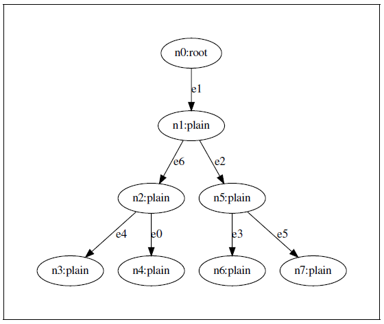
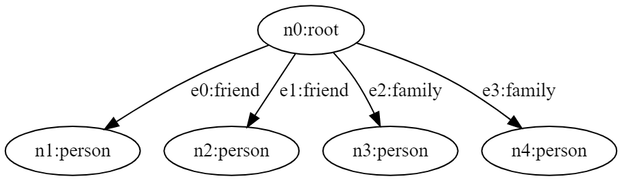
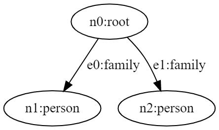

# Walkers

One of the most important abstractions introduced in Jaseci is that of the walker. The
semantics of this abstraction is unlike any that has existed in any programming language
before.

In a nutshell, a walker is a unit of execution that retains state (its local scope) as it travels
over a graphs. Walkers *walk* from node to node in the graph and executing its body.
The walker’s body is specified with an opening and closing braces ( `{` `}` ) and is executed to
completion on each node it lands on. In this sense a walker iterates while spooling through a
sequence of nodes that it ‘takes’ using the take keyword. We call each of these iterations
node-bound iterations.

Variables declared in a walker’s body takes two forms: its context variables, those that
retain state as it travels from node to node in a graph, and its local variables, those that are
reinitialized for each node-bound iterations.

Walkers present a new way of thinking about programmatic execution distinct from the
near-ubiquitous function based asbtraction in other languages. Instead of a functions scope
being temporally pushed onto an ever increasing stack as functions call other functions.
Scopes can be spacially laid out on a graph and walkers can hop around the graph taking its
scope with it. A key difference in this model is in its introduction of data spacial problem
solving. In the former function-based model scopes become unaccessible upon the sub-call of
a function until that function returns. In contrast, walkers can access any scope at any time
in a modular way.

When solving problems with walkers, a developer can think of that walker as a little self-
contained robot or agent that can retain context as it spacially moves about a graph,
interacting with the context in nodes and edges of that graph.

In addition to the introduction of the `take` command to support new types of control flow for node-bound iterations. The keywords and semantics of `disengage`, `skip`, and `ignore` are also introduced. These instruct walkers to stop walking the graph, skip over a node for execution, and ignore certain paths of the graph.

## Basic Walkers Example

When we run a jac code, by default it's exucuting the `init` walker. Basically the `walker init` works as the main method in other programming language. save following code as `main.jac` and run the code in `jsctl` shell with `jac run main.jac`

**Example 1:**
```jac
walker init{
    std.out("This is from init walker \n");
}
```

**Output 1:**

```
    jaseci > jac run main.jac
    This is from init walker
```
As you can see, this code has executed the `init` walker. Now let's create another walker;

**Output 2:**
```jac
walker second_walker{
    std.out("This is from second walker \n");
}

walker init{
    std.out("This is from init walker");
    root{
        spawn here walker::second_walker;
    }
}

```

**Output 2:**
```
    jaseci > jac run main.jac
    This is from init walker
    This is from second walker
```

The statements from `second walker` and `init` are printed in the jac shell, and we may run just `second_walker` directly by using the command `jac run main.jac -walk second_walker`. Here, the `-walk` parameter instructs the `jsctl` to execute a certain walker.

## Walkers Navigating Graphs Examples

As mentioned earlier the walkers can traverse(walk) through the nodes of the graph in breadth first search (BFS) or depth first search(DFS) approaches.

> **Note**
>
> BFS is a traversal approach in which begins from root node and walk through all nodes on the same level before moving on to the next level. DFS is also a traversal approach in which the traverse begins at the root node and proceeds through the nodes as far as possible until we reach the node with no unvisited nearby nodes.

We are creating the following graph to demostrate traversing of walkers in comming sections;

 <div style="text-align:center"> <b>Example Graph - Navigating </b></div> 
 
<p> 
</p>

Jaseci introduces the handy command called "take" to instruct walker to navigate through nodes. See how that works in following example; 

**Example 3:**
```jac
node plain: has number;

## defining the graph
graph example {
    has anchor head;
    spawn {
        n=[];
        for i=0 to i<7 by i+=1 {
            n.l::append(spawn node::plain(number=i+1));
        }

        n[0] --> n[1] --> n[2];
        n[1] --> n[3];
        n[0] --> n[4] --> n[5];
        n[4] --> n[6];
        head=n[0];
        }
    }

#init walker traversing
walker init {
    root {
        start = spawn here --> graph::example;
        take-->;
        }
    plain {
        std.out(here.number);
        take-->;
    }
}  
```

**Output 3:**
```
jaseci > jac run main.jac
1
2
5
3
4
6
7
```
`take` command lets the walker travers through graph nodes. You may notice by default, a walker travers with `take` command using the breadth first search approach. But the `take` command is flexible hence you can indicate whether the take command should use a depth first or a breadth first traversal to navigate. Look at the following example;

**Example 4:**
```jac
node plain: has name;

## defining the graph
graph example {
    has anchor head;
    spawn {
        n=[];
        for i=0 to i<7 by i+=1 {
        n.l::append(spawn node::plain(name=i+1));
        }
        n[0] --> n[1] --> n[2];
        n[1] --> n[3];
        n[0] --> n[4] --> n[5];
        n[4] --> n[6];
        head=n[0];
        }
    }

## walker for breadth first search
walker walk_with_breadth {
    has anchor node_order = [];
    node_order.l::append(here.name);
    take:bfs -->; #can be replaced with take:b -->
    }

walker walk_with_depth {
    has anchor node_order = [];
    node_order.l::append(here.name);
    take:dfs -->; #can be replaced with take:d -->
    }

walker init {
    start = spawn here --> graph::example;
    b_order = spawn start walker::walk_with_breadth;
    d_order = spawn start walker::walk_with_depth;
    std.out("Walk with Breadth:",b_order,"\nWalk with Depth:",d_order);
    }
```

**Output 4:**

```
jaseci > jac run main.jac
Walk with Breadth: [1, 2, 5, 3, 4, 6, 7] 
Walk with Depth: [1, 2, 3, 4, 5, 6, 7]
```

You may see in the above example `take:bfs-->` and `take:dfs --` commands instruct walker to traverse breadth first search or depth first search accordingly. Additionally, to define breadth first or depth first traversals, can use the short hand of `take:b -->` or `take:d —>`.

## Skipping and Disengaging

Jac offers couple of more useful control statements that are pretty convenient, `skip` and `disengage`, with walker traversing graphs with `take` commands.

### Skipping

The idea behind the abstraction of `skip` in the context of a walkers code block is that it tells a walker to halt and abandon any unfinished work on the current node in favor of moving to the next node (or complete computation if no nodes are queued up).

> **Note**
>
> Node/edge abilities also support the usage of the skip directive. The skip merely decides not to use the remaining steps of that `ability` itself in this context.


Lets change the `init` walker of **Example 3** to demostrate how the `skip` command works;

**Example 5:**

```jac
.
.
.

#init walker traversing
walker init {
    root {
        start = spawn here --> graph::example;
        take-->;
        }
    plain {
        ## Skipping the nodes with even numbers
        if(here.number % 2==0): skip;
        std.out(here.number);
        take-->;
    }
}
```

**Output 5:**

```
jaseci > jac run  main.jac
1
5
7
```
Now it is evident when the node number is an even number, the code in the example above skips the code execution for the particular node. The line `if(here.number %2 ==): skip;` says walker to skips nodes with an even number.

The skip command "breaks" out of a walker or ability rather than a loop, but otherwise has semantics that are nearly comparable to the standard `break` command in other programming languages.

### Disengaging 

The command `disengage` tells the walker to stop all execution and "disengage" from the graph (i.e., stop visiting nodes anymore from here) and can only be used inside the code body of a walker.

To demonstrate how the `disengage` command functions, let's once more utilize the `init` walker from example 3;

**Example 6:**

```jac
.
.
.

#init walker traversing
walker init {
    root {
        start = spawn here --> graph::example;
        take-->;
        }
    plain {
        ## Stoping execution from the node number equals to 5
        if(here.number==5): disengage;
        std.out(here.number);
        take-->;
    }
}
```

**Output 6**

```
jaseci > jac run main.jac
1
2
```
The `init` walker in this example is nearly identical to the code in example 5, but we added the condition `if(here.numer == 5): disengage;`. This caused the walker to halt execution and finish its walk, thus truncating the output array.

>**Note**
>
> In addition to a standard disengage, Jac additionally supports a disengage-report shorthand of the type disengage report "I'm disengaging";. Before the disconnect really takes place, this directive produces a final report.

### Technical Semantics of Skip and Disengage

It's important to remember a few key semantic differences between `skip` and `disengage` commands.

    - The 'skip' statement can be used in the code bodies of walkers and abilities.
    - The 'disengage' statement can only be used in the code body of walkers.
    - 'skip' and 'disengage' statements have no effect on the block of code that ends with an 'exit'. Any code in a walker's with 'exit' block will start running as soon as the walker exit the graph.
    - An easy way to think about these semantics is as similar to the behavior of a traditional return (skip) and a return and stop walking (disengage).


## Ignoring and Deleting

The Jaseci walkers also have two more useful commands: `ignore` and `destroy`.

### Ignoring
The quite handy command `ignore` from Juseci allows you to skip(ignore) visiting nodes or edges when traversing.

**Example 7:**
```jac
node person: has name;
edge family;
edge friend;

walker build_example {
    spawn here -[friend]-> node::person(name="Joe");
    spawn here -[friend]-> node::person(name="Susan");
    spawn here -[family]-> node::person(name="Matt");
    spawn here -[family]-> node::person(name="Dan");
    }

walker init {
    root {
        spawn here walker::build_example;
    ignore -[family]->;
    ignore -[friend(name=="Dan")]->;
    take -->;
    }
person {
    std.out(here.name);
    take-->;
    }
}
```

### Deleting

To remove nodes or edges from the graph, Jaseci also offers the very useful command "destroy." Run the example that follows using the 'dot' command in the Jac shell. i.e. `jac dot main.jac`.

**Example 8:**

```jac
node person: has name;
edge family;
edge friend;

walker build_example {
    spawn here -[friend]-> node::person(name="Joe");
    spawn here -[friend]-> node::person(name="Susan");
    spawn here -[family]-> node::person(name="Matt");
    spawn here -[family]-> node::person(name="Dan");
}

walker init {
    root {
        spawn here walker::build_example;
    for i in -[friend]->: destroy i;
    take -->;
    }

person {
    std.out(here.name);
    take-->;
}
}
```
The majic line in the above code is the `for i in -[friend]->: destroy i;` it instruct walker to remove all the nodes connected by friend edges. try playing with the code by removing and adding `destroy` command.


Graph before `destroy` command            |  Graph after `destroy` command
:-------------------------:|:-------------------------:
  |  


> **Note**
> 
> To visualize the dot output can use the Graphviz. An online version of it is [Here](https://dreampuf.github.io/GraphvizOnline/).

## Reporting Back as you Travel

The `report` command in jac resembles a conventional programming logging function in certain ways. The state of each node the walker visits while trarsing will continue to be recorded in this way.

**Example 9:**
```jac
node person: has name;
edge family;
edge friend;

walker build_example {
spawn here -[friend]-> node::person(name="Joe");
spawn here -[friend]-> node::person(name="Susan");
spawn here -[family]-> node::person(name="Matt");
spawn here -[family]-> node::person(name="Dan");
}

walker init {
    root {
        spawn here walker::build_example;
        spawn -->[0] walker::build_example;
        take -->;
    }
person {
        report here; # report print back on disengage
        take -->;
    }
}
```
**Output 9:**
```json
jaseci > jac run run.jac
{
  "success": true,
    .
    .
    .
    {
      "name": "person",
      "kind": "node",
      "jid": "urn:uuid:dcec06b4-4b7f-461d-bbe1-1fbe22a0ed0c",
      "j_timestamp": "2022-11-03T10:18:08.328560",
      "j_type": "node",
      "context": {
        "name": "Matt"
      }
    },
    {
      "name": "person",
      "kind": "node",
      "jid": "urn:uuid:1dde2125-f858-401e-b0e8-fc2bdb7b38fb",
      "j_timestamp": "2022-11-03T10:18:08.330218",
      "j_type": "node",
      "context": {
        "name": "Dan"
      }
    }
    .
    .
    .
```

## Yielding Walkers

We have so far examined walkers that carry variables and state as they move around a graph. Each time a walk is completed, a walker's state is cleared by default , but node/edge state is preserved. Nevertheless, there are circumstances in which you would want a walker to maintain its state across runs, or even to pause in the middle of a walk and wait to be explicitly called again, updating a subset of its dynamic state. This is where the `yield` keyword comes in.

To see an example of `yield` in action we will modify the 'init' walker from example 9.

**Example 10:**

```jac
.
.
.
node person: has name;
edge family;
edge friend;

walker build_example {
spawn here -[friend]-> node::person(name="Joe");
spawn here -[friend]-> node::person(name="Susan");
spawn here -[family]-> node::person(name="Matt");
spawn here -[family]-> node::person(name="Dan");
}

walker init {
    root {
        spawn here walker::build_example;
        spawn -->[0] walker::build_example;
        take -->;
    }
person {
        report here.context; 
        take -->;
        yield;
    }
}
```
**Output 10:**
```json
jaseci > jac run main.jac
{
  "success": true,
  "report": [
    {
      "name": "Joe"
    }
  ],
  "final_node": "urn:uuid:b7ebf434-bd90-443a-b8e2-c29589c3da57",
  "yielded": true
}
```
The yield keyword in example 9 instructs the walker simple_yield to stop walking and wait to be called again, even though the walker is instructed to `take-->` edges. In this example, a single next node location is queued up and the walker reports a single here.context each time it’s called, taking only 1 edge per call.

Also note yield can be followed by a number of operations as a shorthand. For example `take-->;` and `yield;` could be combined to a single line with `yield take -->;`. We call
this a `yield-take`. Shorthands include,
- Yield-Take: `yield take -->;`
- Yield-Report: yield `report "hi";`
- Yield-Disengage: `yield disengage; and yield disengage report "bye";`
  
In each of these cases, the `take`, `report`, and `disengage` executes with the `yield`.

### Technical Semantics of Yield

There are several key semantics of `yield` to remember, including:

1. Upon a yield, a report is returned back and cleared.
2. Additional report items from further walking will be return on subsequent yields or walk completion.
3. Like the take command, the entire body of the walker will execute on the current node and actually yield at the end of this execution.
• Note: Keep in mind yield can be combined with disengage and skip commands.
4. If a start node, also known as a "prime" node, is supplied while continuing a walker after a yield, the walker will disregard this prime node and continue from where it left off on its journey if there are still other walk nodes it is planned to visit.
5. If there are no nodes scheduled for the walker to go to next, a prime node must be specified (or the walker will continue from root by default).
6. with `entry` and with `exit` code blocks in the walker are not executed upon continuing from a `yield` or executing a `yeild` respectively. Regardless of how many yields there are in between, they only execute once at the beginning and finish of a walk.
7. At the level of the master (user) abstraction, Jaseci maintains the distinction between walkers that have been yielded and need to be resumed and those that are currently being run. The semantics of walkers that are summoned as public are currently unclear. For customized yield behaviors, developers should use the more basic walker spawn and walker execute APIs.


