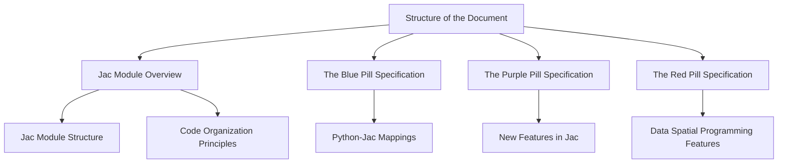

# The Jac Programming Language

This document serves a dual purpose. It provides an introductory guide to understanding the Jac programming language and also offers a full specification of its features, conventions, and best practices.

The document is organized into several distinct parts, each covering a different aspect of the language to provide a comprehensive overview of Jac.

## Structure of the Document

The specification begins with a discussion of the general structure of a Jac module and an overview of code organization principles. This section will provide a broad understanding of how Jac programs are structured and organized.

Following the overview, the document is further divided into three main parts: The Blue Pill, The Purple Pill, and The Red Pill specifications.



### Jac Module Overview

In the first section we examine the diverse set of constructs that make up a Jac module (.jac file). We also touch on a number of key high level design decisions and thought processes for how code is organized to be Jactastic!

If you're a Python hacker that just wants to see how to utilize Jac quickly, jump to Blue, the overview covers many new concepts that are part of the langauge that may feel like a lot.

### The Blue Pill Specification

The Blue Pill section covers the features of Jac that have a direct one-to-one mapping with Python. This section aims to illustrate how typical Python solutions can be implemented in a 'Jactastic' way. By examining these parallels, Python programmers transitioning to Jac can gain a deeper understanding of Jac’s unique characteristics, while leveraging their existing knowledge of Python.

### The Purple Pill Specification

The Purple Pill section delves into the newly introduced features in Jac that build upon and extend the current OOP / procedural model in Python. These enhancements are designed to make coding easier, more efficient, and more robust, thus improving the overall developer experience. This section provides an in-depth exploration of these innovative features and their practical applications.

### The Red Pill Specification

The Red Pill section provides a thorough examination of the language features related to the innovative data spatial programming model. This part of the document covers the new set of semantics and concepts that Jac realizes and provides examples and explanations on how these features can be used in data spatial programming. This exploration will provide a comprehensive understanding of this groundbreaking programming model and its advantages.

By exploring each of these sections, readers can gain a thorough understanding of Jac, its similarities and differences with Python, its innovative features, and the benefits of data spatial programming.

## General Overview of a Jac

Jac programs are organized as a set of modules. A Jac module, at its core, is a logical and functional unit of code organization in the Jac programming language and semantically maps to the notion of a Python Module. The  module contains definitions for elements such as global variables, functions, and object types (classes), and can be imported and utilized in other modules. However, Jac reimagines a few traditional constructs and incorporates a number of new constructs and semantics in realizing its innovative data spatial programming model. The language also brings a fresh take for annotation and documentation, fostering readable and maintainable code.

As we delve into the details, bear in mind that though we will be elevating a 'pythonic' coding style to a 'jactastic' way of thinking, Jac's core principle is that of "python-complete" interoperability. Jac views the pythonic and the jactastic as a continuum that the language must support. A benefit to Jac users is that this also means they automatically inherit the rich ecosystem of Python libraries and frameworks, thus providing programmers with a diverse set of tools for various application domains. Jac's target bytecode is Python. All python libraries are Jac libraries, and a Jac object always maps to a Python object.

Lets jump in.

### Code Organization

In the Jac programming language, the fundamental organizational unit of code is the "module". Each Jac module is a coherent assembly of various elements in a source file. The complete set of these element include the following.

#### Module Elements

The comprehensive array of potential elements within a Jac module encompasses:

1. **Docstring**: This is a string literal that resides as the inaugural statement in a module. A docstring, the sole *mandatory* element, functions for documentation and clarifies the operations performed by the affiliated code.

1. **Import Directives**: These directives import other modules or elements from other modules, providing an avenue to adopt functionalities encapsulated in different modules. Import directives promote code reusability and modular design.

1. **Include Directives**: Occasionally, there's a necessity to directly integrate code into the prevailing namespace, as with definitions matching their declarations. To this end, `include` has been incorporated. Note, however, that with `import`, all entities—classes, functions, variables, and the like—from the imported module are housed under that module's namespace, effectively preventing collision.

1. **Function-style Abilities**: These are quintessential functions that replicate the standard Python `def` style function (augmented with a jactastic `can`), inclusive of input parameters and yielding a value.

1. **Data-spatial Abilities**: Akin to functions but with a unique data-spatial bend, these execute and yield values like functions, yet instead of accepting parameters, data-spatial abilities operate on the requisite data and apply a duck typing approach to their execution. They can be conceptualized as portable computation units dispatched to data elements, spawnable on any type, such as objects, dictionaries, lists, etc.

1. **Module Level Codeblocks**: Code situated at the module level is executable code not enclosed within a function or class. This code executes when the module is imported or initiated as a script, making it perfect for initializing module-level variables or executing setup tasks. A note of caution: its usage should be limited to enhance code readability and maintainability. Explicit specification of this with a module-level `with entry {}` directive is also enforced.

1. **Global Variables**: These can be declared and defined within a module, and are accessible throughout the module's scope. Yet, Jac's design philosophy mildly discourages heavy reliance on global variables, advocating for improved modularity, encapsulation, code readability, and codebase scalability. Overuse may lead to tightly coupled, less maintainable code.
    1. Note: Though Jac allows for the declaration of global variables, developers are encouraged to use this feature sparingly. Overreliance may result in hard-to-debug, complex code that lacks modularity, impacting the scalability of the codebase. Instead, the Jac language supports encapsulation and modular design via its architype and abilities system, promoting a cleaner, more maintainable, and scalable code.

1. **Test Definitions**: In alignment with software development best practices, Jac modules may include test definitions. These tests offer an automated method to verify the behavior of architypes, abilities, and other module components. They form an integral part of the development cycle, supporting continuous validation and confident refactoring of code. Test definitions can be structured as unit tests for individual components, integration tests for interoperability verification, and end-to-end tests to validate system-wide behavior.

1. **Architype Declarations**: An "architype" in the data-spatial programming paradigm is a type of class carrying unique semantics. It's a progression of the conventional "class" concept in Object-Oriented Programming. In Jac, an architype could manifest as traditional classes (Object Types), structures defining nodes in the data space (Node Types), instances of relationships between nodes (Edge Types), or agents traversing the graph data space (Walker Types), each possessing specific properties and relationships.

1. **Detached Definitions**: If an ability or architype is declared but not defined, their definitions can appear separately within the module file. This allows for a clear distinction between the declaration and implementation of architypes and abilities, offering flexibility in the organization of the module content and potentially enhancing code readability and beauty. It's also useful when the implementation of an architype or ability is large or complex, allowing for the separation of interface and implementation details within the module.


#### Architype elements

The term "architype" is a distinct concept introduced with the data spatial programming paradigm. It represents the notion that there can be several categories of classes, each carrying unique semantics. Every other OOP language we are aware of has a singular notion of a "class", so we use "architype" for brevity. In Jac, an architype can take one of the following forms:

1. **Object Types**: Traditional classes, as seen in Object-Oriented Programming (OOP), form the core primitive that Jac's other architypes build upon. Objects encapsulate data and the operations that can be performed on that data, but does not inherently harbor or encode relationships with other objects.

1. **Node Types**: Node types define the structure of individual nodes in the data space. They detail the properties and data that a node can hold. Node types are object that can inherently encode relationships and compatibility with other node types.

1. **Edge Types**: Edge types encode the semantics of an instance of relationship between nodes. They specify the nature of the relationship, including any constraints or properties associated with the particular connection.

1. **Walker Types**: Walker types encapsulate the logic for navigating the graph data space. They can be seen as agents that traverse nodes and edges to perform operations, gather information, and deploy information throughout nodes edges and objects.

(intrigued? hop to the red pill for more. scared? check out the blue pill. neither? read on.)


#### Minimal Code Example

The following code example shows all elements that form a Jac module.

```jac
--8<-- "examples/micro/module_structure.jac"
```

### Emphasizing the Separation of Declarations and Definitions

In the pursuit of more organized, scalable, and readable codebases, the Jac programming language revives the distinction between ability declarations and definitions. This approach is a deviation from Python, which do not explicitly separate method definitions from their declarations.

In Jac, a declaration refers to announcing the existence and signature of an ability to an object type, node type, edge type, or walker type. A declaration specifies the name and either data spatial event details, or method parameters and return details of an ability, but does not detail the actual implementation or behavior. On the other hand, a definition provides the complete description of the declared element, detailing how it operates or behaves. This can be specified within the same Jas module file, or in a separate module file.
#### Minimal Code Example
`main.jac`
```jac
--8<-- "examples/micro/decl_defs_split.jac"
```

`defs.jac`
```jac
--8<-- "examples/micro/decl_defs_imp.jac"
```

The benefits of this separation are manifold:

1. **Readability**: By separating the declaration from the definition, developers can easily understand what an element does just by looking at its signature, without getting lost in the details of its implementation.

2. **Organizational Clarity**: Declarations serve as an overview or table of contents for a module, making it easier to understand the module's structure and functionalities at a glance.

3. **Scalability**: The distinction allows for improved code organization in larger codebases. A module can contain declarations that are defined in different parts of the program, allowing for better distribution of code.

4. **Improved Debugging and Maintenance**: This approach makes debugging easier as it provides a clear distinction between interface and implementation. If a bug occurs, it is more straightforward to identify whether it's due to a faulty implementation or a misuse of the interface.

The reintroduction of this distinction in Jac reflects a philosophy of design clarity and software robustness. By encouraging developers to think about the interface of their code separate from its implementation, Jac promotes the development of clear, maintainable, and scalable software.

### Doc strings in Jac

Jac, compared to Python, offers a thoughtful approach to the implementation of docstrings, aiming to facilitate a cleaner and more helpful usage model for developers. The core philosophy of Jac is to ensure that docstrings are used in a way that truly benefits their intended purpose, which is to serve as an easily accessible documentation for modules, objects, or functions.

Python allows docstrings to appear virtually anywhere within the program. While this provides flexibility, it tends to blur the line between docstrings and comments, with developers often using them as a medium for writing comment. Docstrings should be strictly for documenting the purpose and usage of certain sections of the code. We have comments for... comments.

#### Jac's Approach to Docstrings

Unlike Python, Jac implements a strict yet sensible parser level rule on where docstrings should be placed within the code. The Jac language grammar asserts the position of docstrings are relegated to only placed where they are most beneficial.

In Jac, docstrings are only permitted in the following locations:

- At the start of modules as the first item
- In the beginning of object definitions as the first item
- In the beginning of code blocks that define functions, methods, and abilities as the first item

Indeed, these are the typical places you see docstrings in any good codebase, and these are the only locations that are recognized by most documentation generation tools for Python, yet!, we still see code with docstrings used willy nilly all over the place in various code bases :-P.

If a docstring appears in any arbitrary location that doesn't conform to the aforementioned rules, the Jac compiler will complain. This may seem strict but ensures a clean, concise, and effective usage of docstrings for their primary role: code documentation. Oh and the programs end up being more beautiful too!

Developers are still allowed the freedom to use any style of comments anywhere else in the code. This distinction emphasizes the point that docstrings and comments serve different roles: docstrings for code documentation, and comments for in-line explanations and code narrative.
## Blue Pill: Jac Mapping to Python Semantics and Syntax

Jac is a data spatial programming language that goes beyond Python in several key ways. However it is a superset language semantically, so lets start with understanding Jac through the lens of how typical python style implementation is realized.

### General blue-pill tier differences / improvements over Python

While Python has been widely lauded for its readability and simplicity, Jac introduces several new features and structures that are aimed at providing even greater control, predictability, and flexibility to developers.

#### Whitespace Doesn't Matter

Unlike Python, where whitespace and indentations are crucial for the structure of the code, Jac relaxes these restrictions. Whitespace in Jac does not dictate code blocks; instead, the language reintroduces braces `{}` and semicolons `;` to delineate blocks and terminate lines respectively, reminiscent of many C-style languages. This allows code to be more compact when desired and offers flexibility in styling.

While Python places strong emphasis on the usage of whitespace and indentations for denoting the structure of the code, Jac has a more flexible approach. In Python, these strict formatting rules can occasionally lead to less concise code and even impede the readability of the code in certain scenarios. In Jac, the emphasis on whitespace does not exist, providing more freedom and flexibility to developers. This approach permits developers to create more compact and versatile code, while preserving the clarity and understandability of the code.

That being said, Jac acknowledges the value of the Python's black package, a code formatting tool that strictly enforces a uniform (and opinionated) standard code structure across a project, thereby enhancing a particular approach readability and maintainability. Thus, Jac has built this concept into the core of the language stack itself, offering a standardized auto-formatting tool as an optional feature. This feature provides the benefit and tooling for PEP8 style conventions to create clean, structured, and consistent code across all projects. By integrating strict coding standards via black-style tooling while allowing for flexibility for developer choice, we believes this strikes the perfect balance for a language.

##### Minimal Code Example

```jac
--8<-- "examples/micro/whitespace.jac"
```

#### Type System

While Python has dynamic typing with optional type hints, Jac takes it a small step further. Type hints in Jac are mandatory in function/method signatures and for object class member vairables. It's really not that much work, and provides key benefits of statically typed languages such as better code understanding, fewer programming errors and better performance. However, Jac still allows dynamic typing under the hood to be fully semantically interoperable with Python, and offer the pythonic flexibility of a dynamically typed language.

An additional benefit of this restrained strict type hinting is the potential for type inference. With type hints provided at critical junctures (function/method signatures and class member variables), Jac is designed to allow complete inference of types for non-hinted definitions within code blocks. This introduces a whole new realm of possibilities for the language in the long term. One such potential is the ability to transition into a C++ compatible language backend, enabling Jac to target C/C++ and further extending the utility and flexibility of Jac. However, it is crucial to note that this is a future aspiration; as of now, Jac remains deeply rooted in Python's syntax and semantics.

By blending the best aspects of static and dynamic typing, along with the potential for type inference, Jac positions itself as a versatile language that can adapt to different development needs while maintaining a strong tie to Python's design principles.

##### Minimal Code Example
```jac
--8<-- "examples/micro/type_hints.jac"
```
#### Improving on the class `self` reference

In Python, instance methods require the explicit mention of `self` as their first parameter for accessing instance data. This explicit declaration, although informative, can feel a little awkward and redundant to developers, especially given the language's propensity for clear and clean code.

Jac seeks to remedy this through introducing the `here` reference as s replacement as an implicit self-reference within each class method. This implicit reference is assumed in all methods, eliminating the need for developers to manually include it. The code thus becomes cleaner, more readable, and a bit more intuitive.

This alteration in Jac addresses a longstanding peculiarity in Python's object-oriented design. The repeated use of self in Python can seem a bit odd, particularly considering the language's dynamic nature. While Python utilizes self to ensure that instance methods have a way to access and modify instance data, Jac believes that this access can be assumed rather than explicitly stated, given the context of the method within a class.

Furthermore, Jac's approach aligns better with other object-oriented languages, where the current instance of the object within its methods is implicitly understood. By casting objects explicitly and assuming an implicit here reference, Jac simplifies method definitions and allows developers to focus on the logic of the method rather than the mechanics of accessing instance data.

##### Minimal Code Example
```jac
--8<-- "examples/micro/no_here.jac"
```

#### OOP Access Modifiers

In Python, the visibility and access rights of class members are signified using a simple convention that employs the underscore (`_` and `__`). While this is a compact notation, it's often misunderstood and poorly enforced, leading to potential misuse and confusion. It can also appear as an afterthought or a makeshift solution, rather than a robust design choice.

Jac chooses to address this issue by incorporating explicit optional keywords to define class member visibility. The keywords `priv`, `prot`, and `pub` are used to indicate private, protected, and public access respectively. This is a more explicit and understandable approach, which significantly enhances code readability and clarity.

This enhancement is not just syntactical, but deeply semantic. The use of clear keywords provides predictability in class structure, making the classes easier to understand and maintain. The explicit nature of these keywords ensures developers have a precise understanding of the scope and accessibility of class members, leading to fewer mistakes and more efficient collaboration.

Moreover, the formal support for these accessors in Jac makes it straightforward to understand the structure and hierarchy o f class members, and the level of accessibility of each member. It's a simple yet significant shift that makes class designs more coherent and intuitive.

By transitioning from Python's underscore convention to the use of explicit keywords, Jac promotes predictability and readability, leading to a more structured and intuitive programming model.

##### Minimal Code Example
```jac
--8<-- "examples/micro/access_info.jac"
```

#### Definitions and Declarations

As previously mentioned, in Python, there is a direct tie between declarations and definitions. When you declare a function or a class, you inherently provide its definition. This conjoined approach can be efficient in certain contexts, but forcing this approach when dealing with larger code bases present readability and organizational challenges. Often, understanding the interface of a class or a function requires scrolling through lines of implementation details, or relying on IDE tools for quick summaries. This can make it difficult to get a comprehensive overview of the class or function structure.

Jac introduces a distinction between declarations and definitions, directly addressing this challenge. In Jac, a programmer can first declare the structure of a class, outlining its methods and member variables, and subsequently provide the definitions or implementation details. This separation improves code readability and organization by enabling a clear, high-level overview of the class or function structure before diving into the implementation specifics. If a programmer chooses to conjoin declaration and definition, they can also do that as well.

This approach is particularly beneficial in large projects where different team members may be working on different parts of a class or function. With the separation of declarations and definitions, developers can quickly understand the interface of a class or function without having to navigate through the implementation details. This leads to a better collaborative environment and more efficient development process.
##### Minimal Code Example
```jac
--8<-- "examples/micro/separate_defs.jac"
```
### Realizing Pythonic implemenations in a Jactastic way

Jac provides a comprehensive mapping of Python's core language features, ensuring Python developers can smoothly transition to Jac. At the same time, Jac introduces innovative modifications that enhance readability, explicitness, and flexibility, elevating the developer experience.


To ensure Jac provides a comprehensive coverage of Python's features, we provide analogous structures and functionalities for essential elements such as imports, global variables, free code at module level, Python-style function definitions, and Python-style class declarations, as well as a general mapping of code statements. Here, we detail these analogies.

### Imports in Jac, and Introducing Include

In Jac, the import system allows for two types of imports - 'jac' imports and 'py' imports, denoted as `import:jac ...` and `import:py ...` respectively. The syntax used for specifying the import paths is a direct mapping from the Python language's import syntax. This applies equally to both jac and py style imports. However, in Jac, the 'from' style imports have undergone a slight alteration, with the `name as new_name, ...` clauses being moved to the end of the sequence.

Also note that Jac's import system uses Python's `.` and `..` syntax for path specification in both jac and py style imports. This allows for consistency with existing Python syntax and understanding, and provides a seamless transition for developers familiar with Python's import system.

However, an important distinction lies in the elimination of wildcard imports like `from .mylib import *`, and its replacement with the `include` keyword. We view wildcarding as an issue of how to handle name visibility during standard imports. When a developer writes `include:jac .myjac;` or `include:py .mypy`, all element names within 'myjac' or 'mypy' are implicitly made available in the encompassing module. For instance, if an object named `Obj` exists within the included module, a developer can refer to `Obj` directly as `Obj` without the need to prefix it with `myjac.Obj`. Note however that the semantics of include are the same as import otherwise and do not behave like C/C++ includes. That is to mean a module is "executed" upon an include as with an import.

This introduction of `include` alongside `import` promotes ease of use and cleaner syntax when dealing with imported modules. This nuanced flexibility aligns with Jac's philosophy of providing explicit and intentional programming syntax while still maintaining the familiarity of Python conventions.

#### Minimal Code Example

```jac
--8<-- "examples/micro/imports.jac"
```

### Global Variables in Jac

In Jac, global variables are indicated using the `global` keyword. Similar to Python, these globals can be defined anywhere within the module. However, Jac was created with an emphasis on clarity and intentional programming; thus, globals must be explicitly marked with the `global` keyword to ensure that developers are conscious of their decision to use a global scope, thereby preventing potential conflicts and misunderstandings.

Supplementing the clear-cut design of Jac is the introduction of the global reference operator. With the potential for both global and local variables to share identical names, confusion may arise during code execution. To prevent this, the global reference operator can be used to unambiguously indicate that a global variable is being referred to.

The global reference operator in Jac can be represented in two equivalent forms, either `:global:` or `:g:`. When a variable name is surrounded by this operator, it is a clear indication that the variable in question is a global one.

Consider a scenario where you have a local and a global variable, both named `age`. If you simply call `age` in your code, it might be unclear or ambiguous whether you are referring to the local or global variable. However, by using the global reference operator `:global:age` or `:g:age` it becomes clear that you are explicitly referring to the global variable `age`.

This addition strengthens Jac's philosophy of explicitness and intentionality. It allows developers to maintain clarity in their codebase, preventing potential bugs caused by scoping issues, and promoting a high level of code readability.
#### Minimal Code Example

```jac
--8<-- "examples/micro/globals.jac"
```

### Module Level Free Coding in Jac

In Jac, the use of a `with entry {}` code block is designed to encapsulate free code. Free code is code that is not encapsulated within a function or method, allowing it to be executed at the global level of a program.

These `with entry {}` blocks can be utilized multiple times within a module, similar to how Python allows interspersed code statements along with functions and classes. Although Jac provides the flexibility of having multiple blocks, it is recommended to maintain a single `with entry {}` block for the sake of clarity and readability. An issue with Python is it does not dissuade excessive scattering of free code in a module that can lead to a fractured codebase, making the code harder to understand and maintain.

In Jac, even though the language permits free code, caution is strongly encouraged when deciding where and when to use these blocks. We view the `with entry {}` approach as an important improvement upon free code in pyton. It adds an additional layer of organization and readability. This results in a cleaner code base by providing a clear demarcation of code that is meant to be executed at the global level. This not only promotes the clarity of intention but also assists in maintaining a neat and tidy code structure. This is consistent with Jac's philosophy of facilitating clean, comprehensible code and explicit programming practices.

#### Minimal Code Example
```jac
--8<-- "examples/micro/free_code.jac"
```
### Functions in Jac

In the Jac programming language, the `can` keyword is used in place of Python's `def` to declare a function, followed by the function's name, maintaining a structure similar to Python. Though the data spatial programming model doesn't need functions, the design decision to have these "module level can's" allows Python developers to transition to Jac smoothly, as the semantics and structures of Python's function definitions remain largely identical.

One unique aspect of function handling in Jac is the introduction of `has` variables along with pythonic variable definitions. These variables behave similarly to static variables in languages like C/C++, Java, and C#. Unlike other variables that are reinitialized every time a function is called, a `has` variable retains its value between function calls, making it a valuable tool for certain programming tasks. Python does not natively support this concept of static variables, Jac rectifies this gap.

Jac functions follows Python's dynamic typing approach inside the function's body. No type hints are required here. However, Jac does make type hints mandatory for function parameters to ensure type safety at function boundaries. Also, the type of the return value is required to be indicated in the function's signature. As an aside, A nice property of this approach is all variable types within functions are perfectly inferable, allowing strongly typed semantics without type specification in the body of the function and interestingly creating a foundation for new and interesting type semantics, though that is for future work.

It is important to note that unlike Python, Jac does not support returning multiple values directly in its return statement. From our perspective, this design choice enhances readability by reducing potential ambiguities. Instead of returning multiple values, we suggest wrapping these values in a collection object like a list, tuple, set, or dict, depending on the use case. This aligns with Jac's aim to provide a more explicit, intuitive, and efficient programming experience.


#### Minimal Code Example

```jac
--8<-- "examples/micro/func.jac"
```
### Classes in Jac

In Jac, pythonic class declarations take on a slightly different syntax compared to Python, using the `object` keyword as opposed to `class`. This `object` notion along with a few others are key primitives in Jac's unique data spatial programming approach and capable of embodying various data spatial semantics. However, it also fully subsumes and maps to Python's class semantics so we discuss `object`s through this lens here. Later we'll delve into `object`s through a data spatial lens.

#### Constructor, spawning, self referencing, and access modifiers
A slight departure from Python is the replacement of the `__init__` method with simply `init` in Jac. This `init` method serves as the constructor function in a Jac object, initiating the object's state. `init` can be made private using the `priv` keyword.

Jac introduces a robust system of access modifiers, unlike Python which relies on the `_` and `__` conventions. Jac's 'priv', 'prot', and 'pub' keywords provide explicit control over access levels to the properties and methods of an object. These keywords represent private, protected, and public access modifiers respectively, providing a level of encapsulation more akin to other languages such as C++ or Java.

 There is also no need to specify the `self` keyword in method signatures. This has always felt awkward and redundant in Python. Instead, Jac implies its presence and uses of the `here` keyword to refer to the enclosing object instance.


```jac
--8<-- "examples/micro/basic_class.jac"
```

In this example, we have a `Person` object with two properties: `name` and `age`. The `prot` keyword before `age` indicates that `age` is a protected property (only visible to it's class members and sub class members). Similarly, the `pub` keyword before `name` indicates that `name` is a public property (can be accessed via `.name` everywhere).

The constructor function is declared using `priv: can init(name: str, age: int) -> None`. This `init` function initializes the `Person` object's state. The `priv` keyword denotes that `init` is a private method, meaning it can only be accessed within the `Person` object. The method takes two arguments: `name` and `age`.

Inside the `init` method, we use the `here` keyword instead of `self`, which is traditionally used in Python. The `here` keyword refers to the instance of the `Person` object being manipulated, similar to how `self` works in Python.

Next, we have the `greet` method, which is a public method as denoted by the `pub` keyword. This method prints a greeting message using the `name` and `age` properties.

By switching from `self` to `here`, and from `__init__` to `init`, Jac brings a cleaner and more straightforward syntax for defining and initializing objects. With the introduction of access modifiers (`priv`, `prot` and `pub`), Jac provides a more robust system than `_` and `__` for encapsulating properties and methods within an object, aligning closer to other languages such as C++, Java, and C#. At the same time its all optional and up to the developer if they'd like a more pythonic less pedantic style ot implementation as per:

```jac
--8<-- "examples/micro/basic_class_pylike.jac"
```
#### Inheritance

Inheritance is a fundamental principle of object-oriented programming that allows one class (or `object` in Jac) to inherit the properties and methods of another. This helps promote code reusability and can lead to a more logical, hierarchical object structure.

Similar to Python, Jac allows for both single and multiple inheritance. Here's how you might define a simple single inheritance scenario:

```jac
--8<-- "examples/micro/class_inherit.jac"
```

In this example, `Child` is a subclass of `Parent` and inherits all properties and methods of `Parent`. This means instances of `Child` can also invoke the `speak()` method.

Multiple inheritance, a concept where a class can inherit from more than one superclass, is also supported:

```jac
--8<-- "examples/micro/class_multi_inherit.jac"
```

In this case, `Child` is a subclass of both `Mom` and `Dad` and inherits all their methods. Therefore, instances of `Child` can invoke both `calm()` and `excite()` methods.

When it comes to method overriding (i.e., a subclass providing a different implementation of a method already defined in its superclass), the subclass can simply define the method with the same name. If the method is called on the subclass, Jac will prioritize its own implementation over the inherited one.

Furthermore, if a method in a superclass needs to be invoked from the subclass, it can be done using the object reference op `:o:` and the particular object type name, following the same convention as in Python. Super() is less explicit and potentially confusing so its not present in Jac at the moment (though this is under consideration for future versions).

These inheritance semantics enable Jac to utilize the powerful constructs of object-oriented programming, providing a familiar and flexible paradigm for Python developers.


### Exception Handling in Jac

Jac Exceptions build directly upon Python's exceptions including `try`, `except`, `finally` and `raise` keywords using the same semantics (and imported Exception objects) as python. Jac also imports Python's hierarchy of exceptions with base class `Exception` and supporting the various built-ins like `IOError`, `ValueError`, `TypeError`, `IndexError`, and `KeyError`, etc. Users can define their own exceptions by creating a new subclass of the `Exception` class or any of its descendants.

The `try` block wraps around a section of code for which exceptions will be checked. If an exception is raised in the `try` block, the flow of control immediately passes to an appropriate `except` block that handles that exception. If no exception is raised, the `except` blocks are skipped.

Multiple `except` clauses can be defined to handle various types of exceptions. Each `except` clause specifies the type of exception it handles, and if an exception of that type or a subtype thereof is raised in the `try` block, that `except` clause handles it. An `except` clause with no exception type specified will catch all exceptions that are not caught by an earlier `except` clause.

The `finally` keyword is used for specifying actions that must be executed regardless of whether an exception was raised or not. Code under the `finally` block will always execute after the `try` and `except` blocks, even if they include a `return`, `continue`, or `break` statement, or if an exception is raised that isn't caught.

The `raise` keyword is used to trigger an exception manually and can be followed by the name of the exception to be raised.

#### Minimal Code Example

```jac
--8<-- "examples/micro/exceptions.jac"
```

### Code Statements amd Expressions in Jac

For general code statements and expression, we provide an equivalency set that mirrors Python's structures. We've also expanded on the capabilities described here with the new language features that add additional functionality and flexibility to the Jac programming language. These are discussed in the next section (Purple Pill). Here we describe the basic equivalency set.

#### Complete Set

##### Assignment

```jac
a = 8+foo(9);
```

##### Expressions

```jac
data[5+3].foo(9);
```
##### Walrus (expanded)

```jac
a := b := 5;
```

##### Walrus (expanded set, introduced in Jac)
```jac
a += b *= 5 /= c;
```

##### If, Elif, Else
```jac
if a > b {print("a is greater than b");}
elif a < b {print("a is less than b");}
else {print("a is equal to b");}
```
##### For Loops
```jac
for fruit in ["apple", "banana", "cherry"] {fruit|>print;}
```

##### Iteration For Loops (introduced in Jac)
```jac
for i=0 to i<100 by i+=1 {i|>print;}
```
##### While Loops
```jac
i = 100;
while i {
    i|>print;
    i-=1;
}
```

##### Asserts
```jac
assert mem_left!=0, "Something went terribly wrong!";
```

##### Control (Continues, Breaks)
```jac
for i=0 to i<100 by i+=1 {i|>print; if(i<50) {break;}}
```

##### Delete
```jac
del mylist[4];
```

##### Return
```jac
return "I completed";
```

##### Yield
```jac
yield i-2;
```

##### Multistrings
```jac
output = "the first "
         "and then second";
```

##### F-strings
```jac
output = f"i can do math {1+1}";
```
##### Comprehenstions

```jac
new_list = [i * i for i in range(10)];
new_list2 = [i * i for i in range(10) if i % 2 == 0];
```

```jac
new_dict = {i: i * i for i in range(10)};
new_dict2 = {i: i * i for i in range(10) if i % 2 == 0}
```

#### An Mega Code Example
```jac
--8<-- "examples/micro/bunch_of_statements.jac"
```


## Purple Pill: New Language Features to Improve Traditional Programming

This section describes the cutting-edge features introduced by Jac that enhance and refine traditional programming concepts. This section is designed to offer you an in-depth exploration of these novel features, their syntactical implementation, and the added benefits they bring to the coding experience. By leveraging these features, you can develop efficient, robust, and maintainable software solutions. Here we give Python wings!

In this Purple Pill spec, a range of innovative features including the Pipe Forward Operator, Null Safe Operators, the Elvis Operator, Freestyle Abilities, Freestyle Spawn and Filter Contexts, Enhanced Walrus Operations, and advancements in Dict and Duck Typing. Each feature is designed to build upon traditional programming paradigms, integrating seamlessly with the existing Jac language structure, while offering improved readability, functionality, brevity and performance. Let's delve into these features one by one.

We start with the most basic improvements and gradually go down the rabbit hole towards the Red Pill section (thats where you learn about your new super powers young neophyte).

### Enhanced Walrus Operations

In the Jac programming language, we have taken inspiration from Python's "walrus operator" (`:=`), a nickname for the assignment expressions feature. The walrus operator allows you to assign and return a value in the same expression. But why stop there - we have extended this concept to include augmented assignment statements such as `+=`, `-=`, `/=`, `*=`, and `%=`.

In Python, these operators perform an operation on a variable and assign the result back to that variable. In Jac, these operators behave like walrus assignments, meaning that they perform the operation, assign the result back to the variable, and then return the new value, within the single statement.

Let's take a closer look at a few examples:

#### `+=`

The `+=` operator in Jac will add the right operand to the left operand, assign the result back to the left operand, and return the new value of the left operand.

```jac
if (x += 5) > 10 {
    print(x);
}
```

In the example above, `x += 5` will add `5` to `x`, assign the result back to `x`, and return the new value. If the new value of `x` is greater than `10`, it will print `x`.

#### `-=`, `*=`, `/=`, and `%=`

The `-=` operator behaves similarly. It subtracts the right operand from the left operand, assigns the result back to the left operand, and returns the new value. The `*=` operator multiplies, the `/=` operator divides and the `%=` operator finds the modulus of the left operand divided by the right operand, all assigning the result back to the left operand, and returning the new value.

Here are examples of how they can be used:

```jac
while (y -= 2) >= 0 {
    print(y);
}

if (z *= 3) < 100 {
    print(z);
}

while (a /= 2) > 1 {
    print(a);
}

var = [b %= 7 for b in my_array];
```

These enhancements to the augmented assignment statements in Jac facilitate succinct expressions and efficient programming especially in loops and conditionals.

### Null Safe Operators

Dealing with null values is a common pain point in many programming languages. Jac introduces Null Safe Operators as an effective solution to mitigate potential null reference exceptions, which helps make your code more robust and readable.

Null Safe Operators, also known as 'safe navigation operators', allow you to access methods and properties of an object that may potentially be `null` or `None`. When the operator is used, the system checks whether the object is `null`. If it is, the operation is not performed, and `null` is returned instead, preventing a potential null reference exception.

Let's consider an example. Suppose you want to access a property of an object. In traditional programming, you might write:

```python
value = None
if obj and hasattr(obj, "property"):
    value = obj.property
```

With Jac's Null Safe Operator, this could be significantly simplified:

```jac
value = obj?.property;
```

In this code snippet, if `obj` is `null`, the Null Safe Operator (`?.`) short-circuits the operation, and `value` is set to `null`. If `obj` is not `null`, `value` is set to `obj.property` only if obj has the property. This mechanism ensures that you never try to access a property or method on a `null` object, thereby avoiding runtime errors.

Null Safe Operators also work with function and method calls. If `obj` is `null`, a call like `obj?.method()` simply returns `null` instead of throwing an error.

By employing Null Safe Operators, you can write safer, cleaner code with less boilerplate, contributing to a better and more effective programming experience with Jac.

### Elvis Operator

The Elvis Operator, represented as `?:`, is a binary operator that provides a shorthand syntax for handling default values. Its function is to return the first operand if it is not `null` or `None`, otherwise, it returns the second operand. The operator gets its name from its visual resemblance to Elvis Presley's iconic hairdo when turned sideways.

This operator is especially handy when you need to assign default values to variables or need a fallback for potentially `null` or `None` expressions.

Here's how you can use the Elvis Operator in Jac:

```jac
value = potentiallyNullValue ?: defaultValue;
```

In this example, `value` is assigned the value of `potentiallyNullValue` if it's not `null`. If `potentiallyNullValue` is `null`, `value` is assigned `defaultValue`.

This concise syntax drastically simplifies and cleans up your code by removing the need for verbose `if-else` constructs to handle `null` cases. Without the Elvis Operator, the same operation would look something like this:

```python
if potentiallyNullValue is not None:
    value = potentiallyNullValue
else:
    value = defaultValue
```

and at best
```python
value = potentiallyNullValue if potentiallyNullValue is not None else defaultValue
```

As seen from this comparison, the Elvis Operator is a powerful tool to make your code more readable and succinct, reducing unnecessary verbosity while maintaining clear intent. It's one of the many features that contribute to Jac's goal of creating an enjoyable and efficient programming experience.

Next lets increase the heat and introduce some deeper Jactastic concepts.

### Pipe Forwarding

The Pipe Forward Operator, denoted as `|>`, is an elegant addition to Jac that facilitates a intuitive style of programming and improves code readability. It also serves as a unifying bridge between traditional and data spatial programming concepts and constructs (more on that later.)

The basic pipe forward operator allows the result of an expression to be 'piped forward' into a function or method. It essentially streamlines the process of passing a value or set of values from one function to the next, making code more intuitive and decluttered.

Here's how it works: the expression on the left-hand side of the operator serves as an input to the function on the right-hand side. The operator takes the result of the left-hand expression and inserts it as the first argument of the right-hand function. This feature is especially useful when you have a sequence of functions where the output of one function is the input to the next.

Consider the following Python code:

```python
result = f(g(h(x)))
```

Using the Pipe Forward Operator in Jac, the above can be written as:

```jac
result = x |> h |> g |> f;
```

In this scenario, `x` is passed as an argument to the function `h()`, the result of which is then passed to `g()`, and so on, until it finally feeds into `f()`. This arrangement of code not only increases readability but also follows a more logical, left-to-right flow, closely mirroring the way the data 'moves' through the transformations.

The Pipe Forward Operator is generally preferred in Jac as it embodies the expressive and readable nature of Jac, empowering you to write clean, efficient, and 'Jactastic' code.

#### Enhanced Pipe Fowarding

Jac introduces an ehanced versatile usage model for the pipe forward operator (`|>`), extending beyond the traditional single output, single input paradigm. This enhanced semantic allows the passing of an arbitrary amount of parameters by employing a unique notation leveraging _spawn contexts_ (more on these later).

This notation is denoted by `{}` and can contain multiple parameters. These parameters will be mapped to the arguments of a function when used in conjunction with the pipe forward operator. The syntax is as follows:

```jac
result = {param1, param2, param3} |> foo;
```

In the example above, `param1`, `param2`, and `param3` will be applied to the first three arguments of the `foo` function.

The spawn context notation also supports named arguments similar to Python's _kwargs_ functionality. Here's how you can use it:

```jac
result = {param1, in_param=param2} |> foo;
```

In the above example, `param1` will be passed as the first argument to the `foo` function and `param2` will be passed to the argument named `in_param` in the `foo` function.

#### Chaining Spawn Contexts and Pipes

Pipes through spawn contexts can be chained together. This enables more complex parameter passing and function chaining:

```jac
{bar() |> baz(), param2} |> foo |> qux
```

In this example, the result of `bar() |> baz()` is passed as the first argument to `foo` and `param2` is passed as the second argument. The result of `foo` is then piped forward to the `qux` function.
#### A Foundational Construct and Conceptual Insight

As you may have realized, in Jac, any traditional style function or method call can be replaced with a pipe forward construct for passing parameters. We highly recommend using this notation for improving both readability and intuitiveness of your code. However, this is not the only reason we make this recommendation.

Beyond providing a powerful mechanism to make your code more readable and intuitive, the use of the pipe forward operator also serves as an important conceptual bridge for understanding the relationship between traditional programming and data spatial programming. Function calls can be seen as, and indeed is, a process of sending data, through parameters, to compute units.

Data spatial programming flips this thought process on its head by allowing you to send compute to data and to have compute travel through data. This important insight forms the foundation of the innovative data spatial programming model, which will be explored in more detail in the Red Pill section.

### Freestyle Spawn Contexts

While we've previously seen spawn contexts utilized as a means to send parameters to functions, the role of spawn contexts in Jac is far more expansive. At its core, a spawn context is an impromptu transient expression that describes a collection of data and can be used in various contexts throughout a program.

#### Spawn Context Structure

A spawn context in Jac provides a flexible and dynamic syntax for representing a collection of data. At its core, the structure of a spawn context is `{ <expressions, ...>, <keys=values, ...> }`. Let's break down this structure and examine its components.

The first part, `<expressions, ...>`, can contain a list of one or more expressions. An expression in this context can be a variable, a function call, an operation, or any other valid Jac expression that produces a value. These expressions are evaluated and their resulting values are collected in the spawn context.

Here is an example using expressions-only in a spawn context:

```jac
{param1, param2, do_something()}
```

The second part, `<keys=values, ...>`, allows you to specify one or more key-value assignments. These key-value pairs can be used to initialize an object, augment a dictionary (or object), or even set parameters with specific names in function calls.

Here's an example of using key-value pairs in a spawn context:

```jac
{key1=value1, key2=value2}
```

Spawn contexts can flexibly combine both expressions and key-value pairs within the same context as long as all the experssions preceeds the key, value assignments:

```jac
{param1, param2, key1=value1, key2=value2}
```

#### Various Use Cases of Spawn Contexts

In Jac, spawn contexts are not just a feature, but an indispensable tool that supports a variety of use cases. Let's explore some of these practical applications and see how spawn contexts can simplify our code, make it more intuitive and readable.

##### Initializing Object Members with Spawn Contexts

One of the major applications of spawn contexts lies in initializing member fields of an arbitrary object or dictionary. This can be accomplished by "piping" that object into a spawn context.

Consider this example:

```jac
MyObj |> {field1="4", field2="5"};
```

With this succinct and intuitive syntax, we set the member fields `field1` and `field2` of `MyObj` to `4` and `5` respectively. The elegance of this approach becomes more apparent when dealing with larger objects with numerous fields, making the initialization process cleaner and more readable.

##### Simplifying Method Calls with Spawn Contexts

Spawn contexts in Jac also greatly simplify the process of sending parameters to a method. Consider the following example:

```jac
{p1, p2} |> MyObj.process
```

In this example, the parameters `p1` and `p2` are being passed to the `process` method of `MyObj`. This use of spawn contexts makes the method calls much more readable and understandable.

##### Augmenting Dictionaries using Spawn Contexts

Spawn contexts also facilitate the process of adding new keys and values to an existing dictionary or object. Here's how:

```jac
my_dict |> {"k1"=v1, "k2"=v2}
```

In this example, the keys `k1` and `k2` with corresponding values `v1` and `v2` are added to the `my_dict` dictionary. The same operation can be performed on an object as well, demonstrating the flexibility of spawn contexts.

##### Modifying Lists with Spawn Contexts

Spawn contexts also extend their utility to lists. They can be used to overwrite specific items in a list. Consider this example:

```jac
my_list |> {"first", "three", "words"}
```

Here, the first three items of `my_list` are replaced by "first", "three", and "words", respectively. This opens up an intuitive way to manipulate list data in Jac.

Overall, spawn contexts in Jac provide a versatile toolset for handling and transforming data in a variety of scenarios, making them an integral part of the language's design.


##### Another Foundational Construct in Jac

Spawn contexts is another key primitive construct that assists with data spatial programming. In advanced use-cases such as with freestyle abilitys and walkers (to be detailed later), you can leverage spawn contexts to create transient faux objects and nodes.

For now simply note that spawn contexts are functionally intertwined with the use of pipe forwards (`|>`) as demonstrated in all examples above. In addition, spawn contexts also have a tight functional relationship with the `spawn` keyword, which will be introduced in the very next section of this specification.

### Freestyle Abilities

The **freestyle ability** is the simplest data spatial programming construct in Jac and a keystone starting place to introduce Jac's innovative perspective on the treatment of data. An ability is a variation on a typical function that we cover in detail later. A freestyle ability is unattached to any object, node, or walker, resides at the module level, can be called from anywhere in the module, and can return a value. As such they are essentially functions, except unlike conventional functions, which receive data through parameters, a freestyle ability is spawned on an object and directly accesses the data they need from the object. It is conceptually a region of code that jumps to the data in some location, operates on it there, and then may return a value. In this sense, a freestyle ability is dispatched to the data it needs, leaping from one location to another when taking a spatial view of data.

The fundamental aspect of a freestyle ability is its reliance on the `here` reference. `here` allows a freestyle ability to interact with the data present at the "location" (data object) it was spawned from. As mentioned in the Blue Pill section `here` is analogously to the `self` keyword in the context of a class in python, and in this context, it allows the freestyle ability to access and manipulate the data it resides on.

Here is a basic freestyle ability definition:

```jac
can calculate_avg with float {
    sum = 0
    for i in here.array:
        sum += i
    return sum/len(here.array)
}
```
In this example, the ability `calculate_avg` is designed to calculate the average of an array and return a float value. Note that it does not take parameters but uses `here` to reference the object it is currently residing on. This freestyle ability expects the object it's being spawned on to have a field named `array`.

To invoke the freestyle ability, pipe forward is used to indicate shipping the ability to the data. The syntax is `:c:<freestyle ability_name> |> <object/data>`.

Consider the following object:

```jac
object MyObj {
    has array: list[int] = [1, 2, 3, 4, 5];
}

global obj = spawn :o:MyObj;
```

Invoking the freestyle ability on this object would look as follows:

```jac
avg = :c:calculate_avg |> obj;
```

The `calculate_avg` freestyle ability is sent to the `obj` object. The freestyle ability then accesses the fields of the object using the `here` reference, processes them, and returns the result which is assigned to `avg`.

Note that a spawn context can be used here as well,

```jac
avg = :c:calculate_av |> {array = [1, 2, 3, 4, 5]};
```

#### Introducing Duct Typing

A key aspect of the freestyle ability's design is the use of **duct typing**. A freestyle ability does not explicitly require parameters or a data type. Instead, it uses the `here` reference to fetch the data it needs from its current location. Therefore, the success of a freestyle ability invocation largely depends on whether the data it operates on contains the necessary fields and whether they hold the appropriate type of data. (More on the concept of duct typing in the next subsection)

#### A Gentle Introduction to Data Spatial Programming

The freestyle ability construct in Jac provides an introductory yet profound insight into the world of data spatial programming. It emphasizes the shift from sending data to operations to moving operations to data, implementing in-situ data processing. This not only reduces data movement but also creates more cohesive, readable, and intuitive coding style by encouraging operations to stay close to the data they're associated with. We delve deeply into this topic in the Red Pill, however, this is a handy and useful data spatial superpower anyone can wield.

### Understanding Duck Typing in Jac

Duck Typing is a programming concept that emphasizes on the behavior of an object over its actual type. The term 'duck typing' comes from the phrase "If it looks like a duck, swims like a duck, and quacks like a duck, then it probably is a duck," illustrating the idea that an object's suitability for a task is determined by its methods and properties, not its class or type.

In Jac, Duck Typing is employed (particular in its data spatial feature set) to enhance flexibility and readability of code. It allows you to use objects flexibly, based on their capabilities, rather than rigidly checking their types. It promotes writing code that is less concerned about the actual type of the objects and more about what actions (or abilities) can be performed with them.

Here's a simple example to illustrate Duck Typing in Jac:

```jac
can quack {
    duck.quack();
}

with entry {
    goose = spawn Goose;
    quack |> goose;
}
```

In this example, the `quack` ability works on object as long as it has a `quack` method. The function doesn't care about the type of the object; it only cares that the object can perform the `quack` operation.

This concept not only provides flexibility when using objects, but also promotes code reusability and encourages the design of loosely coupled systems. With Duck Typing, you can write more dynamic and adaptable code. It makes the language more expressive and eases the development of complex systems, making Jac an attractive choice for developing robust and flexible software solutions.
Jac's approach to Duck Typing expands on traditional concepts, offering more flexible and dynamic behavior based on object capabilities rather than their types.

### Dict Typing

This principle of duct typing and the way it is leveraged in Jac allows dictionaries and object instances to be used interchangeably for freestyle abilities and walkers, as long as they adhere to the required interface or 'shape'.

Lets look at an example in Jac. A dictionary is a collection of key-value pairs. The key can be any immutable type, typically a string, and the value can be any valid expression. For example:
```jac
dict1 = {'name': 'John', 'age': 30};
```

An object instance in Jac can be a structurally similar entity, but it is created from an object type and can have associated data spatial and method abilities in addition to properties:

```jac
object Person {
    has name: str = 'John';
    has age: int = 30;
    }

    can greet() -> None {
        return `Hello, my name is ${this.name}`;
    }
}

person1 = spawn :o:Person;
```

In Jac's duck typing, these two types can be used interchangeably. For instance, if an ability expects an object with properties 'name' and 'age', both a dictionary with these keys and an instance of `Person` could be passed in:

```jac
can get_age with int {
    return here.age;
}

with entry {
    :c:get_age |> dict1; # returns 30
    :c:get_age |> person1; # returns 30
}
```

In this scenario, `get_age` function is not concerned with the type of entity, only that it has an 'age' property. The same concept will be used for walkers as well.

You can also reference items in a dictionary with as you would an object as per
```jac
with entry {
   dict1.age = 31; # sets age to 31
}
```

However do note, that this feature is only available for string type keys that have no spaces or special characters and are formated as proper identifiers. Otherwise the standard `dict1["some key"]` type format must be used.

### Freestyle Filter Contexts

A filter context in Jac provides a robust and powerful syntax for constraining a dataset. It is represented as a sequence of constraints using the notation `(= <var> <cmp_op> <expr>, ...)`. Let's dissect this structure and look at its components.

The core notation `(= <var> <cmp_op> <expr>, ...)` defines a set of conditions that the data must meet. `<var>` is a variable that represents the data we are comparing. `<cmp_op>` is a comparison operator such as `==`, `!=`, `<`, `<=`, `>`, `>=`. `<expr>` can be a variable, a function call, an operation, or any other valid Jac expression that produces a value. These expressions are evaluated and used for comparisons. The data that meets these conditions will be collected in the filter context.

Here is an example using a single filter constraint:

`(= age >= 18)`

Multiple constraints can be specified in a filter context. The constraints are evaluated independently and the intersection of data that satisfies all conditions is collected in the filter context. It is a powerful tool for specifying complex conditions on the data.

Here's an example of using multiple filter constraints:

`(= age >= 18, income > 50000)`

The order of constraints doesn't matter. The data is filtered in a way that it meets all the conditions, irrespective of the order in which they are specified. So, the above filter context is equivalent to `(= income > 50000, age >= 18)`

Filter contexts provide a way to concisely specify data constraints and open up a wide range of possibilities for data manipulation in Jac programming.


## Red Pill: Concepts, Semantics, and Features for Realizing Data Spatial Programming

This section of the Jac language specification dives into the composition of how the data spatial programming model is achieved through Jac's four primary architypes: objects, nodes, edges, and walkers. These architypes represent various categories of the notion of a traditional class, each with its unique traits and functionalities.
### Main Components of an Architype in Jac

Across all architypes in Jac, there are three main types of fields: has variables, data spatial abilities, and method abilities.

#### Has Variables

Has variables stand for the variable fields of the architype. Unlike other elements of the Jac language, these fields are strongly typed, thereby requiring explicit type declaration. This ensures that each has variable adheres to a specific type, promoting a sense of robustness and predictability within the language, even while other areas of code allow for dynamic type inference.

#### Data Spatial Abilities

Data spatial abilities, on the other hand, are akin to methods in other languages but imbued with the distinct semantics of data spatial programming. These abilities do not operate on traditional parameter passing or value returning paradigms. Instead, all data access is facilitated exclusively through two references: `here` and `visitor`.

- The `here` reference allows access to the has fields of the node or object that a walker is currently visiting. This visitation-based data access highlights the unique traversal mechanics of Jac's data spatial model.

- The `visitor` reference only provides access to the has variables of the walker itself. It is through this constraint that data sharing between the visited node or object (`here`) and the walker (`visitor`) is permitted.

This spatial ability to access and manipulate data, unique to Jac, aligns with the spatial model of data programming, thus strengthening its differentiating edge.

#### Method Abilities

Method abilities are reminiscent of traditional class methods in other programming languages. They accept parameters and return values, providing a more conventional programming mechanism within Jac. However, just like has variables, these parameters and return types must also be explicitly defined. This requirement ensures type safety during method invocation, helping to prevent runtime errors.


### The Node Architype
### The Edge Architype
### The Walker Architype
### The Object Architype
### Computation via Traversing Graphs
### Data In-Situ Programming
### Report
### Yield
### Cross Invocation Persistence
### The Sentinel

### Notes

* Introduce root along with here and <visitor>, here is root for all non ds code points
## Real World Examples

### Jac's own command line tool written in Jac

```jac
"""
This is the implementation of the command line interface tool for the
Jac languages. It's built with the Jac language V2 via bootstraping and
represents the first such production Jac program.
"""
#* This is
A Multiline
Comment *#

# This is a single line comment

import:py from argparse, ArgumentParser as ArgParser;

global version="0.0.1";

"""
Object representing a command line flag to be
attached to any command group.
"""
object CmdFlag {
    has flag: str, full_flag: str, help: str,
        typ: type, action: str, default: any;

    can init(full_flag: str, flag: str = None, help: str = "No Help Here!",
             typ: type = None, action: str = None, default: any = None) {
        :h:flag = flag ?: f"-{full_flag[2]}";
        :h:full_flag = full_flag;
        :h:help = help;
        :h:typ = typ;
        :h:action = action;
        :h:default = default;
    }
}

"""
Object representing a command line argument to be
attached to any command group.
"""
object CmdArg {
    has name: str, help: str, typ: type, default: any;

    can init(name: str, help: str = "No Help Here!", typ: type = None,
             default: any = None) {
        :h:name = name;
        :h:help = help;
        :h:typ = typ;
        :h:default = default;
    }
}

"""
Represents a higher level command, each command
can take one Argument and any number of flags.
"""
object Command {
    has name: str, description: str, flags: list[CmdFlag], arg: CmdArg;

    can init(name: str, description: str, flags: list[CmdFlag] = [],
             arg: CmdArg = None) {
        :h:name = name;
        :h:description = description;
        :h:flags = flags;
        :h:arg = arg;
    }

    can add_flag(flag: CmdFlag) {
        flag |> :h:flags.append;
    }

    can set_arg(arg: CmdArg) {
        :h:arg = arg;
    }
}

"""
The main CLI object, this is the entry point for the
CLI tool.
"""
object JacCli {
    has parser:ArgParser = ArgParser(prog="jac", description="Jac CLI Tool");

    can init() {
        :h:parser.add_argument("-v", "--version", action="version",
                               version=f"Jac CLI Tool {version}");
        |> :h:setup;
    }

    can setup() {
        run_cmd = Command(name="run", description="Run a Jac program");
        run_cmd.set_arg <| spawn CmdArg(name="file",
                           help="The Jac file to run",  typ=str);
        run_cmd.add_flag <| spawn CmdFlag(full_flag="--debug",
                            help="Run the program in debug mode",
                            action="store_true");

        build_cmd = Command(name="build", description="Build a Jac program");
        build_cmd.set_arg <| spawn CmdArg(name="file",
                             help="The Jac file to build",  typ=str);
        build_cmd.add_flag <| spawn CmdFlag(full_flag="--debug",
                              help="Build the program in debug mode",
                              action="store_true");
    }

    can cli() {
        args = :h:parser.parse_args;
        if args.run {
            :h:run(args.file, args.debug);
        } elif args.build {
            :h:build(args.file, args.debug);
        } else {
            :h:parser.print_help;
        }
    }
}

with entry {
    |> (:+: JacCli).cli;
}
```