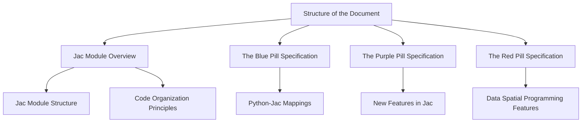

# The Jac Programming Language

This document serves a dual purpose. It provides an introductory guide to understanding the Jac programming language and also offers a full specification of its features, conventions, and best practices.

The document is organized into several distinct parts, each covering a different aspect of the language to provide a comprehensive overview of Jac.

## Structure of the Document

The specification begins with a discussion of the general structure of a Jac module and an overview of code organization principles. This section will provide a broad understanding of how Jac programs are structured and organized.

Following the overview, the document is further divided into three main parts: The Blue Pill, The Purple Pill, and The Red Pill specifications.

### Jac Module Overview

In the first section we examine the diverse set of constructs that make up a Jac module (.jac file). We also touch on a number of key high level design decisions and thought processes for how code is organized to be Jactastic!

If you're a Python hacker that just wants to see how to utilize Jac quickly, jump to Blue, the overview covers many new concepts that are part of the langauge that may feel like a lot.

### The Blue Pill Specification

The Blue Pill section covers the features of Jac that have a direct one-to-one mapping with Python. This section aims to illustrate how typical Python solutions can be implemented in a 'Jactastic' way. By examining these parallels, Python programmers transitioning to Jac can gain a deeper understanding of Jac’s unique characteristics, while leveraging their existing knowledge of Python.

### The Purple Pill Specification

The Purple Pill section delves into the newly introduced features in Jac that build upon and extend the current OOP / procedural model in Python. These enhancements are designed to make coding easier, more efficient, and more robust, thus improving the overall developer experience. This section provides an in-depth exploration of these innovative features and their practical applications.

### The Red Pill Specification

The Red Pill section provides a thorough examination of the language features related to the innovative data spatial programming model. This part of the document covers the new set of semantics and concepts that Jac realizes and provides examples and explanations on how these features can be used in data spatial programming. This exploration will provide a comprehensive understanding of this groundbreaking programming model and its advantages.

By exploring each of these sections, readers can gain a thorough understanding of Jac, its similarities and differences with Python, its innovative features, and the benefits of data spatial programming.
