## Module
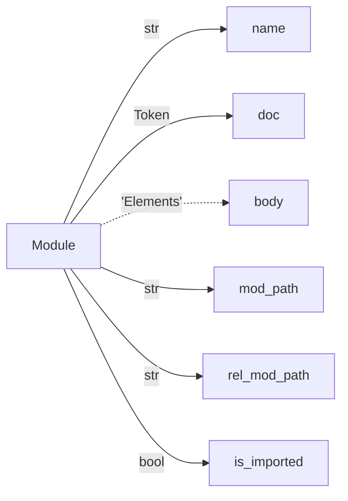

Whole Program node type for Jac Ast.

## Elements
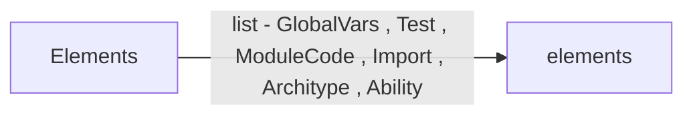

Elements node type for Jac Ast.

## OOPAccessNode


OOPAccessNode node type for Jac Ast.

## GlobalVars
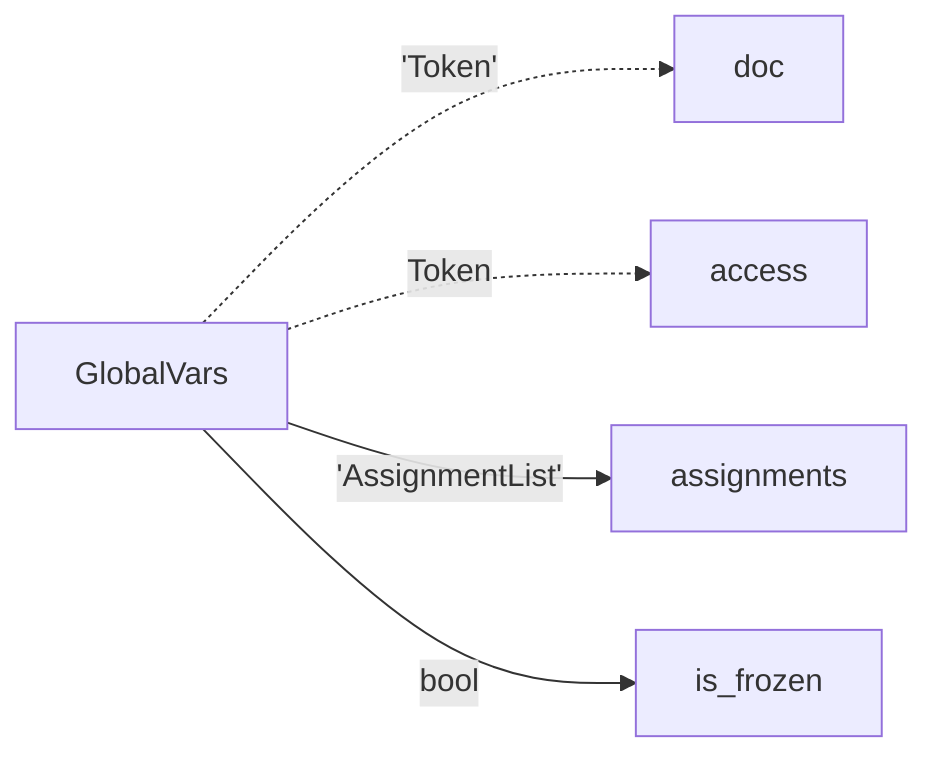

GlobalVars node type for Jac Ast.

## Test
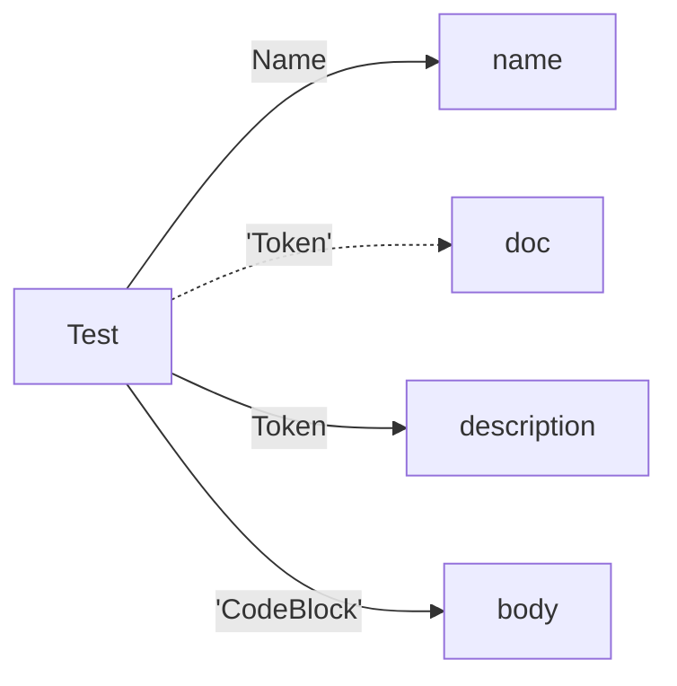

Test node type for Jac Ast.

## ModuleCode
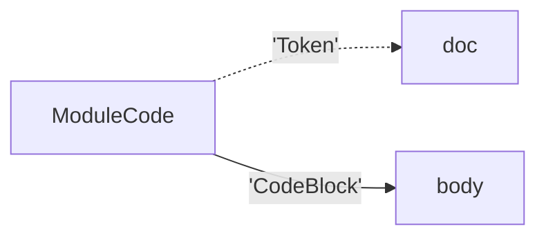

Free mod code for Jac Ast.

## Import
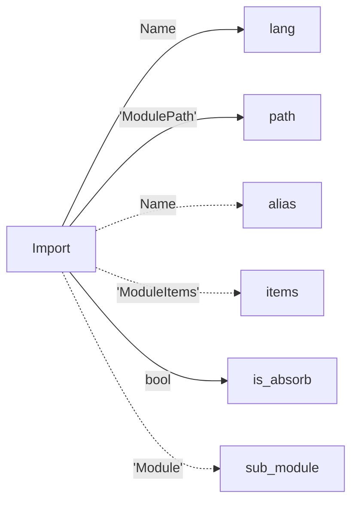

Import node type for Jac Ast.

## ModulePath


ModulePath node type for Jac Ast.

## ModuleItem
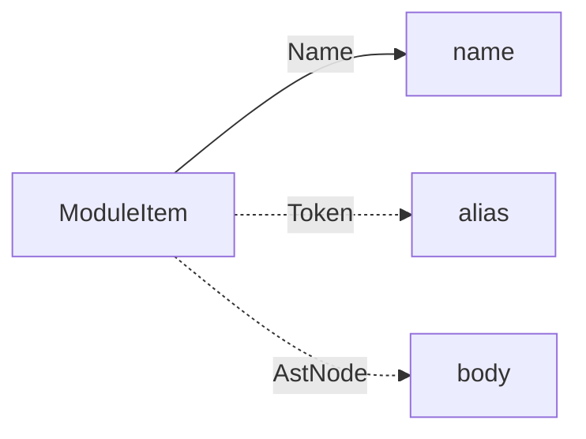

ModuleItem node type for Jac Ast.

## ModuleItems
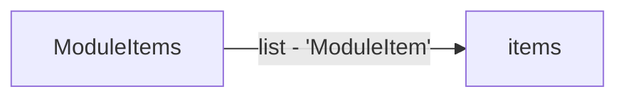

ModuleItems node type for Jac Ast.

## Architype
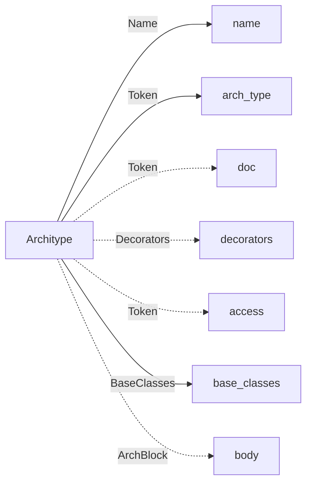

ObjectArch node type for Jac Ast.

## ArchDef
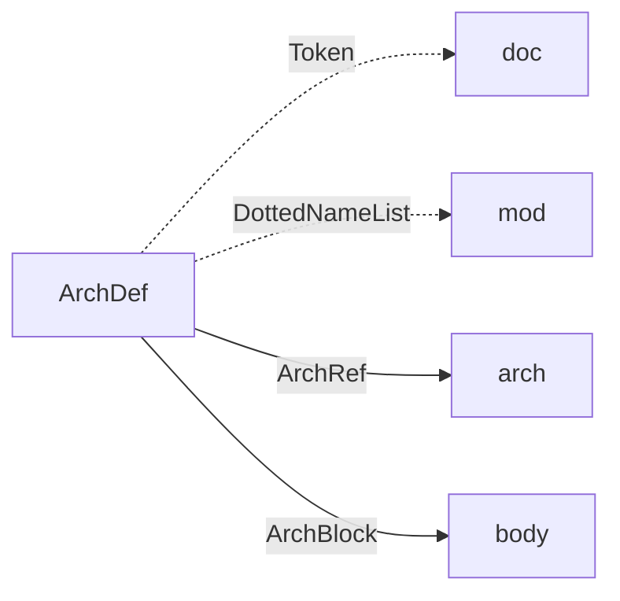

ArchDef node type for Jac Ast.

## Decorators


Decorators node type for Jac Ast.

## BaseClasses


BaseArch node type for Jac Ast.

## Ability
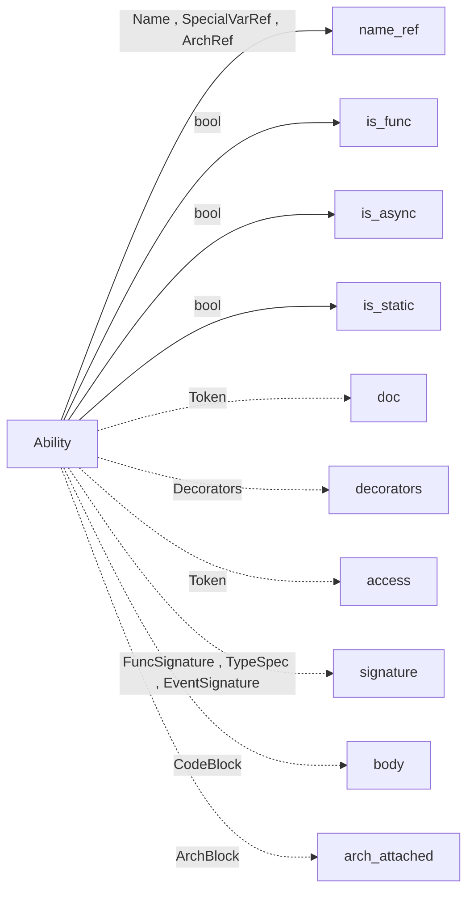

Ability node type for Jac Ast.

## AbilityDef
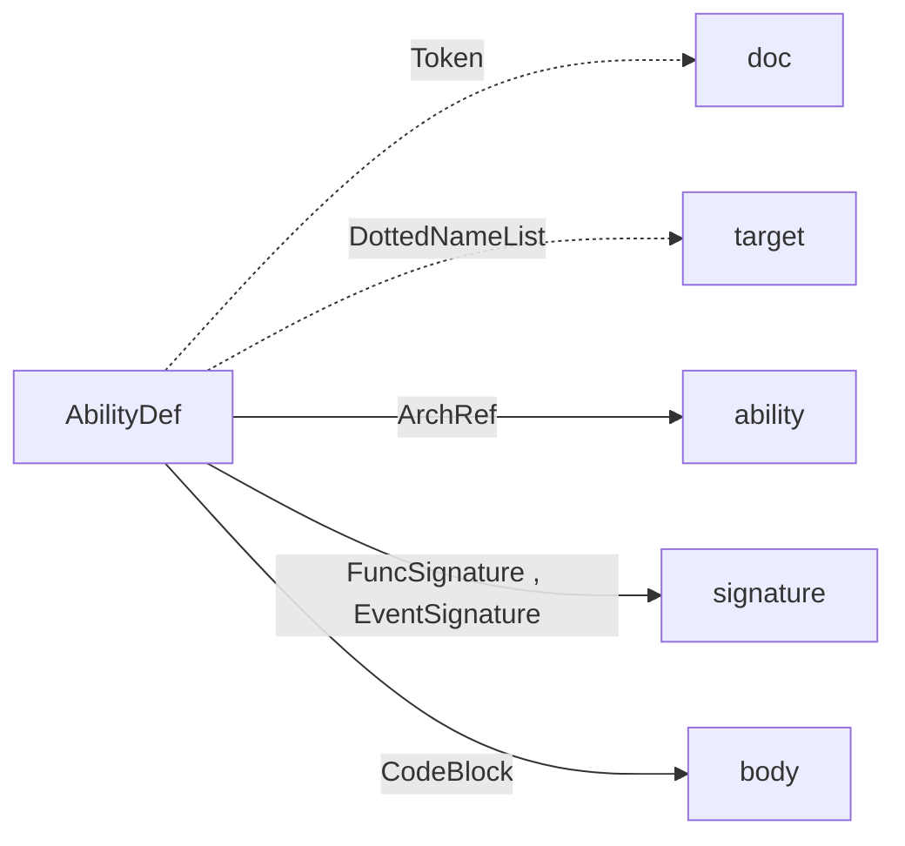

AbilityDef node type for Jac Ast.

## EventSignature
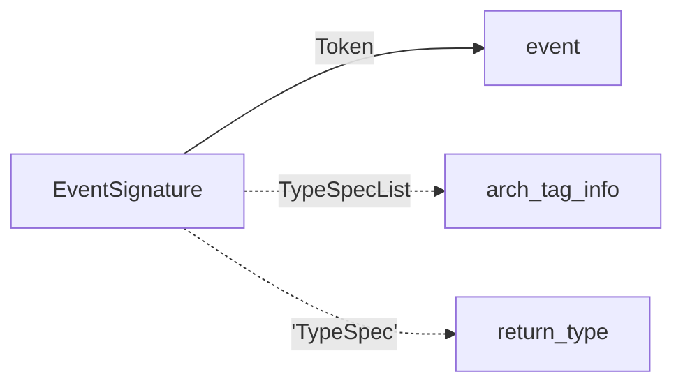

EventSignature node type for Jac Ast.

## DottedNameList


DottedNameList node type for Jac Ast.

## FuncSignature
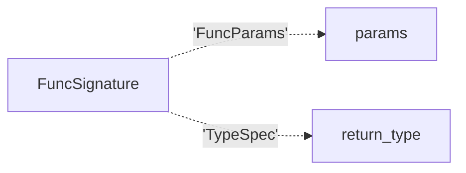

FuncSignature node type for Jac Ast.

## FuncParams


ArchBlock node type for Jac Ast.

## ParamVar
```mermaid
flowchart LR
ParamVar -->|Name| name
ParamVar -.->|Token| unpack
ParamVar -->|'TypeSpec'| type_tag
ParamVar -.->|ExprType| value
```

ParamVar node type for Jac Ast.

## Enum
```mermaid
flowchart LR
Enum -->|Name| name
Enum -.->|Token| doc
Enum -.->|'Decorators'| decorators
Enum -.->|Token| access
Enum -->|'BaseClasses'| base_classes
Enum -.->|'EnumBlock'| body
```

Enum node type for Jac Ast.

## EnumDef
```mermaid
flowchart LR
EnumDef -.->|Token| doc
EnumDef -->|ArchRef| enum
EnumDef -.->|DottedNameList| mod
EnumDef -->|EnumBlock| body
```

EnumDef node type for Jac Ast.

## EnumBlock
```mermaid
flowchart LR
EnumBlock -->|list - 'Name,Assignment'| stmts
```

EnumBlock node type for Jac Ast.

## ArchBlock
```mermaid
flowchart LR
ArchBlock -->|list - 'ArchHas , Ability'| members
```

ArchBlock node type for Jac Ast.

## ArchHas
```mermaid
flowchart LR
ArchHas -.->|Token| doc
ArchHas -->|bool| is_static
ArchHas -.->|Token| access
ArchHas -->|'HasVarList'| vars
ArchHas -->|bool| is_frozen
```

HasStmt node type for Jac Ast.

## HasVar
```mermaid
flowchart LR
HasVar -->|Name| name
HasVar -->|'TypeSpec'| type_tag
HasVar -.->|ExprType| value
```

HasVar node type for Jac Ast.

## HasVarList
```mermaid
flowchart LR
HasVarList -->|list - 'HasVar'| vars
```

HasVarList node type for Jac Ast.

## TypeSpec
```mermaid
flowchart LR
TypeSpec -->|Token , DottedNameList| spec_type
TypeSpec -->|TypeSpec| list_nest
TypeSpec -->|TypeSpec| dict_nest
TypeSpec -->|bool| null_ok
```

TypeSpec node type for Jac Ast.

## TypeSpecList
```mermaid
flowchart LR
TypeSpecList -->|list - TypeSpec| types
```

TypeSpecList node type for Jac Ast.

## CodeBlock
```mermaid
flowchart LR
CodeBlock -->|list - StmtType| stmts
```

CodeBlock node type for Jac Ast.

## TypedCtxBlock
```mermaid
flowchart LR
TypedCtxBlock -->|TypeSpecList| type_ctx
TypedCtxBlock -->|CodeBlock| body
```

TypedCtxBlock node type for Jac Ast.

## IfStmt
```mermaid
flowchart LR
IfStmt -->|ExprType| condition
IfStmt -->|'CodeBlock'| body
IfStmt -.->|'ElseIfs'| elseifs
IfStmt -.->|'ElseStmt'| else_body
```

IfStmt node type for Jac Ast.

## ElseIfs
```mermaid
flowchart LR
ElseIfs -->|list - 'IfStmt'| elseifs
```

ElseIfs node type for Jac Ast.

## ElseStmt
```mermaid
flowchart LR
ElseStmt -->|'CodeBlock'| body
```

Else node type for Jac Ast.

## TryStmt
```mermaid
flowchart LR
TryStmt -->|'CodeBlock'| body
TryStmt -.->|'ExceptList'| excepts
TryStmt -.->|'FinallyStmt'| finally_body
```

TryStmt node type for Jac Ast.

## Except
```mermaid
flowchart LR
Except -->|ExprType| ex_type
Except -.->|Token| name
Except -->|'CodeBlock'| body
```

Except node type for Jac Ast.

## ExceptList
```mermaid
flowchart LR
ExceptList -->|list - 'Except'| excepts
```

ExceptList node type for Jac Ast.

## FinallyStmt
```mermaid
flowchart LR
FinallyStmt -->|'CodeBlock'| body
```

FinallyStmt node type for Jac Ast.

## IterForStmt
```mermaid
flowchart LR
IterForStmt -->|'Assignment'| iter
IterForStmt -->|ExprType| condition
IterForStmt -->|ExprType| count_by
IterForStmt -->|'CodeBlock'| body
```

IterFor node type for Jac Ast.

## InForStmt
```mermaid
flowchart LR
InForStmt -->|NameList| name_list
InForStmt -->|ExprType| collection
InForStmt -->|CodeBlock| body
```

InFor node type for Jac Ast.

## Name
```mermaid
flowchart LR
Name -->|str| name
Name -->|str| value
Name -->|int| col_start
Name -->|int| col_end_
Name -->|bool| already_declared
```

Name node type for Jac Ast.

## NameList
```mermaid
flowchart LR
NameList -->|list - Name| names
```

NameList node type for Jac Ast.

## WhileStmt
```mermaid
flowchart LR
WhileStmt -->|ExprType| condition
WhileStmt -->|'CodeBlock'| body
```

WhileStmt node type for Jac Ast.

## WithStmt
```mermaid
flowchart LR
WithStmt -->|'ExprAsItemList'| exprs
WithStmt -->|'CodeBlock'| body
```

WithStmt node type for Jac Ast.

## ExprAsItem
```mermaid
flowchart LR
ExprAsItem -->|ExprType| expr
ExprAsItem -.->|Name| alias
```

ExprAsItem node type for Jac Ast.

## ExprAsItemList
```mermaid
flowchart LR
ExprAsItemList -->|list - 'ExprAsItem'| items
```

ExprAsItemList node type for Jac Ast.

## RaiseStmt
```mermaid
flowchart LR
RaiseStmt -.->|ExprType| cause
```

RaiseStmt node type for Jac Ast.

## AssertStmt
```mermaid
flowchart LR
AssertStmt -->|ExprType| condition
AssertStmt -.->|ExprType| error_msg
```

AssertStmt node type for Jac Ast.

## CtrlStmt
```mermaid
flowchart LR
CtrlStmt -->|Token| ctrl
```

CtrlStmt node type for Jac Ast.

## DeleteStmt
```mermaid
flowchart LR
DeleteStmt -->|ExprType| target
```

DeleteStmt node type for Jac Ast.

## ReportStmt
```mermaid
flowchart LR
ReportStmt -->|ExprType| expr
```

ReportStmt node type for Jac Ast.

## ReturnStmt
```mermaid
flowchart LR
ReturnStmt -.->|ExprType| expr
```

ReturnStmt node type for Jac Ast.

## YieldStmt
```mermaid
flowchart LR
YieldStmt -.->|ExprType| expr
```

YieldStmt node type for Jac Ast.

## IgnoreStmt
```mermaid
flowchart LR
IgnoreStmt -->|ExprType| target
```

IgnoreStmt node type for Jac Ast.

## VisitStmt
```mermaid
flowchart LR
VisitStmt -.->|Token| vis_type
VisitStmt -->|ExprType| target
VisitStmt -.->|'ElseStmt'| else_body
VisitStmt -->|bool| from_walker
```

VisitStmt node type for Jac Ast.

## RevisitStmt
```mermaid
flowchart LR
RevisitStmt -.->|ExprType| hops
RevisitStmt -.->|'ElseStmt'| else_body
```

ReVisitStmt node type for Jac Ast.

## DisengageStmt
```mermaid
flowchart LR
DisengageStmt -->|bool| from_walker
```

DisengageStmt node type for Jac Ast.

## AwaitStmt
```mermaid
flowchart LR
AwaitStmt -->|ExprType| target
```

AwaitStmt node type for Jac Ast.

## Assignment
```mermaid
flowchart LR
Assignment -->|bool| is_static
Assignment -->|'AtomType'| target
Assignment -->|ExprType| value
Assignment -->|bool| mutable
```

Assignment node type for Jac Ast.

## BinaryExpr
```mermaid
flowchart LR
BinaryExpr -->|ExprType| left
BinaryExpr -->|ExprType| right
BinaryExpr -->|Token , DisconnectOp , ConnectOp| op
```

ExprBinary node type for Jac Ast.

## IfElseExpr
```mermaid
flowchart LR
IfElseExpr -->|'BinaryExpr , IfElseExpr'| condition
IfElseExpr -->|ExprType| value
IfElseExpr -->|ExprType| else_value
```

ExprIfElse node type for Jac Ast.

## UnaryExpr
```mermaid
flowchart LR
UnaryExpr -->|ExprType| operand
UnaryExpr -->|Token| op
```

ExprUnary node type for Jac Ast.

## UnpackExpr
```mermaid
flowchart LR
UnpackExpr -->|ExprType| target
UnpackExpr -->|bool| is_dict
```

ExprUnpack node type for Jac Ast.

## MultiString
```mermaid
flowchart LR
MultiString -->|list - 'Token , FString'| strings
```

ExprMultiString node type for Jac Ast.

## ExprList
```mermaid
flowchart LR
ExprList -->|list - ExprType| values
```

ExprList node type for Jac Ast.

## ListVal
```mermaid
flowchart LR
ListVal -->|list - ExprType| values
```

ListVal node type for Jac Ast.

## SetVal
```mermaid
flowchart LR
SetVal -->|list - ExprType| values
```

SetVal node type for Jac Ast.

## TupleVal
```mermaid
flowchart LR
TupleVal -.->|ExprType| first_expr
TupleVal -.->|ExprList| exprs
TupleVal -.->|AssignmentList| assigns
```

TupleVal node type for Jac Ast.

## DictVal
```mermaid
flowchart LR
DictVal -->|list - 'KVPair'| kv_pairs
```

ExprDict node type for Jac Ast.

## InnerCompr
```mermaid
flowchart LR
InnerCompr -->|ExprType| out_expr
InnerCompr -->|NameList| name_list
InnerCompr -->|ExprType| collection
InnerCompr -.->|ExprType| conditional
InnerCompr -->|bool| is_list
InnerCompr -->|bool| is_gen
InnerCompr -->|bool| is_set
```

ListCompr node type for Jac Ast.

## DictCompr
```mermaid
flowchart LR
DictCompr -->|ExprType| outk_expr
DictCompr -->|ExprType| outv_expr
DictCompr -->|NameList| name_list
DictCompr -->|ExprType| collection
DictCompr -.->|ExprType| conditional
```

DictCompr node type for Jac Ast.

## KVPair
```mermaid
flowchart LR
KVPair -->|ExprType| key
KVPair -->|ExprType| value
```

ExprKVPair node type for Jac Ast.

## AtomTrailer
```mermaid
flowchart LR
AtomTrailer -->|'AtomType'| target
AtomTrailer -->|'IndexSlice , ArchRef , Token'| right
AtomTrailer -->|bool| null_ok
```

AtomTrailer node type for Jac Ast.

## FuncCall
```mermaid
flowchart LR
FuncCall -->|'AtomType'| target
FuncCall -.->|'ParamList'| params
```

FuncCall node type for Jac Ast.

## ParamList
```mermaid
flowchart LR
ParamList -.->|ExprList| p_args
ParamList -.->|'AssignmentList'| p_kwargs
```

ParamList node type for Jac Ast.

## AssignmentList
```mermaid
flowchart LR
AssignmentList -->|list - 'Assignment'| values
```

AssignmentList node type for Jac Ast.

## IndexSlice
```mermaid
flowchart LR
IndexSlice -.->|ExprType| start
IndexSlice -.->|ExprType| stop
IndexSlice -->|bool| is_range
```

IndexSlice node type for Jac Ast.

## ArchRef
```mermaid
flowchart LR
ArchRef -->|Name , SpecialVarRef| name_ref
ArchRef -->|Token| arch
```

GlobalRef node type for Jac Ast.

## SpecialVarRef
```mermaid
flowchart LR
SpecialVarRef -->|Token| var
```

HereRef node type for Jac Ast.

## EdgeOpRef
```mermaid
flowchart LR
EdgeOpRef -.->|ExprType| filter_type
EdgeOpRef -.->|FilterCompr| filter_cond
EdgeOpRef -->|EdgeDir| edge_dir
EdgeOpRef -->|bool| from_walker
```

EdgeOpRef node type for Jac Ast.

## DisconnectOp
```mermaid
flowchart LR
DisconnectOp -.->|ExprType| filter_type
DisconnectOp -.->|FilterCompr| filter_cond
DisconnectOp -->|EdgeDir| edge_dir
DisconnectOp -->|bool| from_walker
```

DisconnectOpRef node type for Jac Ast.

## ConnectOp
```mermaid
flowchart LR
ConnectOp -.->|ExprType| conn_type
ConnectOp -.->|AssignmentList| conn_assign
ConnectOp -->|EdgeDir| edge_dir
```

ConnectOpRef node type for Jac Ast.

## FilterCompr
```mermaid
flowchart LR
FilterCompr -->|list - BinaryExpr| compares
```

FilterCtx node type for Jac Ast.

## FString
```mermaid
flowchart LR
FString -->|list - 'Token , ExprType'| parts
```

FString node type for Jac Ast.

## Parse
```mermaid
flowchart LR
Parse -->|str| name
```

Parse node type for Jac Ast.

## Token
```mermaid
flowchart LR
Token -->|str| name
Token -->|str| value
Token -->|int| col_start
Token -->|int| col_end_
```

Token node type for Jac Ast.

## Constant
```mermaid
flowchart LR
Constant -->|str| name
Constant -->|str| value
Constant -->|int| col_start
Constant -->|int| col_end_
Constant -->|type| typ
```

Constant node type for Jac Ast.


