```mermaid
graph TD
```
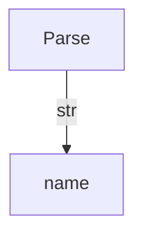
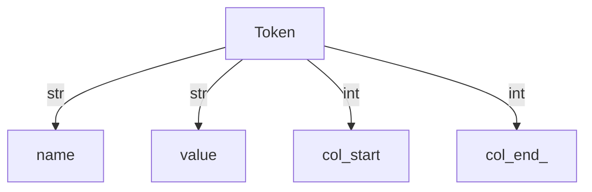
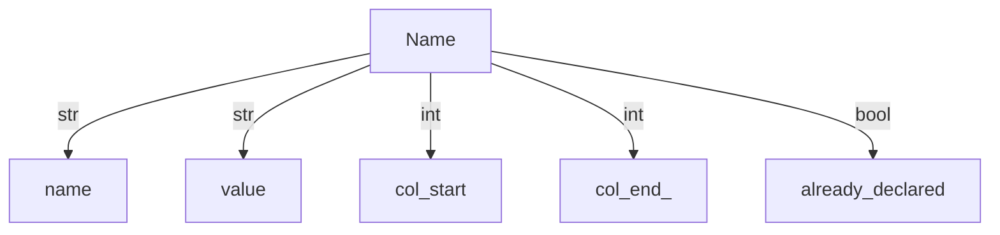
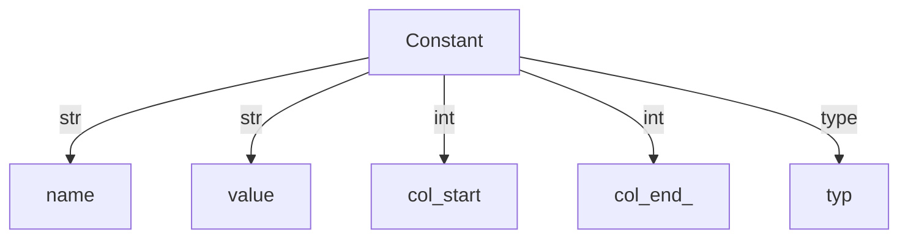
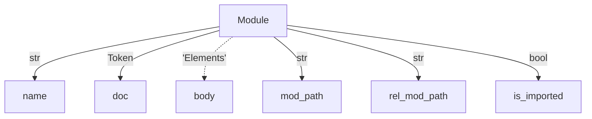
```mermaid
graph TD
Elements -->|list[GlobalVars | Test | ModuleCode | Import | Architype | Ability]| elements
```
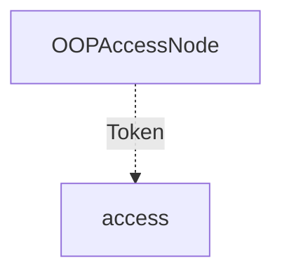
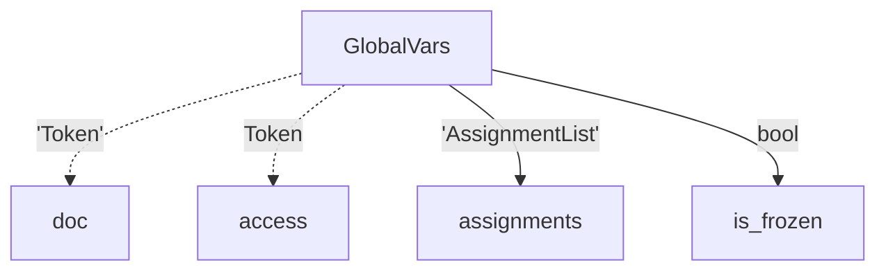
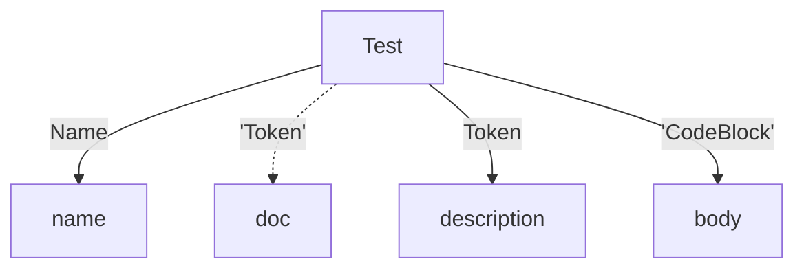
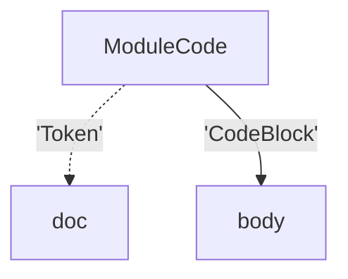
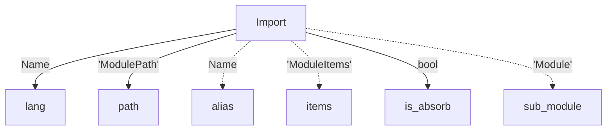
```mermaid
graph TD
ModulePath -->|list[Token]| path
```
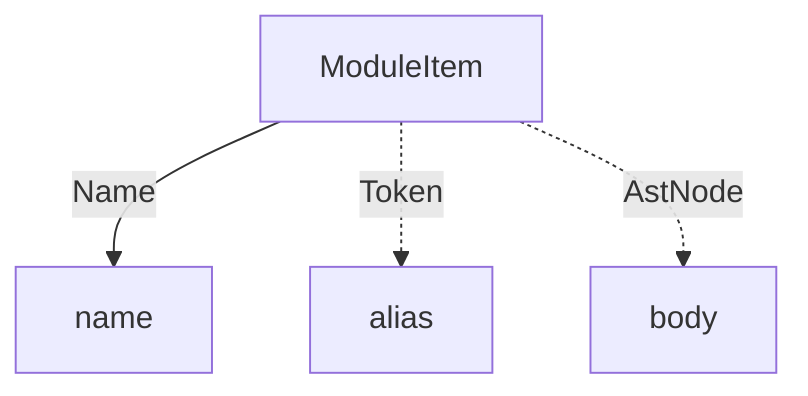
```mermaid
graph TD
ModuleItems -->|list['ModuleItem']| items
```
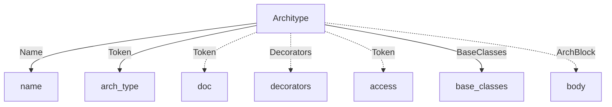
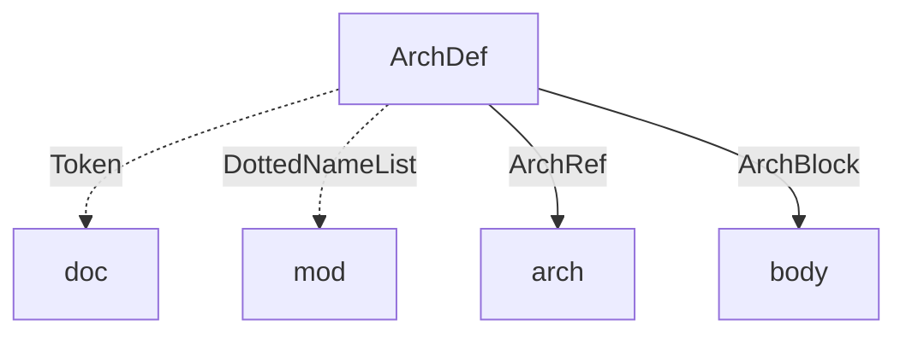
```mermaid
graph TD
Decorators -->|list[ExprType]| calls
```
```mermaid
graph TD
BaseClasses -->|list[DottedNameList]| base_classes
```
```mermaid
graph TD
Ability -->|Name | SpecialVarRef | ArchRef| name_ref
Ability -->|bool| is_func
Ability -->|bool| is_async
Ability -->|bool| is_static
Ability -.->|Token| doc
Ability -.->|Decorators| decorators
Ability -.->|Token| access
Ability -.->|FuncSignature | TypeSpec | EventSignature| signature
Ability -.->|CodeBlock| body
Ability -.->|ArchBlock| arch_attached
```
```mermaid
graph TD
AbilityDef -.->|Token| doc
AbilityDef -.->|DottedNameList| target
AbilityDef -->|ArchRef| ability
AbilityDef -->|FuncSignature | EventSignature| signature
AbilityDef -->|CodeBlock| body
```
```mermaid
graph TD
EventSignature -->|Token| event
EventSignature -.->|TypeSpecList| arch_tag_info
EventSignature -.->|'TypeSpec'| return_type
```
```mermaid
graph TD
DottedNameList -->|list[Token | SpecialVarRef | ArchRef | Name]| names
```
```mermaid
graph TD
FuncSignature -.->|'FuncParams'| params
FuncSignature -.->|'TypeSpec'| return_type
```
```mermaid
graph TD
FuncParams -->|list['ParamVar']| params
```
```mermaid
graph TD
ParamVar -->|Name| name
ParamVar -.->|Token| unpack
ParamVar -->|'TypeSpec'| type_tag
ParamVar -.->|ExprType| value
```
```mermaid
graph TD
Enum -->|Name| name
Enum -.->|Token| doc
Enum -.->|'Decorators'| decorators
Enum -.->|Token| access
Enum -->|'BaseClasses'| base_classes
Enum -.->|'EnumBlock'| body
```
```mermaid
graph TD
EnumDef -.->|Token| doc
EnumDef -->|ArchRef| enum
EnumDef -.->|DottedNameList| mod
EnumDef -->|EnumBlock| body
```
```mermaid
graph TD
EnumBlock -->|list['Name|Assignment']| stmts
```
```mermaid
graph TD
ArchBlock -->|list['ArchHas | Ability']| members
```
```mermaid
graph TD
ArchHas -.->|Token| doc
ArchHas -->|bool| is_static
ArchHas -.->|Token| access
ArchHas -->|'HasVarList'| vars
ArchHas -->|bool| is_frozen
```
```mermaid
graph TD
HasVar -->|Name| name
HasVar -->|'TypeSpec'| type_tag
HasVar -.->|ExprType| value
```
```mermaid
graph TD
HasVarList -->|list['HasVar']| vars
```
```mermaid
graph TD
TypeSpec -->|Token | DottedNameList| spec_type
TypeSpec -->|TypeSpec| list_nest
TypeSpec -->|TypeSpec| dict_nest
TypeSpec -->|bool| null_ok
```
```mermaid
graph TD
TypeSpecList -->|list[TypeSpec]| types
```
```mermaid
graph TD
CodeBlock -->|list[StmtType]| stmts
```
```mermaid
graph TD
TypedCtxBlock -->|TypeSpecList| type_ctx
TypedCtxBlock -->|CodeBlock| body
```
```mermaid
graph TD
IfStmt -->|ExprType| condition
IfStmt -->|'CodeBlock'| body
IfStmt -.->|'ElseIfs'| elseifs
IfStmt -.->|'ElseStmt'| else_body
```
```mermaid
graph TD
ElseIfs -->|list['IfStmt']| elseifs
```
```mermaid
graph TD
ElseStmt -->|'CodeBlock'| body
```
```mermaid
graph TD
TryStmt -->|'CodeBlock'| body
TryStmt -.->|'ExceptList'| excepts
TryStmt -.->|'FinallyStmt'| finally_body
```
```mermaid
graph TD
Except -->|ExprType| ex_type
Except -.->|Token| name
Except -->|'CodeBlock'| body
```
```mermaid
graph TD
ExceptList -->|list['Except']| excepts
```
```mermaid
graph TD
FinallyStmt -->|'CodeBlock'| body
```
```mermaid
graph TD
IterForStmt -->|'Assignment'| iter
IterForStmt -->|ExprType| condition
IterForStmt -->|ExprType| count_by
IterForStmt -->|'CodeBlock'| body
```
```mermaid
graph TD
InForStmt -->|NameList| name_list
InForStmt -->|ExprType| collection
InForStmt -->|CodeBlock| body
```
```mermaid
graph TD
NameList -->|list[Name]| names
```
```mermaid
graph TD
WhileStmt -->|ExprType| condition
WhileStmt -->|'CodeBlock'| body
```
```mermaid
graph TD
WithStmt -->|'ExprAsItemList'| exprs
WithStmt -->|'CodeBlock'| body
```
```mermaid
graph TD
ExprAsItem -->|ExprType| expr
ExprAsItem -.->|Name| alias
```
```mermaid
graph TD
ExprAsItemList -->|list['ExprAsItem']| items
```
```mermaid
graph TD
RaiseStmt -.->|ExprType| cause
```
```mermaid
graph TD
AssertStmt -->|ExprType| condition
AssertStmt -.->|ExprType| error_msg
```
```mermaid
graph TD
CtrlStmt -->|Token| ctrl
```
```mermaid
graph TD
DeleteStmt -->|ExprType| target
```
```mermaid
graph TD
ReportStmt -->|ExprType| expr
```
```mermaid
graph TD
ReturnStmt -.->|ExprType| expr
```
```mermaid
graph TD
YieldStmt -.->|ExprType| expr
```
```mermaid
graph TD
IgnoreStmt -->|ExprType| target
```
```mermaid
graph TD
VisitStmt -.->|Token| vis_type
VisitStmt -->|ExprType| target
VisitStmt -.->|'ElseStmt'| else_body
VisitStmt -->|bool| from_walker
```
```mermaid
graph TD
RevisitStmt -.->|ExprType| hops
RevisitStmt -.->|'ElseStmt'| else_body
```
```mermaid
graph TD
DisengageStmt -->|bool| from_walker
```
```mermaid
graph TD
AwaitStmt -->|ExprType| target
```
```mermaid
graph TD
Assignment -->|bool| is_static
Assignment -->|'AtomType'| target
Assignment -->|ExprType| value
Assignment -->|bool| mutable
```
```mermaid
graph TD
BinaryExpr -->|ExprType| left
BinaryExpr -->|ExprType| right
BinaryExpr -->|Token | DisconnectOp | ConnectOp| op
```
```mermaid
graph TD
IfElseExpr -->|'BinaryExpr | IfElseExpr'| condition
IfElseExpr -->|ExprType| value
IfElseExpr -->|ExprType| else_value
```
```mermaid
graph TD
UnaryExpr -->|ExprType| operand
UnaryExpr -->|Token| op
```
```mermaid
graph TD
UnpackExpr -->|ExprType| target
UnpackExpr -->|bool| is_dict
```
```mermaid
graph TD
MultiString -->|list['Token | FString']| strings
```
```mermaid
graph TD
ExprList -->|list[ExprType]| values
```
```mermaid
graph TD
ListVal -->|list[ExprType]| values
```
```mermaid
graph TD
SetVal -->|list[ExprType]| values
```
```mermaid
graph TD
TupleVal -.->|ExprType| first_expr
TupleVal -.->|ExprList| exprs
TupleVal -.->|AssignmentList| assigns
```
```mermaid
graph TD
DictVal -->|list['KVPair']| kv_pairs
```
```mermaid
graph TD
InnerCompr -->|ExprType| out_expr
InnerCompr -->|NameList| name_list
InnerCompr -->|ExprType| collection
InnerCompr -.->|ExprType| conditional
InnerCompr -->|bool| is_list
InnerCompr -->|bool| is_gen
InnerCompr -->|bool| is_set
```
```mermaid
graph TD
DictCompr -->|ExprType| outk_expr
DictCompr -->|ExprType| outv_expr
DictCompr -->|NameList| name_list
DictCompr -->|ExprType| collection
DictCompr -.->|ExprType| conditional
```
```mermaid
graph TD
KVPair -->|ExprType| key
KVPair -->|ExprType| value
```
```mermaid
graph TD
AtomTrailer -->|'AtomType'| target
AtomTrailer -->|'IndexSlice | ArchRef | Token'| right
AtomTrailer -->|bool| null_ok
```
```mermaid
graph TD
FuncCall -->|'AtomType'| target
FuncCall -.->|'ParamList'| params
```
```mermaid
graph TD
ParamList -.->|ExprList| p_args
ParamList -.->|'AssignmentList'| p_kwargs
```
```mermaid
graph TD
AssignmentList -->|list['Assignment']| values
```
```mermaid
graph TD
IndexSlice -.->|ExprType| start
IndexSlice -.->|ExprType| stop
IndexSlice -->|bool| is_range
```
```mermaid
graph TD
ArchRef -->|Name | SpecialVarRef| name_ref
ArchRef -->|Token| arch
```
```mermaid
graph TD
SpecialVarRef -->|Token| var
```
```mermaid
graph TD
EdgeOpRef -.->|ExprType| filter_type
EdgeOpRef -.->|FilterCompr| filter_cond
EdgeOpRef -->|EdgeDir| edge_dir
EdgeOpRef -->|bool| from_walker
```
```mermaid
graph TD
DisconnectOp -.->|ExprType| filter_type
DisconnectOp -.->|FilterCompr| filter_cond
DisconnectOp -->|EdgeDir| edge_dir
DisconnectOp -->|bool| from_walker
```
```mermaid
graph TD
ConnectOp -.->|ExprType| conn_type
ConnectOp -.->|AssignmentList| conn_assign
ConnectOp -->|EdgeDir| edge_dir
```
```mermaid
graph TD
FilterCompr -->|list[BinaryExpr]| compares
```
```mermaid
graph TD
FString -->|list['Token | ExprType']| parts
```

