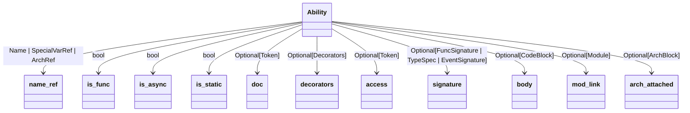

```mermaid
classDiagram
AbilityDef --> doc: Optional[Token]
AbilityDef --> target: Optional[DottedNameList]
AbilityDef --> ability: ArchRef
AbilityDef --> signature: FuncSignature | EventSignature
AbilityDef --> body: CodeBlock
AbilityDef --> mod_link: Optional[Module]
```
```mermaid
classDiagram
EventSignature --> event: Token
EventSignature --> arch_tag_info: Optional[TypeSpecList]
EventSignature --> return_type: Optional['TypeSpec']
EventSignature --> mod_link: Optional[Module]
```
```mermaid
classDiagram
DottedNameList --> names: list[Token | SpecialVarRef | ArchRef | Name]
DottedNameList --> mod_link: Optional[Module]
```
```mermaid
classDiagram
FuncSignature --> params: Optional['FuncParams']
FuncSignature --> return_type: Optional['TypeSpec']
FuncSignature --> mod_link: Optional[Module]
```
```mermaid
classDiagram
FuncParams --> params: list['ParamVar']
FuncParams --> mod_link: Optional[Module]
```
```mermaid
classDiagram
ParamVar --> name: Name
ParamVar --> unpack: Optional[Token]
ParamVar --> type_tag: 'TypeSpec'
ParamVar --> value: Optional[ExprType]
ParamVar --> mod_link: Optional[Module]
```
```mermaid
classDiagram
Enum --> name: Name
Enum --> doc: Optional[Token]
Enum --> decorators: Optional['Decorators']
Enum --> access: Optional[Token]
Enum --> base_classes: 'BaseClasses'
Enum --> body: Optional['EnumBlock']
Enum --> mod_link: Optional[Module]
```
```mermaid
classDiagram
EnumDef --> doc: Optional[Token]
EnumDef --> enum: ArchRef
EnumDef --> mod: Optional[DottedNameList]
EnumDef --> body: EnumBlock
EnumDef --> mod_link: Optional[Module]
```
```mermaid
classDiagram
EnumBlock --> stmts: list['Name|Assignment']
EnumBlock --> mod_link: Optional[Module]
```
```mermaid
classDiagram
ArchBlock --> members: list['ArchHas | Ability']
ArchBlock --> mod_link: Optional[Module]
```
```mermaid
classDiagram
ArchHas --> doc: Optional[Token]
ArchHas --> is_static: bool
ArchHas --> access: Optional[Token]
ArchHas --> vars: 'HasVarList'
ArchHas --> is_frozen: bool
ArchHas --> mod_link: Optional[Module]
```
```mermaid
classDiagram
HasVar --> name: Name
HasVar --> type_tag: 'TypeSpec'
HasVar --> value: Optional[ExprType]
HasVar --> mod_link: Optional[Module]
```
```mermaid
classDiagram
HasVarList --> vars: list['HasVar']
HasVarList --> mod_link: Optional[Module]
```
```mermaid
classDiagram
TypeSpec --> spec_type: Token | DottedNameList
TypeSpec --> list_nest: TypeSpec
TypeSpec --> dict_nest: TypeSpec
TypeSpec --> null_ok: bool
TypeSpec --> mod_link: Optional[Module]
```
```mermaid
classDiagram
TypeSpecList --> types: list[TypeSpec]
TypeSpecList --> mod_link: Optional[Module]
```
```mermaid
classDiagram
CodeBlock --> stmts: list[StmtType]
CodeBlock --> mod_link: Optional[Module]
```
```mermaid
classDiagram
TypedCtxBlock --> type_ctx: TypeSpecList
TypedCtxBlock --> body: CodeBlock
TypedCtxBlock --> mod_link: Optional[Module]
```
```mermaid
classDiagram
IfStmt --> condition: ExprType
IfStmt --> body: 'CodeBlock'
IfStmt --> elseifs: Optional['ElseIfs']
IfStmt --> else_body: Optional['ElseStmt']
IfStmt --> mod_link: Optional[Module]
```
```mermaid
classDiagram
ElseIfs --> elseifs: list['IfStmt']
ElseIfs --> mod_link: Optional[Module]
```
```mermaid
classDiagram
ElseStmt --> body: 'CodeBlock'
ElseStmt --> mod_link: Optional[Module]
```
```mermaid
classDiagram
TryStmt --> body: 'CodeBlock'
TryStmt --> excepts: Optional['ExceptList']
TryStmt --> finally_body: Optional['FinallyStmt']
TryStmt --> mod_link: Optional[Module]
```
```mermaid
classDiagram
Except --> ex_type: ExprType
Except --> name: Optional[Token]
Except --> body: 'CodeBlock'
Except --> mod_link: Optional[Module]
```
```mermaid
classDiagram
ExceptList --> excepts: list['Except']
ExceptList --> mod_link: Optional[Module]
```
```mermaid
classDiagram
FinallyStmt --> body: 'CodeBlock'
FinallyStmt --> mod_link: Optional[Module]
```
```mermaid
classDiagram
IterForStmt --> iter: 'Assignment'
IterForStmt --> condition: ExprType
IterForStmt --> count_by: ExprType
IterForStmt --> body: 'CodeBlock'
IterForStmt --> mod_link: Optional[Module]
```
```mermaid
classDiagram
InForStmt --> name_list: NameList
InForStmt --> collection: ExprType
InForStmt --> body: CodeBlock
InForStmt --> mod_link: Optional[Module]
```
```mermaid
classDiagram
NameList --> names: list[Name]
NameList --> mod_link: Optional[Module]
```
```mermaid
classDiagram
WhileStmt --> condition: ExprType
WhileStmt --> body: 'CodeBlock'
WhileStmt --> mod_link: Optional[Module]
```
```mermaid
classDiagram
WithStmt --> exprs: 'ExprAsItemList'
WithStmt --> body: 'CodeBlock'
WithStmt --> mod_link: Optional[Module]
```
```mermaid
classDiagram
ExprAsItem --> expr: ExprType
ExprAsItem --> alias: Optional[Name]
ExprAsItem --> mod_link: Optional[Module]
```
```mermaid
classDiagram
ExprAsItemList --> items: list['ExprAsItem']
ExprAsItemList --> mod_link: Optional[Module]
```
```mermaid
classDiagram
RaiseStmt --> cause: Optional[ExprType]
RaiseStmt --> mod_link: Optional[Module]
```
```mermaid
classDiagram
AssertStmt --> condition: ExprType
AssertStmt --> error_msg: Optional[ExprType]
AssertStmt --> mod_link: Optional[Module]
```
```mermaid
classDiagram
CtrlStmt --> ctrl: Token
CtrlStmt --> mod_link: Optional[Module]
```
```mermaid
classDiagram
DeleteStmt --> target: ExprType
DeleteStmt --> mod_link: Optional[Module]
```
```mermaid
classDiagram
ReportStmt --> expr: ExprType
ReportStmt --> mod_link: Optional[Module]
```
```mermaid
classDiagram
ReturnStmt --> expr: Optional[ExprType]
ReturnStmt --> mod_link: Optional[Module]
```
```mermaid
classDiagram
YieldStmt --> expr: Optional[ExprType]
YieldStmt --> mod_link: Optional[Module]
```
```mermaid
classDiagram
IgnoreStmt --> target: ExprType
IgnoreStmt --> mod_link: Optional[Module]
```
```mermaid
classDiagram
VisitStmt --> vis_type: Optional[Token]
VisitStmt --> target: ExprType
VisitStmt --> else_body: Optional['ElseStmt']
VisitStmt --> mod_link: Optional[Module]
VisitStmt --> from_walker: bool
```
```mermaid
classDiagram
RevisitStmt --> hops: Optional[ExprType]
RevisitStmt --> else_body: Optional['ElseStmt']
RevisitStmt --> mod_link: Optional[Module]
```
```mermaid
classDiagram
DisengageStmt --> mod_link: Optional[Module]
DisengageStmt --> from_walker: bool
```
```mermaid
classDiagram
AwaitStmt --> target: ExprType
AwaitStmt --> mod_link: Optional[Module]
```
```mermaid
classDiagram
Assignment --> is_static: bool
Assignment --> target: 'AtomType'
Assignment --> value: ExprType
Assignment --> mutable: bool
Assignment --> mod_link: Optional[Module]
```
```mermaid
classDiagram
BinaryExpr --> left: ExprType
BinaryExpr --> right: ExprType
BinaryExpr --> op: Token | DisconnectOp | ConnectOp
BinaryExpr --> mod_link: Optional[Module]
```
```mermaid
classDiagram
IfElseExpr --> condition: 'BinaryExpr | IfElseExpr'
IfElseExpr --> value: ExprType
IfElseExpr --> else_value: ExprType
IfElseExpr --> mod_link: Optional[Module]
```
```mermaid
classDiagram
UnaryExpr --> operand: ExprType
UnaryExpr --> op: Token
UnaryExpr --> mod_link: Optional[Module]
```
```mermaid
classDiagram
UnpackExpr --> target: ExprType
UnpackExpr --> is_dict: bool
UnpackExpr --> mod_link: Optional[Module]
```
```mermaid
classDiagram
MultiString --> strings: list['Token | FString']
MultiString --> mod_link: Optional[Module]
```
```mermaid
classDiagram
ExprList --> values: list[ExprType]
ExprList --> mod_link: Optional[Module]
```
```mermaid
classDiagram
ListVal --> values: list[ExprType]
ListVal --> mod_link: Optional[Module]
```
```mermaid
classDiagram
SetVal --> values: list[ExprType]
SetVal --> mod_link: Optional[Module]
```
```mermaid
classDiagram
TupleVal --> first_expr: Optional[ExprType]
TupleVal --> exprs: Optional[ExprList]
TupleVal --> assigns: Optional[AssignmentList]
TupleVal --> mod_link: Optional[Module]
```
```mermaid
classDiagram
DictVal --> kv_pairs: list['KVPair']
DictVal --> mod_link: Optional[Module]
```
```mermaid
classDiagram
InnerCompr --> out_expr: ExprType
InnerCompr --> name_list: NameList
InnerCompr --> collection: ExprType
InnerCompr --> conditional: Optional[ExprType]
InnerCompr --> is_list: bool
InnerCompr --> is_gen: bool
InnerCompr --> is_set: bool
InnerCompr --> mod_link: Optional[Module]
```
```mermaid
classDiagram
DictCompr --> outk_expr: ExprType
DictCompr --> outv_expr: ExprType
DictCompr --> name_list: NameList
DictCompr --> collection: ExprType
DictCompr --> conditional: Optional[ExprType]
DictCompr --> mod_link: Optional[Module]
```
```mermaid
classDiagram
KVPair --> key: ExprType
KVPair --> value: ExprType
KVPair --> mod_link: Optional[Module]
```
```mermaid
classDiagram
AtomTrailer --> target: 'AtomType'
AtomTrailer --> right: 'IndexSlice | ArchRef | Token'
AtomTrailer --> null_ok: bool
AtomTrailer --> mod_link: Optional[Module]
```
```mermaid
classDiagram
FuncCall --> target: 'AtomType'
FuncCall --> params: Optional['ParamList']
FuncCall --> mod_link: Optional[Module]
```
```mermaid
classDiagram
ParamList --> p_args: Optional[ExprList]
ParamList --> p_kwargs: Optional['AssignmentList']
ParamList --> mod_link: Optional[Module]
```
```mermaid
classDiagram
AssignmentList --> values: list['Assignment']
AssignmentList --> mod_link: Optional[Module]
```
```mermaid
classDiagram
IndexSlice --> start: Optional[ExprType]
IndexSlice --> stop: Optional[ExprType]
IndexSlice --> is_range: bool
IndexSlice --> mod_link: Optional[Module]
```
```mermaid
classDiagram
ArchRef --> name_ref: Name | SpecialVarRef
ArchRef --> arch: Token
ArchRef --> mod_link: Optional[Module]
```
```mermaid
classDiagram
SpecialVarRef --> var: Token
SpecialVarRef --> mod_link: Optional[Module]
```
```mermaid
classDiagram
EdgeOpRef --> filter_type: Optional[ExprType]
EdgeOpRef --> filter_cond: Optional[FilterCompr]
EdgeOpRef --> edge_dir: EdgeDir
EdgeOpRef --> mod_link: Optional[Module]
EdgeOpRef --> from_walker: bool
```
```mermaid
classDiagram
DisconnectOp --> filter_type: Optional[ExprType]
DisconnectOp --> filter_cond: Optional[FilterCompr]
DisconnectOp --> edge_dir: EdgeDir
DisconnectOp --> mod_link: Optional[Module]
DisconnectOp --> from_walker: bool
```
```mermaid
classDiagram
ConnectOp --> conn_type: Optional[ExprType]
ConnectOp --> conn_assign: Optional[AssignmentList]
ConnectOp --> edge_dir: EdgeDir
ConnectOp --> mod_link: Optional[Module]
```
```mermaid
classDiagram
FilterCompr --> compares: list[BinaryExpr]
FilterCompr --> mod_link: Optional[Module]
```
```mermaid
classDiagram
FString --> parts: list['Token | ExprType']
FString --> mod_link: Optional[Module]
```

