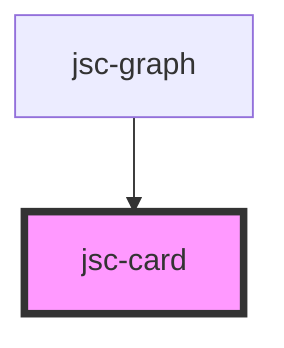

# my-component

<!-- Auto Generated Below -->

## Properties

| Property     | Attribute    | Description | Type                             | Default              |
| ------------ | ------------ | ----------- | -------------------------------- | -------------------- |
| `css`        | `css`        |             | `string`                         | `JSON.stringify({})` |
| `events`     | `events`     |             | `string`                         | `undefined`          |
| `name`       | `name`       |             | `string`                         | `undefined`          |
| `operations` | `operations` |             | `any`                            | `undefined`          |
| `radius`     | `radius`     |             | `"full" \| "lg" \| "md" \| "sm"` | `'lg'`               |
| `shadow`     | `shadow`     |             | `"lg" \| "md" \| "sm" \| "xl"`   | `'md'`               |
| `title`      | `title`      |             | `string`                         | `undefined`          |
| `variant`    | `variant`    |             | `"outline" \| "shadow"`          | `'outline'`          |

## Dependencies

### Used by

 - [jsc-graph](../jsc-graph)

### Graph

----------------------------------------------

*Built with [StencilJS](https://stenciljs.com/)*
