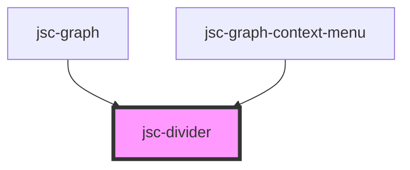

# my-component

<!-- Auto Generated Below -->

## Properties

| Property      | Attribute     | Description | Type     | Default                |
| ------------- | ------------- | ----------- | -------- | ---------------------- |
| `color`       | `color`       |             | `string` | `'rgb(206, 212, 218)'` |
| `css`         | `css`         |             | `string` | `JSON.stringify({})`   |
| `events`      | `events`      |             | `string` | `undefined`            |
| `label`       | `label`       |             | `string` | `undefined`            |
| `name`        | `name`        |             | `string` | `undefined`            |
| `operations`  | `operations`  |             | `any`    | `undefined`            |
| `orientation` | `orientation` |             | `string` | `undefined`            |
| `size`        | `size`        |             | `string` | `'1px'`                |

## Dependencies

### Used by

 - [jsc-graph](../jsc-graph)
 - [jsc-graph-context-menu](../jsc-graph)

### Graph

----------------------------------------------

*Built with [StencilJS](https://stenciljs.com/)*
