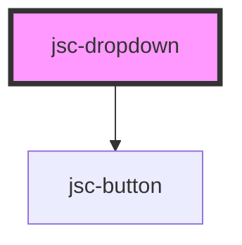

# my-component

<!-- Auto Generated Below -->

## Properties

| Property      | Attribute     | Description | Type     | Default              |
| ------------- | ------------- | ----------- | -------- | -------------------- |
| `buttonProps` | `buttonprops` |             | `string` | `undefined`          |
| `css`         | `css`         |             | `string` | `JSON.stringify({})` |
| `events`      | `events`      |             | `string` | `undefined`          |
| `items`       | `items`       |             | `string` | `undefined`          |
| `label`       | `label`       |             | `string` | `undefined`          |
| `name`        | `name`        |             | `string` | `undefined`          |
| `operations`  | `operations`  |             | `any`    | `undefined`          |

## Dependencies

### Depends on

- [jsc-button](../jsc-button)

### Graph

----------------------------------------------

*Built with [StencilJS](https://stenciljs.com/)*
