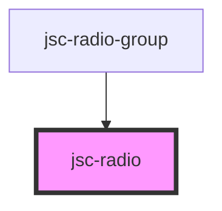

# my-component

<!-- Auto Generated Below -->

## Properties

| Property      | Attribute     | Description | Type                                                                                                       | Default              |
| ------------- | ------------- | ----------- | ---------------------------------------------------------------------------------------------------------- | -------------------- |
| `altLabel`    | `alt-label`   |             | `string`                                                                                                   | `undefined`          |
| `css`         | `css`         |             | `string`                                                                                                   | `JSON.stringify({})` |
| `events`      | `events`      |             | `string`                                                                                                   | `undefined`          |
| `fullwidth`   | `fullwidth`   |             | `string`                                                                                                   | `undefined`          |
| `label`       | `label`       |             | `string`                                                                                                   | `undefined`          |
| `name`        | `name`        |             | `string`                                                                                                   | `undefined`          |
| `operations`  | `operations`  |             | `string`                                                                                                   | `undefined`          |
| `palette`     | `palette`     |             | `"accent" \| "error" \| "ghost" \| "info" \| "link" \| "primary" \| "secondary" \| "success" \| "warning"` | `undefined`          |
| `placeholder` | `placeholder` |             | `string`                                                                                                   | `undefined`          |
| `type`        | `type`        |             | `string`                                                                                                   | `'text'`             |
| `value`       | `value`       |             | `string`                                                                                                   | `undefined`          |

## Events

| Event          | Description | Type                  |
| -------------- | ----------- | --------------------- |
| `valueChanged` |             | `CustomEvent<string>` |

## Dependencies

### Used by

 - [jsc-radio-group](../jsc-radio-group)

### Graph

----------------------------------------------

*Built with [StencilJS](https://stenciljs.com/)*
